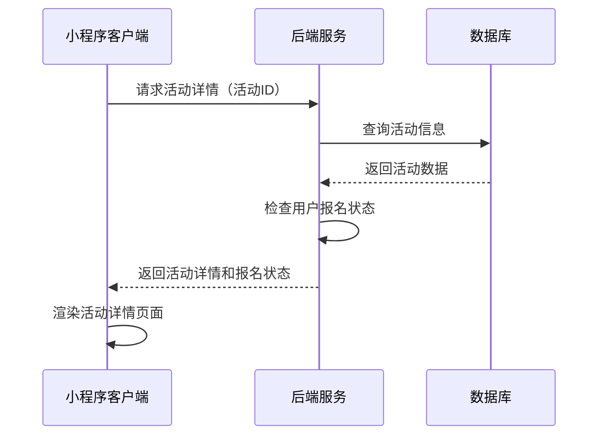
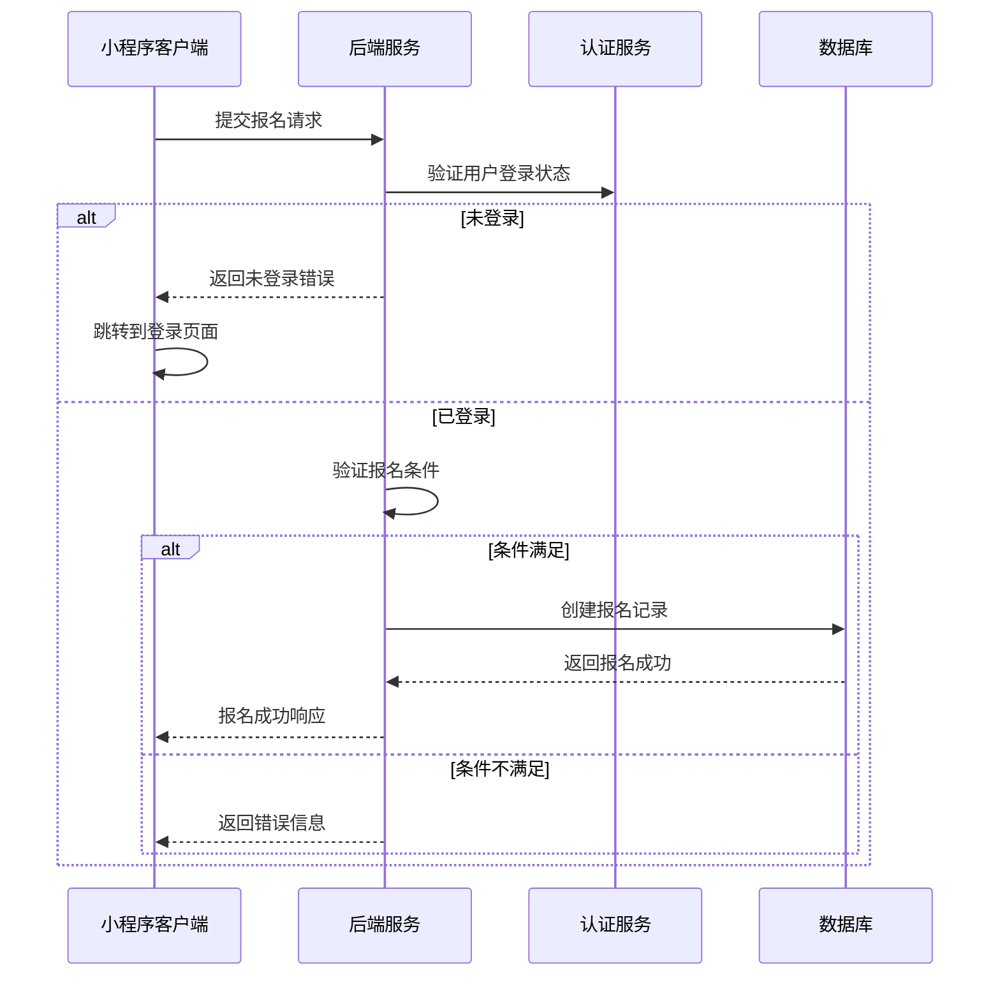
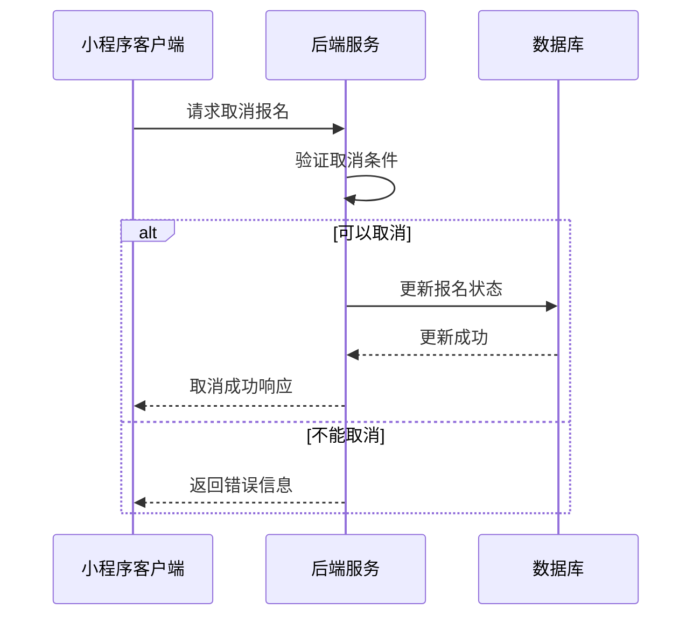
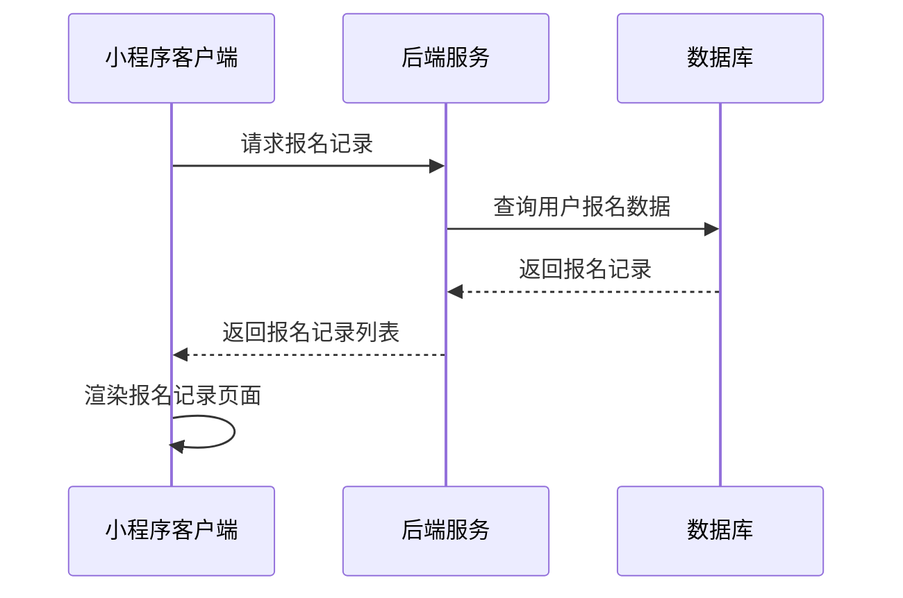

# 活动详情页面接口文档

## 获取活动详情

**接口名称：** 获取活动详情信息
**功能描述：** 根据活动ID获取活动的详细信息，包含活动内容、规则、报名状态等
**接口地址：** /api/activities/detail
**请求方式：** GET

### 功能说明
获取指定活动的详细信息，包含活动的完整描述、HTML格式的活动内容、活动规则、报名信息等。用户可根据活动详情决定是否参与报名。根据activityDetail/index.js中的实际实现，活动详情数据结构已简化为核心字段。



### 请求参数
```json
{
  "id": "1"
}
```

| 参数名 | 类型 | 必填 | 说明 | 示例值 |
|----|---|-----|---|-----|
| id | string | 是 | 活动唯一ID | 1 |

### 响应参数
```json
{
  "error": 0,
  "body": {
    "id": "1",
    "title": "门店周年庆活动",
    "description": "羽你同行实体店两周年店庆，全场商品8折，会员额外95折，还有精美礼品赠送！快来参与我们的庆典活动吧！",
    "startTime": "2024年12月18日 10:00",
    "endTime": "2024年12月24日 18:00",
    "location": "倍特爱运动专卖店",
    "organizer": "倍特爱运动专卖店",
    "content": "<p>🎉 为庆祝倍特爱运动专卖店周年庆，我们特举办盛大庆典活动！</p><p><strong>活动亮点：</strong></p><p>• 全场商品8折优惠</p><p>• 会员额外享受95折</p><p>• 购物满299元送精美礼品</p><p>• 现场抽奖有机会获得专业球拍</p><p><strong>活动地址：</strong>倍特爱运动专卖店</p>",
    "rules": "1. 活动期间每天限量100份礼品，先到先得\n2. 会员折扣与商品折扣可叠加使用\n3. 抽奖活动每人每天限参与一次\n4. 活动最终解释权归商家所有",
    "coverUrl": "https://images.unsplash.com/photo-1626224583764-f87db24ac5e4?w=800",
    "isJoined": false
  },
  "message": "获取活动详情成功",
  "success": true
}
```

| 参数名 | 类型 | 必填 | 说明 | 示例值 |
|----|---|-----|---|-----|
| error | int | 是 | 错误码，0表示成功 | 0 |
| body | object | 是 | 响应数据 | |
| body.id | string | 是 | 活动唯一ID | 1 |
| body.title | string | 是 | 活动标题 | 门店周年庆活动 |
| body.description | string | 是 | 活动详细描述 | 羽你同行实体店两周年店庆... |
| body.startTime | string | 是 | 活动开始时间（格式化字符串） | 2024年12月18日 10:00 |
| body.endTime | string | 是 | 活动结束时间（格式化字符串） | 2024年12月24日 18:00 |
| body.location | string | 是 | 活动地点 | 倍特爱运动专卖店 |
| body.organizer | string | 是 | 主办方名称 | 倍特爱运动专卖店 |
| body.content | string | 是 | 活动内容（HTML格式） | <p>🎉 为庆祝倍特爱运动专卖店周年庆... |
| body.rules | string | 是 | 活动规则（换行符分隔） | 1. 活动期间每天限量100份礼品... |
| body.coverUrl | string | 是 | 活动封面图片URL | https://example.com/cover.jpg |
| body.isJoined | bool | 是 | 是否已报名 | false |
| message | string | 是 | 响应消息 | 获取活动详情成功 |
| success | bool | 是 | 是否成功 | true |

**字段说明：**
- `id`: 活动的唯一标识符，为字符串类型
- `title`: 活动标题，用于页面展示
- `description`: 活动的详细描述信息
- `startTime/endTime`: 活动时间，使用格式化的日期时间字符串
- `location`: 活动举办地点
- `organizer`: 活动主办方
- `content`: 活动内容的HTML格式文本，用于富文本展示
- `rules`: 活动规则文本，使用换行符分隔不同条目
- `coverUrl`: 活动封面图片URL
- `isJoined`: 当前用户是否已报名该活动

---

## 报名活动

**接口名称：** 报名参加活动
**功能描述：** 用户提交报名信息参加指定活动
**接口地址：** /api/activities/signup
**请求方式：** POST

### 功能说明
用户点击报名按钮参加活动。根据activityDetail/index.js中的handleJoin方法实现，系统会检查登录状态，验证报名条件后创建报名记录。如果用户未登录，会跳转到登录页面。



### 请求参数
```json
{
  "id": "1"
}
```

| 参数名 | 类型 | 必填 | 说明 | 示例值 |
|----|---|-----|---|-----|
| id | string | 是 | 活动唯一ID | 1 |

### 响应参数
```json
{
  "error": 0,
  "body": {
    "signupId": "signup_123456",
    "activityId": "1",
    "signupTime": "2024-12-18T14:30:00Z",
    "status": "confirmed",
    "message": "报名成功！"
  },
  "message": "活动报名成功",
  "success": true
}
```

| 参数名 | 类型 | 必填 | 说明 | 示例值 |
|----|---|-----|---|-----|
| error | int | 是 | 错误码，0表示成功 | 0 |
| body | object | 是 | 响应数据 | |
| body.signupId | string | 是 | 报名记录唯一ID | signup_123456 |
| body.activityId | string | 是 | 活动ID | 1 |
| body.signupTime | string | 是 | 报名成功时间 | 2024-12-18T14:30:00Z |
| body.status | string | 是 | 报名状态 | confirmed |
| body.message | string | 是 | 报名成功提示信息 | 报名成功！ |
| message | string | 是 | 响应消息 | 活动报名成功 |
| success | bool | 是 | 是否成功 | true |

### 错误响应示例
```json
{
  "error": 1003,
  "body": null,
  "message": "你已报名此活动",
  "success": false
}
```

**常见错误码说明：**
- `401`：用户未登录，需要跳转登录页面
- `1003`：用户已报名该活动
- `1001`：报名人数已满
- `1002`：报名已截止
- `1004`：活动不存在或已下线

---

## 取消报名

**接口名称：** 取消活动报名
**功能描述：** 用户取消已报名的活动
**接口地址：** /api/activities/cancel-signup
**请求方式：** POST

### 功能说明
用户可以取消已报名的活动，系统会删除或标记报名记录为已取消状态。取消报名后，活动的当前报名人数会相应减少。



### 请求参数
```json
{
  "eventId": "event_1",
  "signupId": "signup_123456"
}
```

| 参数名 | 类型 | 必填 | 说明 | 示例值 |
|----|---|-----|---|-----|
| eventId | string | 是 | 活动唯一ID | event_1 |
| signupId | string | 是 | 报名记录ID | signup_123456 |

### 响应参数
```json
{
  "error": 0,
  "body": {
    "eventId": "event_1",
    "signupId": "signup_123456",
    "cancelTime": "2024-12-19T09:15:00Z",
    "refundAmount": 0,
    "message": "取消报名成功"
  },
  "message": "取消报名成功",
  "success": true
}
```

| 参数名 | 类型 | 必填 | 说明 | 示例值 |
|----|---|-----|---|-----|
| error | int | 是 | 错误码，0表示成功 | 0 |
| body | object | 是 | 响应数据 | |
| body.eventId | string | 是 | 活动ID | event_1 |
| body.signupId | string | 是 | 报名记录ID | signup_123456 |
| body.cancelTime | string | 是 | 取消时间 | 2024-12-19T09:15:00Z |
| body.refundAmount | number | 是 | 退款金额（如有） | 0 |
| body.message | string | 是 | 取消成功提示 | 取消报名成功 |
| message | string | 是 | 响应消息 | 取消报名成功 |
| success | bool | 是 | 是否成功 | true |

---

## 查询用户报名记录

**接口名称：** 查询用户活动报名记录
**功能描述：** 获取用户的活动报名历史记录
**接口地址：** /api/activities/my-signups
**请求方式：** GET

### 功能说明
获取当前用户的所有活动报名记录，包含已报名、已取消、已完成等各种状态的报名记录，支持分页查询。



### 请求参数
```json
{
  "page": 1,
  "pageSize": 10,
  "status": "all"
}
```

| 参数名 | 类型 | 必填 | 说明 | 示例值 |
|----|---|-----|---|-----|
| page | int | 否 | 页码（默认1） | 1 |
| pageSize | int | 否 | 每页数量（默认10） | 10 |
| status | string | 否 | 报名状态筛选（默认all） | all |

**status参数说明：**
- `all`：全部记录
- `confirmed`：已确认报名
- `cancelled`：已取消
- `completed`：已完成活动

### 响应参数
```json
{
  "error": 0,
  "body": {
    "signups": [
      {
        "signupId": "signup_123456",
        "activityId": "1",
        "activityTitle": "门店周年庆活动",
        "activityCoverUrl": "https://images.unsplash.com/photo-1626224583764-f87db24ac5e4?w=400",
        "activityStartTime": "2024年12月18日 10:00",
        "activityEndTime": "2024年12月24日 18:00",
        "activityLocation": "倍特爱运动专卖店",
        "signupTime": "2024-12-18T14:30:00Z",
        "status": "confirmed",
        "isJoined": true
      }
    ],
    "pagination": {
      "page": 1,
      "pageSize": 10,
      "total": 5,
      "totalPages": 1,
      "hasMore": false
    }
  },
  "message": "获取报名记录成功",
  "success": true
}
```

| 参数名 | 类型 | 必填 | 说明 | 示例值 |
|----|---|-----|---|-----|
| error | int | 是 | 错误码，0表示成功 | 0 |
| body | object | 是 | 响应数据 | |
| body.signups | array | 是 | 报名记录列表 | |
| body.signups[].signupId | string | 是 | 报名记录ID | signup_123456 |
| body.signups[].activityId | string | 是 | 活动ID | 1 |
| body.signups[].activityTitle | string | 是 | 活动标题 | 门店周年庆活动 |
| body.signups[].activityCoverUrl | string | 是 | 活动封面图 | https://example.com/cover.jpg |
| body.signups[].activityStartTime | string | 是 | 活动开始时间 | 2024年12月18日 10:00 |
| body.signups[].activityEndTime | string | 是 | 活动结束时间 | 2024年12月24日 18:00 |
| body.signups[].activityLocation | string | 是 | 活动地点 | 倍特爱运动专卖店 |
| body.signups[].signupTime | string | 是 | 报名时间 | 2024-12-18T14:30:00Z |
| body.signups[].status | string | 是 | 报名状态 | confirmed |
| body.signups[].isJoined | bool | 是 | 是否已报名 | true |
| body.pagination | object | 是 | 分页信息 | |
| body.pagination.page | int | 是 | 当前页码 | 1 |
| body.pagination.pageSize | int | 是 | 每页数量 | 10 |
| body.pagination.total | int | 是 | 总记录数 | 5 |
| body.pagination.totalPages | int | 是 | 总页数 | 1 |
| body.pagination.hasMore | bool | 是 | 是否有更多数据 | false |
| message | string | 是 | 响应消息 | 获取报名记录成功 |
| success | bool | 是 | 是否成功 | true | 