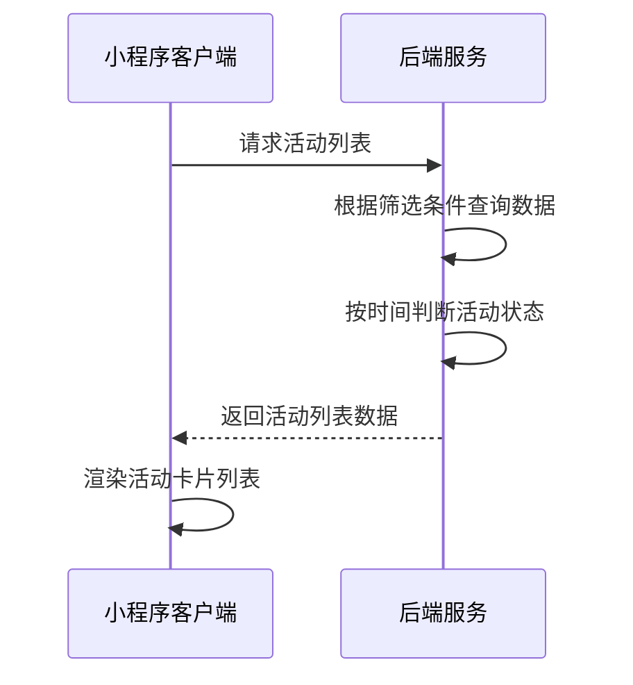
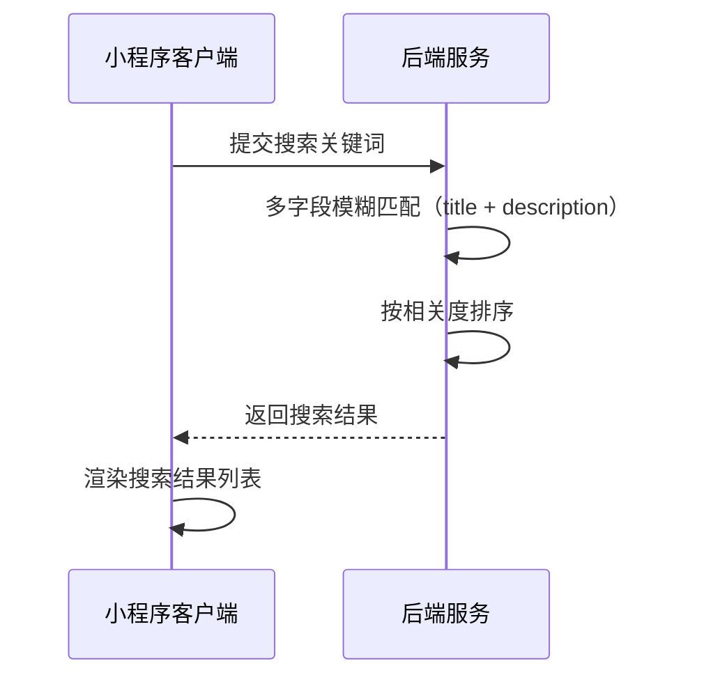
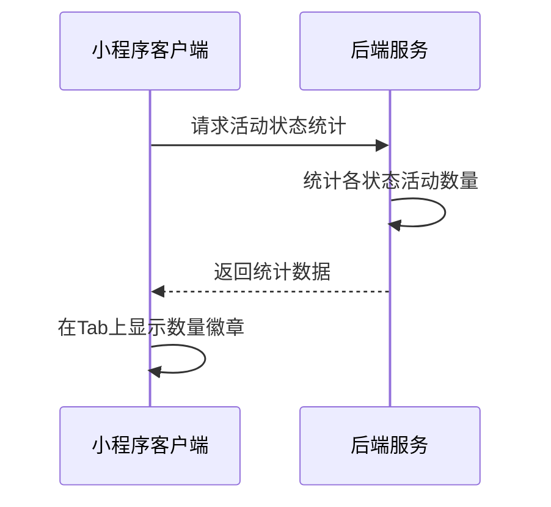

# 活动页面接口文档

## 获取活动列表

**接口名称：** 获取活动列表数据
**功能描述：** 获取活动列表，支持状态筛选、关键词搜索、分页加载等功能
**接口地址：** /api/activities/list
**请求方式：** GET

### 功能说明
获取活动列表数据，支持多种筛选条件：按活动状态（全部/进行中/即将开始/已结束）筛选，关键词搜索活动标题和描述，分页加载数据。活动状态根据当前时间和活动开始结束时间自动判断。根据activity/index.js中的实际实现，搜索功能支持标题和描述的模糊匹配。



### 请求参数
```json
{
  "page": 1,
  "pageSize": 10,
  "status": "all",
  "searchKeyword": ""
}
```

| 参数名 | 类型 | 必填 | 说明 | 示例值 |
|----|---|-----|---|-----|
| page | int | 否 | 页码（默认1） | 1 |
| pageSize | int | 否 | 每页数量（默认10） | 10 |
| status | string | 否 | 活动状态筛选（默认all） | all |
| searchKeyword | string | 否 | 搜索关键词 | 羽毛球 |

**status参数说明：**
- `all`：全部活动
- `ongoing`：进行中活动
- `coming`：即将开始活动
- `finished`：已结束活动

### 响应参数
```json
{
  "error": 0,
  "body": {
    "activities": [
      {
        "id": 1,
        "title": "门店周年庆活动",
        "description": "羽你同行实体店两周年店庆，全场商品8折，会员额外95折，还有精美礼品赠送！",
        "coverUrl": "https://images.unsplash.com/photo-1626224583764-f87db24ac5e4?w=400",
        "startTime": "12月18日",
        "endTime": "12月24日",
        "location": "倍特爱运动专卖店",
        "status": "ongoing",
        "isFull": false
      }
    ],
    "pagination": {
      "page": 1,
      "pageSize": 10,
      "hasMore": true,
      "loading": false
    }
  },
  "message": "获取活动列表成功",
  "success": true
}
```

| 参数名 | 类型 | 必填 | 说明 | 示例值 |
|----|---|-----|---|-----|
| error | int | 是 | 错误码，0表示成功 | 0 |
| body | object | 是 | 响应数据 | |
| body.activities | array | 是 | 活动列表 | |
| body.activities[].id | int | 是 | 活动唯一ID | 1 |
| body.activities[].title | string | 是 | 活动标题 | 门店周年庆活动 |
| body.activities[].description | string | 是 | 活动描述 | 羽你同行实体店两周年店庆... |
| body.activities[].coverUrl | string | 是 | 活动封面图URL | https://example.com/cover.jpg |
| body.activities[].startTime | string | 是 | 活动开始时间（简化格式） | 12月18日 |
| body.activities[].endTime | string | 是 | 活动结束时间（简化格式） | 12月24日 |
| body.activities[].location | string | 是 | 活动地点 | 倍特爱运动专卖店 |
| body.activities[].status | string | 是 | 活动状态 | ongoing |
| body.activities[].isFull | bool | 是 | 是否已满员 | false |
| body.pagination | object | 是 | 分页信息 | |
| body.pagination.page | int | 是 | 当前页码 | 1 |
| body.pagination.pageSize | int | 是 | 每页数量 | 10 |
| body.pagination.hasMore | bool | 是 | 是否有更多数据 | true |
| body.pagination.loading | bool | 是 | 加载状态 | false |
| message | string | 是 | 响应消息 | 获取活动列表成功 |
| success | bool | 是 | 是否成功 | true |

**字段说明：**
- `id`: 活动的唯一标识符，为数字类型
- `title`: 活动标题，用于页面展示和搜索匹配
- `description`: 活动描述信息，用于页面展示和搜索匹配
- `coverUrl`: 活动封面图片URL
- `startTime/endTime`: 活动时间，使用简化的日期格式（如"12月18日"）
- `location`: 活动举办地点
- `status`: 活动状态，用于状态筛选功能
- `isFull`: 是否已满员，用于控制报名按钮状态
- `hasMore`: 是否有更多数据，用于上拉加载更多功能
- `loading`: 加载状态，用于页面加载提示

---

## 搜索活动

**接口名称：** 搜索活动
**功能描述：** 根据关键词搜索活动，支持模糊匹配活动标题、描述等字段
**接口地址：** /api/activities/search
**请求方式：** GET

### 功能说明
支持关键词搜索功能，可以匹配活动标题、活动描述等字段。根据activity/index.js中的onSearchConfirm方法实现，搜索结果会重置分页并重新加载。搜索时会显示"搜索中..."的加载提示。



### 请求参数
```json
{
  "searchKeyword": "羽毛球",
  "page": 1,
  "pageSize": 10,
  "status": "all"
}
```

| 参数名 | 类型 | 必填 | 说明 | 示例值 |
|----|---|-----|---|-----|
| searchKeyword | string | 是 | 搜索关键词 | 羽毛球 |
| page | int | 否 | 页码（默认1，搜索时重置为1） | 1 |
| pageSize | int | 否 | 每页数量（默认10） | 10 |
| status | string | 否 | 活动状态筛选（默认all） | all |

### 响应参数
```json
{
  "error": 0,
  "body": {
    "activities": [
      {
        "id": 4,
        "title": "春季业余联赛",
        "description": "第四届春季业余羽毛球联赛报名开始，丰厚奖品等你来拿！",
        "coverUrl": "https://images.unsplash.com/photo-1626224583764-f87db24ac5e4?w=400",
        "startTime": "3月15日",
        "endTime": "3月16日",
        "location": "倍特爱运动专卖店",
        "status": "coming",
        "isFull": false
      }
    ],
    "pagination": {
      "page": 1,
      "pageSize": 10,
      "hasMore": false,
      "loading": false
    },
    "searchSummary": {
      "searchKeyword": "羽毛球",
      "totalMatched": 3,
      "searchTime": 800
    }
  },
  "message": "搜索活动成功",
  "success": true
}
```

| 参数名 | 类型 | 必填 | 说明 | 示例值 |
|----|---|-----|---|-----|
| error | int | 是 | 错误码，0表示成功 | 0 |
| body | object | 是 | 响应数据 | |
| body.activities | array | 是 | 搜索结果活动列表 | |
| body.activities[].id | int | 是 | 活动唯一ID | 4 |
| body.activities[].title | string | 是 | 活动标题 | 春季业余联赛 |
| body.activities[].description | string | 是 | 活动描述 | 第四届春季业余羽毛球联赛... |
| body.activities[].coverUrl | string | 是 | 活动封面图URL | https://example.com/cover.jpg |
| body.activities[].startTime | string | 是 | 活动开始时间 | 3月15日 |
| body.activities[].endTime | string | 是 | 活动结束时间 | 3月16日 |
| body.activities[].location | string | 是 | 活动地点 | 倍特爱运动专卖店 |
| body.activities[].status | string | 是 | 活动状态 | coming |
| body.activities[].isFull | bool | 是 | 是否已满员 | false |
| body.pagination | object | 是 | 分页信息 | |
| body.pagination.page | int | 是 | 当前页码 | 1 |
| body.pagination.pageSize | int | 是 | 每页数量 | 10 |
| body.pagination.hasMore | bool | 是 | 是否有更多数据 | false |
| body.pagination.loading | bool | 是 | 加载状态 | false |
| body.searchSummary | object | 是 | 搜索汇总信息 | |
| body.searchSummary.searchKeyword | string | 是 | 搜索关键词 | 羽毛球 |
| body.searchSummary.totalMatched | int | 是 | 匹配到的活动总数 | 3 |
| body.searchSummary.searchTime | int | 是 | 搜索耗时（毫秒） | 800 |
| message | string | 是 | 响应消息 | 搜索活动成功 |
| success | bool | 是 | 是否成功 | true |

**字段说明：**
- 搜索功能会匹配活动的`title`和`description`字段
- 搜索时页面会重置为第1页，清空之前的活动列表
- `searchTime`对应代码中的延时加载时间（800ms）
- 搜索结果的数据结构与活动列表完全一致

---

## 获取活动状态统计

**接口名称：** 获取活动状态统计数据
**功能描述：** 获取各状态下的活动数量统计，用于Tab标签显示数量徽章
**接口地址：** /api/activities/stats
**请求方式：** GET

### 功能说明
返回各个状态下的活动数量统计，用于在Tab标签上显示数量徽章，帮助用户快速了解各状态下的活动数量。



### 请求参数
无需传入参数

### 响应参数
```json
{
  "error": 0,
  "body": {
    "stats": {
      "all": 6,
      "ongoing": 2,
      "coming": 3,
      "finished": 1
    },
    "lastUpdated": "2024-12-18T10:30:00Z"
  },
  "message": "获取活动统计成功",
  "success": true
}
```

| 参数名 | 类型 | 必填 | 说明 | 示例值 |
|----|---|-----|---|-----|
| error | int | 是 | 错误码，0表示成功 | 0 |
| body | object | 是 | 响应数据 | |
| body.stats | object | 是 | 统计数据 | |
| body.stats.all | int | 是 | 全部活动数量 | 6 |
| body.stats.ongoing | int | 是 | 进行中活动数量 | 2 |
| body.stats.coming | int | 是 | 即将开始活动数量 | 3 |
| body.stats.finished | int | 是 | 已结束活动数量 | 1 |
| body.lastUpdated | string | 是 | 最后更新时间 | 2024-12-18T10:30:00Z |
| message | string | 是 | 响应消息 | 获取活动统计成功 |
| success | bool | 是 | 是否成功 | true |
```