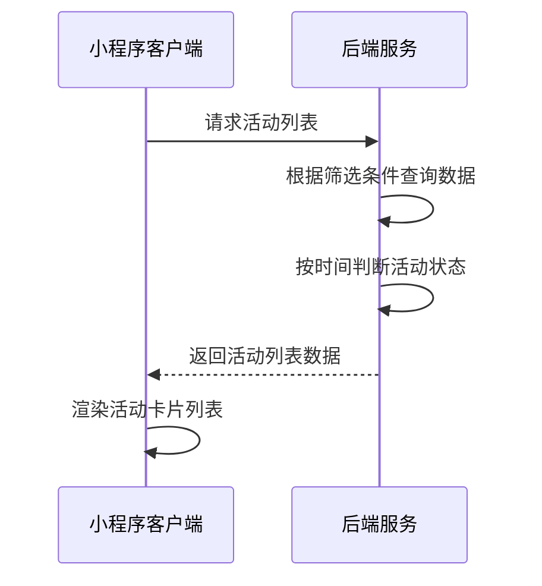
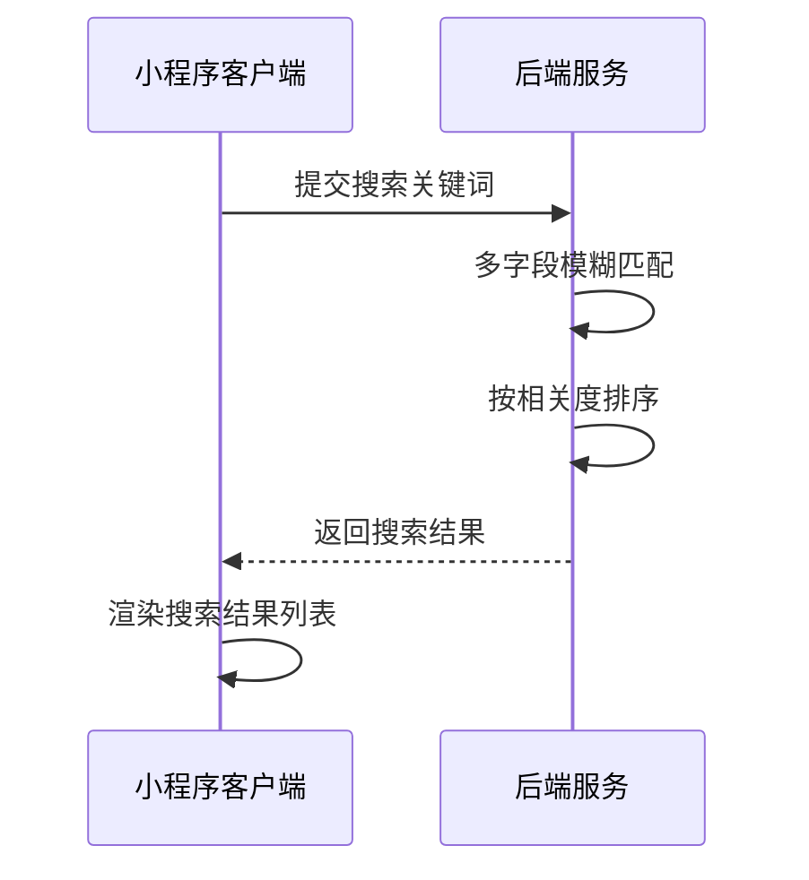
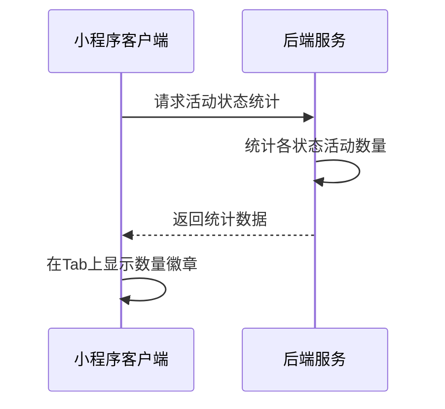

# 活动页面接口文档

## 获取活动列表

**接口名称：** 获取活动列表数据
**功能描述：** 获取活动列表，支持状态筛选、关键词搜索、分页加载等功能
**接口地址：** /api/activities/list
**请求方式：** GET

### 功能说明
获取活动列表数据，支持多种筛选条件：按活动状态（全部/进行中/即将开始/已结束）筛选，关键词搜索活动标题和描述，分页加载数据。活动状态根据当前时间和活动开始结束时间自动判断。



### 请求参数
```json
{
  "page": 1,
  "pageSize": 10,
  "status": "all",
  "keyword": ""
}
```

| 参数名 | 类型 | 必填 | 说明 | 示例值 |
|----|---|-----|---|-----|
| page | int | 否 | 页码（默认1） | 1 |
| pageSize | int | 否 | 每页数量（默认10） | 10 |
| status | string | 否 | 活动状态筛选 | all |
| keyword | string | 否 | 搜索关键词 | 羽毛球 |

**status参数说明：**
- `all`：全部活动
- `ongoing`：进行中活动（当前时间在startTime和endTime之间）
- `coming`：即将开始活动（当前时间早于startTime）
- `finished`：已结束活动（当前时间晚于endTime）

### 响应参数
```json
{
  "error": 0,
  "body": {
    "activities": [
      {
        "eventId": "event_1",
        "title": "门店周年庆活动",
        "brief": "羽你同行实体店两周年店庆，全场商品8折，会员额外95折，还有精美礼品赠送！",
        "coverImage": "https://images.unsplash.com/photo-1626224583764-f87db24ac5e4?w=400",
        "startTime": "2024-12-18T10:00:00Z",
        "endTime": "2024-12-24T18:00:00Z",
        "location": "倍特爱运动专卖店",
        "organizer": "倍特爱运动专卖店",
        "status": "ongoing",
        "isPublished": true,
        "maxParticipants": 100,
        "currentParticipants": 38,
        "signupDeadline": "2024-12-23T18:00:00Z"
      }
    ],
    "pagination": {
      "page": 1,
      "pageSize": 10,
      "total": 25,
      "totalPages": 3,
      "hasMore": true
    }
  },
  "message": "获取活动列表成功",
  "success": true
}
```

| 参数名 | 类型 | 必填 | 说明 | 示例值 |
|----|---|-----|---|-----|
| error | int | 是 | 错误码，0表示成功 | 0 |
| body | object | 是 | 响应数据 | |
| body.activities | array | 是 | 活动列表 | |
| body.activities[].eventId | string | 是 | 活动唯一ID | event_1 |
| body.activities[].title | string | 是 | 活动标题 | 门店周年庆活动 |
| body.activities[].brief | string | 是 | 活动简介 | 羽你同行实体店两周年店庆... |
| body.activities[].coverImage | string | 是 | 活动封面图URL | https://example.com/cover.jpg |
| body.activities[].startTime | string | 是 | 活动开始时间（ISO 8601格式） | 2024-12-18T10:00:00Z |
| body.activities[].endTime | string | 是 | 活动结束时间（ISO 8601格式） | 2024-12-24T18:00:00Z |
| body.activities[].location | string | 是 | 活动地点 | 倍特爱运动专卖店 |
| body.activities[].organizer | string | 是 | 主办方名称 | 倍特爱运动专卖店 |
| body.activities[].status | string | 是 | 活动状态 | ongoing |
| body.activities[].isPublished | bool | 是 | 是否已发布 | true |
| body.activities[].maxParticipants | int | 是 | 最大报名人数 | 100 |
| body.activities[].currentParticipants | int | 是 | 当前报名人数 | 38 |
| body.activities[].signupDeadline | string | 是 | 报名截止时间 | 2024-12-23T18:00:00Z |
| body.pagination | object | 是 | 分页信息 | |
| body.pagination.page | int | 是 | 当前页码 | 1 |
| body.pagination.pageSize | int | 是 | 每页数量 | 10 |
| body.pagination.total | int | 是 | 总记录数 | 25 |
| body.pagination.totalPages | int | 是 | 总页数 | 3 |
| body.pagination.hasMore | bool | 是 | 是否有更多数据 | true |
| message | string | 是 | 响应消息 | 获取活动列表成功 |
| success | bool | 是 | 是否成功 | true |

---

## 搜索活动

**接口名称：** 搜索活动
**功能描述：** 根据关键词搜索活动，支持模糊匹配活动标题、描述、地点等字段
**接口地址：** /api/activities/search
**请求方式：** GET

### 功能说明
支持关键词搜索功能，可以匹配活动标题、活动描述、活动地点等多个字段。搜索结果按照相关度排序，相关度高的活动排在前面。



### 请求参数
```json
{
  "keyword": "羽毛球",
  "page": 1,
  "pageSize": 10,
  "status": "all"
}
```

| 参数名 | 类型 | 必填 | 说明 | 示例值 |
|----|---|-----|---|-----|
| keyword | string | 是 | 搜索关键词 | 羽毛球 |
| page | int | 否 | 页码（默认1） | 1 |
| pageSize | int | 否 | 每页数量（默认10） | 10 |
| status | string | 否 | 活动状态筛选（默认all） | all |

### 响应参数
```json
{
  "error": 0,
  "body": {
    "activities": [
      {
        "eventId": "event_3",
        "title": "春季业余羽毛球联赛",
        "brief": "第四届春季业余羽毛球联赛报名开始，丰厚奖品等你来拿！",
        "coverImage": "https://images.unsplash.com/photo-1626224583764-f87db24ac5e4?w=400",
        "startTime": "2025-03-15T09:00:00Z",
        "endTime": "2025-03-16T18:00:00Z",
        "location": "倍特爱运动专卖店",
        "organizer": "倍特爱运动专卖店",
        "status": "coming",
        "isPublished": true,
        "relevanceScore": 95
      }
    ],
    "pagination": {
      "page": 1,
      "pageSize": 10,
      "total": 3,
      "totalPages": 1,
      "hasMore": false
    },
    "searchSummary": {
      "keyword": "羽毛球",
      "totalMatched": 3,
      "searchTime": 120
    }
  },
  "message": "搜索活动成功",
  "success": true
}
```

| 参数名 | 类型 | 必填 | 说明 | 示例值 |
|----|---|-----|---|-----|
| error | int | 是 | 错误码，0表示成功 | 0 |
| body | object | 是 | 响应数据 | |
| body.activities | array | 是 | 搜索结果活动列表 | |
| body.activities[].eventId | string | 是 | 活动唯一ID | event_3 |
| body.activities[].title | string | 是 | 活动标题 | 春季业余羽毛球联赛 |
| body.activities[].brief | string | 是 | 活动简介 | 第四届春季业余羽毛球联赛... |
| body.activities[].coverImage | string | 是 | 活动封面图URL | https://example.com/cover.jpg |
| body.activities[].startTime | string | 是 | 活动开始时间 | 2025-03-15T09:00:00Z |
| body.activities[].endTime | string | 是 | 活动结束时间 | 2025-03-16T18:00:00Z |
| body.activities[].location | string | 是 | 活动地点 | 倍特爱运动专卖店 |
| body.activities[].organizer | string | 是 | 主办方名称 | 倍特爱运动专卖店 |
| body.activities[].status | string | 是 | 活动状态 | coming |
| body.activities[].isPublished | bool | 是 | 是否已发布 | true |
| body.activities[].relevanceScore | int | 否 | 相关度分数（可选） | 95 |
| body.pagination | object | 是 | 分页信息 | |
| body.pagination.page | int | 是 | 当前页码 | 1 |
| body.pagination.pageSize | int | 是 | 每页数量 | 10 |
| body.pagination.total | int | 是 | 总记录数 | 3 |
| body.pagination.totalPages | int | 是 | 总页数 | 1 |
| body.pagination.hasMore | bool | 是 | 是否有更多数据 | false |
| body.searchSummary | object | 是 | 搜索汇总信息 | |
| body.searchSummary.keyword | string | 是 | 搜索关键词 | 羽毛球 |
| body.searchSummary.totalMatched | int | 是 | 匹配到的活动总数 | 3 |
| body.searchSummary.searchTime | int | 是 | 搜索耗时（毫秒） | 120 |
| message | string | 是 | 响应消息 | 搜索活动成功 |
| success | bool | 是 | 是否成功 | true |

---

## 获取活动状态统计

**接口名称：** 获取活动状态统计数据
**功能描述：** 获取各状态下的活动数量统计，用于Tab标签显示数量徽章
**接口地址：** /api/activities/stats
**请求方式：** GET

### 功能说明
返回各个状态下的活动数量统计，用于在Tab标签上显示数量徽章，帮助用户快速了解各状态下的活动数量。



### 请求参数
无需传入参数

### 响应参数
```json
{
  "error": 0,
  "body": {
    "stats": {
      "all": 25,
      "ongoing": 8,
      "coming": 12,
      "finished": 5
    },
    "lastUpdated": "2024-12-18T10:30:00Z"
  },
  "message": "获取活动统计成功",
  "success": true
}
```

| 参数名 | 类型 | 必填 | 说明 | 示例值 |
|----|---|-----|---|-----|
| error | int | 是 | 错误码，0表示成功 | 0 |
| body | object | 是 | 响应数据 | |
| body.stats | object | 是 | 统计数据 | |
| body.stats.all | int | 是 | 全部活动数量 | 25 |
| body.stats.ongoing | int | 是 | 进行中活动数量 | 8 |
| body.stats.coming | int | 是 | 即将开始活动数量 | 12 |
| body.stats.finished | int | 是 | 已结束活动数量 | 5 |
| body.lastUpdated | string | 是 | 最后更新时间 | 2024-12-18T10:30:00Z |
| message | string | 是 | 响应消息 | 获取活动统计成功 |
| success | bool | 是 | 是否成功 | true |
``` 