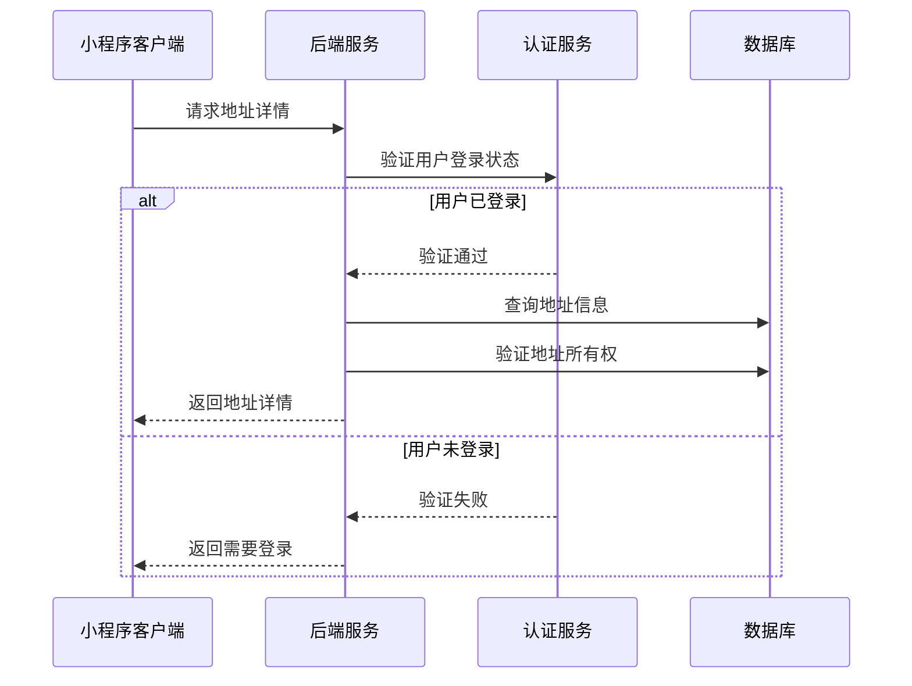
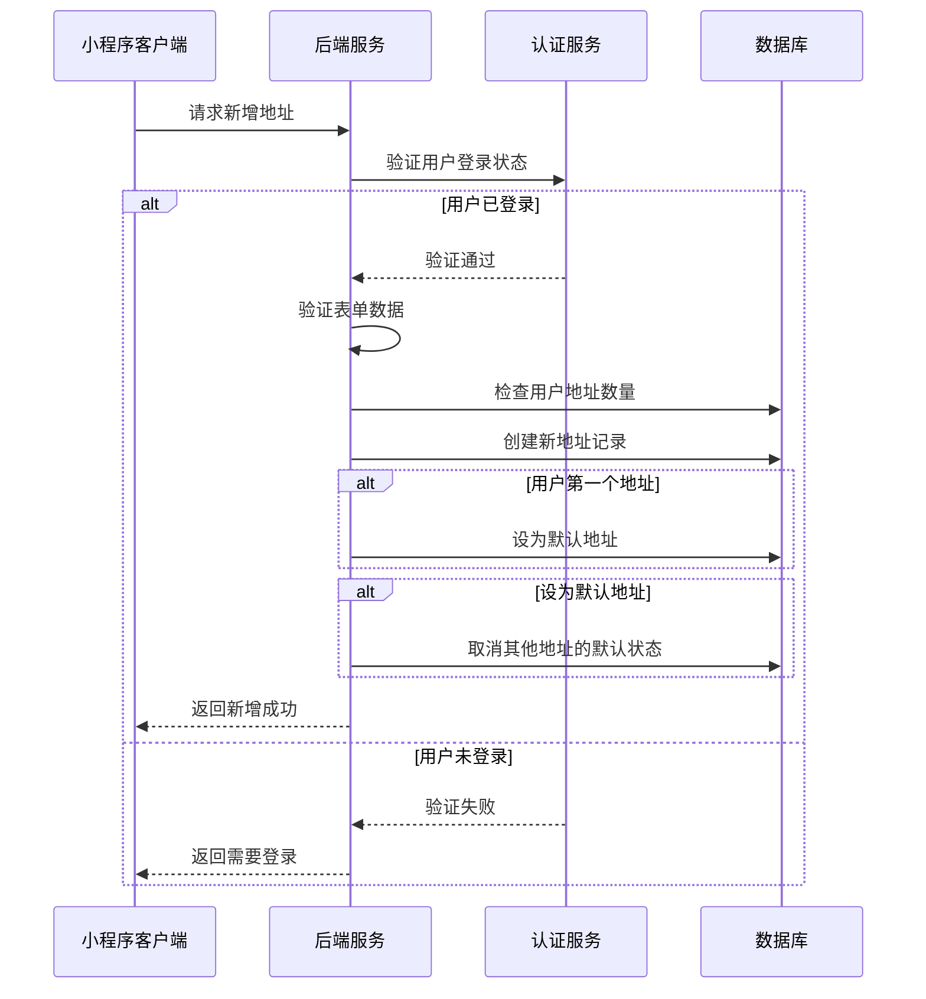
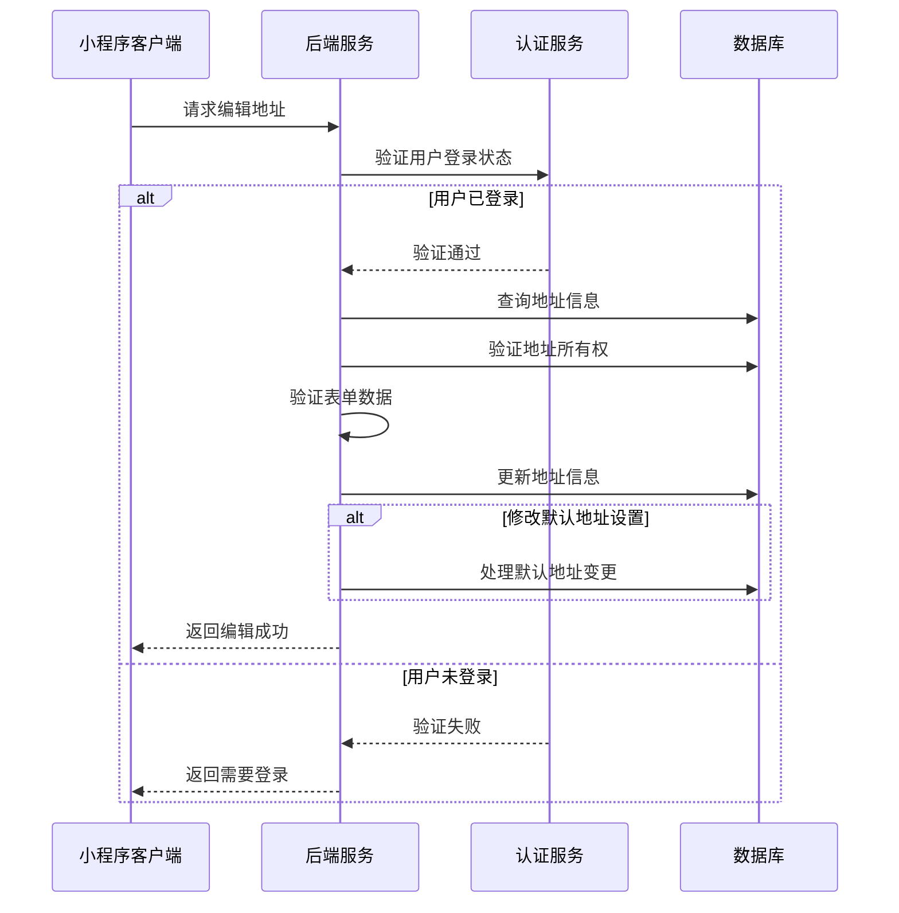

# 地址表单页面接口文档

## 获取地址详情

**接口名称：** 获取地址详情
**功能描述：** 获取指定地址的详细信息，用于编辑地址时的数据回填
**接口地址：** /api/user/addresses/detail
**请求方式：** GET

### 功能说明
在地址编辑页面加载时，如果是编辑模式，需要获取地址的详细信息进行表单回填。**此接口需要用户登录状态。**



### 请求参数
```json
{
  "addressId": "addr_001"
}
```

| 参数名 | 类型 | 必填 | 说明 | 示例值 |
|----|---|-----|---|-----|
| addressId | string | 是 | 地址ID | addr_001 |

### 响应参数
```json
{
  "error": 0,
  "body": {
    "address": {
      "id": "addr_001",
      "consignee": "张三",
      "mobile": "13812345678",
      "province": "广东省",
      "city": "深圳市",
      "district": "南山区",
      "region": "广东省 深圳市 南山区",
      "detail": "科技园南区深圳软件园二期东座1002室",
      "isDefault": true,
      "createTime": "2024-01-10 14:30:00",
      "updateTime": "2024-01-15 16:20:00"
    }
  },
  "message": "获取地址详情成功",
  "success": true
}
```

| 参数名 | 类型 | 必填 | 说明 | 示例值 |
|----|---|-----|---|-----|
| error | int | 是 | 错误码，0成功/401未登录/404地址不存在 | 0 |
| body | object | 是 | 响应数据 | |
| body.address | object | 是 | 地址详细信息 | |
| body.address.id | string | 是 | 地址ID | addr_001 |
| body.address.consignee | string | 是 | 收件人姓名 | 张三 |
| body.address.mobile | string | 是 | 收件人手机号 | 13812345678 |
| body.address.province | string | 是 | 省份 | 广东省 |
| body.address.city | string | 是 | 城市 | 深圳市 |
| body.address.district | string | 是 | 区县 | 南山区 |
| body.address.region | string | 是 | 完整地区（供显示用） | 广东省 深圳市 南山区 |
| body.address.detail | string | 是 | 详细地址 | 科技园南区深圳软件园二期东座1002室 |
| body.address.isDefault | bool | 是 | 是否为默认地址 | true |
| body.address.createTime | string | 是 | 创建时间 | 2024-01-10 14:30:00 |
| body.address.updateTime | string | 是 | 更新时间 | 2024-01-15 16:20:00 |
| message | string | 是 | 响应消息 | 获取地址详情成功 |
| success | bool | 是 | 是否成功 | true |

---

## 新增地址

**接口名称：** 新增地址
**功能描述：** 添加新的收货地址
**接口地址：** /api/user/addresses/add
**请求方式：** POST

### 功能说明
用户在地址表单页面填写完整信息后，提交新增地址。系统会进行表单验证，如果是用户的第一个地址，会自动设为默认地址。**此接口需要用户登录状态。**



### 请求参数
```json
{
  "consignee": "李四",
  "mobile": "13987654321",
  "province": "北京市",
  "city": "北京市",
  "district": "朝阳区",
  "detail": "建国门外大街1号国贸大厦A座20层",
  "isDefault": false
}
```

| 参数名 | 类型 | 必填 | 说明 | 示例值 |
|----|---|-----|---|-----|
| consignee | string | 是 | 收件人姓名（2-20字符） | 李四 |
| mobile | string | 是 | 收件人手机号（11位） | 13987654321 |
| province | string | 是 | 省份 | 北京市 |
| city | string | 是 | 城市 | 北京市 |
| district | string | 是 | 区县 | 朝阳区 |
| detail | string | 是 | 详细地址（5-200字符） | 建国门外大街1号国贸大厦A座20层 |
| isDefault | bool | 否 | 是否设为默认地址（默认false） | false |

### 响应参数
```json
{
  "error": 0,
  "body": {
    "addResult": {
      "addressId": "addr_005",
      "created": true,
      "addressInfo": {
        "id": "addr_005",
        "consignee": "李四",
        "mobile": "13987654321",
        "province": "北京市",
        "city": "北京市",
        "district": "朝阳区",
        "region": "北京市 北京市 朝阳区",
        "detail": "建国门外大街1号国贸大厦A座20层",
        "isDefault": false,
        "createTime": "2024-01-16 10:30:00"
      },
      "isFirstAddress": false,
      "message": "地址添加成功"
    }
  },
  "message": "地址添加成功",
  "success": true
}
```

| 参数名 | 类型 | 必填 | 说明 | 示例值 |
|----|---|-----|---|-----|
| error | int | 是 | 错误码，0成功/401未登录/400参数错误/422验证失败 | 0 |
| body | object | 是 | 响应数据 | |
| body.addResult | object | 是 | 添加结果 | |
| body.addResult.addressId | string | 是 | 新增的地址ID | addr_005 |
| body.addResult.created | bool | 是 | 是否创建成功 | true |
| body.addResult.addressInfo | object | 是 | 地址详细信息 | |
| body.addResult.addressInfo.id | string | 是 | 地址ID | addr_005 |
| body.addResult.addressInfo.consignee | string | 是 | 收件人姓名 | 李四 |
| body.addResult.addressInfo.mobile | string | 是 | 收件人手机号 | 13987654321 |
| body.addResult.addressInfo.province | string | 是 | 省份 | 北京市 |
| body.addResult.addressInfo.city | string | 是 | 城市 | 北京市 |
| body.addResult.addressInfo.district | string | 是 | 区县 | 朝阳区 |
| body.addResult.addressInfo.region | string | 是 | 完整地区 | 北京市 北京市 朝阳区 |
| body.addResult.addressInfo.detail | string | 是 | 详细地址 | 建国门外大街1号国贸大厦A座20层 |
| body.addResult.addressInfo.isDefault | bool | 是 | 是否为默认地址 | false |
| body.addResult.addressInfo.createTime | string | 是 | 创建时间 | 2024-01-16 10:30:00 |
| body.addResult.isFirstAddress | bool | 是 | 是否为用户第一个地址 | false |
| body.addResult.message | string | 是 | 添加结果消息 | 地址添加成功 |
| message | string | 是 | 响应消息 | 地址添加成功 |
| success | bool | 是 | 是否成功 | true |

---

## 编辑地址

**接口名称：** 编辑地址
**功能描述：** 修改指定的收货地址信息
**接口地址：** /api/user/addresses/update
**请求方式：** PUT

### 功能说明
用户在地址表单页面修改地址信息后提交保存。系统会验证表单数据，如果修改了默认地址设置，会处理默认地址的变更。**此接口需要用户登录状态。**



### 请求参数
```json
{
  "id": "addr_002",
  "consignee": "张三丰",
  "mobile": "13812345678",
  "province": "广东省",
  "city": "深圳市",
  "district": "福田区",
  "detail": "华强北街道振兴路120号赛格广场5楼",
  "isDefault": true
}
```

| 参数名 | 类型 | 必填 | 说明 | 示例值 |
|----|---|-----|---|-----|
| id | string | 是 | 地址ID | addr_002 |
| consignee | string | 是 | 收件人姓名（2-20字符） | 张三丰 |
| mobile | string | 是 | 收件人手机号（11位） | 13812345678 |
| province | string | 是 | 省份 | 广东省 |
| city | string | 是 | 城市 | 深圳市 |
| district | string | 是 | 区县 | 福田区 |
| detail | string | 是 | 详细地址（5-200字符） | 华强北街道振兴路120号赛格广场5楼 |
| isDefault | bool | 否 | 是否设为默认地址 | true |

### 响应参数
```json
{
  "error": 0,
  "body": {
    "updateResult": {
      "addressId": "addr_002",
      "updated": true,
      "addressInfo": {
        "id": "addr_002",
        "consignee": "张三丰",
        "mobile": "13812345678",
        "province": "广东省",
        "city": "深圳市",
        "district": "福田区",
        "region": "广东省 深圳市 福田区",
        "detail": "华强北街道振兴路120号赛格广场5楼",
        "isDefault": true,
        "updateTime": "2024-01-16 11:00:00"
      },
      "defaultChanged": true,
      "previousDefaultId": "addr_001",
      "message": "地址修改成功"
    }
  },
  "message": "地址修改成功",
  "success": true
}
```

| 参数名 | 类型 | 必填 | 说明 | 示例值 |
|----|---|-----|---|-----|
| error | int | 是 | 错误码，0成功/401未登录/404地址不存在/400参数错误/422验证失败 | 0 |
| body | object | 是 | 响应数据 | |
| body.updateResult | object | 是 | 更新结果 | |
| body.updateResult.addressId | string | 是 | 更新的地址ID | addr_002 |
| body.updateResult.updated | bool | 是 | 是否更新成功 | true |
| body.updateResult.addressInfo | object | 是 | 更新后的地址信息 | |
| body.updateResult.addressInfo.id | string | 是 | 地址ID | addr_002 |
| body.updateResult.addressInfo.consignee | string | 是 | 收件人姓名 | 张三丰 |
| body.updateResult.addressInfo.mobile | string | 是 | 收件人手机号 | 13812345678 |
| body.updateResult.addressInfo.province | string | 是 | 省份 | 广东省 |
| body.updateResult.addressInfo.city | string | 是 | 城市 | 深圳市 |
| body.updateResult.addressInfo.district | string | 是 | 区县 | 福田区 |
| body.updateResult.addressInfo.region | string | 是 | 完整地区 | 广东省 深圳市 福田区 |
| body.updateResult.addressInfo.detail | string | 是 | 详细地址 | 华强北街道振兴路120号赛格广场5楼 |
| body.updateResult.addressInfo.isDefault | bool | 是 | 是否为默认地址 | true |
| body.updateResult.addressInfo.updateTime | string | 是 | 更新时间 | 2024-01-16 11:00:00 |
| body.updateResult.defaultChanged | bool | 是 | 默认地址是否发生变更 | true |
| body.updateResult.previousDefaultId | string | 否 | 之前的默认地址ID | addr_001 |
| body.updateResult.message | string | 是 | 更新结果消息 | 地址修改成功 |
| message | string | 是 | 响应消息 | 地址修改成功 |
| success | bool | 是 | 是否成功 | true |

---

## 表单验证规则

### 客户端验证规则
地址表单页面需要进行实时的客户端验证，验证规则如下：

#### 收件人姓名验证
- **必填项**：不能为空
- **长度限制**：2-20个字符
- **格式要求**：支持中文、英文字母

#### 联系电话验证  
- **必填项**：不能为空
- **格式要求**：11位手机号，以1开头
- **正则表达式**：`^1\d{10}$`

#### 所在地区验证
- **必填项**：必须选择省市区
- **数据结构**：需要包含省份、城市、区县三级信息

#### 详细地址验证
- **必填项**：不能为空  
- **长度限制**：5-200个字符
- **内容要求**：需要包含街道、楼牌号等具体信息

#### 设为默认地址
- **可选项**：用户可选择是否设为默认地址
- **业务逻辑**：如果是用户第一个地址，自动设为默认地址

### 服务端验证规则
服务端会进行二次验证，确保数据的完整性和安全性：

1. **用户身份验证**：验证用户登录状态和地址所有权
2. **数据格式验证**：严格按照上述规则验证所有字段
3. **业务逻辑验证**：处理默认地址的唯一性约束
4. **安全性验证**：防止SQL注入、XSS等安全问题 