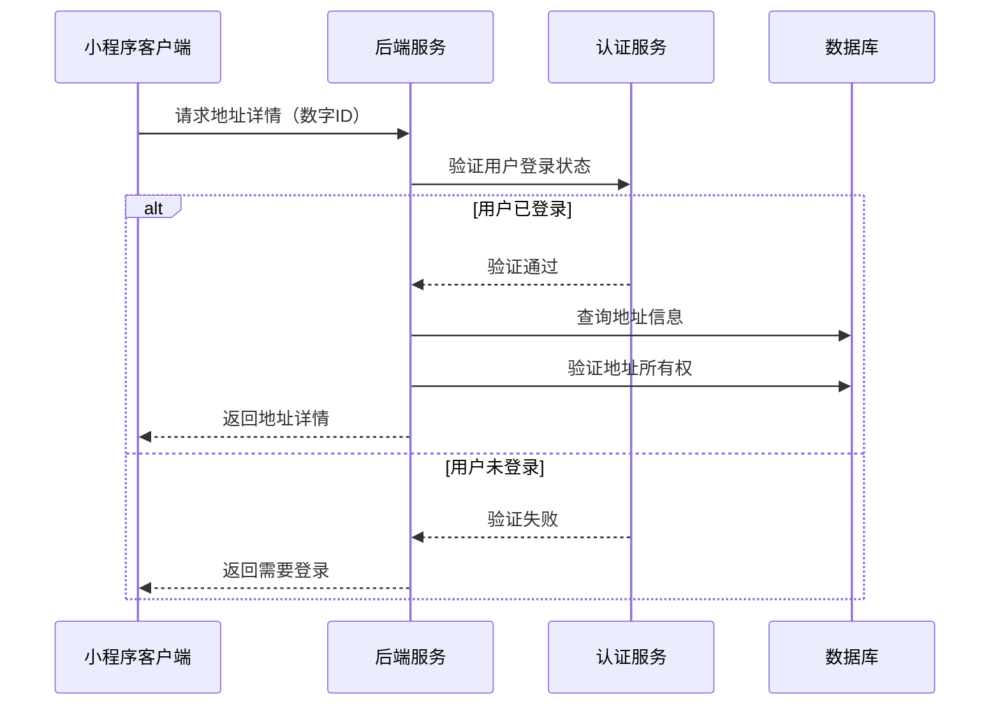
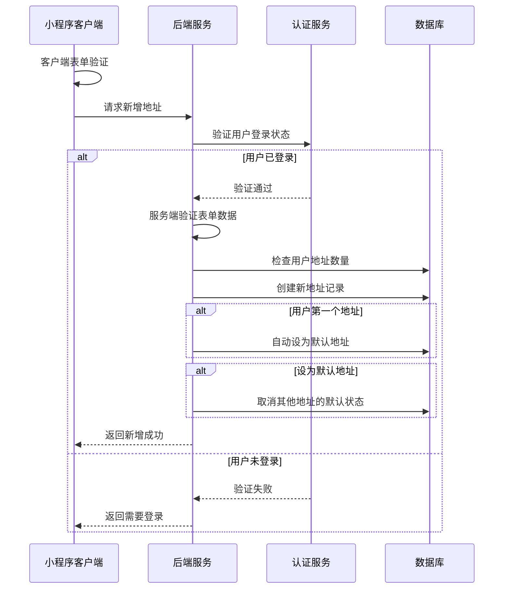
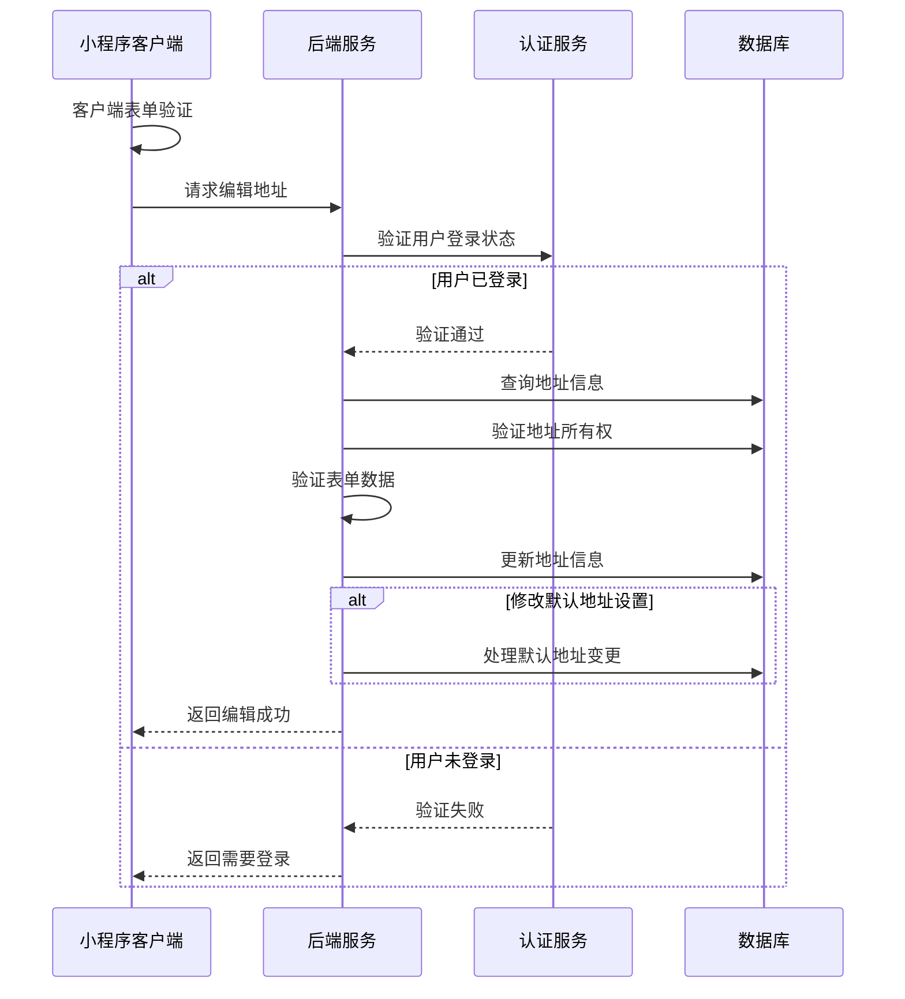

# 地址表单页面接口文档

## 获取地址详情

**接口名称：** 获取地址详情
**功能描述：** 获取指定地址的详细信息，用于编辑地址时的数据回填
**接口地址：** /api/user/addresses/detail
**请求方式：** GET

### 功能说明
在地址编辑页面加载时，如果是编辑模式，需要获取地址的详细信息进行表单回填。**此接口需要用户登录状态。** 根据address-form/index.js中的loadAddressDetail方法实现，地址ID为数字类型，地区数据支持逗号和空格两种分隔格式。



### 请求参数
```json
{
  "addressId": 1
}
```

| 参数名 | 类型 | 必填 | 说明 | 示例值 |
|----|---|-----|---|-----|
| addressId | int | 是 | 地址ID（数字类型） | 1 |

### 响应参数
```json
{
  "error": 0,
  "body": {
    "address": {
      "id": 1,
      "consignee": "张三",
      "mobile": "13812345678",
      "region": "广东省,深圳市,南山区",
      "detail": "科技园南区深南大道9988号",
      "isDefault": true
    }
  },
  "message": "获取地址详情成功",
  "success": true
}
```

| 参数名 | 类型 | 必填 | 说明 | 示例值 |
|----|---|-----|---|-----|
| error | int | 是 | 错误码，0成功/401未登录/404地址不存在 | 0 |
| body | object | 是 | 响应数据 | |
| body.address | object | 是 | 地址详细信息 | |
| body.address.id | int | 是 | 地址ID（数字类型） | 1 |
| body.address.consignee | string | 是 | 收件人姓名 | 张三 |
| body.address.mobile | string | 是 | 收件人手机号 | 13812345678 |
| body.address.region | string | 是 | 地区信息（支持逗号或空格分隔） | 广东省,深圳市,南山区 |
| body.address.detail | string | 是 | 详细地址 | 科技园南区深南大道9988号 |
| body.address.isDefault | bool | 是 | 是否为默认地址 | true |
| message | string | 是 | 响应消息 | 获取地址详情成功 |
| success | bool | 是 | 是否成功 | true |

**字段说明：**
- `id`: 地址的唯一标识符，为数字类型，对应JS代码中的parseInt处理
- `region`: 地区信息，支持逗号分隔（如"广东省,深圳市,南山区"）或空格分隔格式
- 地区格式兼容性：前端会自动解析逗号或空格分隔的格式转换为选择器数组

---

## 新增地址

**接口名称：** 新增地址
**功能描述：** 添加新的收货地址
**接口地址：** /api/user/addresses/add
**请求方式：** POST

### 功能说明
用户在地址表单页面填写完整信息后，提交新增地址。根据address-form/index.js中的saveAddress方法实现，系统会进行客户端表单验证，并自动分离省市区信息。**此接口需要用户登录状态。**



### 请求参数
```json
{
  "consignee": "李四",
  "mobile": "13987654321",
  "region": "北京市 北京市 朝阳区",
  "detail": "建国门外大街1号国贸大厦A座20层",
  "isDefault": false,
  "province": "北京市",
  "city": "北京市",
  "district": "朝阳区"
}
```

| 参数名 | 类型 | 必填 | 说明 | 示例值 |
|----|---|-----|---|-----|
| consignee | string | 是 | 收件人姓名（2-20字符） | 李四 |
| mobile | string | 是 | 收件人手机号（11位，以1开头） | 13987654321 |
| region | string | 是 | 完整地区信息（空格分隔） | 北京市 北京市 朝阳区 |
| detail | string | 是 | 详细地址（5-200字符） | 建国门外大街1号国贸大厦A座20层 |
| isDefault | bool | 否 | 是否设为默认地址（默认false） | false |
| province | string | 是 | 省份（从regionArray自动提取） | 北京市 |
| city | string | 是 | 城市（从regionArray自动提取） | 北京市 |
| district | string | 是 | 区县（从regionArray自动提取） | 朝阳区 |

**参数说明：**
- `region`: 由地区选择器生成，格式为空格分隔的完整地区
- `province/city/district`: 由前端自动从regionArray中提取，确保数据准确性
- `mobile`: 验证规则为`/^1\d{10}$/`，即以1开头的11位数字

### 响应参数
```json
{
  "error": 0,
  "body": {
    "addressId": 5,
    "created": true,
    "addressInfo": {
      "id": 5,
      "consignee": "李四",
      "mobile": "13987654321",
      "region": "北京市 北京市 朝阳区",
      "detail": "建国门外大街1号国贸大厦A座20层",
      "isDefault": false
    },
    "message": "地址添加成功"
  },
  "message": "地址添加成功",
  "success": true
}
```

| 参数名 | 类型 | 必填 | 说明 | 示例值 |
|----|---|-----|---|-----|
| error | int | 是 | 错误码，0成功/401未登录/400参数错误/422验证失败 | 0 |
| body | object | 是 | 响应数据 | |
| body.addressId | int | 是 | 新增的地址ID（数字类型） | 5 |
| body.created | bool | 是 | 是否创建成功 | true |
| body.addressInfo | object | 是 | 地址详细信息 | |
| body.addressInfo.id | int | 是 | 地址ID | 5 |
| body.addressInfo.consignee | string | 是 | 收件人姓名 | 李四 |
| body.addressInfo.mobile | string | 是 | 收件人手机号 | 13987654321 |
| body.addressInfo.region | string | 是 | 完整地区（空格分隔） | 北京市 北京市 朝阳区 |
| body.addressInfo.detail | string | 是 | 详细地址 | 建国门外大街1号国贸大厦A座20层 |
| body.addressInfo.isDefault | bool | 是 | 是否为默认地址 | false |
| body.message | string | 是 | 添加结果消息 | 地址添加成功 |
| message | string | 是 | 响应消息 | 地址添加成功 |
| success | bool | 是 | 是否成功 | true |

---

## 编辑地址

**接口名称：** 编辑地址
**功能描述：** 修改指定的收货地址信息
**接口地址：** /api/user/addresses/update
**请求方式：** PUT

### 功能说明
用户在地址表单页面修改地址信息后提交保存。根据address-form/index.js中的saveAddress方法实现，编辑时需要传入地址ID，系统会验证表单数据并处理默认地址变更。**此接口需要用户登录状态。**



### 请求参数
```json
{
  "id": 2,
  "consignee": "张三丰",
  "mobile": "13812345678",
  "region": "广东省 深圳市 福田区",
  "detail": "华强北街道振兴路120号赛格广场5楼",
  "isDefault": true,
  "province": "广东省",
  "city": "深圳市",
  "district": "福田区"
}
```

| 参数名 | 类型 | 必填 | 说明 | 示例值 |
|----|---|-----|---|-----|
| id | int | 是 | 地址ID（数字类型） | 2 |
| consignee | string | 是 | 收件人姓名（2-20字符） | 张三丰 |
| mobile | string | 是 | 收件人手机号（11位，以1开头） | 13812345678 |
| region | string | 是 | 完整地区信息（空格分隔） | 广东省 深圳市 福田区 |
| detail | string | 是 | 详细地址（5-200字符） | 华强北街道振兴路120号赛格广场5楼 |
| isDefault | bool | 否 | 是否设为默认地址 | true |
| province | string | 是 | 省份（从regionArray自动提取） | 广东省 |
| city | string | 是 | 城市（从regionArray自动提取） | 深圳市 |
| district | string | 是 | 区县（从regionArray自动提取） | 福田区 |

### 响应参数
```json
{
  "error": 0,
  "body": {
    "addressId": 2,
    "updated": true,
    "addressInfo": {
      "id": 2,
      "consignee": "张三丰",
      "mobile": "13812345678",
      "region": "广东省 深圳市 福田区",
      "detail": "华强北街道振兴路120号赛格广场5楼",
      "isDefault": true
    },
    "message": "地址修改成功"
  },
  "message": "地址修改成功",
  "success": true
}
```

| 参数名 | 类型 | 必填 | 说明 | 示例值 |
|----|---|-----|---|-----|
| error | int | 是 | 错误码，0成功/401未登录/404地址不存在/400参数错误/422验证失败 | 0 |
| body | object | 是 | 响应数据 | |
| body.addressId | int | 是 | 更新的地址ID（数字类型） | 2 |
| body.updated | bool | 是 | 是否更新成功 | true |
| body.addressInfo | object | 是 | 更新后的地址信息 | |
| body.addressInfo.id | int | 是 | 地址ID | 2 |
| body.addressInfo.consignee | string | 是 | 收件人姓名 | 张三丰 |
| body.addressInfo.mobile | string | 是 | 收件人手机号 | 13812345678 |
| body.addressInfo.region | string | 是 | 完整地区（空格分隔） | 广东省 深圳市 福田区 |
| body.addressInfo.detail | string | 是 | 详细地址 | 华强北街道振兴路120号赛格广场5楼 |
| body.addressInfo.isDefault | bool | 是 | 是否为默认地址 | true |
| body.message | string | 是 | 更新结果消息 | 地址修改成功 |
| message | string | 是 | 响应消息 | 地址修改成功 |
| success | bool | 是 | 是否成功 | true |

---

## 表单验证规则

### 客户端验证规则
根据address-form/index.js中的validateForm方法实现，地址表单页面需要进行实时的客户端验证：

#### 收件人姓名验证
- **必填项**：不能为空，使用trim()去除空格
- **长度限制**：至少2个字符
- **验证逻辑**：`!formData.consignee || formData.consignee.trim().length === 0` 和 `formData.consignee.trim().length < 2`

#### 联系电话验证  
- **必填项**：不能为空
- **格式要求**：11位手机号，以1开头
- **正则表达式**：`/^1\d{10}$/` （放宽验证规则，支持更多号码格式）

#### 所在地区验证
- **必填项**：必须选择省市区
- **验证逻辑**：`!formData.region` 
- **数据处理**：支持空格或逗号分隔格式自动解析

#### 详细地址验证
- **必填项**：不能为空，使用trim()去除空格
- **长度限制**：至少5个字符
- **验证逻辑**：`!formData.detail || formData.detail.trim().length === 0` 和 `formData.detail.trim().length < 5`

#### 设为默认地址
- **可选项**：用户可选择是否设为默认地址
- **业务逻辑**：如果是用户第一个地址，自动设为默认地址

### 服务端验证规则
服务端会进行二次验证，确保数据的完整性和安全性：

1. **用户身份验证**：验证用户登录状态和地址所有权
2. **数据格式验证**：严格按照上述规则验证所有字段
3. **业务逻辑验证**：处理默认地址的唯一性约束
4. **安全性验证**：防止SQL注入、XSS等安全问题
5. **地区数据完整性**：确保province、city、district字段正确分离 