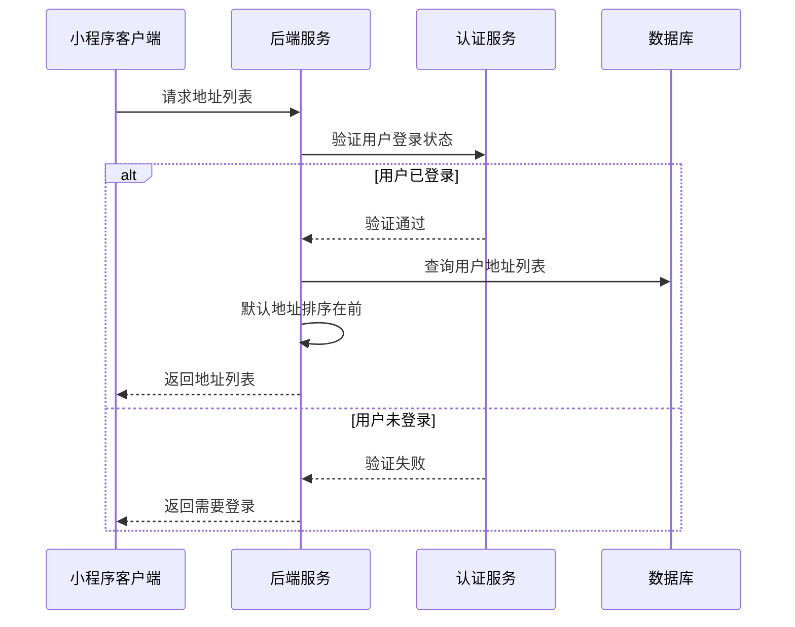
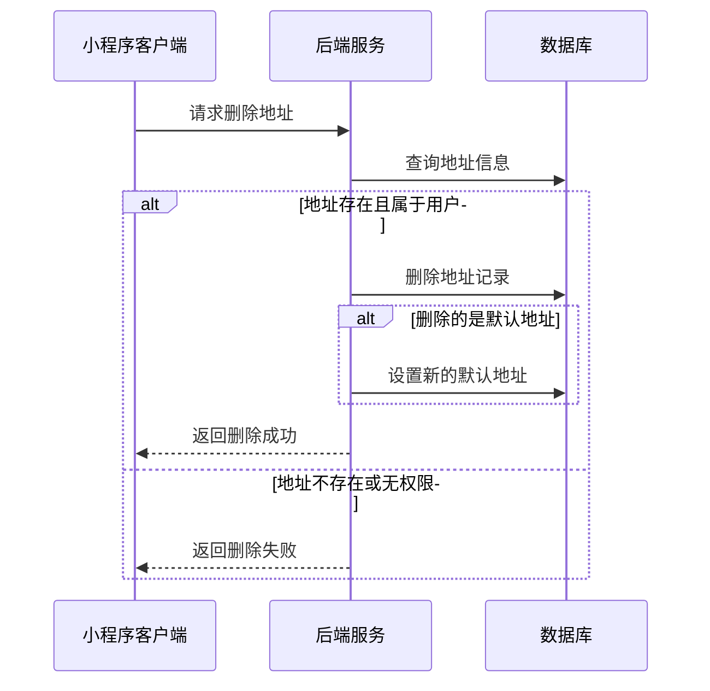
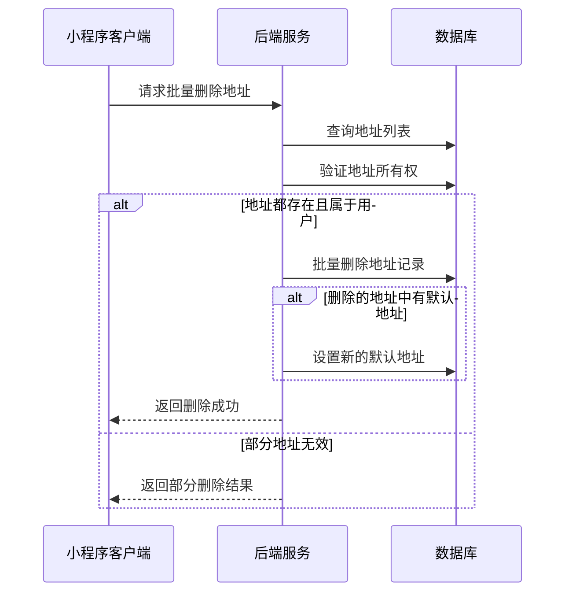
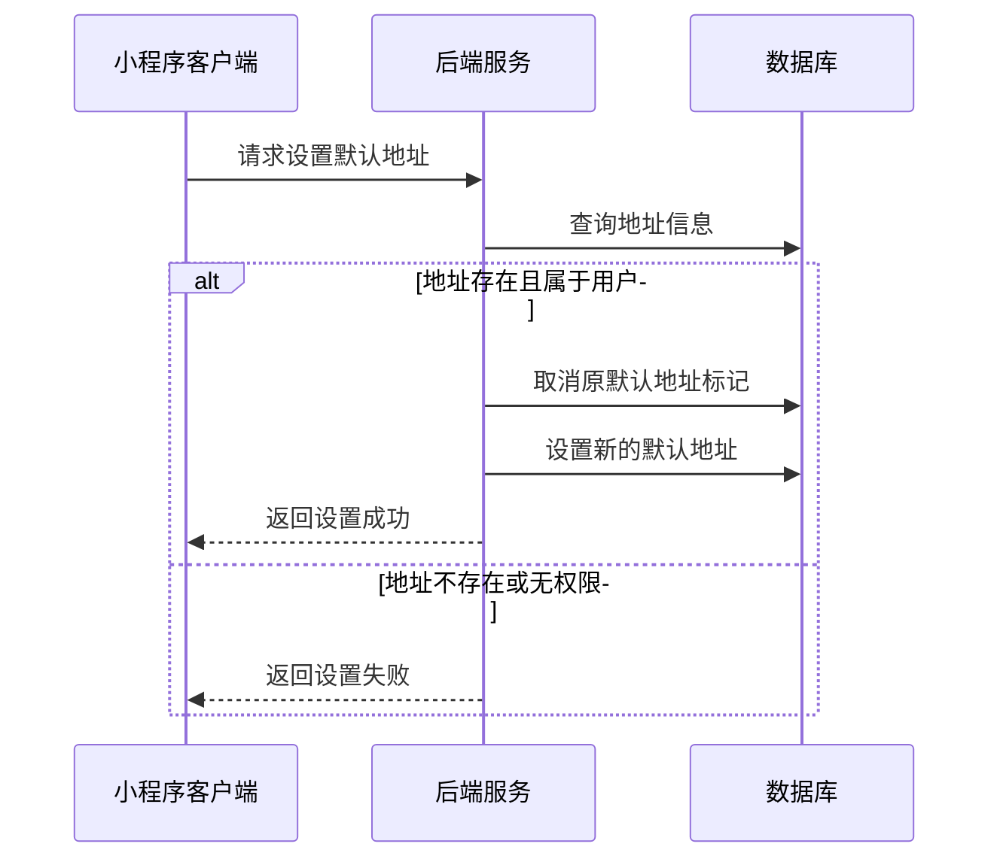
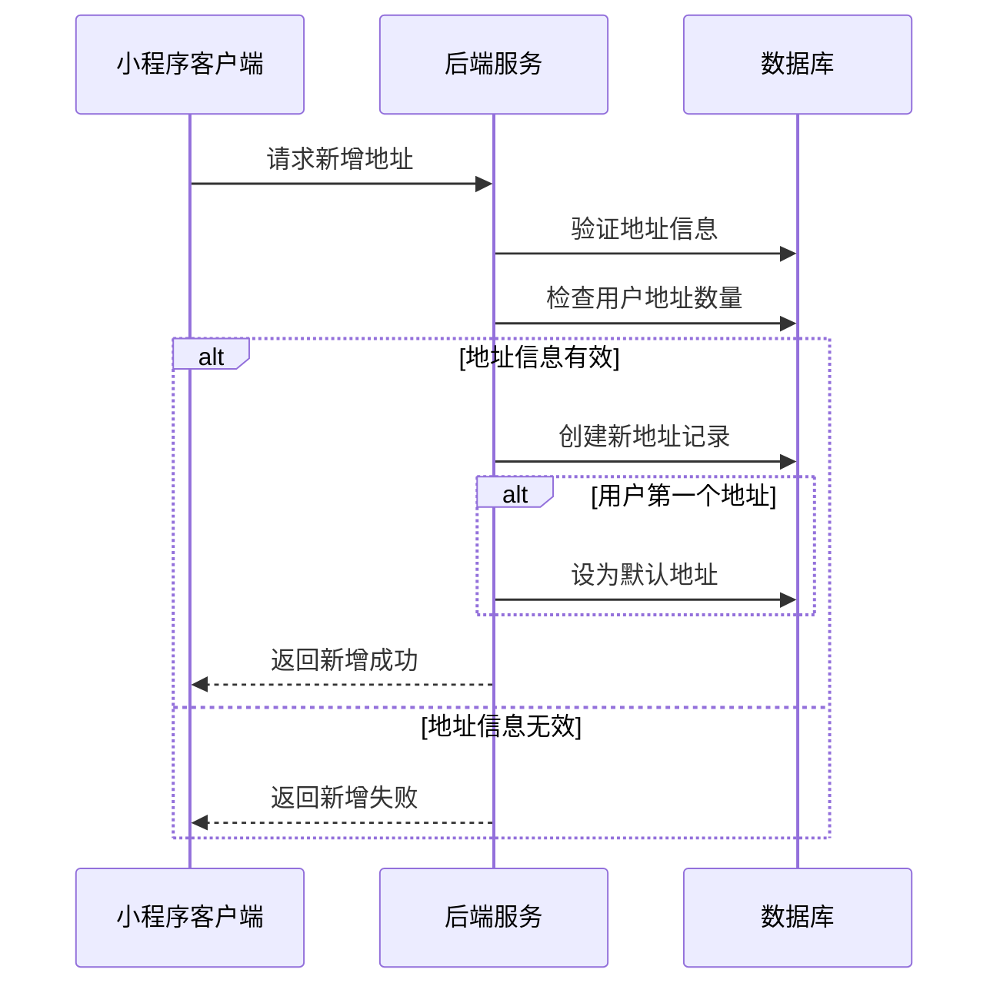

# 地址管理页面接口文档

## 获取地址列表

**接口名称：** 获取地址列表
**功能描述：** 获取用户的所有收货地址，支持地址管理和地址选择场景
**接口地址：** /api/user/addresses/list
**请求方式：** GET

### 功能说明
获取用户的所有收货地址列表，用于地址管理页面展示和订单确认页面地址选择。默认地址排在列表首位。**此接口需要用户登录状态。**



### 请求参数
无需传入参数（需要用户登录态）

### 响应参数
```json
{
  "error": 0,
  "body": {
    "addresses": [
      {
        "id": "addr_001",
        "consignee": "张三",
        "mobile": "13812345678",
        "region": "广东省 深圳市 南山区",
        "detail": "科技园南区深圳软件园二期东座1002室",
        "isDefault": true,
        "createTime": "2024-01-10 14:30:00",
        "updateTime": "2024-01-15 16:20:00"
      },
      {
        "id": "addr_002",
        "consignee": "张三",
        "mobile": "13812345678",
        "region": "广东省 深圳市 福田区",
        "detail": "华强北街道振兴路120号赛格广场3楼",
        "isDefault": false,
        "createTime": "2024-01-08 10:15:00",
        "updateTime": "2024-01-08 10:15:00"
      }
    ],
    "total": 2,
    "defaultAddressId": "addr_001"
  },
  "message": "获取地址列表成功",
  "success": true
}
```

| 参数名 | 类型 | 必填 | 说明 | 示例值 |
|----|---|-----|---|-----|
| error | int | 是 | 错误码，0成功/401未登录 | 0 |
| body | object | 是 | 响应数据 | |
| body.addresses | array | 是 | 地址列表 | |
| body.addresses[].id | string | 是 | 地址ID | addr_001 |
| body.addresses[].consignee | string | 是 | 收件人姓名 | 张三 |
| body.addresses[].mobile | string | 是 | 收件人手机号 | 13812345678 |
| body.addresses[].region | string | 是 | 省市区信息 | 广东省 深圳市 南山区 |
| body.addresses[].detail | string | 是 | 详细地址 | 科技园南区深圳软件园二期东座1002室 |
| body.addresses[].isDefault | bool | 是 | 是否为默认地址 | true |
| body.addresses[].createTime | string | 是 | 创建时间 | 2024-01-10 14:30:00 |
| body.addresses[].updateTime | string | 是 | 更新时间 | 2024-01-15 16:20:00 |
| body.total | int | 是 | 地址总数 | 2 |
| body.defaultAddressId | string | 否 | 默认地址ID | addr_001 |
| message | string | 是 | 响应消息 | 获取地址列表成功 |
| success | bool | 是 | 是否成功 | true |

---

## 删除地址

**接口名称：** 删除地址
**功能描述：** 删除指定的收货地址
**接口地址：** /api/user/addresses/delete
**请求方式：** DELETE

### 功能说明
删除用户指定的收货地址。如果删除的是默认地址，系统会自动将第一个地址设为默认地址。**此接口需要用户登录状态。**



### 请求参数
```json
{
  "addressId": "addr_002"
}
```

| 参数名 | 类型 | 必填 | 说明 | 示例值 |
|----|---|-----|---|-----|
| addressId | string | 是 | 地址ID | addr_002 |

### 响应参数
```json
{
  "error": 0,
  "body": {
    "deleteResult": {
      "addressId": "addr_002",
      "deleted": true,
      "wasDefault": false,
      "newDefaultAddressId": null,
      "message": "地址删除成功"
    }
  },
  "message": "地址删除成功",
  "success": true
}
```

| 参数名 | 类型 | 必填 | 说明 | 示例值 |
|----|---|-----|---|-----|
| error | int | 是 | 错误码，0成功/401未登录/404地址不存在 | 0 |
| body | object | 是 | 响应数据 | |
| body.deleteResult | object | 是 | 删除结果 | |
| body.deleteResult.addressId | string | 是 | 被删除的地址ID | addr_002 |
| body.deleteResult.deleted | bool | 是 | 是否删除成功 | true |
| body.deleteResult.wasDefault | bool | 是 | 被删除地址是否为默认地址 | false |
| body.deleteResult.newDefaultAddressId | string | 否 | 新的默认地址ID（如果删除的是默认地址） | null |
| body.deleteResult.message | string | 是 | 删除结果消息 | 地址删除成功 |
| message | string | 是 | 响应消息 | 地址删除成功 |
| success | bool | 是 | 是否成功 | true |

---

## 批量删除地址

**接口名称：** 批量删除地址
**功能描述：** 批量删除多个收货地址
**接口地址：** /api/user/addresses/batch-delete
**请求方式：** DELETE

### 功能说明
批量删除用户选中的多个收货地址。如果删除的地址中包含默认地址，系统会自动设置剩余的第一个地址为默认地址。**此接口需要用户登录状态。**



### 请求参数
```json
{
  "addressIds": ["addr_002", "addr_003", "addr_004"]
}
```

| 参数名 | 类型 | 必填 | 说明 | 示例值 |
|----|---|-----|---|-----|
| addressIds | array | 是 | 要删除的地址ID数组 | ["addr_002", "addr_003", "addr_004"] |

### 响应参数
```json
{
  "error": 0,
  "body": {
    "batchDeleteResult": {
      "requestedCount": 3,
      "deletedCount": 3,
      "deletedIds": ["addr_002", "addr_003", "addr_004"],
      "failedIds": [],
      "defaultAddressDeleted": false,
      "newDefaultAddressId": null,
      "message": "成功删除3个地址"
    }
  },
  "message": "批量删除地址成功",
  "success": true
}
```

| 参数名 | 类型 | 必填 | 说明 | 示例值 |
|----|---|-----|---|-----|
| error | int | 是 | 错误码，0成功/401未登录/400请求参数错误 | 0 |
| body | object | 是 | 响应数据 | |
| body.batchDeleteResult | object | 是 | 批量删除结果 | |
| body.batchDeleteResult.requestedCount | int | 是 | 请求删除的地址数量 | 3 |
| body.batchDeleteResult.deletedCount | int | 是 | 实际删除的地址数量 | 3 |
| body.batchDeleteResult.deletedIds | array | 是 | 成功删除的地址ID数组 | ["addr_002", "addr_003", "addr_004"] |
| body.batchDeleteResult.failedIds | array | 是 | 删除失败的地址ID数组 | [] |
| body.batchDeleteResult.defaultAddressDeleted | bool | 是 | 是否删除了默认地址 | false |
| body.batchDeleteResult.newDefaultAddressId | string | 否 | 新的默认地址ID（如果删除了默认地址） | null |
| body.batchDeleteResult.message | string | 是 | 批量删除结果消息 | 成功删除3个地址 |
| message | string | 是 | 响应消息 | 批量删除地址成功 |
| success | bool | 是 | 是否成功 | true |

---

## 设置默认地址

**接口名称：** 设置默认地址
**功能描述：** 将指定地址设置为默认收货地址
**接口地址：** /api/user/addresses/set-default
**请求方式：** POST

### 功能说明
将用户指定的地址设置为默认收货地址，系统会自动取消之前的默认地址。**此接口需要用户登录状态。**



### 请求参数
```json
{
  "addressId": "addr_002"
}
```

| 参数名 | 类型 | 必填 | 说明 | 示例值 |
|----|---|-----|---|-----|
| addressId | string | 是 | 要设为默认的地址ID | addr_002 |

### 响应参数
```json
{
  "error": 0,
  "body": {
    "setDefaultResult": {
      "addressId": "addr_002",
      "setAsDefault": true,
      "previousDefaultId": "addr_001",
      "addressInfo": {
        "consignee": "张三",
        "mobile": "13812345678",
        "region": "广东省 深圳市 福田区",
        "detail": "华强北街道振兴路120号赛格广场3楼"
      },
      "message": "默认地址设置成功"
    }
  },
  "message": "默认地址设置成功",
  "success": true
}
```

| 参数名 | 类型 | 必填 | 说明 | 示例值 |
|----|---|-----|---|-----|
| error | int | 是 | 错误码，0成功/401未登录/404地址不存在 | 0 |
| body | object | 是 | 响应数据 | |
| body.setDefaultResult | object | 是 | 设置结果 | |
| body.setDefaultResult.addressId | string | 是 | 设为默认的地址ID | addr_002 |
| body.setDefaultResult.setAsDefault | bool | 是 | 是否设置成功 | true |
| body.setDefaultResult.previousDefaultId | string | 否 | 之前的默认地址ID | addr_001 |
| body.setDefaultResult.addressInfo | object | 是 | 地址信息 | |
| body.setDefaultResult.addressInfo.consignee | string | 是 | 收件人姓名 | 张三 |
| body.setDefaultResult.addressInfo.mobile | string | 是 | 收件人手机号 | 13812345678 |
| body.setDefaultResult.addressInfo.region | string | 是 | 省市区信息 | 广东省 深圳市 福田区 |
| body.setDefaultResult.addressInfo.detail | string | 是 | 详细地址 | 华强北街道振兴路120号赛格广场3楼 |
| body.setDefaultResult.message | string | 是 | 设置结果消息 | 默认地址设置成功 |
| message | string | 是 | 响应消息 | 默认地址设置成功 |
| success | bool | 是 | 是否成功 | true |

---

## 新增地址

**接口名称：** 新增地址
**功能描述：** 添加新的收货地址
**接口地址：** /api/user/addresses/add
**请求方式：** POST

### 功能说明
为用户添加新的收货地址。如果是用户的第一个地址，会自动设为默认地址。**此接口需要用户登录状态。**



### 请求参数
```json
{
  "consignee": "李四",
  "mobile": "13987654321",
  "region": "北京市 朝阳区",
  "detail": "建国门外大街1号国贸大厦A座20层",
  "isDefault": false
}
```

| 参数名 | 类型 | 必填 | 说明 | 示例值 |
|----|---|-----|---|-----|
| consignee | string | 是 | 收件人姓名 | 李四 |
| mobile | string | 是 | 收件人手机号 | 13987654321 |
| region | string | 是 | 省市区信息 | 北京市 朝阳区 |
| detail | string | 是 | 详细地址 | 建国门外大街1号国贸大厦A座20层 |
| isDefault | bool | 否 | 是否设为默认地址（默认false） | false |

### 响应参数
```json
{
  "error": 0,
  "body": {
    "addResult": {
      "addressId": "addr_005",
      "created": true,
      "addressInfo": {
        "id": "addr_005",
        "consignee": "李四",
        "mobile": "13987654321",
        "region": "北京市 朝阳区",
        "detail": "建国门外大街1号国贸大厦A座20层",
        "isDefault": false,
        "createTime": "2024-01-16 10:30:00"
      },
      "isFirstAddress": false,
      "message": "地址添加成功"
    }
  },
  "message": "地址添加成功",
  "success": true
}
```

| 参数名 | 类型 | 必填 | 说明 | 示例值 |
|----|---|-----|---|-----|
| error | int | 是 | 错误码，0成功/401未登录/400参数错误 | 0 |
| body | object | 是 | 响应数据 | |
| body.addResult | object | 是 | 添加结果 | |
| body.addResult.addressId | string | 是 | 新增的地址ID | addr_005 |
| body.addResult.created | bool | 是 | 是否创建成功 | true |
| body.addResult.addressInfo | object | 是 | 地址详细信息 | |
| body.addResult.addressInfo.id | string | 是 | 地址ID | addr_005 |
| body.addResult.addressInfo.consignee | string | 是 | 收件人姓名 | 李四 |
| body.addResult.addressInfo.mobile | string | 是 | 收件人手机号 | 13987654321 |
| body.addResult.addressInfo.region | string | 是 | 省市区信息 | 北京市 朝阳区 |
| body.addResult.addressInfo.detail | string | 是 | 详细地址 | 建国门外大街1号国贸大厦A座20层 |
| body.addResult.addressInfo.isDefault | bool | 是 | 是否为默认地址 | false |
| body.addResult.addressInfo.createTime | string | 是 | 创建时间 | 2024-01-16 10:30:00 |
| body.addResult.isFirstAddress | bool | 是 | 是否为用户第一个地址 | false |
| body.addResult.message | string | 是 | 添加结果消息 | 地址添加成功 |
| message | string | 是 | 响应消息 | 地址添加成功 |
| success | bool | 是 | 是否成功 | true |

---

## 编辑地址

**接口名称：** 编辑地址
**功能描述：** 修改指定的收货地址信息
**接口地址：** /api/user/addresses/edit
**请求方式：** PUT

### 功能说明
修改用户指定的收货地址信息，包括收件人、手机号、地址等。**此接口需要用户登录状态。**


### 请求参数
```json
{
  "addressId": "addr_002",
  "consignee": "张三丰",
  "mobile": "13812345678",
  "region": "广东省 深圳市 福田区",
  "detail": "华强北街道振兴路120号赛格广场5楼",
  "isDefault": true
}
```

| 参数名 | 类型 | 必填 | 说明 | 示例值 |
|----|---|-----|---|-----|
| addressId | string | 是 | 地址ID | addr_002 |
| consignee | string | 是 | 收件人姓名 | 张三丰 |
| mobile | string | 是 | 收件人手机号 | 13812345678 |
| region | string | 是 | 省市区信息 | 广东省 深圳市 福田区 |
| detail | string | 是 | 详细地址 | 华强北街道振兴路120号赛格广场5楼 |
| isDefault | bool | 否 | 是否设为默认地址 | true |

### 响应参数
```json
{
  "error": 0,
  "body": {
    "editResult": {
      "addressId": "addr_002",
      "updated": true,
      "addressInfo": {
        "id": "addr_002",
        "consignee": "张三丰",
        "mobile": "13812345678",
        "region": "广东省 深圳市 福田区",
        "detail": "华强北街道振兴路120号赛格广场5楼",
        "isDefault": true,
        "updateTime": "2024-01-16 11:00:00"
      },
      "defaultChanged": true,
      "previousDefaultId": "addr_001",
      "message": "地址修改成功"
    }
  },
  "message": "地址修改成功",
  "success": true
}
```

| 参数名 | 类型 | 必填 | 说明 | 示例值 |
|----|---|-----|---|-----|
| error | int | 是 | 错误码，0成功/401未登录/404地址不存在 | 0 |
| body | object | 是 | 响应数据 | |
| body.editResult | object | 是 | 编辑结果 | |
| body.editResult.addressId | string | 是 | 编辑的地址ID | addr_002 |
| body.editResult.updated | bool | 是 | 是否更新成功 | true |
| body.editResult.addressInfo | object | 是 | 更新后的地址信息 | |
| body.editResult.addressInfo.id | string | 是 | 地址ID | addr_002 |
| body.editResult.addressInfo.consignee | string | 是 | 收件人姓名 | 张三丰 |
| body.editResult.addressInfo.mobile | string | 是 | 收件人手机号 | 13812345678 |
| body.editResult.addressInfo.region | string | 是 | 省市区信息 | 广东省 深圳市 福田区 |
| body.editResult.addressInfo.detail | string | 是 | 详细地址 | 华强北街道振兴路120号赛格广场5楼 |
| body.editResult.addressInfo.isDefault | bool | 是 | 是否为默认地址 | true |
| body.editResult.addressInfo.updateTime | string | 是 | 更新时间 | 2024-01-16 11:00:00 |
| body.editResult.defaultChanged | bool | 是 | 默认地址是否发生变更 | true |
| body.editResult.previousDefaultId | string | 否 | 之前的默认地址ID | addr_001 |
| body.editResult.message | string | 是 | 编辑结果消息 | 地址修改成功 |
| message | string | 是 | 响应消息 | 地址修改成功 |
| success | bool | 是 | 是否成功 | true | 