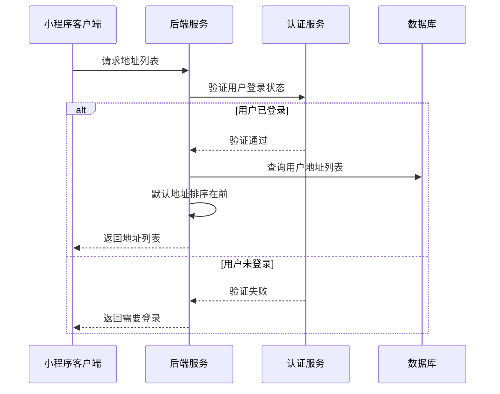
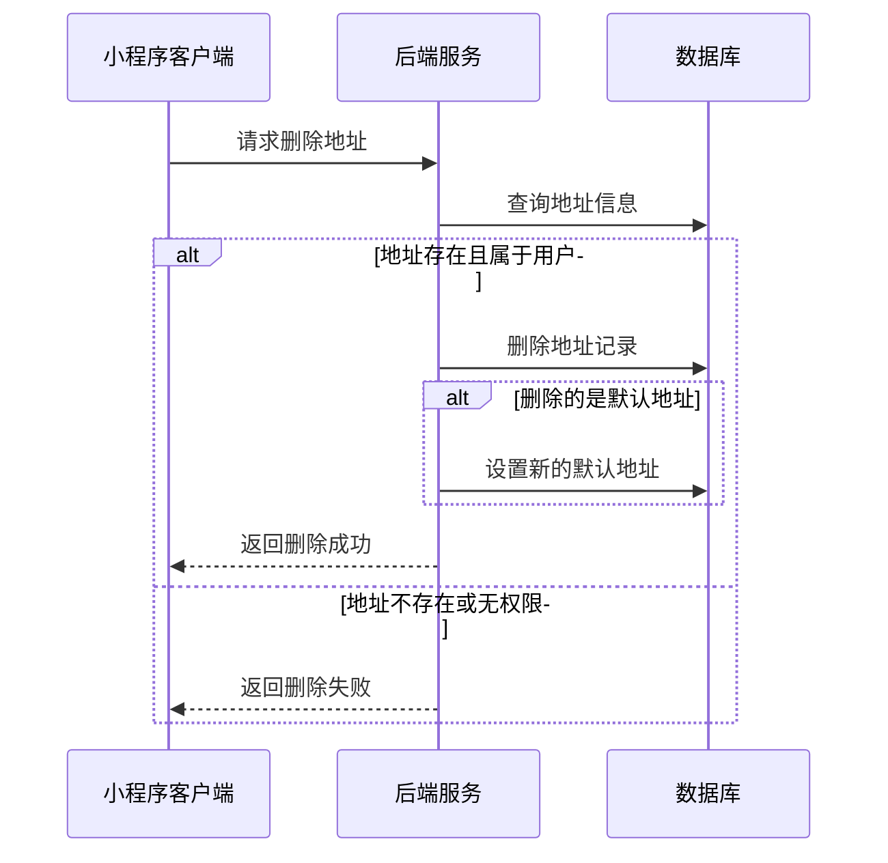
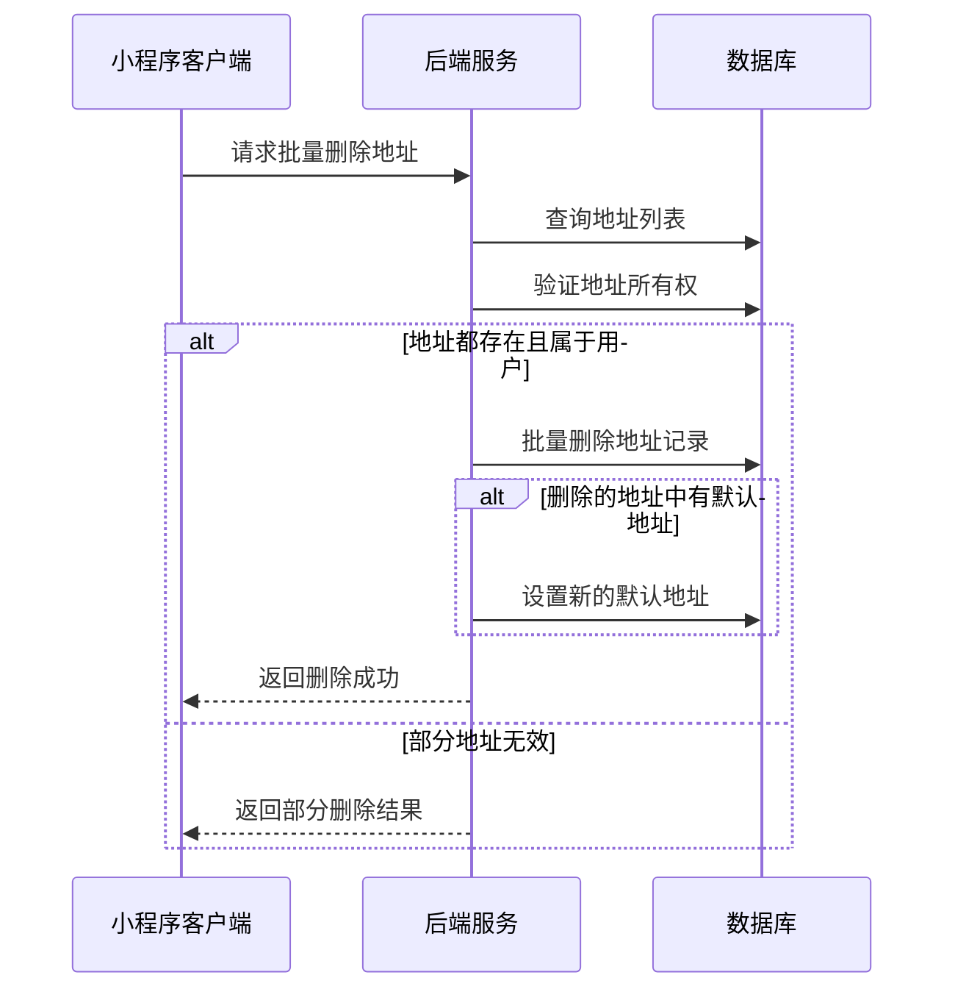
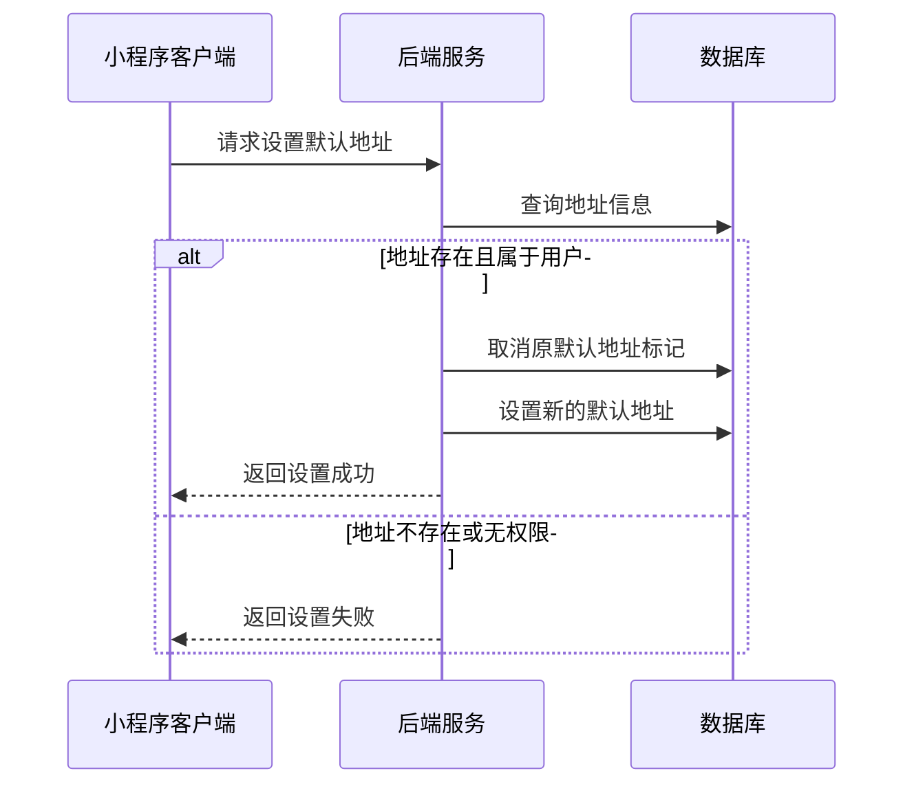

# 地址管理页面接口文档

## 获取地址列表

**接口名称：** 获取地址列表
**功能描述：** 获取用户的所有收货地址，支持地址管理和地址选择场景
**接口地址：** /api/user/addresses/list
**请求方式：** GET

### 功能说明
获取用户的所有收货地址列表，用于地址管理页面展示和订单确认页面地址选择。根据address-list/index.js中的loadAddressList方法实现，默认地址排在列表首位，每个地址会添加selected字段用于编辑模式的多选功能。**此接口需要用户登录状态。**



### 请求参数
无需传入参数（需要用户登录态）

### 响应参数
```json
{
  "error": 0,
  "body": [
    {
      "id": 1,
      "consignee": "张三",
      "mobile": "13812345678",
      "region": "广东省 深圳市 南山区",
      "detail": "科技园南区深圳软件园二期东座1002室",
      "isDefault": true
    },
    {
      "id": 2,
      "consignee": "张三",
      "mobile": "13812345678",
      "region": "广东省 深圳市 福田区",
      "detail": "华强北街道振兴路120号赛格广场3楼",
      "isDefault": false
    }
  ],
  "message": "获取地址列表成功",
  "success": true
}
```

| 参数名 | 类型 | 必填 | 说明 | 示例值 |
|----|---|-----|---|-----|
| error | int | 是 | 错误码，0成功/401未登录 | 0 |
| body | array | 是 | 地址列表数组 | |
| body[].id | int | 是 | 地址ID（数字类型） | 1 |
| body[].consignee | string | 是 | 收件人姓名 | 张三 |
| body[].mobile | string | 是 | 收件人手机号 | 13812345678 |
| body[].region | string | 是 | 省市区信息（空格分隔） | 广东省 深圳市 南山区 |
| body[].detail | string | 是 | 详细地址 | 科技园南区深圳软件园二期东座1002室 |
| body[].isDefault | bool | 是 | 是否为默认地址 | true |
| message | string | 是 | 响应消息 | 获取地址列表成功 |
| success | bool | 是 | 是否成功 | true |

**字段说明：**
- `body`: 直接返回地址数组，而非嵌套在addresses字段中，对应JS代码中的`await getAddressList()`
- `id`: 地址的唯一标识符，为数字类型，对应JS代码中的地址选择和操作逻辑
- `region`: 地区信息，使用空格分隔格式，对应JS代码中的地区显示
- 每个地址项在前端会自动添加`selected: false`字段用于编辑模式的多选功能

---

## 删除地址

**接口名称：** 删除地址
**功能描述：** 删除指定的收货地址
**接口地址：** /api/user/addresses/delete
**请求方式：** DELETE

### 功能说明
删除用户指定的收货地址。根据address-list/index.js中的deleteAddress方法实现，如果删除的是默认地址，系统会自动将第一个地址设为默认地址。删除前会显示确认弹窗。**此接口需要用户登录状态。**



### 请求参数
```json
{
  "addressId": 2
}
```

| 参数名 | 类型 | 必填 | 说明 | 示例值 |
|----|---|-----|---|-----|
| addressId | int | 是 | 地址ID（数字类型） | 2 |

### 响应参数
```json
{
  "error": 0,
  "body": {
    "addressId": 2,
    "deleted": true,
    "message": "地址删除成功"
  },
  "message": "地址删除成功",
  "success": true
}
```

| 参数名 | 类型 | 必填 | 说明 | 示例值 |
|----|---|-----|---|-----|
| error | int | 是 | 错误码，0成功/401未登录/404地址不存在 | 0 |
| body | object | 是 | 响应数据 | |
| body.addressId | int | 是 | 被删除的地址ID（数字类型） | 2 |
| body.deleted | bool | 是 | 是否删除成功 | true |
| body.message | string | 是 | 删除结果消息 | 地址删除成功 |
| message | string | 是 | 响应消息 | 地址删除成功 |
| success | bool | 是 | 是否成功 | true |

---

## 批量删除地址

**接口名称：** 批量删除地址
**功能描述：** 批量删除多个收货地址
**接口地址：** /api/user/addresses/batch-delete
**请求方式：** DELETE

### 功能说明
批量删除用户选中的多个收货地址。根据address-list/index.js中的batchDelete和confirmDelete方法实现，如果删除的地址中包含默认地址，系统会自动设置剩余的第一个地址为默认地址。操作完成后会退出编辑模式。**此接口需要用户登录状态。**



### 请求参数
```json
{
  "addressIds": [2, 3, 4]
}
```

| 参数名 | 类型 | 必填 | 说明 | 示例值 |
|----|---|-----|---|-----|
| addressIds | array | 是 | 要删除的地址ID数组（数字类型） | [2, 3, 4] |

### 响应参数
```json
{
  "error": 0,
  "body": {
    "requestedCount": 3,
    "deletedCount": 3,
    "deletedIds": [2, 3, 4],
    "message": "成功删除3个地址"
  },
  "message": "批量删除地址成功",
  "success": true
}
```

| 参数名 | 类型 | 必填 | 说明 | 示例值 |
|----|---|-----|---|-----|
| error | int | 是 | 错误码，0成功/401未登录/400请求参数错误 | 0 |
| body | object | 是 | 响应数据 | |
| body.requestedCount | int | 是 | 请求删除的地址数量 | 3 |
| body.deletedCount | int | 是 | 实际删除的地址数量 | 3 |
| body.deletedIds | array | 是 | 成功删除的地址ID数组（数字类型） | [2, 3, 4] |
| body.message | string | 是 | 批量删除结果消息 | 成功删除3个地址 |
| message | string | 是 | 响应消息 | 批量删除地址成功 |
| success | bool | 是 | 是否成功 | true |

---

## 设置默认地址

**接口名称：** 设置默认地址
**功能描述：** 将指定地址设置为默认收货地址
**接口地址：** /api/user/addresses/set-default
**请求方式：** POST

### 功能说明
将用户指定的地址设置为默认收货地址。根据address-list/index.js中的setAsDefault方法实现，系统会自动取消之前的默认地址。操作完成后会重新加载地址列表。**此接口需要用户登录状态。**



### 请求参数
```json
{
  "addressId": 2
}
```

| 参数名 | 类型 | 必填 | 说明 | 示例值 |
|----|---|-----|---|-----|
| addressId | int | 是 | 要设为默认的地址ID（数字类型） | 2 |

### 响应参数
```json
{
  "error": 0,
  "body": {
    "addressId": 2,
    "setAsDefault": true,
    "message": "默认地址设置成功"
  },
  "message": "默认地址设置成功",
  "success": true
}
```

| 参数名 | 类型 | 必填 | 说明 | 示例值 |
|----|---|-----|---|-----|
| error | int | 是 | 错误码，0成功/401未登录/404地址不存在 | 0 |
| body | object | 是 | 响应数据 | |
| body.addressId | int | 是 | 设为默认的地址ID（数字类型） | 2 |
| body.setAsDefault | bool | 是 | 是否设置成功 | true |
| body.message | string | 是 | 设置结果消息 | 默认地址设置成功 |
| message | string | 是 | 响应消息 | 默认地址设置成功 |
| success | bool | 是 | 是否成功 | true |

---

## 页面模式和交互逻辑

### 页面模式说明
根据address-list/index.js中的onLoad方法实现，地址列表页面支持两种模式：

#### 地址管理模式（默认）
- **来源参数**：`fromPage` 为空或 `"manage"`
- **页面标题**："地址管理"
- **功能特性**：
  - 支持编辑模式：长按进入编辑模式，可多选删除
  - 支持单个操作：编辑、删除单个地址
  - 支持新增地址：跳转到地址表单页面
  - 点击地址卡片无操作（管理模式下不设置默认地址）

#### 地址选择模式
- **来源参数**：`fromPage` 为 `"order"` 或 `"order-confirm"`
- **页面标题**："选择收货地址"
- **功能特性**：
  - 点击地址卡片直接选择并返回
  - 通过`onAddressSelected`回调或存储方式传递选中地址
  - 自动执行`wx.navigateBack()`返回上一页

### 编辑模式功能
根据JS代码实现的编辑模式功能：

#### 进入编辑模式
- **触发方式**：长按地址卡片或点击编辑按钮
- **反馈提示**：显示"已进入编辑模式"Toast和轻震动反馈
- **页面状态**：`isEditMode: true`

#### 多选功能
- **选中状态**：每个地址添加`selected`字段
- **全选功能**：支持全选/取消全选操作
- **选中计数**：实时更新`selectedIds`数组

#### 退出编辑模式
- **清空选中**：自动清空所有选中状态
- **恢复正常**：返回正常浏览模式

### 地址操作功能

#### 新增地址
- **跳转路径**：`/pages/address-form/index?action=add`
- **页面刷新**：`onShow`时自动重新加载地址列表

#### 编辑地址
- **跳转路径**：`/pages/address-form/index?id=${id}&action=edit`
- **参数传递**：地址ID为数字类型

#### 删除确认
- **弹窗提示**：根据是否默认地址显示不同提示信息
- **默认地址提示**：`确定要删除默认地址"${address.consignee}"吗？`
- **普通地址提示**：`确定要删除"${address.consignee}"的地址吗？` 