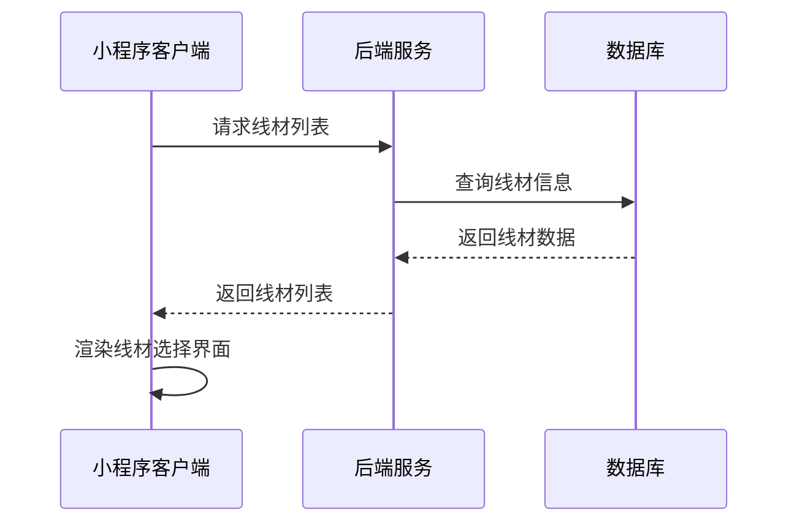
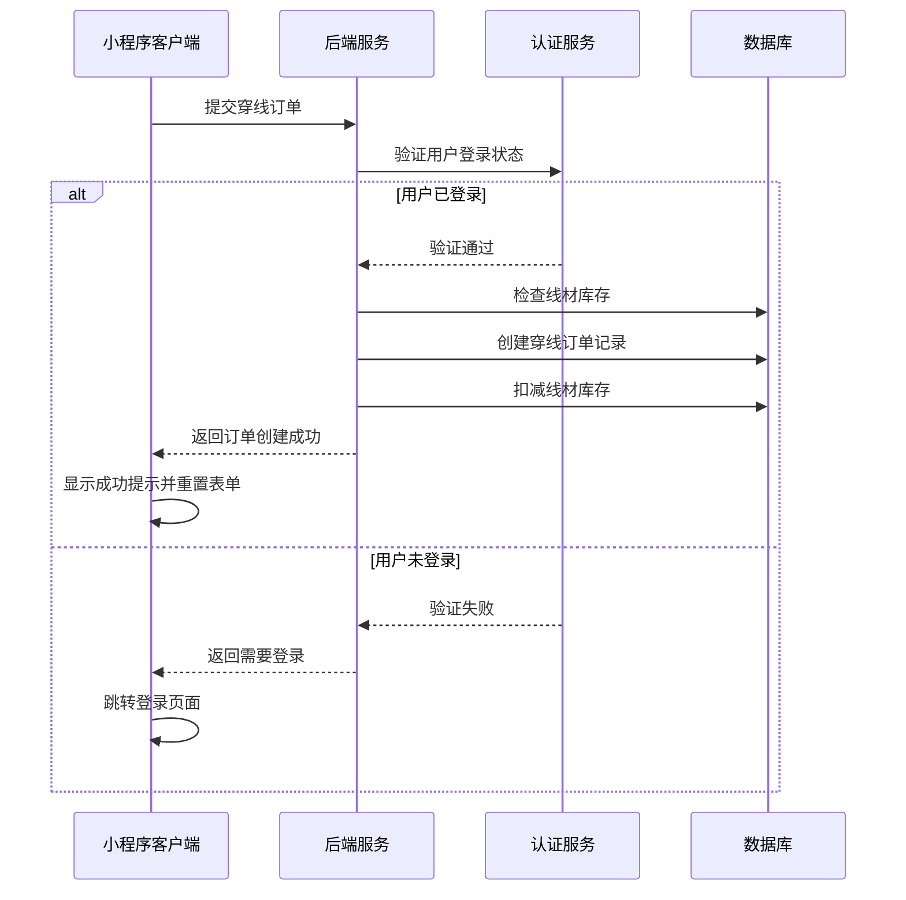
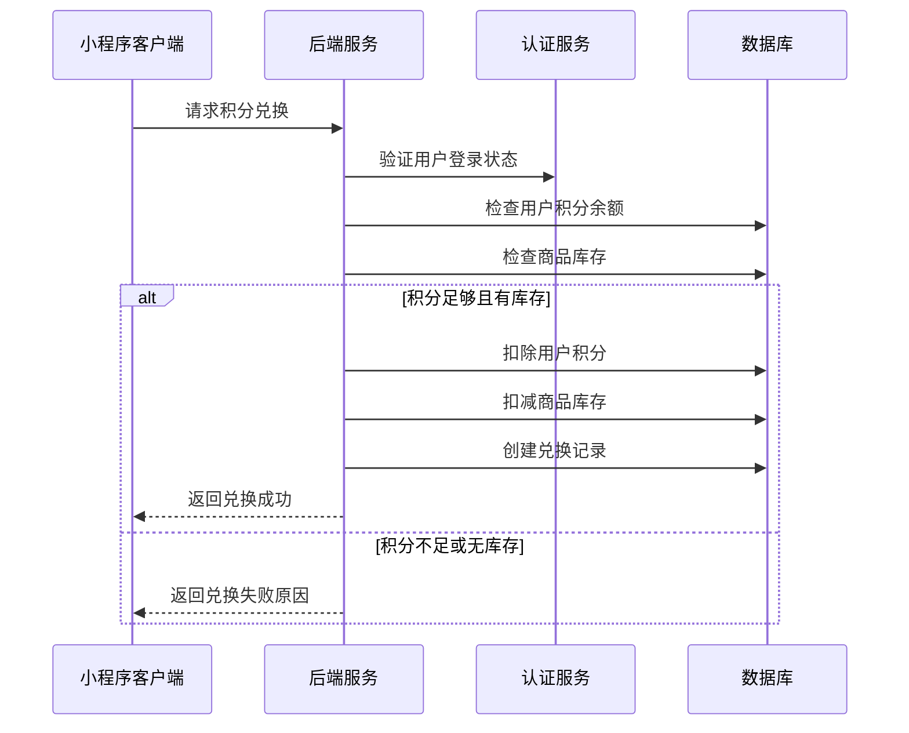
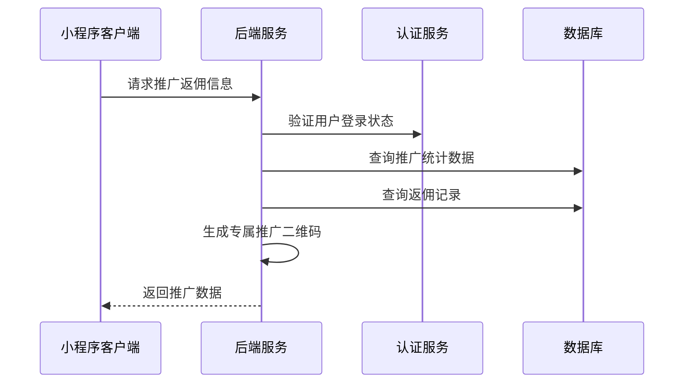
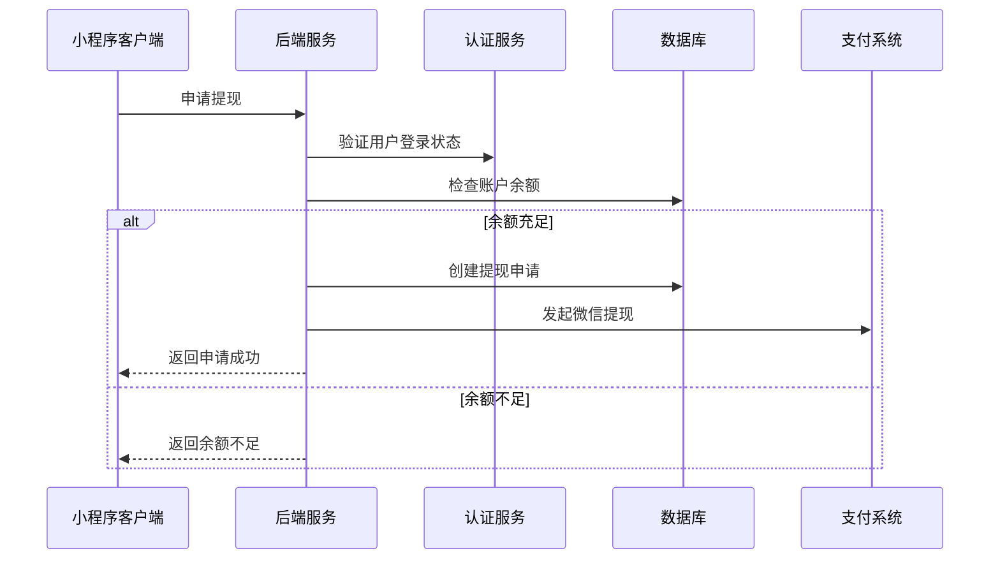
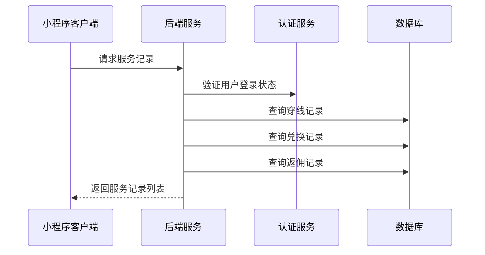

# 服务页面接口文档

## 获取线材列表

**接口名称：** 获取线材列表
**功能描述：** 获取穿线服务可选的羽毛球线材列表，支持按品牌筛选
**接口地址：** /api/strings/list
**请求方式：** GET

### 功能说明
在穿线服务Tab中展示可选的线材列表，用户可以按品牌筛选线材。返回线材的名称、描述、价格等信息供用户选择。



### 请求参数
```json
{
  "brand": "yonex"
}
```

| 参数名 | 类型 | 必填 | 说明 | 示例值 |
|----|---|-----|---|-----|
| brand | string | 否 | 品牌筛选（all全部/yonex/victor/li_ning/gosen） | yonex |

### 响应参数
```json
{
  "error": 0,
  "body": {
    "brands": [
      { "id": "all", "name": "全部" },
      { "id": "yonex", "name": "YONEX" },
      { "id": "victor", "name": "VICTOR" },
      { "id": "li_ning", "name": "李宁" },
      { "id": "gosen", "name": "GOSEN" }
    ],
    "strings": [
      {
        "id": "BG65",
        "name": "BG-65",
        "brand": "yonex",
        "description": "经典耐用，适合初学者",
        "price": 35,
        "inStock": true
      },
      {
        "id": "BG80", 
        "name": "BG-80 Power",
        "brand": "yonex",
        "description": "高弹性，进攻型选手首选",
        "price": 45,
        "inStock": true
      }
    ]
  },
  "message": "获取线材列表成功",
  "success": true
}
```

| 参数名 | 类型 | 必填 | 说明 | 示例值 |
|----|---|-----|---|-----|
| error | int | 是 | 错误码，0表示成功 | 0 |
| body | object | 是 | 响应数据 | |
| body.brands | array | 是 | 品牌列表 | |
| body.brands[].id | string | 是 | 品牌ID | yonex |
| body.brands[].name | string | 是 | 品牌名称 | YONEX |
| body.strings | array | 是 | 线材列表 | |
| body.strings[].id | string | 是 | 线材ID | BG65 |
| body.strings[].name | string | 是 | 线材名称 | BG-65 |
| body.strings[].brand | string | 是 | 所属品牌 | yonex |
| body.strings[].description | string | 是 | 线材描述 | 经典耐用，适合初学者 |
| body.strings[].price | number | 是 | 穿线价格 | 35 |
| body.strings[].inStock | bool | 是 | 是否有库存 | true |
| message | string | 是 | 响应消息 | 获取线材列表成功 |
| success | bool | 是 | 是否成功 | true |

---

## 提交穿线订单

**接口名称：** 提交穿线订单
**功能描述：** 提交穿线服务订单，创建穿线任务记录
**接口地址：** /api/string-service/create
**请求方式：** POST

### 功能说明
用户在穿线服务Tab填写完球拍信息、选择线材和磅数后提交穿线订单。**此接口需要用户登录状态，未登录用户需要先引导登录。** 提交成功后生成穿线任务记录，用户可在"我的服务"中查看进度。



### 请求参数
```json
{
  "racketBrand": "YONEX ARC-11",
  "pounds": 24,
  "stringId": "BG65",
  "remark": "请小心包装",
  "customerInfo": {
    "name": "张三",
    "phone": "13800138000"
  }
}
```

| 参数名 | 类型 | 必填 | 说明 | 示例值 |
|----|---|-----|---|-----|
| racketBrand | string | 是 | 球拍品牌型号 | YONEX ARC-11 |
| pounds | int | 是 | 磅数要求（18-30） | 24 |
| stringId | string | 是 | 选择的线材ID | BG65 |
| remark | string | 否 | 备注信息 | 请小心包装 |
| customerInfo | object | 否 | 客户信息（未登录用户填写） | |
| customerInfo.name | string | 否 | 客户姓名 | 张三 |
| customerInfo.phone | string | 否 | 联系电话 | 13800138000 |

### 响应参数
```json
{
  "error": 0,
  "body": {
    "stringOrder": {
      "orderId": "string_20241215001",
      "orderNo": "STR202412150001",
      "racketBrand": "YONEX ARC-11",
      "pounds": 24,
      "stringName": "BG-65",
      "totalPrice": 35.00,
      "status": "pending",
      "statusText": "待接单",
      "estimatedTime": "2-3个工作日",
      "createTime": "2024-12-15 14:30:00"
    }
  },
  "message": "穿线订单提交成功",
  "success": true
}
```

| 参数名 | 类型 | 必填 | 说明 | 示例值 |
|----|---|-----|---|-----|
| error | int | 是 | 错误码，0成功/401未登录/400参数错误 | 0 |
| body | object | 是 | 响应数据 | |
| body.stringOrder | object | 是 | 穿线订单信息 | |
| body.stringOrder.orderId | string | 是 | 订单ID | string_20241215001 |
| body.stringOrder.orderNo | string | 是 | 订单号 | STR202412150001 |
| body.stringOrder.racketBrand | string | 是 | 球拍型号 | YONEX ARC-11 |
| body.stringOrder.pounds | int | 是 | 磅数 | 24 |
| body.stringOrder.stringName | string | 是 | 线材名称 | BG-65 |
| body.stringOrder.totalPrice | number | 是 | 总价格 | 35.00 |
| body.stringOrder.status | string | 是 | 订单状态 | pending |
| body.stringOrder.statusText | string | 是 | 状态描述 | 待接单 |
| body.stringOrder.estimatedTime | string | 是 | 预计完成时间 | 2-3个工作日 |
| body.stringOrder.createTime | string | 是 | 创建时间 | 2024-12-15 14:30:00 |
| message | string | 是 | 响应消息 | 穿线订单提交成功 |
| success | bool | 是 | 是否成功 | true |

---

## 获取积分兑换信息

**接口名称：** 获取积分兑换信息
**功能描述：** 获取用户积分余额和可兑换商品列表
**接口地址：** /api/points/exchange-info
**请求方式：** GET

### 功能说明
在积分兑换Tab中显示用户当前积分余额、可兑换的商品列表和最近兑换记录。**此接口需要用户登录状态。**


### 请求参数
无需传入参数（需要用户登录态）

### 响应参数
```json
{
  "error": 0,
  "body": {
    "pointsInfo": {
      "userPoints": 2580,
      "goods": [
        {
          "id": 101,
          "name": "羽毛球拍",
          "image": "/assets/images/racket.jpg",
          "pointsRequired": 2200,
          "stock": 5,
          "category": "器材"
        },
        {
          "id": 102,
          "name": "专业羽毛球鞋",
          "image": "/assets/images/shoes.jpg", 
          "pointsRequired": 1800,
          "stock": 3,
          "category": "服装"
        }
      ],
      "recentExchanges": [
        {
          "goodsName": "专业羽毛球鞋",
          "pointsSpent": 1800,
          "exchangeTime": "2024-06-01",
          "status": "completed"
        }
      ]
    }
  },
  "message": "获取积分信息成功",
  "success": true
}
```

| 参数名 | 类型 | 必填 | 说明 | 示例值 |
|----|---|-----|---|-----|
| error | int | 是 | 错误码，0成功/401未登录 | 0 |
| body | object | 是 | 响应数据 | |
| body.pointsInfo | object | 是 | 积分信息 | |
| body.pointsInfo.userPoints | int | 是 | 用户当前积分 | 2580 |
| body.pointsInfo.goods | array | 是 | 可兑换商品列表 | |
| body.pointsInfo.goods[].id | int | 是 | 商品ID | 101 |
| body.pointsInfo.goods[].name | string | 是 | 商品名称 | 羽毛球拍 |
| body.pointsInfo.goods[].image | string | 是 | 商品图片 | /assets/images/racket.jpg |
| body.pointsInfo.goods[].pointsRequired | int | 是 | 所需积分 | 2200 |
| body.pointsInfo.goods[].stock | int | 是 | 可兑换库存 | 5 |
| body.pointsInfo.goods[].category | string | 是 | 商品分类 | 器材 |
| body.pointsInfo.recentExchanges | array | 是 | 最近兑换记录 | |
| body.pointsInfo.recentExchanges[].goodsName | string | 是 | 商品名称 | 专业羽毛球鞋 |
| body.pointsInfo.recentExchanges[].pointsSpent | int | 是 | 消耗积分 | 1800 |
| body.pointsInfo.recentExchanges[].exchangeTime | string | 是 | 兑换时间 | 2024-06-01 |
| body.pointsInfo.recentExchanges[].status | string | 是 | 兑换状态 | completed |
| message | string | 是 | 响应消息 | 获取积分信息成功 |
| success | bool | 是 | 是否成功 | true |

---

## 积分兑换商品

**接口名称：** 积分兑换商品
**功能描述：** 使用积分兑换指定商品
**接口地址：** /api/points/exchange
**请求方式：** POST

### 功能说明
用户在积分兑换Tab中选择商品进行兑换。需要验证用户积分是否充足、商品库存是否足够等，兑换成功后扣除对应积分并生成兑换记录。**此接口需要用户登录状态。**



### 请求参数
```json
{
  "goodsId": 101,
  "quantity": 1
}
```

| 参数名 | 类型 | 必填 | 说明 | 示例值 |
|----|---|-----|---|-----|
| goodsId | int | 是 | 商品ID | 101 |
| quantity | int | 是 | 兑换数量 | 1 |

### 响应参数
```json
{
  "error": 0,
  "body": {
    "exchangeResult": {
      "exchangeId": "exchange_20241215001",
      "goodsName": "羽毛球拍",
      "pointsSpent": 2200,
      "remainingPoints": 380,
      "status": "success",
      "deliveryInfo": "预计3-5个工作日发货"
    }
  },
  "message": "兑换成功",
  "success": true
}
```

| 参数名 | 类型 | 必填 | 说明 | 示例值 |
|----|---|-----|---|-----|
| error | int | 是 | 错误码，0成功/401未登录/402积分不足/403库存不足 | 0 |
| body | object | 是 | 响应数据 | |
| body.exchangeResult | object | 是 | 兑换结果 | |
| body.exchangeResult.exchangeId | string | 是 | 兑换记录ID | exchange_20241215001 |
| body.exchangeResult.goodsName | string | 是 | 商品名称 | 羽毛球拍 |
| body.exchangeResult.pointsSpent | int | 是 | 消耗积分 | 2200 |
| body.exchangeResult.remainingPoints | int | 是 | 剩余积分 | 380 |
| body.exchangeResult.status | string | 是 | 兑换状态 | success |
| body.exchangeResult.deliveryInfo | string | 是 | 发货信息 | 预计3-5个工作日发货 |
| message | string | 是 | 响应消息 | 兑换成功 |
| success | bool | 是 | 是否成功 | true |

---

## 获取推广返佣信息

**接口名称：** 获取推广返佣信息
**功能描述：** 获取用户推广返佣的统计数据和明细记录
**接口地址：** /api/promotion/info
**请求方式：** GET

### 功能说明
在推广返佣Tab中显示用户的推广统计数据，包括累计收益、邀请人数、推广二维码等信息，以及返佣明细记录。**此接口需要用户登录状态。**



### 请求参数
无需传入参数（需要用户登录态）

### 响应参数
```json
{
  "error": 0,
  "body": {
    "promotionData": {
      "totalEarnings": 158.00,
      "invitedUsers": 6,
      "thisMonthEarnings": 45.00,
      "todayEarnings": 8.00,
      "accountBalance": 245.00,
      "inviteCode": "PROMO001",
      "inviteLink": "https://miniprogram.com/invite?code=PROMO001",
      "qrCodeUrl": "https://api.qrserver.com/v1/create-qr-code/?size=200x200&data=https://miniprogram.com/invite?code=PROMO001",
      "commissionRecords": [
        {
          "id": "comm_001",
          "description": "邀请好友注册奖励",
          "amount": 20.00,
          "createTime": "2024-06-08",
          "status": "completed",
          "type": "invite"
        },
        {
          "id": "comm_002",
          "description": "好友消费返佣",
          "amount": 15.00,
          "createTime": "2024-06-07",
          "status": "completed", 
          "type": "commission"
        }
      ],
      "withdrawRecords": [
        {
          "id": "withdraw_001",
          "amount": 100.00,
          "createTime": "2024-06-01",
          "status": "completed",
          "orderNo": "WD202406010001"
        }
      ]
    }
  },
  "message": "获取推广信息成功",
  "success": true
}
```

| 参数名 | 类型 | 必填 | 说明 | 示例值 |
|----|---|-----|---|-----|
| error | int | 是 | 错误码，0成功/401未登录 | 0 |
| body | object | 是 | 响应数据 | |
| body.promotionData | object | 是 | 推广数据 | |
| body.promotionData.totalEarnings | number | 是 | 累计收益 | 158.00 |
| body.promotionData.invitedUsers | int | 是 | 累计邀请人数 | 6 |
| body.promotionData.thisMonthEarnings | number | 是 | 本月收益 | 45.00 |
| body.promotionData.todayEarnings | number | 是 | 今日收益 | 8.00 |
| body.promotionData.accountBalance | number | 是 | 账户余额 | 245.00 |
| body.promotionData.inviteCode | string | 是 | 邀请码 | PROMO001 |
| body.promotionData.inviteLink | string | 是 | 邀请链接 | https://miniprogram.com/invite?code=PROMO001 |
| body.promotionData.qrCodeUrl | string | 是 | 推广二维码URL | https://api.qrserver.com/v1/... |
| body.promotionData.commissionRecords | array | 是 | 佣金记录 | |
| body.promotionData.commissionRecords[].id | string | 是 | 记录ID | comm_001 |
| body.promotionData.commissionRecords[].description | string | 是 | 佣金描述 | 邀请好友注册奖励 |
| body.promotionData.commissionRecords[].amount | number | 是 | 佣金金额 | 20.00 |
| body.promotionData.commissionRecords[].createTime | string | 是 | 获得时间 | 2024-06-08 |
| body.promotionData.commissionRecords[].status | string | 是 | 状态 | completed |
| body.promotionData.commissionRecords[].type | string | 是 | 类型（invite邀请/commission返佣） | invite |
| body.promotionData.withdrawRecords | array | 是 | 提现记录 | |
| body.promotionData.withdrawRecords[].id | string | 是 | 提现ID | withdraw_001 |
| body.promotionData.withdrawRecords[].amount | number | 是 | 提现金额 | 100.00 |
| body.promotionData.withdrawRecords[].createTime | string | 是 | 提现时间 | 2024-06-01 |
| body.promotionData.withdrawRecords[].status | string | 是 | 提现状态 | completed |
| body.promotionData.withdrawRecords[].orderNo | string | 是 | 提现单号 | WD202406010001 |
| message | string | 是 | 响应消息 | 获取推广信息成功 |
| success | bool | 是 | 是否成功 | true |

---

## 申请提现

**接口名称：** 申请提现
**功能描述：** 用户申请将账户余额提现到微信零钱
**接口地址：** /api/promotion/withdraw
**请求方式：** POST

### 功能说明
用户在推广返佣Tab中申请提现。需要验证账户余额是否充足、是否满足最低提现金额等条件。**此接口需要用户登录状态。**



### 请求参数
```json
{
  "amount": 50.00,
  "withdrawType": "wechat"
}
```

| 参数名 | 类型 | 必填 | 说明 | 示例值 |
|----|---|-----|---|-----|
| amount | number | 是 | 提现金额 | 50.00 |
| withdrawType | string | 是 | 提现方式（目前仅支持wechat） | wechat |

### 响应参数
```json
{
  "error": 0,
  "body": {
    "withdrawResult": {
      "withdrawId": "withdraw_20241215001",
      "orderNo": "WD202412150001",
      "amount": 50.00,
      "fee": 0.00,
      "actualAmount": 50.00,
      "status": "processing",
      "estimatedTime": "1-3个工作日"
    }
  },
  "message": "提现申请成功",
  "success": true
}
```

| 参数名 | 类型 | 必填 | 说明 | 示例值 |
|----|---|-----|---|-----|
| error | int | 是 | 错误码，0成功/401未登录/402余额不足/403金额不符合要求 | 0 |
| body | object | 是 | 响应数据 | |
| body.withdrawResult | object | 是 | 提现结果 | |
| body.withdrawResult.withdrawId | string | 是 | 提现记录ID | withdraw_20241215001 |
| body.withdrawResult.orderNo | string | 是 | 提现单号 | WD202412150001 |
| body.withdrawResult.amount | number | 是 | 提现金额 | 50.00 |
| body.withdrawResult.fee | number | 是 | 手续费 | 0.00 |
| body.withdrawResult.actualAmount | number | 是 | 实际到账金额 | 50.00 |
| body.withdrawResult.status | string | 是 | 提现状态 | processing |
| body.withdrawResult.estimatedTime | string | 是 | 预计到账时间 | 1-3个工作日 |
| message | string | 是 | 响应消息 | 提现申请成功 |
| success | bool | 是 | 是否成功 | true |

---

## 获取我的服务记录

**接口名称：** 获取我的服务记录
**功能描述：** 获取用户的各类服务记录，支持按类型筛选
**接口地址：** /api/user/service-records
**请求方式：** GET

### 功能说明
在我的服务Tab中展示用户的各类服务记录，包括穿线进度、奖品物流、返佣记录等。支持按服务类型筛选查看。**此接口需要用户登录状态。**



### 请求参数
```json
{
  "type": "all",
  "page": 1,
  "pageSize": 10
}
```

| 参数名 | 类型 | 必填 | 说明 | 示例值 |
|----|---|-----|---|-----|
| type | string | 否 | 服务类型（all全部/穿线进度/奖品物流/返佣记录） | all |
| page | int | 否 | 页码（默认1） | 1 |
| pageSize | int | 否 | 每页数量（默认10） | 10 |

### 响应参数
```json
{
  "error": 0,
  "body": {
    "serviceRecords": {
      "total": 15,
      "list": [
        {
          "id": "service_001",
          "serviceType": "穿线进度",
          "title": "YONEX BG-65 穿线服务",
          "description": "主线24磅，横线23磅",
          "status": "in_progress",
          "statusText": "穿线中",
          "progress": 60,
          "createTime": "2024-12-10 10:00:00",
          "updateTime": "2024-12-12 14:30:00",
          "extraInfo": {
            "racket": "YONEX BG-65",
            "estimatedTime": "预计6月10日完成"
          }
        },
        {
          "id": "service_002", 
          "serviceType": "奖品物流",
          "title": "专业手胶套装",
          "description": "积分兑换商品",
          "status": "shipping",
          "statusText": "派送中",
          "progress": 80,
          "createTime": "2024-12-05 16:00:00",
          "updateTime": "2024-12-07 09:00:00",
          "extraInfo": {
            "expressNumber": "SF1234567890",
            "logistics": [
              { "description": "已发货", "time": "2024-06-06 15:00" },
              { "description": "运输中", "time": "2024-06-06 18:00" },
              { "description": "派送中", "time": "2024-06-07 09:00" }
            ]
          }
        },
        {
          "id": "service_003",
          "serviceType": "返佣记录", 
          "title": "邀请好友下单奖励",
          "description": "好友首单消费返佣",
          "status": "completed",
          "statusText": "已到账",
          "progress": 100,
          "createTime": "2024-12-02 14:00:00",
          "updateTime": "2024-12-02 14:00:00",
          "extraInfo": {
            "amount": 20.00,
            "commissionType": "invite_order"
          }
        }
      ]
    },
    "pagination": {
      "page": 1,
      "pageSize": 10,
      "total": 15,
      "totalPages": 2,
      "hasMore": true
    }
  },
  "message": "获取服务记录成功",
  "success": true
}
```

| 参数名 | 类型 | 必填 | 说明 | 示例值 |
|----|---|-----|---|-----|
| error | int | 是 | 错误码，0成功/401未登录 | 0 |
| body | object | 是 | 响应数据 | |
| body.serviceRecords | object | 是 | 服务记录数据 | |
| body.serviceRecords.total | int | 是 | 记录总数 | 15 |
| body.serviceRecords.list | array | 是 | 记录列表 | |
| body.serviceRecords.list[].id | string | 是 | 记录ID | service_001 |
| body.serviceRecords.list[].serviceType | string | 是 | 服务类型 | 穿线进度 |
| body.serviceRecords.list[].title | string | 是 | 记录标题 | YONEX BG-65 穿线服务 |
| body.serviceRecords.list[].description | string | 是 | 记录描述 | 主线24磅，横线23磅 |
| body.serviceRecords.list[].status | string | 是 | 状态码 | in_progress |
| body.serviceRecords.list[].statusText | string | 是 | 状态文字 | 穿线中 |
| body.serviceRecords.list[].progress | int | 是 | 进度百分比 | 60 |
| body.serviceRecords.list[].createTime | string | 是 | 创建时间 | 2024-12-10 10:00:00 |
| body.serviceRecords.list[].updateTime | string | 是 | 更新时间 | 2024-12-12 14:30:00 |
| body.serviceRecords.list[].extraInfo | object | 是 | 额外信息（根据服务类型不同） | |
| body.pagination | object | 是 | 分页信息 | |
| body.pagination.page | int | 是 | 当前页码 | 1 |
| body.pagination.pageSize | int | 是 | 每页数量 | 10 |
| body.pagination.total | int | 是 | 总记录数 | 15 |
| body.pagination.totalPages | int | 是 | 总页数 | 2 |
| body.pagination.hasMore | bool | 是 | 是否有更多数据 | true |
| message | string | 是 | 响应消息 | 获取服务记录成功 |
| success | bool | 是 | 是否成功 | true | 