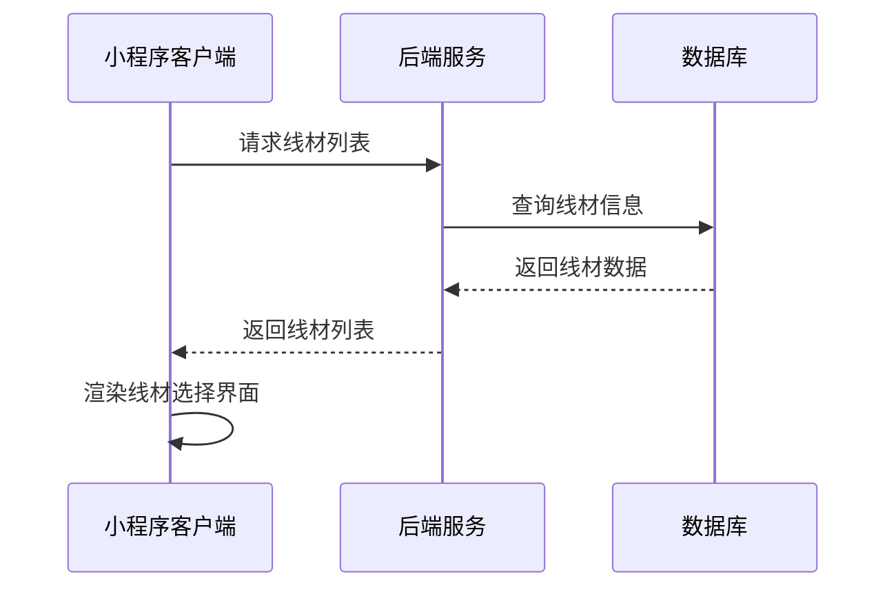
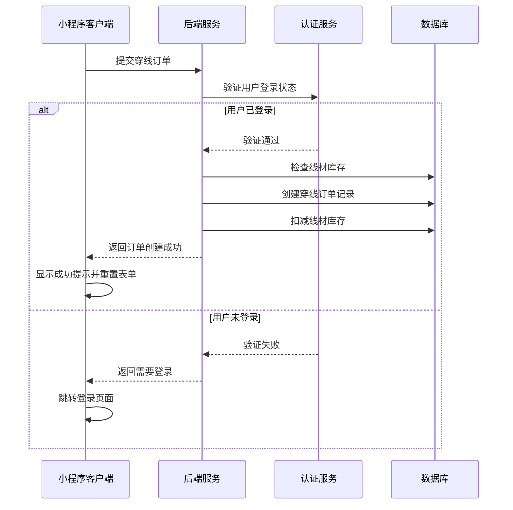
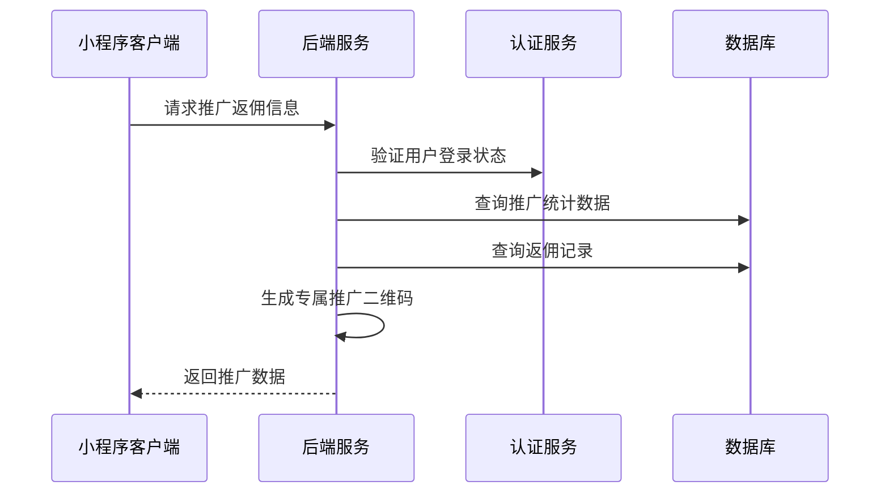
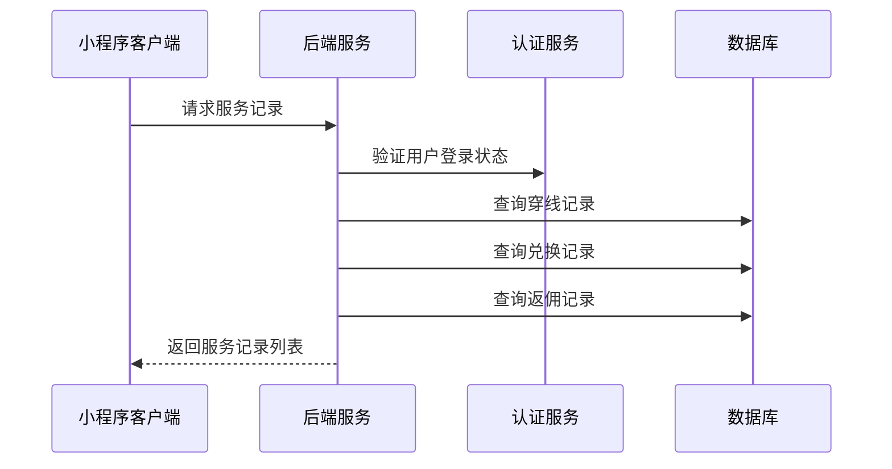

# 服务页面接口文档

## 获取线材列表

**接口名称：** 获取线材列表
**功能描述：** 获取穿线服务可选的羽毛球线材列表，支持按品牌筛选
**接口地址：** /api/strings/list
**请求方式：** GET

### 功能说明
在穿线服务Tab中展示可选的线材列表，用户可以按品牌筛选线材。返回线材的名称、描述、价格等信息供用户选择。字段完全对应JS中的stringBrands和stringList。



### 请求参数
```json
{
  "brand": "yonex"
}
```

| 参数名 | 类型 | 必填 | 说明 | 示例值 |
|----|---|-----|---|-----|
| brand | string | 否 | 品牌筛选（all全部/yonex/victor/li_ning/gosen） | yonex |

### 响应参数
```json
{
  "error": 0,
  "body": {
    "brands": [
      { "id": "all", "name": "全部" },
      { "id": "yonex", "name": "YONEX" },
      { "id": "victor", "name": "VICTOR" },
      { "id": "li_ning", "name": "李宁" },
      { "id": "gosen", "name": "GOSEN" }
    ],
    "strings": [
      {
        "id": "BG65",
        "name": "BG-65",
        "brand": "yonex",
        "description": "经典耐用，适合初学者",
        "price": 35
      }
    ]
  },
  "message": "获取线材列表成功",
  "success": true
}
```

| 参数名 | 类型 | 必填 | 说明 | 示例值 |
|----|---|-----|---|-----|
| error | int | 是 | 错误码，0表示成功 | 0 |
| body | object | 是 | 响应数据 | |
| body.brands | array | 是 | 品牌列表 | |
| body.brands[].id | string | 是 | 品牌ID | yonex |
| body.brands[].name | string | 是 | 品牌名称 | YONEX |
| body.strings | array | 是 | 线材列表 | |
| body.strings[].id | string | 是 | 线材ID | BG65 |
| body.strings[].name | string | 是 | 线材名称 | BG-65 |
| body.strings[].brand | string | 是 | 所属品牌 | yonex |
| body.strings[].description | string | 是 | 线材描述 | 经典耐用，适合初学者 |
| body.strings[].price | number | 是 | 穿线价格 | 35 |
| message | string | 是 | 响应消息 | 获取线材列表成功 |
| success | bool | 是 | 是否成功 | true |

**注释：**
- brands和strings字段结构与JS完全一致，没有inStock字段。
- price为数字类型，单位为元。

---

## 提交穿线订单

**接口名称：** 提交穿线订单
**功能描述：** 提交穿线服务订单，创建穿线任务记录
**接口地址：** /api/string-service/create
**请求方式：** POST

### 功能说明
用户在穿线服务Tab填写完球拍信息、选择线材和磅数后提交穿线订单。字段完全对应JS中的stringService。**此接口需要用户登录状态，未登录用户需要先引导登录。**



### 请求参数
```json
{
  "racket_brand": "YONEX ARC-11",
  "pounds": 24,
  "string_id": "BG65",
  "remark": "请小心包装"
}
```

| 参数名 | 类型 | 必填 | 说明 | 示例值 |
|----|---|-----|---|-----|
| racket_brand | string | 是 | 球拍品牌型号 | YONEX ARC-11 |
| pounds | int | 是 | 磅数要求（18-30） | 24 |
| string_id | string | 是 | 选择的线材ID | BG65 |
| remark | string | 否 | 备注信息 | 请小心包装 |

**注释：**
- 字段全部为小写下划线风格，完全对应JS的stringService。
- 没有customerInfo对象，所有字段都在一级。

### 响应参数
```json
{
  "error": 0,
  "body": {
    "orderId": "string_20241215001",
    "orderNo": "STR202412150001",
    "racket_brand": "YONEX ARC-11",
    "pounds": 24,
    "string_name": "BG-65",
    "total_price": 35,
    "status": "pending",
    "status_text": "待接单",
    "estimated_time": "2-3个工作日",
    "create_time": "2024-12-15 14:30:00"
  },
  "message": "穿线订单提交成功",
  "success": true
}
```

| 参数名 | 类型 | 必填 | 说明 | 示例值 |
|----|---|-----|---|-----|
| error | int | 是 | 错误码，0成功/401未登录/400参数错误 | 0 |
| body | object | 是 | 响应数据 | |
| body.orderId | string | 是 | 订单ID | string_20241215001 |
| body.orderNo | string | 是 | 订单号 | STR202412150001 |
| body.racket_brand | string | 是 | 球拍品牌型号 | YONEX ARC-11 |
| body.pounds | int | 是 | 磅数 | 24 |
| body.string_name | string | 是 | 线材名称 | BG-65 |
| body.total_price | number | 是 | 总价格 | 35 |
| body.status | string | 是 | 订单状态 | pending |
| body.status_text | string | 是 | 状态描述 | 待接单 |
| body.estimated_time | string | 是 | 预计完成时间 | 2-3个工作日 |
| body.create_time | string | 是 | 创建时间 | 2024-12-15 14:30:00 |
| message | string | 是 | 响应消息 | 穿线订单提交成功 |
| success | bool | 是 | 是否成功 | true |

**注释：**
- 字段全部为小写下划线风格，完全对应JS的stringService和订单弹窗。
- 价格为数字类型，单位为元。

---

## 获取积分兑换信息

**接口名称：** 获取积分兑换信息
**功能描述：** 获取用户积分余额和可兑换商品列表
**接口地址：** /api/points/exchange-info
**请求方式：** GET

### 功能说明
在积分兑换Tab中显示用户当前积分余额、可兑换的商品列表和最近兑换记录。字段完全对应JS中的pointsData。**此接口需要用户登录状态。**


### 请求参数
无需传入参数（需要用户登录态）

### 响应参数
```json
{
  "error": 0,
  "body": {
    "user_points": 2580,
    "goods": [
      {
        "id": 101,
        "name": "羽毛球拍",
        "img": "/assets/images/racket.jpg",
        "points": 2200,
        "stock": 5
      }
    ],
    "recent_exchanges": [
      {
        "goods_name": "专业羽毛球鞋",
        "points": 1800,
        "date": "2024-06-01"
      }
    ]
  },
  "message": "获取积分信息成功",
  "success": true
}
```

| 参数名 | 类型 | 必填 | 说明 | 示例值 |
|----|---|-----|---|-----|
| error | int | 是 | 错误码，0成功/401未登录 | 0 |
| body | object | 是 | 响应数据 | |
| body.user_points | int | 是 | 用户当前积分 | 2580 |
| body.goods | array | 是 | 可兑换商品列表 | |
| body.goods[].id | int | 是 | 商品ID | 101 |
| body.goods[].name | string | 是 | 商品名称 | 羽毛球拍 |
| body.goods[].img | string | 是 | 商品图片 | /assets/images/racket.jpg |
| body.goods[].points | int | 是 | 所需积分 | 2200 |
| body.goods[].stock | int | 是 | 可兑换库存 | 5 |
| body.recent_exchanges | array | 是 | 最近兑换记录 | |
| body.recent_exchanges[].goods_name | string | 是 | 商品名称 | 专业羽毛球鞋 |
| body.recent_exchanges[].points | int | 是 | 消耗积分 | 1800 |
| body.recent_exchanges[].date | string | 是 | 兑换时间 | 2024-06-01 |
| message | string | 是 | 响应消息 | 获取积分信息成功 |
| success | bool | 是 | 是否成功 | true |

**注释：**
- 字段全部为小写下划线风格，完全对应JS的pointsData。
- 商品图片字段为img。
- 兑换记录字段为goods_name、points、date。

---

## 获取推广返佣信息

**接口名称：** 获取推广返佣信息
**功能描述：** 获取用户推广返佣的统计数据和明细记录
**接口地址：** /api/promotion/info
**请求方式：** GET

### 功能说明
在推广返佣Tab中显示用户的推广统计数据，包括累计收益、邀请人数、推广二维码等信息，以及返佣明细记录。字段完全对应JS中的promotionData。**此接口需要用户登录状态。**



### 请求参数
无需传入参数（需要用户登录态）

### 响应参数
```json
{
  "error": 0,
  "body": {
    "total_earnings": 158,
    "invited_users": 6,
    "this_month_earnings": 45,
    "today_earnings": 8,
    "account_balance": 245,
    "invite_code": "PROMO001",
    "invite_link": "https://miniprogram.com/invite?code=PROMO001",
    "qr_code_url": "https://api.qrserver.com/v1/create-qr-code/?size=200x200&data=https://miniprogram.com/invite?code=PROMO001",
    "commission_records": [
      {
        "desc": "邀请好友注册奖励",
        "amount": 20,
        "date": "2024-06-08",
        "status": "已到账",
        "type": "invite"
      }
    ],
    "withdraw_records": [
      {
        "amount": 100,
        "date": "2024-06-01",
        "status": "已到账",
        "order_no": "WD202406010001"
      }
    ]
  },
  "message": "获取推广信息成功",
  "success": true
}
```

| 参数名 | 类型 | 必填 | 说明 | 示例值 |
|----|---|-----|---|-----|
| error | int | 是 | 错误码，0成功/401未登录 | 0 |
| body | object | 是 | 响应数据 | |
| body.total_earnings | number | 是 | 累计收益 | 158 |
| body.invited_users | int | 是 | 累计邀请人数 | 6 |
| body.this_month_earnings | number | 是 | 本月收益 | 45 |
| body.today_earnings | number | 是 | 今日收益 | 8 |
| body.account_balance | number | 是 | 账户余额 | 245 |
| body.invite_code | string | 是 | 邀请码 | PROMO001 |
| body.invite_link | string | 是 | 邀请链接 | https://miniprogram.com/invite?code=PROMO001 |
| body.qr_code_url | string | 是 | 推广二维码URL | https://api.qrserver.com/v1/... |
| body.commission_records | array | 是 | 佣金记录 | |
| body.commission_records[].desc | string | 是 | 佣金描述 | 邀请好友注册奖励 |
| body.commission_records[].amount | number | 是 | 佣金金额 | 20 |
| body.commission_records[].date | string | 是 | 获得时间 | 2024-06-08 |
| body.commission_records[].status | string | 是 | 状态 | 已到账 |
| body.commission_records[].type | string | 是 | 类型（invite邀请/commission返佣） | invite |
| body.withdraw_records | array | 是 | 提现记录 | |
| body.withdraw_records[].amount | number | 是 | 提现金额 | 100 |
| body.withdraw_records[].date | string | 是 | 提现时间 | 2024-06-01 |
| body.withdraw_records[].status | string | 是 | 提现状态 | 已到账 |
| body.withdraw_records[].order_no | string | 是 | 提现单号 | WD202406010001 |
| message | string | 是 | 响应消息 | 获取推广信息成功 |
| success | bool | 是 | 是否成功 | true |

**注释：**
- 字段全部为小写下划线风格，完全对应JS的promotionData。
- 佣金记录和提现记录字段名与JS一致。

---

## 获取我的服务记录

**接口名称：** 获取我的服务记录
**功能描述：** 获取用户的各类服务记录，支持按类型筛选
**接口地址：** /api/user/service-records
**请求方式：** GET

### 功能说明
在我的服务Tab中展示用户的各类服务记录，包括穿线进度、奖品物流、返佣记录等。字段完全对应JS中的serviceList。**此接口需要用户登录状态。**



### 请求参数
```json
{
  "type": "all",
  "page": 1,
  "pageSize": 10
}
```

| 参数名 | 类型 | 必填 | 说明 | 示例值 |
|----|---|-----|---|-----|
| type | string | 否 | 服务类型（all全部/穿线进度/奖品物流/返佣记录） | all |
| page | int | 否 | 页码（默认1） | 1 |
| pageSize | int | 否 | 每页数量（默认10） | 10 |

### 响应参数
```json
{
  "error": 0,
  "body": [
    {
      "service_type": "穿线进度",
      "racket": "YONEX BG-65",
      "status": "穿线中",
      "progress": 60,
      "detail": "主线24磅，横线23磅，预计6月10日完成"
    },
    {
      "service_type": "奖品物流",
      "goods": "专业手胶套装",
      "logistics": [
        { "desc": "已发货", "time": "2024-06-06 15:00" },
        { "desc": "运输中", "time": "2024-06-06 18:00" },
        { "desc": "派送中", "time": "2024-06-07 09:00" }
      ],
      "express_number": "SF1234567890"
    },
    {
      "service_type": "返佣记录",
      "amount": 20,
      "desc": "邀请好友下单奖励",
      "date": "2024-06-02",
      "status": "已到账"
    }
  ],
  "pagination": {
    "page": 1,
    "pageSize": 10,
    "hasMore": false
  },
  "message": "获取服务记录成功",
  "success": true
}
```

| 参数名 | 类型 | 必填 | 说明 | 示例值 |
|----|---|-----|---|-----|
| error | int | 是 | 错误码，0成功/401未登录 | 0 |
| body | array | 是 | 服务记录数组 | |
| body[].service_type | string | 是 | 服务类型 | 穿线进度 |
| body[].racket | string | 否 | 球拍信息（穿线进度类型有） | YONEX BG-65 |
| body[].status | string | 否 | 状态 | 穿线中 |
| body[].progress | int | 否 | 进度百分比 | 60 |
| body[].detail | string | 否 | 详细描述 | 主线24磅，横线23磅，预计6月10日完成 |
| body[].goods | string | 否 | 奖品名称（奖品物流类型有） | 专业手胶套装 |
| body[].logistics | array | 否 | 物流信息 | |
| body[].logistics[].desc | string | 是 | 物流节点描述 | 已发货 |
| body[].logistics[].time | string | 是 | 物流时间 | 2024-06-06 15:00 |
| body[].express_number | string | 否 | 快递单号 | SF1234567890 |
| body[].amount | number | 否 | 金额（返佣记录类型有） | 20 |
| body[].desc | string | 否 | 返佣描述 | 邀请好友下单奖励 |
| body[].date | string | 否 | 日期 | 2024-06-02 |
| pagination | object | 是 | 分页信息 | |
| pagination.page | int | 是 | 当前页码 | 1 |
| pagination.pageSize | int | 是 | 每页数量 | 10 |
| pagination.hasMore | bool | 是 | 是否有更多数据 | false |
| message | string | 是 | 响应消息 | 获取服务记录成功 |
| success | bool | 是 | 是否成功 | true |

**注释：**
- 字段全部为小写下划线风格，完全对应JS的serviceList。
- 不同类型的服务记录字段会有差异，具体以实际类型为准。
- 物流信息字段为desc、time。
