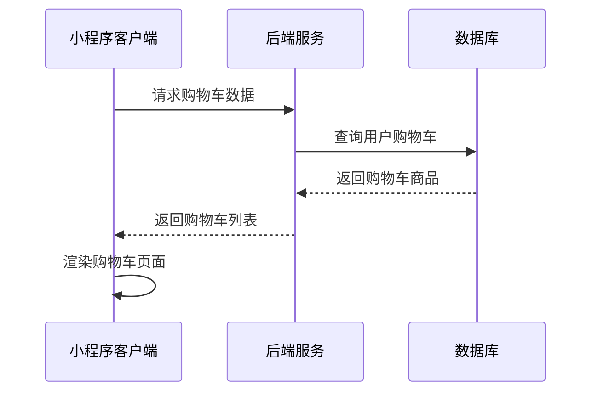
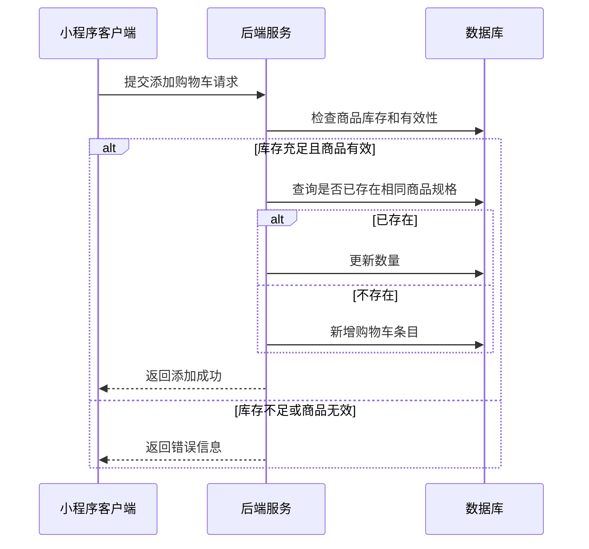
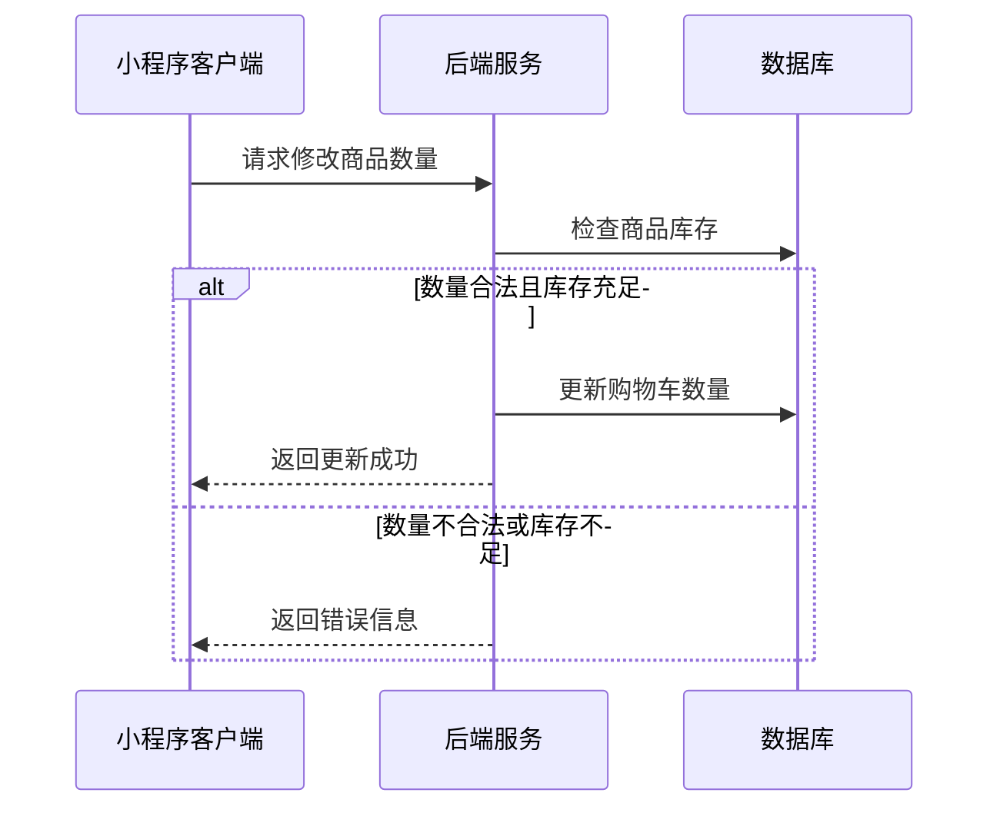
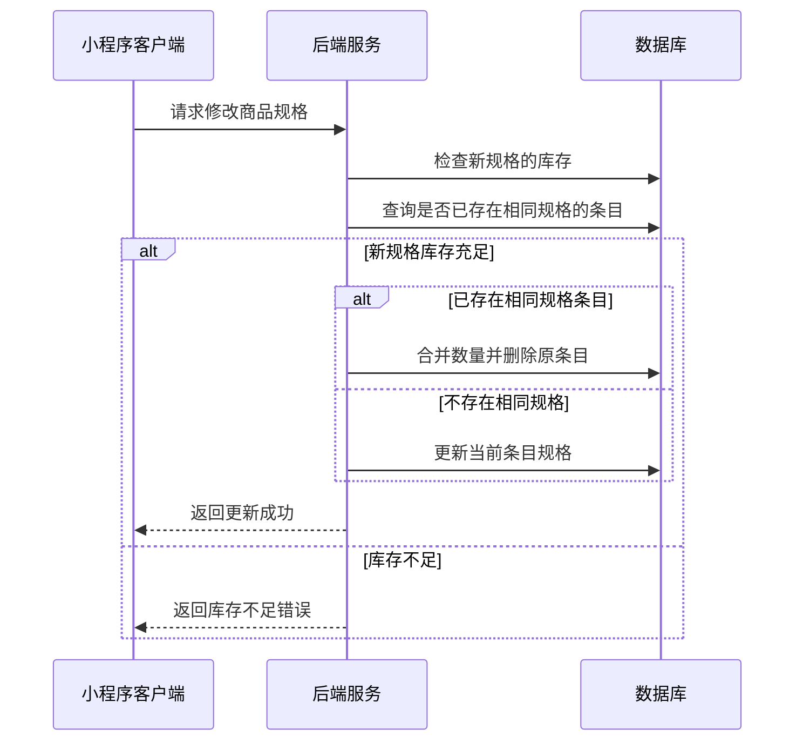
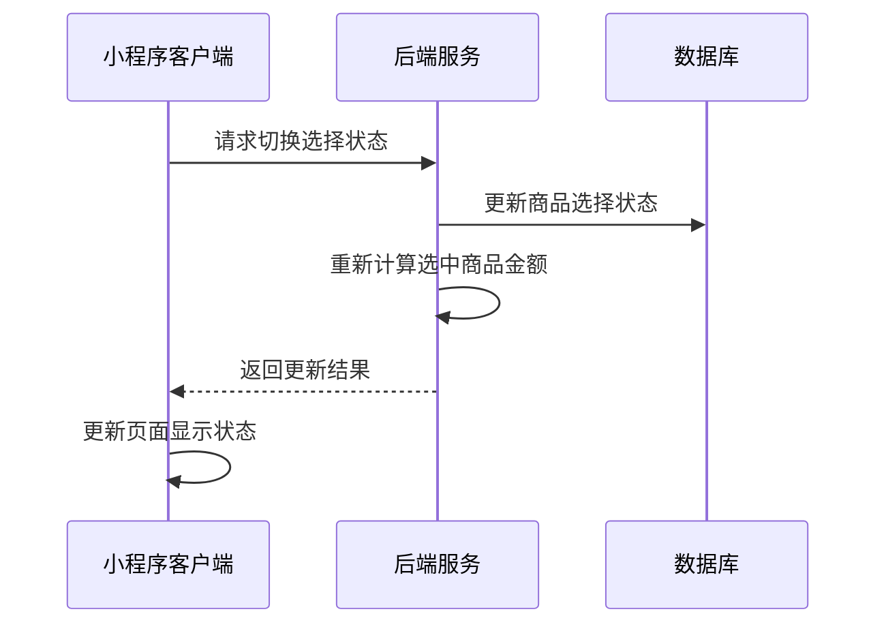
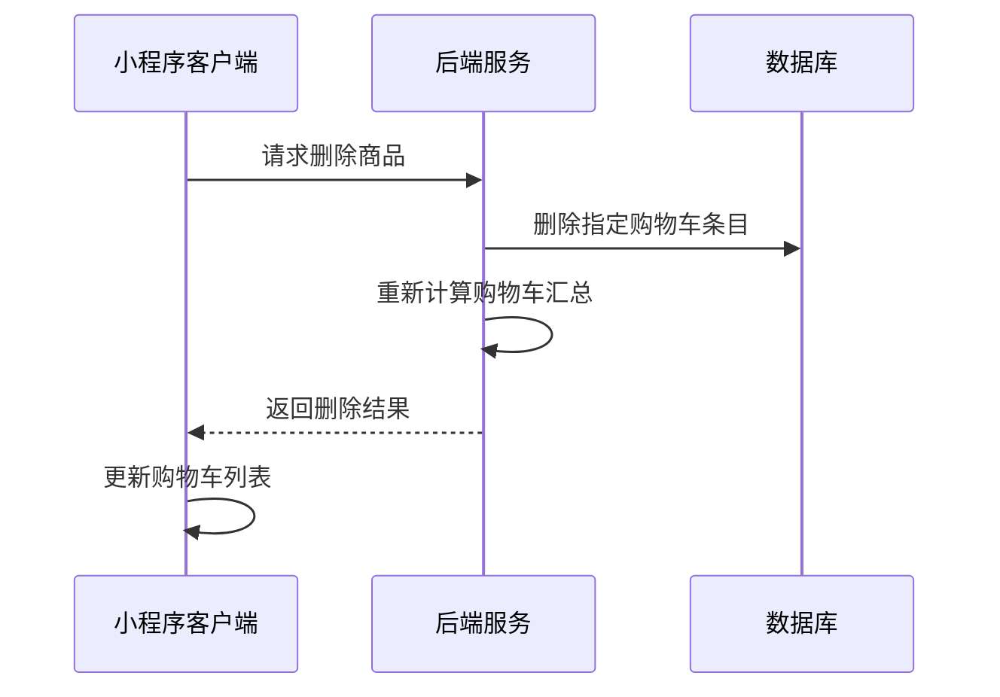
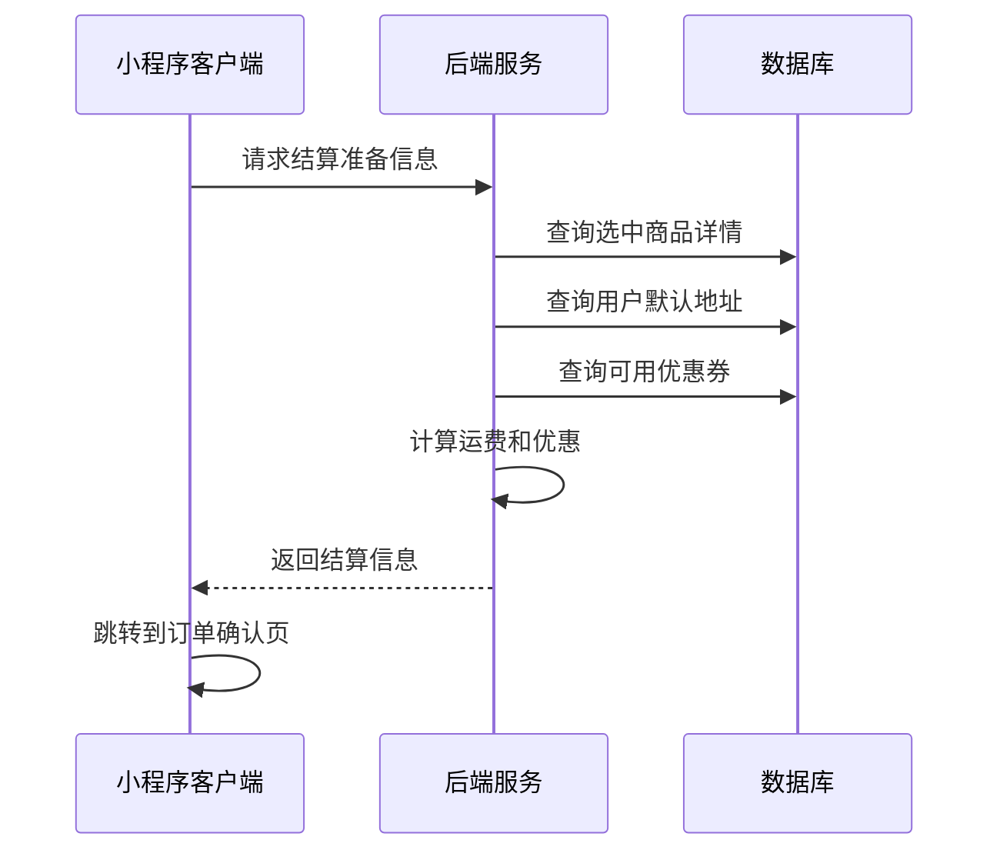
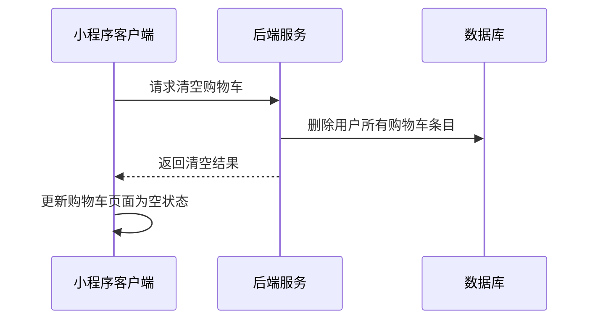

# 购物车页面接口文档（已对齐cart.js字段，含详细注释）

## 获取购物车商品列表

**接口名称：** 获取用户购物车商品列表
**功能描述：** 获取当前登录用户的购物车中所有商品，包含商品信息、规格、数量等
**接口地址：** /api/cart/list
**请求方式：** GET

### 功能说明
获取用户购物车中的所有商品信息，包含商品基本信息、选择的规格、数量、价格等。支持商品规格展示和选择状态管理，用于购物车页面展示和操作。



### 请求参数
无需传入参数（需要用户登录态）

### 响应参数
```json
{
  "error": 0,
  "body": {
    "cartList": [
      {
        "id": 1, // 商品唯一ID
        "name": "苹果iPhone 14 Pro Max 紫色 128GB", // 商品名称
        "spec": "颜色：紫色 容量：128GB", // 已选规格描述
        "price": 9999.00, // 商品单价
        "quantity": 1, // 商品数量
        "image": "/assets/images/phone1.jpg", // 商品图片
        "selected": true, // 是否选中
        "specGroups": [ // 规格选项组
          {
            "name": "颜色", // 规格组名称
            "options": [
              { "value": "紫色", "selected": true, "disabled": false }, // 规格值、是否选中、是否禁用
              { "value": "黑色", "selected": false, "disabled": false },
              { "value": "白色", "selected": false, "disabled": false }
            ]
          },
          {
            "name": "容量",
            "options": [
              { "value": "128GB", "selected": true, "disabled": false },
              { "value": "256GB", "selected": false, "disabled": false },
              { "value": "512GB", "selected": false, "disabled": false }
            ]
          }
        ]
      }
    ]
  },
  "message": "获取购物车成功",
  "success": true
}
```

| 参数名 | 类型 | 必填 | 说明 | 示例值 |
|----|---|-----|---|-----|
| error | int | 是 | 错误码，0表示成功 | 0 |
| body | object | 是 | 响应数据 |  |
| body.cartList | array | 是 | 购物车商品列表 |  |
| body.cartList[].id | int | 是 | 商品唯一ID | 1 |
| body.cartList[].name | string | 是 | 商品名称 | 苹果iPhone 14 Pro Max 紫色 128GB |
| body.cartList[].spec | string | 是 | 已选规格描述 | 颜色：紫色 容量：128GB |
| body.cartList[].price | number | 是 | 商品单价 | 9999.00 |
| body.cartList[].quantity | int | 是 | 商品数量 | 1 |
| body.cartList[].image | string | 是 | 商品图片 | /assets/images/phone1.jpg |
| body.cartList[].selected | bool | 是 | 是否选中 | true |
| body.cartList[].specGroups | array | 是 | 规格选项组 |  |
| body.cartList[].specGroups[].name | string | 是 | 规格组名称 | 颜色 |
| body.cartList[].specGroups[].options | array | 是 | 规格选项列表 |  |
| body.cartList[].specGroups[].options[].value | string | 是 | 规格值 | 紫色 |
| body.cartList[].specGroups[].options[].selected | bool | 是 | 是否已选择 | true |
| body.cartList[].specGroups[].options[].disabled | bool | 是 | 是否禁用 | false |
| message | string | 是 | 响应消息 | 获取购物车成功 |
| success | bool | 是 | 是否成功 | true |

**注释：**
- 购物车商品主键为 id，所有字段与cart.js完全一致。
- 价格、数量、规格、图片、选中状态等字段均与页面数据结构同步。
- 规格选项组结构与JS一致。

---

## 添加商品到购物车

**接口名称：** 添加商品到购物车
**功能描述：** 将指定商品和规格添加到用户购物车中
**接口地址：** /api/cart/add
**请求方式：** POST

### 功能说明
用户在商品详情页选择规格后，将商品添加到购物车。如果购物车中已存在相同商品和规格，则增加数量；如果是新商品或不同规格，则新增购物车条目。



### 请求参数
```json
{
  "productId": "product_101",
  "quantity": 1,
  "selectedSpecs": {
    "颜色": "蓝色",
    "重量": "4U"
  }
}
```

| 参数名 | 类型 | 必填 | 说明 | 示例值 |
|----|---|-----|---|-----|
| productId | string | 是 | 商品唯一ID | product_101 |
| quantity | int | 是 | 添加数量 | 1 |
| selectedSpecs | object | 是 | 选择的规格键值对 | {"颜色": "蓝色", "重量": "4U"} |

### 响应参数
```json
{
  "error": 0,
  "body": {
    "cartId": "cart_001",
    "action": "added",
    "newQuantity": 2,
    "cartCount": 5
  },
  "message": "添加到购物车成功",
  "success": true
}
```

| 参数名 | 类型 | 必填 | 说明 | 示例值 |
|----|---|-----|---|-----|
| error | int | 是 | 错误码，0表示成功 | 0 |
| body | object | 是 | 响应数据 | |
| body.cartId | string | 是 | 购物车条目ID | cart_001 |
| body.action | string | 是 | 操作类型（added新增/updated更新数量） | added |
| body.newQuantity | int | 是 | 该条目的最新数量 | 2 |
| body.cartCount | int | 是 | 购物车总商品数量 | 5 |
| message | string | 是 | 响应消息 | 添加到购物车成功 |
| success | bool | 是 | 是否成功 | true |

---

## 修改购物车商品数量

**接口名称：** 修改购物车商品数量
**功能描述：** 修改购物车中指定商品的数量
**接口地址：** /api/cart/update-quantity
**请求方式：** PUT

### 功能说明
用户在购物车页面修改商品数量，支持增加、减少或直接输入数量。系统会检查库存限制，确保不超过可用库存。



### 请求参数
```json
{
  "cartId": "cart_001",
  "quantity": 3
}
```

| 参数名 | 类型 | 必填 | 说明 | 示例值 |
|----|---|-----|---|-----|
| cartId | string | 是 | 购物车条目ID | cart_001 |
| quantity | int | 是 | 新的数量（1-99） | 3 |

### 响应参数
```json
{
  "error": 0,
  "body": {
    "cartId": "cart_001",
    "newQuantity": 3,
    "newSubtotal": 2697.00,
    "cartSummary": {
      "totalItems": 5,
      "selectedItems": 3,
      "totalAmount": 4596.00
    }
  },
  "message": "修改数量成功",
  "success": true
}
```

| 参数名 | 类型 | 必填 | 说明 | 示例值 |
|----|---|-----|---|-----|
| error | int | 是 | 错误码，0表示成功 | 0 |
| body | object | 是 | 响应数据 | |
| body.cartId | string | 是 | 购物车条目ID | cart_001 |
| body.newQuantity | int | 是 | 更新后的数量 | 3 |
| body.newSubtotal | number | 是 | 更新后的小计金额 | 2697.00 |
| body.cartSummary | object | 是 | 购物车汇总信息 | |
| body.cartSummary.totalItems | int | 是 | 购物车总商品数 | 5 |
| body.cartSummary.selectedItems | int | 是 | 已选中商品数 | 3 |
| body.cartSummary.totalAmount | number | 是 | 选中商品总金额 | 4596.00 |
| message | string | 是 | 响应消息 | 修改数量成功 |
| success | bool | 是 | 是否成功 | true |

---

## 修改购物车商品规格

**接口名称：** 修改购物车商品规格
**功能描述：** 修改购物车中指定商品的规格选择
**接口地址：** /api/cart/update-specs
**请求方式：** PUT

### 功能说明
用户在购物车页面点击规格可以重新选择商品规格。如果修改后的规格在购物车中已存在，则合并数量；如果不存在，则更新当前条目的规格。



### 请求参数
```json
{
  "cartId": "cart_001",
  "newSpecs": {
    "颜色": "红色",
    "重量": "3U"
  },
  "quantity": 2
}
```

| 参数名 | 类型 | 必填 | 说明 | 示例值 |
|----|---|-----|---|-----|
| cartId | string | 是 | 购物车条目ID | cart_001 |
| newSpecs | object | 是 | 新选择的规格键值对 | {"颜色": "红色", "重量": "3U"} |
| quantity | int | 是 | 商品数量 | 2 |

### 响应参数
```json
{
  "error": 0,
  "body": {
    "cartId": "cart_001",
    "action": "updated",
    "newSpec": "颜色：红色 重量：3U",
    "merged": false,
    "cartSummary": {
      "totalItems": 5,
      "selectedItems": 3,
      "totalAmount": 4596.00
    }
  },
  "message": "修改规格成功",
  "success": true
}
```

| 参数名 | 类型 | 必填 | 说明 | 示例值 |
|----|---|-----|---|-----|
| error | int | 是 | 错误码，0表示成功 | 0 |
| body | object | 是 | 响应数据 | |
| body.cartId | string | 是 | 购物车条目ID | cart_001 |
| body.action | string | 是 | 操作类型（updated更新/merged合并） | updated |
| body.newSpec | string | 是 | 新的规格描述 | 颜色：红色 重量：3U |
| body.merged | bool | 是 | 是否与已有条目合并 | false |
| body.cartSummary | object | 是 | 购物车汇总信息 | |
| body.cartSummary.totalItems | int | 是 | 购物车总商品数 | 5 |
| body.cartSummary.selectedItems | int | 是 | 已选中商品数 | 3 |
| body.cartSummary.totalAmount | number | 是 | 选中商品总金额 | 4596.00 |
| message | string | 是 | 响应消息 | 修改规格成功 |
| success | bool | 是 | 是否成功 | true |

---

## 切换商品选择状态

**接口名称：** 切换购物车商品选择状态
**功能描述：** 切换购物车中商品的选中状态，用于结算和批量操作
**接口地址：** /api/cart/toggle-select
**请求方式：** PUT

### 功能说明
用户在购物车页面勾选或取消勾选商品，用于控制哪些商品参与结算。支持单个商品切换和全选/全不选操作。



### 请求参数
```json
{
  "cartIds": ["cart_001"],
  "selected": true,
  "selectAll": false
}
```

| 参数名 | 类型 | 必填 | 说明 | 示例值 |
|----|---|-----|---|-----|
| cartIds | array | 否 | 购物车条目ID列表（单选或多选时使用） | ["cart_001", "cart_002"] |
| selected | bool | 是 | 选择状态 | true |
| selectAll | bool | 否 | 是否全选操作（true时忽略cartIds） | false |

### 响应参数
```json
{
  "error": 0,
  "body": {
    "updatedItems": ["cart_001"],
    "cartSummary": {
      "totalItems": 5,
      "selectedItems": 3,
      "totalAmount": 2697.00,
      "originalAmount": 3297.00,
      "discountAmount": 600.00,
      "allSelected": false
    }
  },
  "message": "更新选择状态成功",
  "success": true
}
```

| 参数名 | 类型 | 必填 | 说明 | 示例值 |
|----|---|-----|---|-----|
| error | int | 是 | 错误码，0表示成功 | 0 |
| body | object | 是 | 响应数据 | |
| body.updatedItems | array | 是 | 已更新的购物车条目ID列表 | ["cart_001"] |
| body.cartSummary | object | 是 | 购物车汇总信息 | |
| body.cartSummary.totalItems | int | 是 | 购物车总商品数 | 5 |
| body.cartSummary.selectedItems | int | 是 | 已选中商品数 | 3 |
| body.cartSummary.totalAmount | number | 是 | 选中商品总金额 | 2697.00 |
| body.cartSummary.originalAmount | number | 是 | 选中商品原价总额 | 3297.00 |
| body.cartSummary.discountAmount | number | 是 | 优惠金额 | 600.00 |
| body.cartSummary.allSelected | bool | 是 | 是否全部选中 | false |
| message | string | 是 | 响应消息 | 更新选择状态成功 |
| success | bool | 是 | 是否成功 | true |

---

## 删除购物车商品

**接口名称：** 删除购物车商品
**功能描述：** 从购物车中删除指定的商品条目
**接口地址：** /api/cart/remove
**请求方式：** DELETE

### 功能说明
用户在购物车页面删除不需要的商品，支持单个删除和批量删除。删除后会重新计算购物车金额和数量。



### 请求参数
```json
{
  "cartIds": ["cart_001", "cart_002"]
}
```

| 参数名 | 类型 | 必填 | 说明 | 示例值 |
|----|---|-----|---|-----|
| cartIds | array | 是 | 要删除的购物车条目ID列表 | ["cart_001", "cart_002"] |

### 响应参数
```json
{
  "error": 0,
  "body": {
    "deletedItems": ["cart_001", "cart_002"],
    "deletedCount": 2,
    "cartSummary": {
      "totalItems": 3,
      "selectedItems": 1,
      "totalAmount": 899.00
    }
  },
  "message": "删除商品成功",
  "success": true
}
```

| 参数名 | 类型 | 必填 | 说明 | 示例值 |
|----|---|-----|---|-----|
| error | int | 是 | 错误码，0表示成功 | 0 |
| body | object | 是 | 响应数据 | |
| body.deletedItems | array | 是 | 已删除的购物车条目ID列表 | ["cart_001", "cart_002"] |
| body.deletedCount | int | 是 | 删除的商品数量 | 2 |
| body.cartSummary | object | 是 | 删除后的购物车汇总 | |
| body.cartSummary.totalItems | int | 是 | 剩余商品总数 | 3 |
| body.cartSummary.selectedItems | int | 是 | 剩余选中商品数 | 1 |
| body.cartSummary.totalAmount | number | 是 | 剩余选中商品金额 | 899.00 |
| message | string | 是 | 响应消息 | 删除商品成功 |
| success | bool | 是 | 是否成功 | true |

---

## 购物车结算准备

**接口名称：** 购物车结算准备
**功能描述：** 获取购物车结算所需的信息，包括商品清单、地址、优惠券等
**接口地址：** /api/cart/checkout-prepare
**请求方式：** POST

### 功能说明
用户点击"结算"按钮时，获取结算页面所需的完整信息，包括选中的商品清单、默认收货地址、可用优惠券、运费计算等。为跳转到订单确认页面做准备。



### 请求参数
```json
{
  "cartIds": ["cart_001", "cart_003"]
}
```

| 参数名 | 类型 | 必填 | 说明 | 示例值 |
|----|---|-----|---|-----|
| cartIds | array | 否 | 指定结算的购物车条目ID（不传则使用所有选中商品） | ["cart_001", "cart_003"] |

### 响应参数
```json
{
  "error": 0,
  "body": {
    "checkoutItems": [
      {
        "cartId": "cart_001",
        "productId": "product_101",
        "name": "YONEX尤尼克斯ARC-11羽毛球拍",
        "image": "https://example.com/product.jpg",
        "spec": "颜色：蓝色 重量：4U",
        "price": 899.00,
        "quantity": 2,
        "subtotal": 1798.00,
        "shippingFee": 15.00
      }
    ],
    "defaultAddress": {
      "addressId": "addr_001",
      "recipientName": "张三",
      "phone": "138****5678",
      "region": "广东省 深圳市 南山区",
      "detailAddress": "科技园南区深圳软件园"
    },
    "availableCoupons": [
      {
        "couponId": "coupon_001",
        "name": "满200减30优惠券",
        "discountType": "amount",
        "discountValue": 30.00,
        "minAmount": 200.00,
        "validUntil": "2024-12-31T23:59:59Z"
      }
    ],
    "priceDetail": {
      "itemsTotal": 1798.00,
      "shippingTotal": 15.00,
      "discountTotal": 0.00,
      "finalTotal": 1813.00
    }
  },
  "message": "获取结算信息成功",
  "success": true
}
```

| 参数名 | 类型 | 必填 | 说明 | 示例值 |
|----|---|-----|---|-----|
| error | int | 是 | 错误码，0表示成功 | 0 |
| body | object | 是 | 响应数据 | |
| body.checkoutItems | array | 是 | 结算商品列表 | |
| body.checkoutItems[].cartId | string | 是 | 购物车条目ID | cart_001 |
| body.checkoutItems[].productId | string | 是 | 商品ID | product_101 |
| body.checkoutItems[].name | string | 是 | 商品名称 | YONEX尤尼克斯ARC-11羽毛球拍 |
| body.checkoutItems[].image | string | 是 | 商品图片 | https://example.com/product.jpg |
| body.checkoutItems[].spec | string | 是 | 商品规格 | 颜色：蓝色 重量：4U |
| body.checkoutItems[].price | number | 是 | 商品单价 | 899.00 |
| body.checkoutItems[].quantity | int | 是 | 商品数量 | 2 |
| body.checkoutItems[].subtotal | number | 是 | 商品小计 | 1798.00 |
| body.checkoutItems[].shippingFee | number | 是 | 该商品运费 | 15.00 |
| body.defaultAddress | object | 否 | 用户默认收货地址 | |
| body.defaultAddress.addressId | string | 是 | 地址ID | addr_001 |
| body.defaultAddress.recipientName | string | 是 | 收件人姓名 | 张三 |
| body.defaultAddress.phone | string | 是 | 联系电话 | 138****5678 |
| body.defaultAddress.region | string | 是 | 所在地区 | 广东省 深圳市 南山区 |
| body.defaultAddress.detailAddress | string | 是 | 详细地址 | 科技园南区深圳软件园 |
| body.availableCoupons | array | 是 | 可用优惠券列表 | |
| body.availableCoupons[].couponId | string | 是 | 优惠券ID | coupon_001 |
| body.availableCoupons[].name | string | 是 | 优惠券名称 | 满200减30优惠券 |
| body.availableCoupons[].discountType | string | 是 | 优惠类型（amount金额/percent百分比） | amount |
| body.availableCoupons[].discountValue | number | 是 | 优惠值 | 30.00 |
| body.availableCoupons[].minAmount | number | 是 | 最低使用金额 | 200.00 |
| body.availableCoupons[].validUntil | string | 是 | 有效期截止时间 | 2024-12-31T23:59:59Z |
| body.priceDetail | object | 是 | 价格明细 | |
| body.priceDetail.itemsTotal | number | 是 | 商品总价 | 1798.00 |
| body.priceDetail.shippingTotal | number | 是 | 运费总计 | 15.00 |
| body.priceDetail.discountTotal | number | 是 | 优惠总计 | 0.00 |
| body.priceDetail.finalTotal | number | 是 | 最终应付金额 | 1813.00 |
| message | string | 是 | 响应消息 | 获取结算信息成功 |
| success | bool | 是 | 是否成功 | true |

---

## 清空购物车

**接口名称：** 清空用户购物车
**功能描述：** 清空当前用户购物车中的所有商品
**接口地址：** /api/cart/clear
**请求方式：** DELETE

### 功能说明
清空用户购物车中的所有商品，通常在订单成功支付后调用，或用户主动清空购物车时使用。



### 请求参数
无需传入参数（需要用户登录态）

### 响应参数
```json
{
  "error": 0,
  "body": {
    "clearedCount": 5
  },
  "message": "清空购物车成功",
  "success": true
}
```

| 参数名 | 类型 | 必填 | 说明 | 示例值 |
|----|---|-----|---|-----|
| error | int | 是 | 错误码，0表示成功 | 0 |
| body | object | 是 | 响应数据 | |
| body.clearedCount | int | 是 | 清空的商品数量 | 5 |
| message | string | 是 | 响应消息 | 清空购物车成功 |
| success | bool | 是 | 是否成功 | true | 