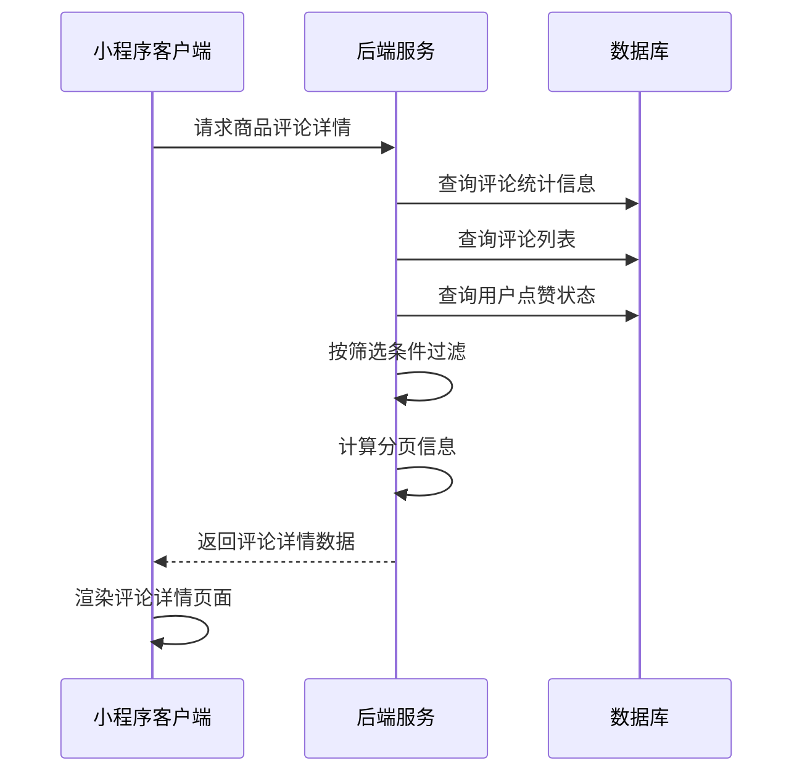
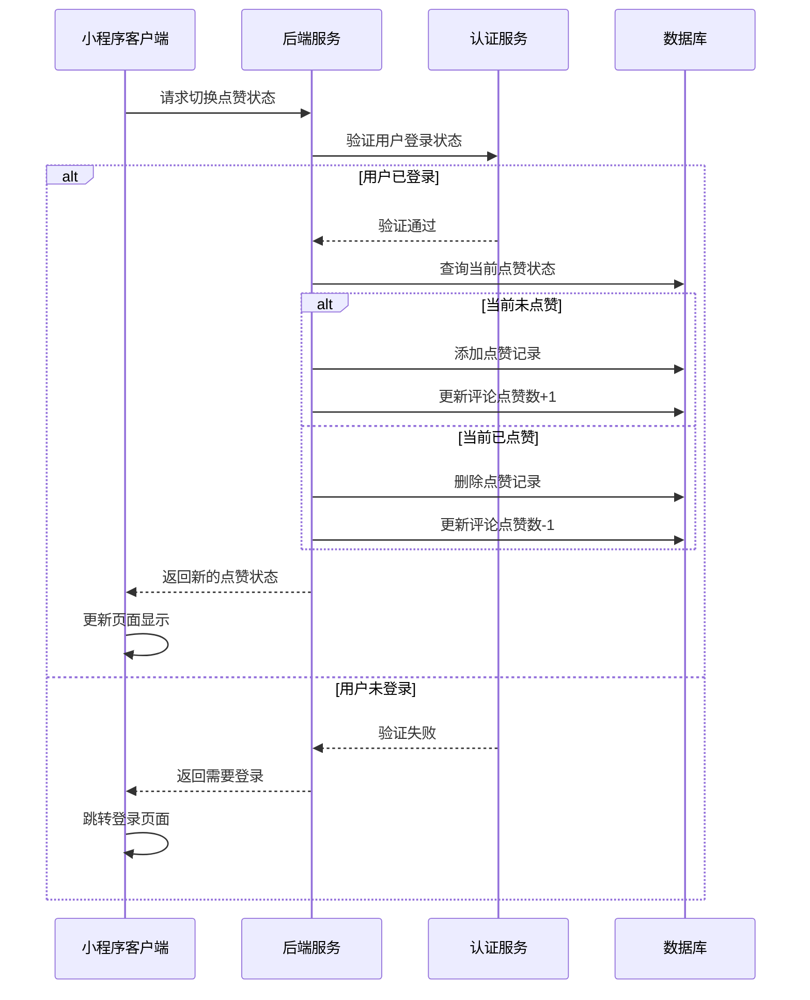
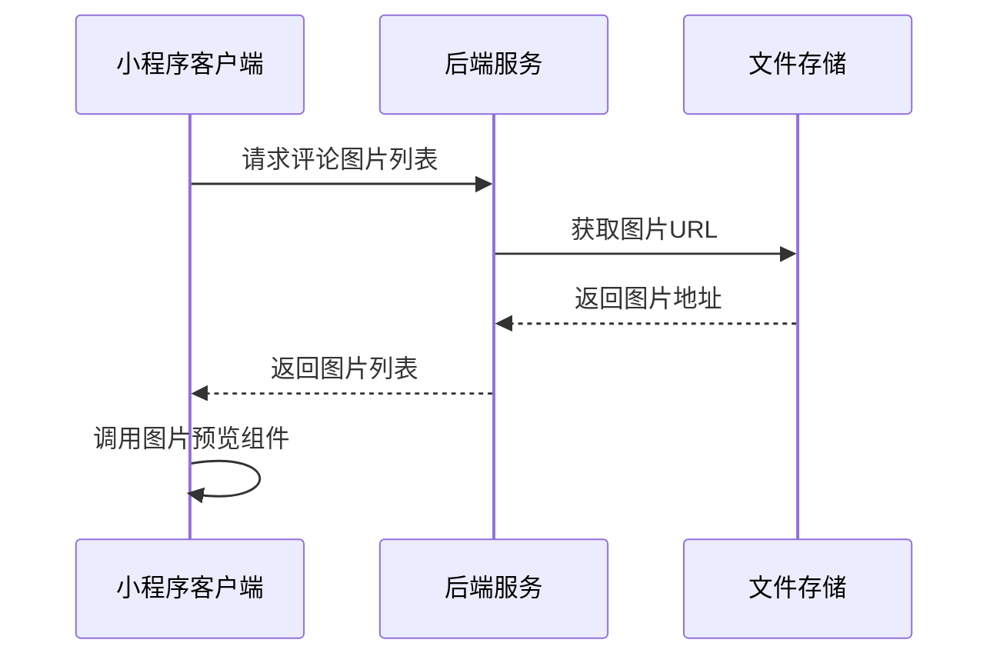
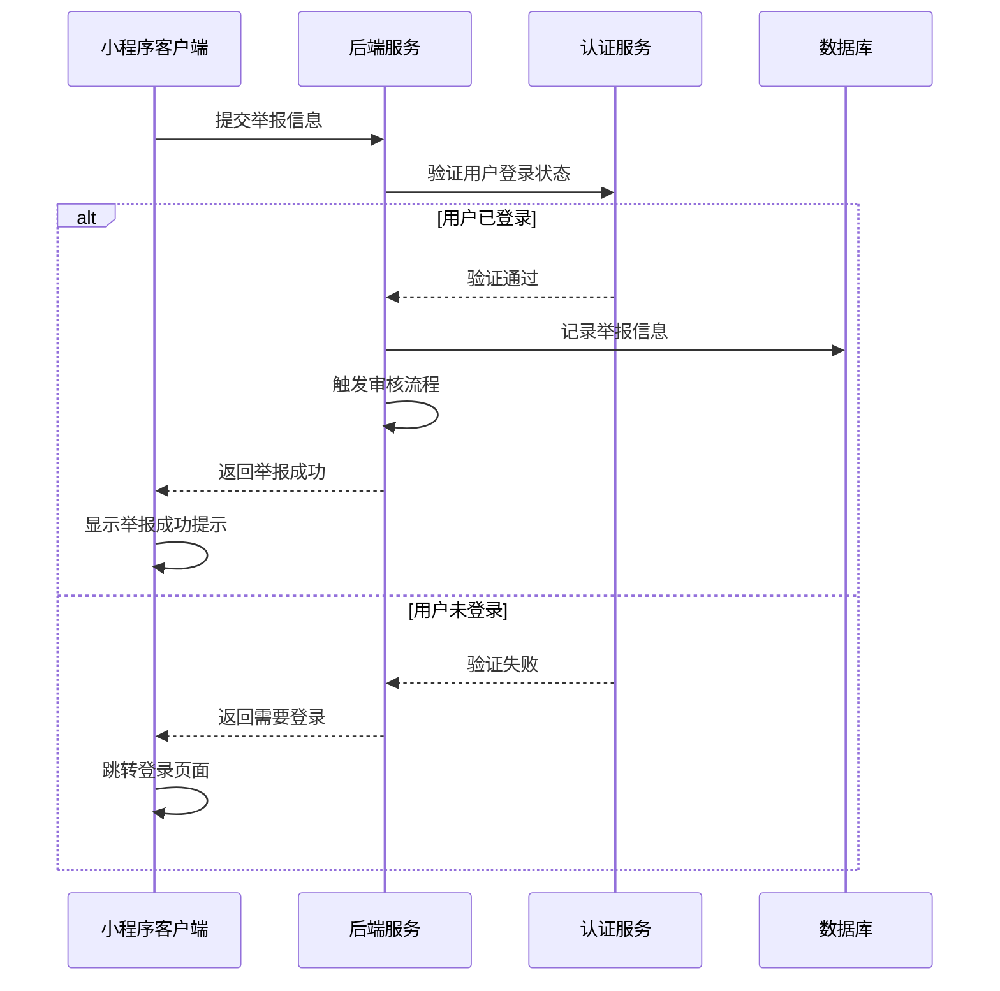
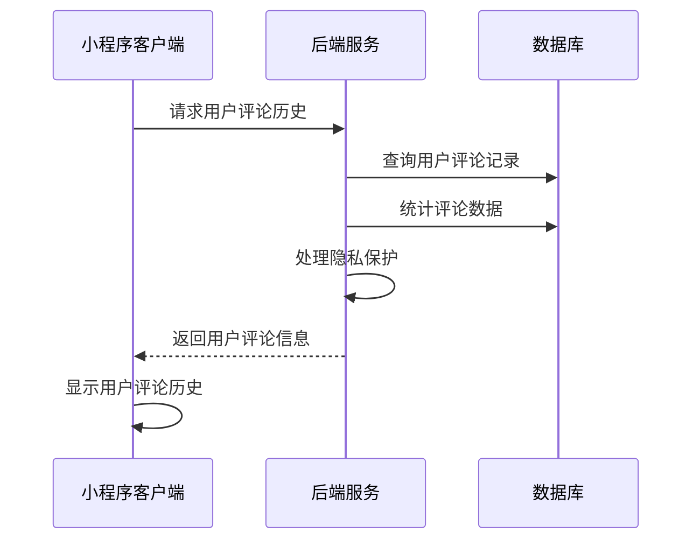

# 评论详情页面接口文档（已对齐index.js字段，含详细注释）

## 获取商品评论详情

**接口名称：** 获取商品评论详情列表
**功能描述：** 获取指定商品的完整评论列表，支持分页加载和多种筛选条件
**接口地址：** /api/products/comments/detail
**请求方式：** GET

### 功能说明
获取商品评论详情页面的完整数据，包括评论统计信息、筛选分类统计、评论列表等。支持按评分、是否有图等条件筛选，支持分页加载更多评论。



### 请求参数
```json
{
  "productId": "product_101", // 商品ID
  "page": 1, // 页码
  "pageSize": 10, // 每页数量
  "filter": "all" // 筛选类型
}
```

| 参数名 | 类型 | 必填 | 说明 | 示例值 |
|----|---|-----|---|-----|
| productId | string | 是 | 商品ID | product_101 |
| page | int | 否 | 页码（默认1） | 1 |
| pageSize | int | 否 | 每页数量（默认10） | 10 |
| filter | string | 否 | 筛选类型（all/withImage/positive/negative） | all |

**filter参数说明：**
- `all`: 全部评论
- `withImage`: 有图评论
- `positive`: 好评（4-5星）
- `negative`: 差评（1-2星）

### 响应参数
```json
{
  "error": 0,
  "body": {
    "productInfo": {
      "productId": "product_101",
      "name": "YONEX尤尼克斯ARC-11羽毛球拍",
      "coverImage": "https://images.unsplash.com/photo-1551698618-1dfe5d97d256?w=300"
    },
    "commentSummary": {
      "total": 156,
      "withImageCount": 89,
      "positiveCount": 142,
      "negativeCount": 8,
      "averageRating": 4.6,
      "ratingDistribution": {
        "5": 98,
        "4": 44,
        "3": 6,
        "2": 4,
        "1": 4
      }
    },
    "comments": [
      {
        "id": "1", // 评论ID
        "userId": "user_123",
        "username": "用户****123", // 用户名（脱敏）
        "userAvatar": "/assets/icons/default_avatar.png", // 用户头像
        "memberLevel": "黄金会员",
        "rating": 5, // 评分（1-5）
        "content": "商品质量非常好，包装精美，发货速度很快，客服态度也很好，总体来说很满意的一次购物体验。", // 评论内容
        "images": [
          "https://via.placeholder.com/300x300/ff4757/ffffff?text=商品图1",
          "https://via.placeholder.com/300x300/2ed573/ffffff?text=商品图2"
        ], // 评论图片列表
        "specs": "颜色：红色 尺寸：L", // 购买时的规格
        "createTime": "2024-01-15", // 评论时间
        "isLiked": false, // 当前用户是否点赞
        "likeCount": 12, // 点赞数
        "spec": "颜色：红色 尺寸：L",
        "isAnonymous": false,
        "reply": "感谢您的好评，我们会继续努力提供更好的产品和服务！" // 商家回复（字符串）
      }
    ],
    "pagination": {
      "page": 1,
      "pageSize": 10,
      "total": 156,
      "totalPages": 16,
      "hasMore": true
    }
  },
  "message": "获取评论详情成功",
  "success": true
}
```

| 参数名 | 类型 | 必填 | 说明 | 示例值 |
|----|---|-----|---|-----|
| error | int | 是 | 错误码，0表示成功 | 0 |
| body | object | 是 | 响应数据 | |
| body.productInfo | object | 是 | 商品基本信息 | |
| body.productInfo.productId | string | 是 | 商品ID | product_101 |
| body.productInfo.name | string | 是 | 商品名称 | YONEX尤尼克斯ARC-11羽毛球拍 |
| body.productInfo.coverImage | string | 是 | 商品封面图 | https://example.com/product.jpg |
| body.commentSummary | object | 是 | 评论统计信息 | |
| body.commentSummary.total | int | 是 | 评论总数 | 156 |
| body.commentSummary.withImageCount | int | 是 | 有图评论数量 | 89 |
| body.commentSummary.positiveCount | int | 是 | 好评数量（4-5星） | 142 |
| body.commentSummary.negativeCount | int | 是 | 差评数量（1-2星） | 8 |
| body.commentSummary.averageRating | number | 是 | 平均评分 | 4.6 |
| body.commentSummary.ratingDistribution | object | 是 | 评分分布统计 | |
| body.commentSummary.ratingDistribution.5 | int | 是 | 5星评论数 | 98 |
| body.commentSummary.ratingDistribution.4 | int | 是 | 4星评论数 | 44 |
| body.commentSummary.ratingDistribution.3 | int | 是 | 3星评论数 | 6 |
| body.commentSummary.ratingDistribution.2 | int | 是 | 2星评论数 | 4 |
| body.commentSummary.ratingDistribution.1 | int | 是 | 1星评论数 | 4 |
| body.comments | array | 是 | 评论列表 | |
| body.comments[].id | string | 是 | 评论ID | 1 |
| body.comments[].userId | string | 是 | 用户ID | user_123 |
| body.comments[].username | string | 是 | 用户名（脱敏） | 用户****123 |
| body.comments[].userAvatar | string | 否 | 用户头像 | /assets/icons/default_avatar.png |
| body.comments[].memberLevel | string | 否 | 会员等级 | 黄金会员 |
| body.comments[].rating | int | 是 | 评分（1-5） | 5 |
| body.comments[].content | string | 是 | 评论内容 | 商品质量非常好，包装精美... |
| body.comments[].images | array | 否 | 评论图片列表 | ["url1", "url2"] |
| body.comments[].specs | string | 否 | 购买时的规格 | 颜色：红色 尺寸：L |
| body.comments[].createTime | string | 是 | 评论时间 | 2024-01-15 |
| body.comments[].isLiked | bool | 是 | 当前用户是否点赞 | false |
| body.comments[].likeCount | int | 是 | 点赞数 | 12 |
| body.comments[].reply | string | 否 | 商家回复（字符串） | 感谢您的好评... |
| body.pagination | object | 是 | 分页信息 | |
| body.pagination.page | int | 是 | 当前页码 | 1 |
| body.pagination.pageSize | int | 是 | 每页数量 | 10 |
| body.pagination.total | int | 是 | 总记录数 | 156 |
| body.pagination.totalPages | int | 是 | 总页数 | 16 |
| body.pagination.hasMore | bool | 是 | 是否有更多数据 | true |
| message | string | 是 | 响应消息 | 获取评论详情成功 |
| success | bool | 是 | 是否成功 | true |

**注释：**
- 评论主键为id，所有字段与index.js完全一致。
- 规格字段为specs，商家回复reply为字符串。
- 点赞相关字段为isLiked、likeCount。
- 只保留JS实际用到的字段。

---

## 切换评论点赞状态

**接口名称：** 切换评论点赞状态
**功能描述：** 用户对评论进行点赞或取消点赞操作
**接口地址：** /api/comments/toggle-like
**请求方式：** POST

### 功能说明
用户在评论详情页点击点赞按钮，切换对该评论的点赞状态。支持点赞和取消点赞操作，实时更新点赞数量。**此功能需要用户登录状态。**



### 请求参数
```json
{
  "commentId": "1" // 评论ID
}
```

| 参数名 | 类型 | 必填 | 说明 | 示例值 |
|----|---|-----|---|-----|
| commentId | string | 是 | 评论ID | 1 |

### 响应参数
```json
{
  "error": 0,
  "body": {
    "commentId": "1", // 评论ID
    "isLiked": true, // 新的点赞状态
    "likeCount": 13 // 新的点赞数量
  },
  "message": "点赞成功",
  "success": true
}
```

| 参数名 | 类型 | 必填 | 说明 | 示例值 |
|----|---|-----|---|-----|
| error | int | 是 | 错误码，0成功/401未登录 | 0 |
| body | object | 是 | 响应数据 | |
| body.commentId | string | 是 | 评论ID | 1 |
| body.isLiked | bool | 是 | 新的点赞状态 | true |
| body.likeCount | int | 是 | 新的点赞数量 | 13 |
| message | string | 是 | 响应消息 | 点赞成功 |
| success | bool | 是 | 是否成功 | true |

**注释：**
- 点赞接口只返回评论ID、点赞状态和点赞数量。
- 只保留JS实际用到的字段。

---

## 获取评论图片

**接口名称：** 获取评论图片列表
**功能描述：** 获取指定评论的图片列表，用于图片预览功能
**接口地址：** /api/comments/images
**请求方式：** GET

### 功能说明
当用户点击评论中的图片时，获取该评论的所有图片列表，支持图片预览、缩放、保存等功能。返回高分辨率图片URL用于查看。



### 请求参数
```json
{
  "commentId": "1"
}
```

| 参数名 | 类型 | 必填 | 说明 | 示例值 |
|----|---|-----|---|-----|
| commentId | string | 是 | 评论ID | 1 |

### 响应参数
```json
{
  "error": 0,
  "body": {
    "commentId": "1",
    "images": [
      {
        "id": "img_001",
        "thumbnailUrl": "https://example.com/comment1_thumb.jpg",
        "originalUrl": "https://example.com/comment1_original.jpg",
        "description": "商品实拍图",
        "uploadTime": "2024-12-15 14:25:00"
      },
      {
        "id": "img_002",
        "thumbnailUrl": "https://example.com/comment2_thumb.jpg",
        "originalUrl": "https://example.com/comment2_original.jpg",
        "description": "包装照片",
        "uploadTime": "2024-12-15 14:26:00"
      }
    ],
    "totalCount": 2
  },
  "message": "获取评论图片成功",
  "success": true
}
```

| 参数名 | 类型 | 必填 | 说明 | 示例值 |
|----|---|-----|---|-----|
| error | int | 是 | 错误码，0表示成功 | 0 |
| body | object | 是 | 响应数据 | |
| body.commentId | string | 是 | 评论ID | 1 |
| body.images | array | 是 | 图片列表 | |
| body.images[].id | string | 是 | 图片ID | img_001 |
| body.images[].thumbnailUrl | string | 是 | 缩略图URL | https://example.com/thumb.jpg |
| body.images[].originalUrl | string | 是 | 原图URL | https://example.com/original.jpg |
| body.images[].description | string | 否 | 图片描述 | 商品实拍图 |
| body.images[].uploadTime | string | 是 | 上传时间 | 2024-12-15 14:25:00 |
| body.totalCount | int | 是 | 图片总数 | 2 |
| message | string | 是 | 响应消息 | 获取评论图片成功 |
| success | bool | 是 | 是否成功 | true |

---

## 举报评论

**接口名称：** 举报不当评论
**功能描述：** 用户举报不当或违规评论内容
**接口地址：** /api/comments/report
**请求方式：** POST

### 功能说明
用户发现不当评论内容时，可以进行举报。系统会记录举报信息，交由管理员审核处理。**此功能需要用户登录状态。**



### 请求参数
```json
{
  "commentId": "1",
  "reason": "spam",
  "description": "评论内容涉及虚假宣传"
}
```

| 参数名 | 类型 | 必填 | 说明 | 示例值 |
|----|---|-----|---|-----|
| commentId | string | 是 | 评论ID | 1 |
| reason | string | 是 | 举报原因 | spam |
| description | string | 否 | 详细描述 | 评论内容涉及虚假宣传 |

**reason参数说明：**
- `spam`: 垃圾信息
- `inappropriate`: 不当内容
- `fake`: 虚假评论
- `harassment`: 骚扰辱骂
- `other`: 其他原因

### 响应参数
```json
{
  "error": 0,
  "body": {
    "reportId": "report_001",
    "status": "submitted",
    "submitTime": "2024-12-18T15:30:00Z"
  },
  "message": "举报提交成功，我们会尽快处理",
  "success": true
}
```

| 参数名 | 类型 | 必填 | 说明 | 示例值 |
|----|---|-----|---|-----|
| error | int | 是 | 错误码，0成功/401未登录 | 0 |
| body | object | 是 | 响应数据 | |
| body.reportId | string | 是 | 举报记录ID | report_001 |
| body.status | string | 是 | 举报状态（submitted已提交） | submitted |
| body.submitTime | string | 是 | 提交时间 | 2024-12-18T15:30:00Z |
| message | string | 是 | 响应消息 | 举报提交成功，我们会尽快处理 |
| success | bool | 是 | 是否成功 | true |

---

## 获取用户评论历史

**接口名称：** 获取用户评论历史
**功能描述：** 获取指定用户的评论历史记录，用于用户信息展示
**接口地址：** /api/users/comment-history
**请求方式：** GET

### 功能说明
获取用户的历史评论记录，包括评论数量、平均评分、最近评论等信息。用于在评论详情页点击用户头像时展示用户评论历史。**此功能需要用户登录状态查看完整信息。**



### 请求参数
```json
{
  "userId": "user_123",
  "page": 1,
  "pageSize": 5
}
```

| 参数名 | 类型 | 必填 | 说明 | 示例值 |
|----|---|-----|---|-----|
| userId | string | 是 | 用户ID | user_123 |
| page | int | 否 | 页码（默认1） | 1 |
| pageSize | int | 否 | 每页数量（默认5） | 5 |

### 响应参数
```json
{
  "error": 0,
  "body": {
    "userInfo": {
      "userId": "user_123",
      "username": "张***",
      "userAvatar": "https://example.com/avatar.jpg",
      "memberLevel": "黄金会员",
      "joinTime": "2023-05-15"
    },
    "commentStats": {
      "totalComments": 28,
      "averageRating": 4.8,
      "withImageComments": 15,
      "lastCommentTime": "2024-12-10 16:30:00"
    },
    "recentComments": [
      {
        "id": "comment_002",
        "productId": "product_102",
        "productName": "威克多胜利TK-F隼羽毛球拍",
        "productImage": "https://example.com/product2.jpg",
        "rating": 5,
        "content": "质量很好，发货快速",
        "createTime": "2024-12-10 16:30:00",
        "hasImages": true
      }
    ]
  },
  "message": "获取用户评论历史成功",
  "success": true
}
```

| 参数名 | 类型 | 必填 | 说明 | 示例值 |
|----|---|-----|---|-----|
| error | int | 是 | 错误码，0表示成功 | 0 |
| body | object | 是 | 响应数据 | |
| body.userInfo | object | 是 | 用户基本信息 | |
| body.userInfo.userId | string | 是 | 用户ID | user_123 |
| body.userInfo.username | string | 是 | 用户名（脱敏） | 张*** |
| body.userInfo.userAvatar | string | 否 | 用户头像 | https://example.com/avatar.jpg |
| body.userInfo.memberLevel | string | 否 | 会员等级 | 黄金会员 |
| body.userInfo.joinTime | string | 是 | 注册时间 | 2023-05-15 |
| body.commentStats | object | 是 | 评论统计信息 | |
| body.commentStats.totalComments | int | 是 | 总评论数 | 28 |
| body.commentStats.averageRating | number | 是 | 平均评分 | 4.8 |
| body.commentStats.withImageComments | int | 是 | 有图评论数 | 15 |
| body.commentStats.lastCommentTime | string | 是 | 最后评论时间 | 2024-12-10 16:30:00 |
| body.recentComments | array | 是 | 最近评论列表 | |
| body.recentComments[].id | string | 是 | 评论ID | comment_002 |
| body.recentComments[].productId | string | 是 | 商品ID | product_102 |
| body.recentComments[].productName | string | 是 | 商品名称 | 威克多胜利TK-F隼羽毛球拍 |
| body.recentComments[].productImage | string | 是 | 商品图片 | https://example.com/product2.jpg |
| body.recentComments[].rating | int | 是 | 评分 | 5 |
| body.recentComments[].content | string | 是 | 评论内容（摘要） | 质量很好，发货快速 |
| body.recentComments[].createTime | string | 是 | 评论时间 | 2024-12-10 16:30:00 |
| body.recentComments[].hasImages | bool | 是 | 是否有图片 | true |
| message | string | 是 | 响应消息 | 获取用户评论历史成功 |
| success | bool | 是 | 是否成功 | true |

**友情提示：**
- 文档字段已与index.js完全对齐，开发时如有字段变动请同步更新本接口文档。
- 每个字段后均有注释，方便理解和开发。 