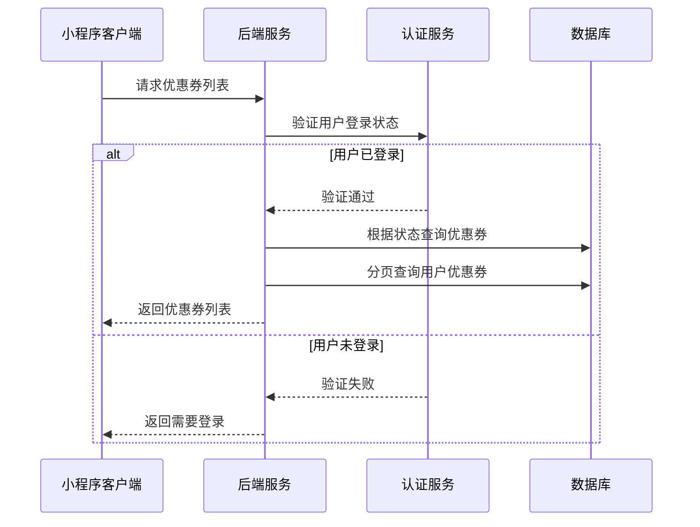
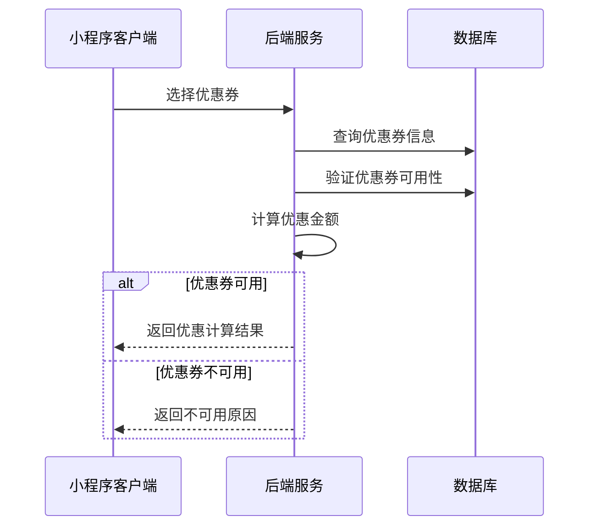
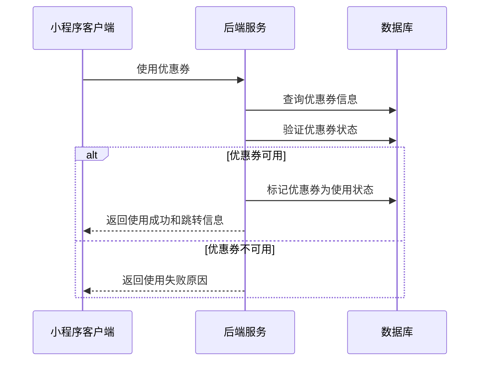
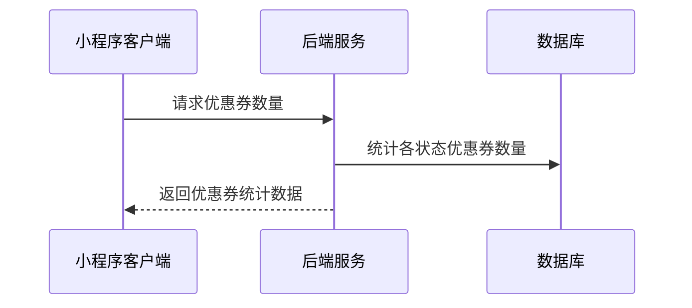
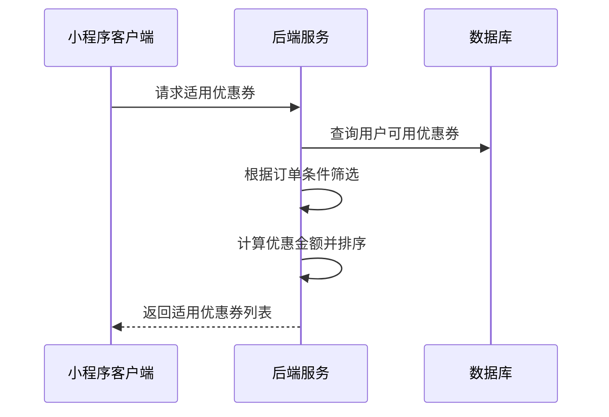

# 优惠券页面接口文档

## 获取优惠券列表

**接口名称：** 获取优惠券列表
**功能描述：** 获取用户的优惠券列表，支持按状态筛选和分页加载
**接口地址：** /api/user/coupons/list
**请求方式：** GET

### 功能说明
在优惠券页面显示用户所有的优惠券，支持按状态筛选（全部、可使用、即将过期），支持分页加载。**此接口需要用户登录状态。**



### 请求参数
```json
{
  "status": 1,
  "page": 1,
  "pageSize": 10
}
```

| 参数名 | 类型 | 必填 | 说明 | 示例值 |
|----|---|-----|---|-----|
| status | int | 否 | 优惠券状态（0全部/1可使用/4即将过期） | 1 |
| page | int | 否 | 页码（默认1） | 1 |
| pageSize | int | 否 | 每页数量（默认10） | 10 |

### 响应参数
```json
{
  "error": 0,
  "body": {
    "coupons": {
      "total": 15,
      "list": [
        {
          "id": 101,
          "title": "新球友专享大礼包",
          "amount": 50,
          "minAmount": 299,
          "type": 1,
          "scope": "全场羽毛球用品",
          "startTime": "2024-01-01",
          "endTime": "2024-12-31",
          "status": 1,
          "description": "新用户注册即得，购买羽毛球拍、球鞋等满299元可用",
          "discount": 50,
          "expireDays": 30,
          "targetProductId": null
        },
        {
          "id": 102,
          "title": "羽毛球拍8折优惠券",
          "amount": 80,
          "minAmount": 500,
          "type": 2,
          "scope": "羽毛球拍类",
          "startTime": "2024-02-01",
          "endTime": "2024-08-31",
          "status": 1,
          "description": "尤尼克斯、胜利、李宁等知名品牌球拍享8折优惠",
          "discount": 0,
          "expireDays": 45,
          "targetProductId": null
        },
        {
          "id": 103,
          "title": "羽毛球用品免邮券",
          "amount": 0,
          "minAmount": 0,
          "type": 3,
          "scope": "全场羽毛球用品",
          "startTime": "2024-01-01",
          "endTime": "2024-12-31",
          "status": 1,
          "description": "购买任意羽毛球用品免运费，最高免15元运费",
          "discount": 0,
          "expireDays": 60,
          "targetProductId": null
        }
      ]
    },
    "pagination": {
      "page": 1,
      "pageSize": 10,
      "total": 15,
      "totalPages": 2,
      "hasMore": true
    }
  },
  "message": "获取优惠券列表成功",
  "success": true
}
```

| 参数名 | 类型 | 必填 | 说明 | 示例值 |
|----|---|-----|---|-----|
| error | int | 是 | 错误码，0成功/401未登录 | 0 |
| body | object | 是 | 响应数据 | |
| body.coupons | object | 是 | 优惠券数据 | |
| body.coupons.total | int | 是 | 优惠券总数 | 15 |
| body.coupons.list | array | 是 | 优惠券列表 | |
| body.coupons.list[].id | int | 是 | 优惠券ID | 101 |
| body.coupons.list[].title | string | 是 | 优惠券标题 | 新球友专享大礼包 |
| body.coupons.list[].amount | number | 是 | 优惠金额（满减券）或折扣（折扣券） | 50 |
| body.coupons.list[].minAmount | number | 是 | 最低使用金额 | 299 |
| body.coupons.list[].type | int | 是 | 优惠券类型（1满减券/2折扣券/3免邮券） | 1 |
| body.coupons.list[].scope | string | 是 | 适用范围 | 全场羽毛球用品 |
| body.coupons.list[].startTime | string | 是 | 生效时间 | 2024-01-01 |
| body.coupons.list[].endTime | string | 是 | 到期时间 | 2024-12-31 |
| body.coupons.list[].status | int | 是 | 状态（1可使用/2已使用/3已过期/4即将过期） | 1 |
| body.coupons.list[].description | string | 是 | 优惠券描述 | 新用户注册即得，购买羽毛球拍、球鞋等满299元可用 |
| body.coupons.list[].discount | number | 是 | 实际优惠金额 | 50 |
| body.coupons.list[].expireDays | int | 是 | 距离过期天数 | 30 |
| body.coupons.list[].targetProductId | string | 否 | 指定商品ID（全场券为null） | null |
| body.pagination | object | 是 | 分页信息 | |
| body.pagination.page | int | 是 | 当前页码 | 1 |
| body.pagination.pageSize | int | 是 | 每页数量 | 10 |
| body.pagination.total | int | 是 | 总记录数 | 15 |
| body.pagination.totalPages | int | 是 | 总页数 | 2 |
| body.pagination.hasMore | bool | 是 | 是否有更多数据 | true |
| message | string | 是 | 响应消息 | 获取优惠券列表成功 |
| success | bool | 是 | 是否成功 | true |

---

## 选择优惠券（订单确认页使用）

**接口名称：** 选择优惠券
**功能描述：** 从订单确认页面选择优惠券，验证可用性并返回优惠信息
**接口地址：** /api/orders/select-coupon
**请求方式：** POST

### 功能说明
用户在订单确认页面选择优惠券时，验证该优惠券是否可用于当前订单，并返回优惠后的金额信息。**此接口需要用户登录状态。**



### 请求参数
```json
{
  "couponId": 101,
  "orderAmount": 350.00,
  "goodsIds": ["goods_001", "goods_002"]
}
```

| 参数名 | 类型 | 必填 | 说明 | 示例值 |
|----|---|-----|---|-----|
| couponId | int | 是 | 优惠券ID | 101 |
| orderAmount | number | 是 | 订单商品总金额 | 350.00 |
| goodsIds | array | 是 | 商品ID列表 | ["goods_001", "goods_002"] |

### 响应参数
```json
{
  "error": 0,
  "body": {
    "couponResult": {
      "canUse": true,
      "couponInfo": {
        "id": 101,
        "title": "新球友专享大礼包",
        "type": 1,
        "amount": 50,
        "minAmount": 299
      },
      "discountAmount": 50.00,
      "finalAmount": 300.00,
      "message": "优惠券可用，订单优惠50元"
    }
  },
  "message": "优惠券验证成功",
  "success": true
}
```

| 参数名 | 类型 | 必填 | 说明 | 示例值 |
|----|---|-----|---|-----|
| error | int | 是 | 错误码，0成功/401未登录/400优惠券不可用 | 0 |
| body | object | 是 | 响应数据 | |
| body.couponResult | object | 是 | 优惠券验证结果 | |
| body.couponResult.canUse | bool | 是 | 是否可以使用 | true |
| body.couponResult.couponInfo | object | 是 | 优惠券信息 | |
| body.couponResult.couponInfo.id | int | 是 | 优惠券ID | 101 |
| body.couponResult.couponInfo.title | string | 是 | 优惠券标题 | 新球友专享大礼包 |
| body.couponResult.couponInfo.type | int | 是 | 优惠券类型 | 1 |
| body.couponResult.couponInfo.amount | number | 是 | 优惠金额 | 50 |
| body.couponResult.couponInfo.minAmount | number | 是 | 最低使用金额 | 299 |
| body.couponResult.discountAmount | number | 是 | 实际优惠金额 | 50.00 |
| body.couponResult.finalAmount | number | 是 | 优惠后金额 | 300.00 |
| body.couponResult.message | string | 是 | 验证结果消息 | 优惠券可用，订单优惠50元 |
| message | string | 是 | 响应消息 | 优惠券验证成功 |
| success | bool | 是 | 是否成功 | true |

---

## 使用优惠券

**接口名称：** 使用优惠券
**功能描述：** 直接使用优惠券，跳转到对应商品或商城页面
**接口地址：** /api/user/coupons/use
**请求方式：** POST

### 功能说明
用户在优惠券页面点击"立即使用"按钮时，标记优惠券为使用状态，并返回跳转页面信息。**此接口需要用户登录状态。**



### 请求参数
```json
{
  "couponId": 101
}
```

| 参数名 | 类型 | 必填 | 说明 | 示例值 |
|----|---|-----|---|-----|
| couponId | int | 是 | 优惠券ID | 101 |

### 响应参数
```json
{
  "error": 0,
  "body": {
    "useResult": {
      "success": true,
      "couponInfo": {
        "title": "新球友专享大礼包",
        "type": 1,
        "scope": "全场羽毛球用品"
      },
      "jumpInfo": {
        "type": "mall",
        "url": "/pages/mall/index",
        "productId": null
      },
      "message": "优惠券使用成功，正在跳转到商城"
    }
  },
  "message": "优惠券使用成功",
  "success": true
}
```

| 参数名 | 类型 | 必填 | 说明 | 示例值 |
|----|---|-----|---|-----|
| error | int | 是 | 错误码，0成功/401未登录/400优惠券不可用 | 0 |
| body | object | 是 | 响应数据 | |
| body.useResult | object | 是 | 使用结果 | |
| body.useResult.success | bool | 是 | 是否使用成功 | true |
| body.useResult.couponInfo | object | 是 | 优惠券信息 | |
| body.useResult.couponInfo.title | string | 是 | 优惠券标题 | 新球友专享大礼包 |
| body.useResult.couponInfo.type | int | 是 | 优惠券类型 | 1 |
| body.useResult.couponInfo.scope | string | 是 | 适用范围 | 全场羽毛球用品 |
| body.useResult.jumpInfo | object | 是 | 跳转信息 | |
| body.useResult.jumpInfo.type | string | 是 | 跳转类型（mall商城/product商品详情） | mall |
| body.useResult.jumpInfo.url | string | 是 | 跳转页面路径 | /pages/mall/index |
| body.useResult.jumpInfo.productId | string | 否 | 指定商品ID（全场券为null） | null |
| body.useResult.message | string | 是 | 使用结果消息 | 优惠券使用成功，正在跳转到商城 |
| message | string | 是 | 响应消息 | 优惠券使用成功 |
| success | bool | 是 | 是否成功 | true |

---

## 获取可用优惠券数量

**接口名称：** 获取可用优惠券数量
**功能描述：** 获取用户可用优惠券的数量统计
**接口地址：** /api/user/coupons/count
**请求方式：** GET

### 功能说明
获取用户各种状态的优惠券数量，用于个人页面优惠券数量显示。**此接口需要用户登录状态。**



### 请求参数
无需传入参数（需要用户登录态）

### 响应参数
```json
{
  "error": 0,
  "body": {
    "couponCounts": {
      "total": 15,
      "available": 8,
      "used": 4,
      "expired": 1,
      "expiringSoon": 2
    }
  },
  "message": "获取优惠券数量成功",
  "success": true
}
```

| 参数名 | 类型 | 必填 | 说明 | 示例值 |
|----|---|-----|---|-----|
| error | int | 是 | 错误码，0成功/401未登录 | 0 |
| body | object | 是 | 响应数据 | |
| body.couponCounts | object | 是 | 优惠券数量统计 | |
| body.couponCounts.total | int | 是 | 总优惠券数 | 15 |
| body.couponCounts.available | int | 是 | 可使用优惠券数 | 8 |
| body.couponCounts.used | int | 是 | 已使用优惠券数 | 4 |
| body.couponCounts.expired | int | 是 | 已过期优惠券数 | 1 |
| body.couponCounts.expiringSoon | int | 是 | 即将过期优惠券数 | 2 |
| message | string | 是 | 响应消息 | 获取优惠券数量成功 |
| success | bool | 是 | 是否成功 | true |

---

## 获取适用优惠券

**接口名称：** 获取适用优惠券
**功能描述：** 根据订单信息获取可用的优惠券列表
**接口地址：** /api/orders/available-coupons
**请求方式：** POST

### 功能说明
在订单确认页面显示当前订单可以使用的优惠券列表，按优惠力度排序。**此接口需要用户登录状态。**



### 请求参数
```json
{
  "orderAmount": 350.00,
  "goodsIds": ["goods_001", "goods_002"],
  "goodsCategories": ["羽毛球拍", "羽毛球鞋"]
}
```

| 参数名 | 类型 | 必填 | 说明 | 示例值 |
|----|---|-----|---|-----|
| orderAmount | number | 是 | 订单商品总金额 | 350.00 |
| goodsIds | array | 是 | 商品ID列表 | ["goods_001", "goods_002"] |
| goodsCategories | array | 是 | 商品分类列表 | ["羽毛球拍", "羽毛球鞋"] |

### 响应参数
```json
{
  "error": 0,
  "body": {
    "availableCoupons": [
      {
        "id": 101,
        "title": "新球友专享大礼包",
        "amount": 50,
        "minAmount": 299,
        "type": 1,
        "scope": "全场羽毛球用品",
        "endTime": "2024-12-31",
        "description": "新用户注册即得，购买羽毛球拍、球鞋等满299元可用",
        "canUse": true,
        "discountAmount": 50.00,
        "finalAmount": 300.00,
        "savingRank": 1
      },
      {
        "id": 102,
        "title": "羽毛球拍8折优惠券",
        "amount": 80,
        "minAmount": 500,
        "type": 2,
        "scope": "羽毛球拍类",
        "endTime": "2024-08-31",
        "description": "尤尼克斯、胜利、李宁等知名品牌球拍享8折优惠",
        "canUse": false,
        "discountAmount": 0,
        "finalAmount": 350.00,
        "savingRank": 0,
        "reason": "订单金额不足500元"
      }
    ],
    "bestCoupon": {
      "id": 101,
      "discountAmount": 50.00
    }
  },
  "message": "获取适用优惠券成功",
  "success": true
}
```

| 参数名 | 类型 | 必填 | 说明 | 示例值 |
|----|---|-----|---|-----|
| error | int | 是 | 错误码，0成功/401未登录 | 0 |
| body | object | 是 | 响应数据 | |
| body.availableCoupons | array | 是 | 适用优惠券列表 | |
| body.availableCoupons[].id | int | 是 | 优惠券ID | 101 |
| body.availableCoupons[].title | string | 是 | 优惠券标题 | 新球友专享大礼包 |
| body.availableCoupons[].amount | number | 是 | 优惠金额或折扣 | 50 |
| body.availableCoupons[].minAmount | number | 是 | 最低使用金额 | 299 |
| body.availableCoupons[].type | int | 是 | 优惠券类型 | 1 |
| body.availableCoupons[].scope | string | 是 | 适用范围 | 全场羽毛球用品 |
| body.availableCoupons[].endTime | string | 是 | 到期时间 | 2024-12-31 |
| body.availableCoupons[].description | string | 是 | 优惠券描述 | 新用户注册即得，购买羽毛球拍、球鞋等满299元可用 |
| body.availableCoupons[].canUse | bool | 是 | 是否可用 | true |
| body.availableCoupons[].discountAmount | number | 是 | 实际优惠金额 | 50.00 |
| body.availableCoupons[].finalAmount | number | 是 | 使用后金额 | 300.00 |
| body.availableCoupons[].savingRank | int | 是 | 优惠排名（按优惠力度） | 1 |
| body.availableCoupons[].reason | string | 否 | 不可用原因（不可用时返回） | 订单金额不足500元 |
| body.bestCoupon | object | 是 | 最优优惠券推荐 | |
| body.bestCoupon.id | int | 是 | 最优优惠券ID | 101 |
| body.bestCoupon.discountAmount | number | 是 | 最大优惠金额 | 50.00 |
| message | string | 是 | 响应消息 | 获取适用优惠券成功 |
| success | bool | 是 | 是否成功 | true |
``` 