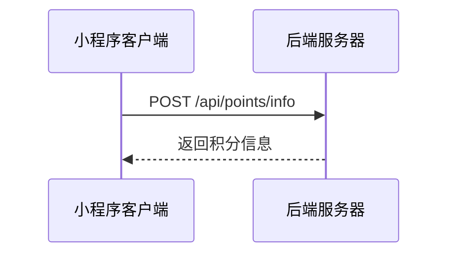
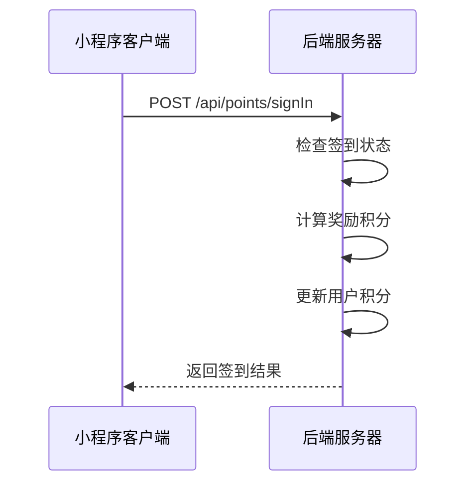
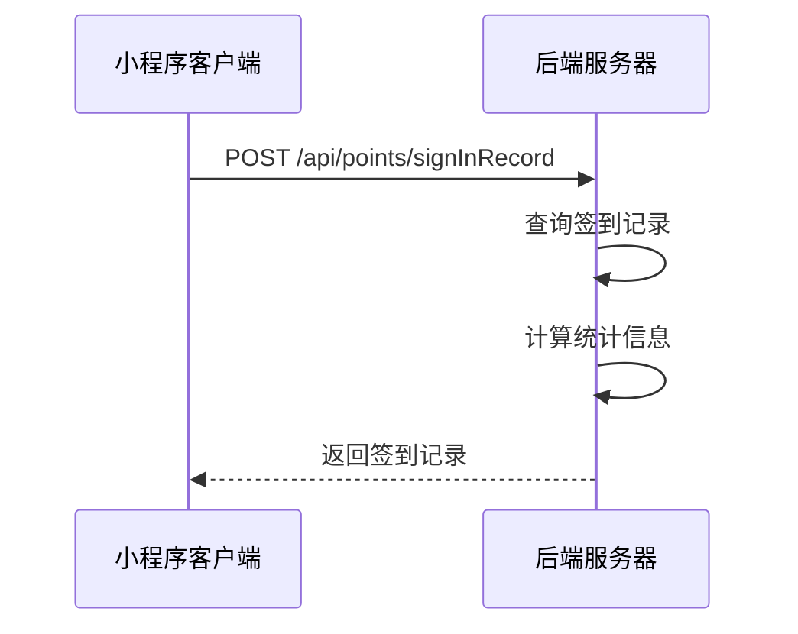

# 每日签到功能 API 文档

## 问题修复说明

### 修复的问题
1. **跳转失败问题**：修复了个人中心页面点击每日签到无法跳转到签到页面的问题
2. **用户体验优化**：参考主流签到功能，大幅提升了签到页面的用户体验
3. **功能完善**：增加了签到奖励、统计信息、动画效果等功能

### 修复内容
- 修改了 `pages/personal/index.ts` 中的 `handleTaskClick` 函数
- 优化了 `pages/dailyCheck/index.js` 的签到逻辑
- 重新设计了 `pages/dailyCheck/index.wxml` 页面布局
- 全面优化了 `pages/dailyCheck/index.wxss` 样式

---

## 接口列表

### 1. 获取积分信息

**接口名称：** 获取用户积分信息和签到状态
**功能描述：** 获取用户当前积分余额和今日签到状态
**接口地址：** /api/points/info
**请求方式：** POST

#### 功能说明
获取用户的积分信息，包括积分余额和签到状态，用于页面数据展示。



#### 请求参数
```json
{}
```

| 参数名 | 类型 | 必填 | 说明 | 示例值 |
|----|---|-----|---|-----|
| 无 | - | - | 空对象 | {} |

#### 响应参数
```json
{
  "error": 0,
  "body": {
    "balance": 280,
    "isSigned": false
  },
  "message": "获取积分信息成功",
  "success": true
}
```

| 参数名 | 类型 | 必填 | 说明 | 示例值 |
|----|---|-----|---|-----|
| error | int | 是 | 错误码 | 0 |
| body | object | 是 | 响应数据 | |
| body.balance | int | 是 | 积分余额 | 280 |
| body.isSigned | boolean | 是 | 今日是否已签到 | false |
| message | string | 是 | 响应消息 | 获取积分信息成功 |
| success | bool | 是 | 是否成功 | true |

### 2. 每日签到

**接口名称：** 用户每日签到
**功能描述：** 执行签到操作，获得积分奖励
**接口地址：** /api/points/signIn
**请求方式：** POST

#### 功能说明
用户执行签到操作，根据连续签到天数获得不同的积分奖励。连续签到7天可获得最高奖励。



#### 请求参数
```json
{}
```

| 参数名 | 类型 | 必填 | 说明 | 示例值 |
|----|---|-----|---|-----|
| 无 | - | - | 空对象 | {} |

#### 响应参数
```json
{
  "error": 0,
  "body": {
    "success": true,
    "points": 10,
    "continuousDays": 2,
    "totalPoints": 290
  },
  "message": "签到成功",
  "success": true
}
```

| 参数名 | 类型 | 必填 | 说明 | 示例值 |
|----|---|-----|---|-----|
| error | int | 是 | 错误码 | 0 |
| body | object | 是 | 响应数据 | |
| body.success | boolean | 是 | 签到是否成功 | true |
| body.points | int | 是 | 获得的积分 | 10 |
| body.continuousDays | int | 是 | 连续签到天数 | 2 |
| body.totalPoints | int | 是 | 签到后总积分 | 290 |
| message | string | 是 | 响应消息 | 签到成功 |
| success | bool | 是 | 是否成功 | true |

### 3. 获取签到记录

**接口名称：** 获取用户签到记录
**功能描述：** 获取用户的签到历史记录和统计信息
**接口地址：** /api/points/signInRecord
**请求方式：** POST

#### 功能说明
获取用户的签到记录，包括本月已签到的日期、连续签到天数、累计签到天数等统计信息。



#### 请求参数
```json
{}
```

| 参数名 | 类型 | 必填 | 说明 | 示例值 |
|----|---|-----|---|-----|
| 无 | - | - | 空对象 | {} |

#### 响应参数
```json
{
  "error": 0,
  "body": {
    "days": [1, 2, 5, 8, 12, 15, 20],
    "continuousDays": 2,
    "totalDays": 15,
    "maxContinuous": 7
  },
  "message": "获取签到记录成功",
  "success": true
}
```

| 参数名 | 类型 | 必填 | 说明 | 示例值 |
|----|---|-----|---|-----|
| error | int | 是 | 错误码 | 0 |
| body | object | 是 | 响应数据 | |
| body.days | array | 是 | 本月已签到的日期 | [1, 2, 5, 8] |
| body.continuousDays | int | 是 | 当前连续签到天数 | 2 |
| body.totalDays | int | 是 | 累计签到天数 | 15 |
| body.maxContinuous | int | 是 | 最大连续签到天数 | 7 |
| message | string | 是 | 响应消息 | 获取签到记录成功 |
| success | bool | 是 | 是否成功 | true |

---

## 功能特性

### 1. 签到奖励机制

#### 奖励规则
- 第1天：5积分
- 第2天：10积分
- 第3天：15积分
- 第4天：20积分
- 第5天：25积分
- 第6天：30积分
- 第7天：50积分（大奖励）

#### 奖励展示
- 连续签到进度可视化
- 已领取奖励标记
- 下一个奖励预览

### 2. 签到统计

#### 统计信息
- 累计签到天数
- 连续签到天数
- 最高连续签到天数
- 当前积分余额

#### 日历展示
- 本月签到日历
- 已签到日期标记
- 今日签到状态

### 3. 用户体验优化

#### 动画效果
- 签到成功动画
- 按钮点击反馈
- 页面加载动画

#### 交互反馈
- 振动反馈
- 声音提示
- 视觉反馈

### 4. 页面跳转修复

#### 修复前问题
- 点击个人中心的每日签到任务无法跳转
- 直接在个人中心执行签到，体验不佳

#### 修复后效果
- 点击每日签到任务自动跳转到签到页面
- 提供完整的签到体验和奖励展示
- 支持签到历史查看和统计

---

## 错误码说明

| 错误码 | 说明 | 处理方式 |
|-------|-----|---------|
| 0 | 成功 | 正常处理 |
| 401 | 未登录 | 跳转到登录页面 |
| 500 | 系统异常 | 显示错误提示 |
| 1001 | 今日已签到 | 提示用户已签到 |
| 1002 | 签到失败 | 提示用户重试 |

---

## 使用示例

### 1. 从个人中心跳转到签到页面

```javascript
// 个人中心页面 - 任务点击处理
handleTaskClick(e) {
  const { id } = e.currentTarget.dataset
  
  if (parseInt(id) === 1) { // 签到任务
    wx.navigateTo({
      url: '/pages/dailyCheck/index'
    })
  }
}
```

### 2. 签到页面初始化

```javascript
// 签到页面加载
onLoad() {
  this.initCalendar()      // 初始化日历
  this.getUserInfo()       // 获取用户信息
  this.getSignInStatus()   // 获取签到状态
  this.getSignInRecord()   // 获取签到记录
}
```

### 3. 执行签到操作

```javascript
// 签到按钮点击
async handleSignIn() {
  try {
    const result = await signIn()
    
    if (result.success) {
      // 更新页面状态
      this.setData({
        signedToday: true,
        continuousDays: result.continuousDays,
        'userInfo.pointsBalance': result.totalPoints
      })
      
      // 显示签到成功动画
      this.showSignSuccess(result.points, result.continuousDays)
    }
  } catch (error) {
    wx.showToast({
      title: '签到失败，请重试',
      icon: 'none'
    })
  }
}
```

---

## 注意事项

1. **登录状态**：所有接口都需要用户登录状态，请确保header中包含有效的token
2. **签到限制**：每日只能签到一次，重复签到会返回错误
3. **奖励计算**：连续签到中断后，奖励会重新从第1天开始计算
4. **时区处理**：签到时间以服务器时区为准
5. **数据刷新**：页面显示时会自动刷新签到状态和记录

---

## 更新日志

### v1.0.0 (2024-01-15)
- 修复个人中心签到跳转问题
- 优化签到页面UI设计
- 增加签到奖励机制
- 增加签到统计功能
- 增加签到成功动画
- 增加响应式设计和暗黑模式支持 