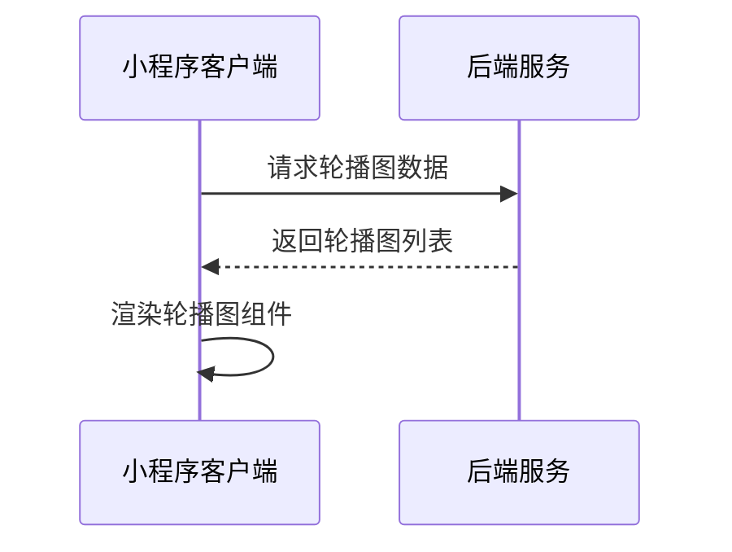
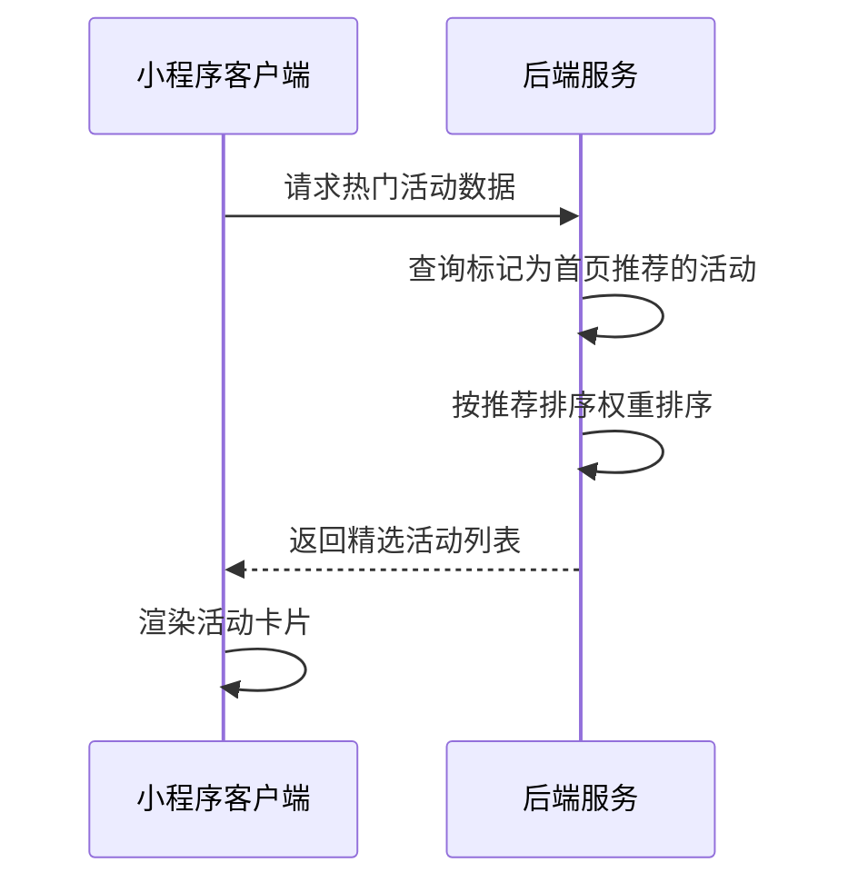
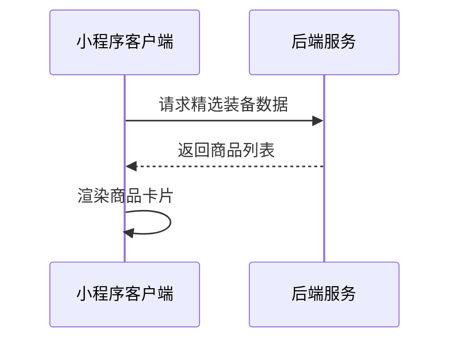
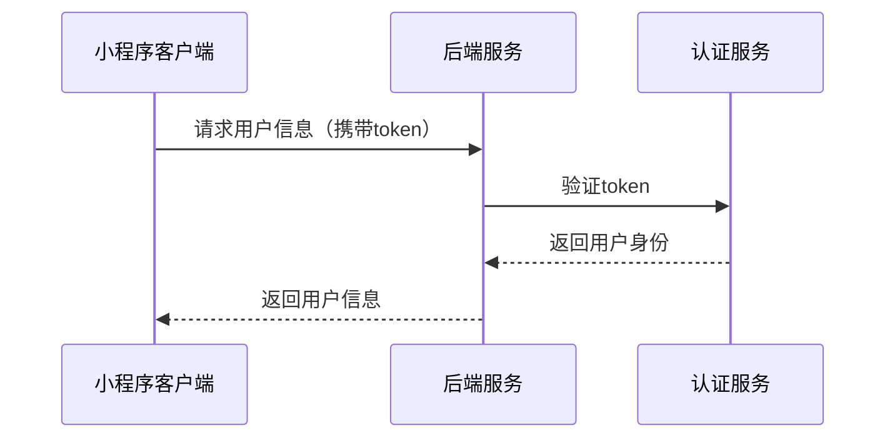
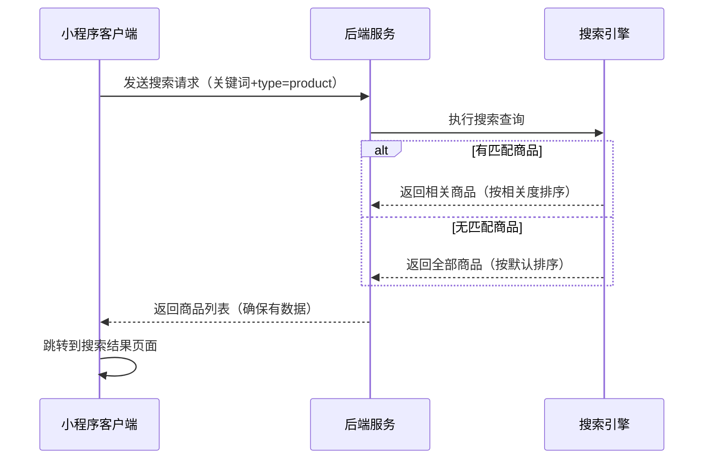
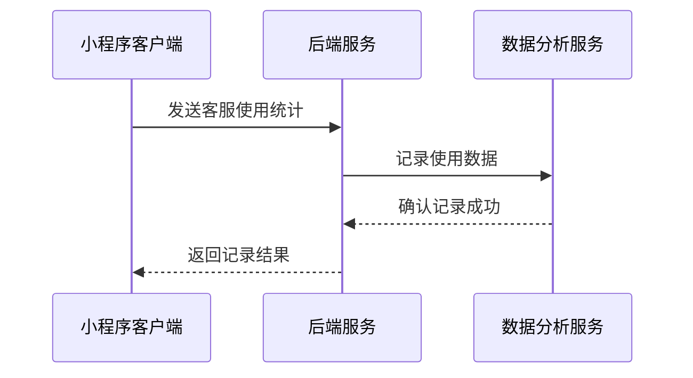

# 首页接口文档

## 获取轮播图数据

**接口名称：** 获取首页轮播图数据
**功能描述：** 获取首页轮播图的图片、链接、标题等信息，用于首页banner展示
**接口地址：** /api/banners
**请求方式：** GET

### 功能说明
获取首页轮播图数据，支持不同类型的banner（活动、商品等），用于首页顶部轮播展示。每个banner包含图片、标题、副标题和跳转链接等信息。



### 请求参数
无需传入参数

### 响应参数
```json
{
  "error": 0,
  "body": {
    "banners": [
      {
        "id": "banner_1",
        "imageUrl": "https://images.unsplash.com/photo-1551698618-1dfe5d97d256?w=800",
        "type": "activity",
        "linkId": "activity_1",
        "title": "夏季网球训练营",
        "subtitle": "专业教练指导，提升你的网球技能"
      }
    ]
  },
  "message": "获取轮播图数据成功",
  "success": true
}
```

| 参数名 | 类型 | 必填 | 说明 | 示例值 |
|----|---|-----|---|-----|
| error | int | 是 | 错误码，0表示成功 | 0 |
| body | object | 是 | 响应数据 | |
| body.banners | array | 是 | 轮播图列表 | |
| body.banners[].id | string | 是 | 轮播图ID | banner_1 |
| body.banners[].imageUrl | string | 是 | 轮播图图片URL | https://example.com/image.jpg |
| body.banners[].type | string | 是 | 跳转类型（product商品/activity活动） | activity |
| body.banners[].linkId | string | 是 | 跳转目标ID | activity_1 |
| body.banners[].title | string | 是 | 轮播图主标题 | 夏季网球训练营 |
| body.banners[].subtitle | string | 是 | 轮播图副标题 | 专业教练指导，提升你的网球技能 |
| message | string | 是 | 响应消息 | 获取轮播图数据成功 |
| success | bool | 是 | 是否成功 | true |

---

## 获取热门活动数据

**接口名称：** 获取首页热门活动数据
**功能描述：** 获取首页热门活动列表，包含活动详情、时间、地点等信息
**接口地址：** /api/activities
**请求方式：** GET

### 功能说明
获取首页展示的热门活动数据，包含活动标题、描述、封面图、时间范围、地点等信息。**特别注意：首页展示的活动都是由后台运营人员在活动管理页面中手动精选并设置为"首页推荐"的活动，并非所有活动或按时间顺序的前两个活动。** 运营可以控制哪些活动在首页展示，以及展示的顺序。



### 请求参数
```json
{
  "limit": 2,
  "isRecommended": true,
  "featured": true
}
```

| 参数名 | 类型 | 必填 | 说明 | 示例值 |
|----|---|-----|---|-----|
| limit | int | 否 | 返回数量限制（首页默认2） | 2 |
| isRecommended | bool | 否 | 是否只返回推荐到首页的活动（默认true） | true |
| featured | bool | 否 | 是否只返回精选活动（默认true，首页调用） | true |

### 响应参数
```json
{
  "error": 0,
  "body": {
    "activities": [
      {
        "id": "activity_1",
        "title": "门店周年庆活动",
        "description": "全场商品8折，会员额外95折，还有精美礼品赠送。专业网球装备一应俱全，品质保证。",
        "coverUrl": "https://images.unsplash.com/photo-1554068865-24cecd4e34b8?w=400",
        "timeRange": "6月18日-6月24日",
        "location": "滨顺店"
      }
    ],
    "totalFeaturedCount": 2,
    "totalActivitiesCount": 15
  },
  "message": "获取热门活动成功",
  "success": true
}
```

| 参数名 | 类型 | 必填 | 说明 | 示例值 |
|----|---|-----|---|-----|
| error | int | 是 | 错误码，0表示成功 | 0 |
| body | object | 是 | 响应数据 | |
| body.activities | array | 是 | 活动列表 | |
| body.activities[].id | string | 是 | 活动ID | activity_1 |
| body.activities[].title | string | 是 | 活动标题 | 门店周年庆活动 |
| body.activities[].description | string | 是 | 活动详细描述 | 全场商品8折，会员额外95折，还有精美礼品赠送 |
| body.activities[].coverUrl | string | 是 | 活动封面图URL | https://example.com/cover.jpg |
| body.activities[].timeRange | string | 是 | 活动时间范围 | 6月18日-6月24日 |
| body.activities[].location | string | 是 | 活动地点 | 滨顺店 |
| body.totalFeaturedCount | int | 是 | 当前首页精选活动总数 | 2 |
| body.totalActivitiesCount | int | 是 | 当前所有活动总数 | 15 |
| message | string | 是 | 响应消息 | 获取热门活动成功 |
| success | bool | 是 | 是否成功 | true |

**字段说明：**
- `id`: 活动的唯一标识符
- `title`: 活动标题，用于页面展示
- `description`: 活动的详细描述信息
- `coverUrl`: 活动封面图片URL
- `timeRange`: 活动时间范围的文字描述
- `location`: 活动举办地点
- `totalFeaturedCount`: 当前设置为首页精选的活动总数
- `totalActivitiesCount`: 系统中所有活动的总数，用于运营数据统计

---

## 获取精选装备数据

**接口名称：** 获取首页精选装备数据
**功能描述：** 获取首页精选装备商品列表，包含商品信息、价格、销量等
**接口地址：** /api/featured-equipment
**请求方式：** GET

### 功能说明
获取首页展示的精选装备商品数据，包含商品名称、价格、销量、标签、图片等信息。商品按推荐度和销量排序，首页展示最多6个精选商品。



### 请求参数
```json
{
  "limit": 4,
  "isFeatured": true
}
```

| 参数名 | 类型 | 必填 | 说明 | 示例值 |
|----|---|-----|---|-----|
| limit | int | 否 | 返回数量限制（首页默认4） | 4 |
| isFeatured | bool | 否 | 是否只返回精选商品（默认true） | true |

### 响应参数
```json
{
  "error": 0,
  "body": {
    "featuredEquipment": [
      {
        "id": "equipment_1",
        "name": "YONEX尤尼克斯ARC-11羽毛球拍",
        "tag": "热销",
        "price": "899",
        "sales": "销量268",
        "imageUrl": "https://images.unsplash.com/photo-1551698618-1dfe5d97d256?w=300"
      }
    ]
  },
  "message": "获取精选装备成功",
  "success": true
}
```

| 参数名 | 类型 | 必填 | 说明 | 示例值 |
|----|---|-----|---|-----|
| error | int | 是 | 错误码，0表示成功 | 0 |
| body | object | 是 | 响应数据 | |
| body.featuredEquipment | array | 是 | 精选装备商品列表 | |
| body.featuredEquipment[].id | string | 是 | 商品ID | equipment_1 |
| body.featuredEquipment[].name | string | 是 | 商品名称 | YONEX尤尼克斯ARC-11羽毛球拍 |
| body.featuredEquipment[].tag | string | 是 | 商品标签（热销/新品/爆款/推荐） | 热销 |
| body.featuredEquipment[].price | string | 是 | 商品价格 | 899 |
| body.featuredEquipment[].sales | string | 是 | 销量信息 | 销量268 |
| body.featuredEquipment[].imageUrl | string | 是 | 商品主图URL | https://example.com/product.jpg |
| message | string | 是 | 响应消息 | 获取精选装备成功 |
| success | bool | 是 | 是否成功 | true |

**字段说明：**
- `id`: 装备商品的唯一标识符
- `name`: 商品的完整名称，包含品牌和型号
- `tag`: 商品推荐标签，用于页面展示（热销、新品、爆款、推荐）
- `price`: 商品价格，字符串格式便于前端显示
- `sales`: 销量信息，包含"销量"文字前缀的完整描述
- `imageUrl`: 商品图片URL，用于页面展示

---

## 获取用户基本信息

**接口名称：** 获取用户基本信息
**功能描述：** 获取当前登录用户的基本信息，包含会员等级、积分等
**接口地址：** /api/user/info
**请求方式：** GET

### 功能说明
获取当前登录用户的基本信息，用于首页展示用户会员等级、积分余额等个人信息。需要在请求头中携带用户token。根据index.js中的checkLoginStatus方法，当前主要用于检查登录状态。



### 请求参数
**请求头：**
```json
{
  "Authorization": "Bearer {token}"
}
```

| 参数名 | 类型 | 必填 | 说明 | 示例值 |
|----|---|-----|---|-----|
| Authorization | string | 是 | 用户认证token | Bearer abc123... |

### 响应参数
```json
{
  "error": 0,
  "body": {
    "userId": "user_123",
    "nickname": "张三",
    "avatarUrl": "https://example.com/avatar.jpg",
    "memberLevel": "初级会员",
    "memberLevelCode": "bronze",
    "points": 1280,
    "pointsToNextLevel": 720,
    "isVip": false,
    "phone": "138****5678",
    "registeredDate": "2023-01-15",
    "isLoggedIn": true
  },
  "message": "获取用户信息成功",
  "success": true
}
```

| 参数名 | 类型 | 必填 | 说明 | 示例值 |
|----|---|-----|---|-----|
| error | int | 是 | 错误码，0表示成功 | 0 |
| body | object | 是 | 响应数据 | |
| body.userId | string | 是 | 用户ID | user_123 |
| body.nickname | string | 是 | 微信昵称 | 张三 |
| body.avatarUrl | string | 否 | 微信头像URL | https://example.com/avatar.jpg |
| body.memberLevel | string | 是 | 会员等级名称 | 初级会员 |
| body.memberLevelCode | string | 是 | 会员等级代码（bronze/silver/gold/diamond） | bronze |
| body.points | int | 是 | 当前积分 | 1280 |
| body.pointsToNextLevel | int | 是 | 距离下一级所需积分 | 720 |
| body.isVip | bool | 是 | 是否VIP会员 | false |
| body.phone | string | 否 | 用户手机号（脱敏显示） | 138****5678 |
| body.registeredDate | string | 是 | 注册日期 | 2023-01-15 |
| body.isLoggedIn | bool | 是 | 是否已登录 | true |
| message | string | 是 | 响应消息 | 获取用户信息成功 |
| success | bool | 是 | 是否成功 | true |

---

## 商品搜索接口

**接口名称：** 商品搜索
**功能描述：** 根据关键词搜索商品，支持模糊匹配商品名称、品牌等
**接口地址：** /api/products/search
**请求方式：** GET

### 功能说明
根据用户输入的关键词搜索商品，支持按商品标题和品牌名进行模糊匹配。用于首页搜索栏功能。根据index.js中的onSearchConfirm方法实现，搜索成功后跳转到搜索结果页面。

**重要的兜底逻辑：**
- 无论关键词输入是否精准匹配，都会返回商品数据，确保用户能正常跳转到搜索结果页
- 如果有匹配商品：按相关度和销量排序，相关度高的商品靠前
- 如果没有完全匹配的商品：返回全部商品列表，按系统默认排序（热销、推荐等）
- 不会返回空结果，避免用户看到"无结果"的空白页面



### 请求参数
```json
{
  "keyword": "羽毛球拍",
  "type": "product",
  "page": 1,
  "pageSize": 10,
  "sortBy": "relevance"
}
```

| 参数名 | 类型 | 必填 | 说明 | 示例值 |
|----|---|-----|---|-----|
| keyword | string | 是 | 搜索关键词（搜索商品标题和品牌名，可为空字符串） | 羽毛球拍 |
| type | string | 是 | 搜索类型（product商品搜索） | product |
| page | int | 否 | 页码（默认1） | 1 |
| pageSize | int | 否 | 每页数量（默认10） | 10 |
| sortBy | string | 否 | 排序方式（relevance相关度/sales销量/price价格，默认relevance） | relevance |

### 响应参数
```json
{
  "error": 0,
  "body": {
    "products": [
      {
        "productId": "product_1",
        "title": "YONEX尤尼克斯ARC-11羽毛球拍",
        "brand": "YONEX",
        "price": "899",
        "imageUrl": "https://example.com/product.jpg",
        "salesCount": 268,
        "category": "羽毛球拍",
        "relevanceScore": 0.95
      }
    ],
    "total": 156,
    "page": 1,
    "pageSize": 10,
    "totalPages": 16,
    "hasExactMatch": true,
    "searchStrategy": "exact_match",
    "searchKeyword": "羽毛球拍",
    "searchType": "product"
  },
  "message": "搜索成功",
  "success": true
}
```

| 参数名 | 类型 | 必填 | 说明 | 示例值 |
|----|---|-----|---|-----|
| error | int | 是 | 错误码，0表示成功 | 0 |
| body | object | 是 | 响应数据 | |
| body.products | array | 是 | 商品列表（确保不为空） | |
| body.products[].productId | string | 是 | 商品ID | product_1 |
| body.products[].title | string | 是 | 商品标题 | YONEX尤尼克斯ARC-11羽毛球拍 |
| body.products[].brand | string | 是 | 商品品牌 | YONEX |
| body.products[].price | string | 是 | 商品价格 | 899 |
| body.products[].imageUrl | string | 是 | 商品图片URL | https://example.com/product.jpg |
| body.products[].salesCount | int | 是 | 销量 | 268 |
| body.products[].category | string | 是 | 商品分类 | 羽毛球拍 |
| body.products[].relevanceScore | float | 否 | 相关度分数（0-1，1为最相关） | 0.95 |
| body.total | int | 是 | 商品总数 | 156 |
| body.page | int | 是 | 当前页码 | 1 |
| body.pageSize | int | 是 | 每页数量 | 10 |
| body.totalPages | int | 是 | 总页数 | 16 |
| body.hasExactMatch | bool | 是 | 是否有精确匹配的商品 | true |
| body.searchStrategy | string | 是 | 搜索策略（exact_match精确匹配/fallback_all兜底全部） | exact_match |
| body.searchKeyword | string | 是 | 搜索关键词（原样返回） | 羽毛球拍 |
| body.searchType | string | 是 | 搜索类型（原样返回） | product |
| message | string | 是 | 响应消息 | 搜索成功 |
| success | bool | 是 | 是否成功 | true |

**字段说明：**
- `hasExactMatch`: true表示有匹配关键词的商品，false表示使用了兜底逻辑返回全部商品
- `searchStrategy`: 
  - `exact_match`: 有精确匹配，商品按相关度排序
  - `fallback_all`: 无匹配商品，返回全部商品按默认排序
- `relevanceScore`: 仅在有匹配商品时返回，表示与搜索关键词的相关度
- `searchKeyword`: 返回原始搜索关键词，便于搜索结果页面展示
- `searchType`: 返回搜索类型，便于结果页面处理

---

## 记录客服使用统计

**接口名称：** 记录客服使用统计
**功能描述：** 记录用户点击客服按钮的行为统计，用于数据分析
**接口地址：** /api/analytics/customer-service
**请求方式：** POST

### 功能说明
当用户点击首页客服按钮时，记录使用统计信息，包括用户ID、时间戳、来源页面等，用于分析用户使用客服的行为模式。根据index.js中的onContactButton方法实现。



### 请求参数
```json
{
  "userId": "user_123",
  "timestamp": 1672531200000,
  "source": "首页导航",
  "action": "contact_start",
  "sessionId": "session_abc123"
}
```

| 参数名 | 类型 | 必填 | 说明 | 示例值 |
|----|---|-----|---|-----|
| userId | string | 否 | 用户ID（未登录为guest） | user_123 |
| timestamp | long | 是 | 时间戳 | 1672531200000 |
| source | string | 是 | 来源页面 | 首页导航 |
| action | string | 是 | 操作类型（contact_start联系开始） | contact_start |
| sessionId | string | 否 | 会话ID | session_abc123 |

### 响应参数
```json
{
  "error": 0,
  "body": {
    "recordId": "record_789",
    "recorded": true
  },
  "message": "客服使用统计记录成功",
  "success": true
}
```

| 参数名 | 类型 | 必填 | 说明 | 示例值 |
|----|---|-----|---|-----|
| error | int | 是 | 错误码，0表示成功 | 0 |
| body | object | 是 | 响应数据 | |
| body.recordId | string | 是 | 记录ID | record_789 |
| body.recorded | bool | 是 | 是否记录成功 | true |
| message | string | 是 | 响应消息 | 客服使用统计记录成功 |
| success | bool | 是 | 是否成功 | true | 