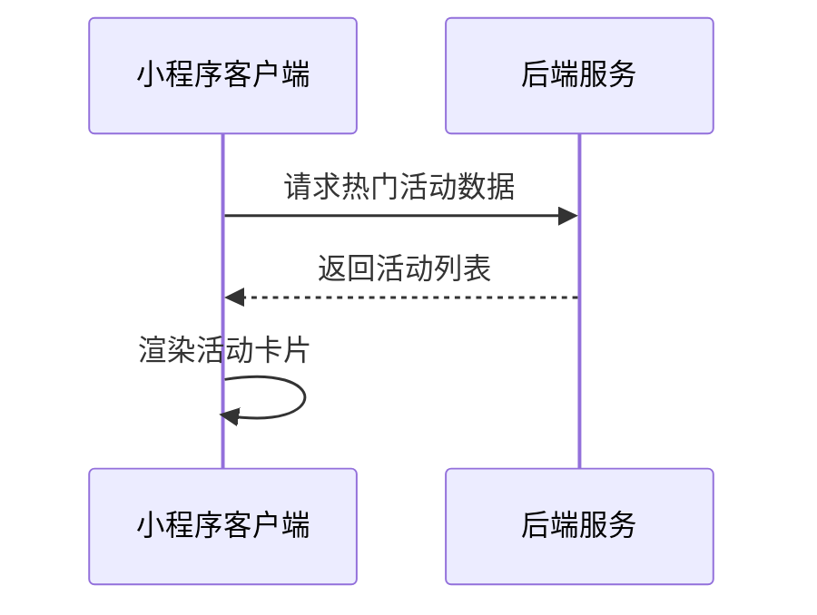
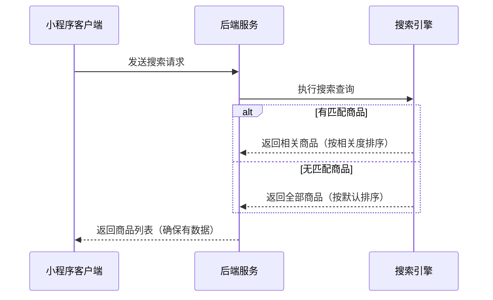

# 首页接口文档

## 获取轮播图数据

**接口名称：** 获取首页轮播图数据
**功能描述：** 获取首页轮播图的图片、链接、标题等信息，用于首页banner展示
**接口地址：** /api/banners
**请求方式：** GET

### 功能说明
获取首页轮播图数据，支持不同类型的banner（活动、商品等），用于首页顶部轮播展示。每个banner包含图片、标题、副标题和跳转链接等信息。


### 请求参数
无需传入参数

### 响应参数
```json
{
  "error": 0,
  "body": {
    "banners": [
      {
        "id": "banner_1",
        "imageUrl": "https://images.unsplash.com/photo-1551698618-1dfe5d97d256?w=800",
        "targetType": "product",
        "targetId": "product_1",
        "title": "夏季羽毛球装备",
        "subtitle": "专业装备，助力你的运动表现"
      }
    ]
  },
  "message": "获取轮播图数据成功",
  "success": true
}
```

| 参数名 | 类型 | 必填 | 说明 | 示例值 |
|----|---|-----|---|-----|
| error | int | 是 | 错误码，0表示成功 | 0 |
| body | object | 是 | 响应数据 | |
| body.banners | array | 是 | 轮播图列表 | |
| body.banners[].id | string | 是 | 轮播图ID | banner_1 |
| body.banners[].imageUrl | string | 是 | 轮播图图片URL | https://example.com/image.jpg |
| body.banners[].targetType | string | 是 | 跳转类型（product商品/event活动） | product |
| body.banners[].targetId | string | 是 | 跳转目标ID | product_1 |
| body.banners[].title | string | 是 | 轮播图主标题 | 夏季羽毛球装备 |
| body.banners[].subtitle | string | 是 | 轮播图副标题 | 专业装备，助力你的运动表现 |
| message | string | 是 | 响应消息 | 获取轮播图数据成功 |
| success | bool | 是 | 是否成功 | true |

---

## 获取热门活动数据

**接口名称：** 获取首页热门活动数据
**功能描述：** 获取首页热门活动列表，包含活动详情、时间、地点等信息
**接口地址：** /api/activities
**请求方式：** GET

### 功能说明
获取首页展示的热门活动数据，包含活动标题、描述、封面图、时间范围、地点等信息。活动按热度排序，首页只展示前2个热门活动。



### 请求参数
```json
{
  "limit": 2,
  "isRecommended": true
}
```

| 参数名 | 类型 | 必填 | 说明 | 示例值 |
|----|---|-----|---|-----|
| limit | int | 否 | 返回数量限制（首页默认2） | 2 |
| isRecommended | bool | 否 | 是否只返回推荐到首页的活动（默认true） | true |

### 响应参数
```json
{
  "error": 0,
  "body": {
    "activities": [
      {
        "eventId": "event_1",
        "title": "门店周年庆活动",
        "brief": "全场商品8折，会员额外95折，还有精美礼品赠送",
        "coverImage": "https://images.unsplash.com/photo-1554068865-24cecd4e34b8?w=400",
        "startTime": "2024-06-18T00:00:00Z",
        "endTime": "2024-06-24T23:59:59Z",
        "location": "滨顺店",
        "organizer": "倍特爱体育",
        "isPublished": true
      }
    ]
  },
  "message": "获取热门活动成功",
  "success": true
}
```

| 参数名 | 类型 | 必填 | 说明 | 示例值 |
|----|---|-----|---|-----|
| error | int | 是 | 错误码，0表示成功 | 0 |
| body | object | 是 | 响应数据 | |
| body.activities | array | 是 | 活动列表 | |
| body.activities[].eventId | string | 是 | 活动ID | event_1 |
| body.activities[].title | string | 是 | 活动标题 | 门店周年庆活动 |
| body.activities[].brief | string | 是 | 活动简介 | 全场商品8折，会员额外95折 |
| body.activities[].coverImage | string | 是 | 活动封面图URL | https://example.com/cover.jpg |
| body.activities[].startTime | string | 是 | 活动开始时间（ISO 8601格式） | 2024-06-18T00:00:00Z |
| body.activities[].endTime | string | 是 | 活动结束时间（ISO 8601格式） | 2024-06-24T23:59:59Z |
| body.activities[].location | string | 是 | 活动地点 | 滨顺店 |
| body.activities[].organizer | string | 是 | 主办方名称 | 倍特爱体育 |
| body.activities[].isPublished | bool | 是 | 是否已发布 | true |
| message | string | 是 | 响应消息 | 获取热门活动成功 |
| success | bool | 是 | 是否成功 | true |

---

## 获取精选装备数据

**接口名称：** 获取首页精选装备数据
**功能描述：** 获取首页精选装备商品列表，包含商品信息、价格、销量等
**接口地址：** /api/featured-equipment
**请求方式：** GET

### 功能说明
获取首页展示的精选装备商品数据，包含商品名称、价格、销量、标签、图片等信息。商品按推荐度和销量排序，首页展示最多6个精选商品。


### 请求参数
```json
{
  "limit": 6,
  "isFeatured": true
}
```

| 参数名 | 类型 | 必填 | 说明 | 示例值 |
|----|---|-----|---|-----|
| limit | int | 否 | 返回数量限制（首页默认6） | 6 |
| isFeatured | bool | 否 | 是否只返回精选商品（默认true） | true |

### 响应参数
```json
{
  "error": 0,
  "body": {
    "equipment": [
      {
        "productId": "product_1",
        "title": "YONEX尤尼克斯ARC-11羽毛球拍",
        "imageUrl": "https://images.unsplash.com/photo-1551698618-1dfe5d97d256?w=300",
        "price": "899",
        "originalPrice": "1099",
        "salesCount": 268,
        "category": "羽毛球拍",
        "brand": "YONEX"
      }
    ]
  },
  "message": "获取精选装备成功",
  "success": true
}
```

| 参数名 | 类型 | 必填 | 说明 | 示例值 |
|----|---|-----|---|-----|
| error | int | 是 | 错误码，0表示成功 | 0 |
| body | object | 是 | 响应数据 | |
| body.equipment | array | 是 | 装备商品列表 | |
| body.equipment[].productId | string | 是 | 商品ID | product_1 |
| body.equipment[].title | string | 是 | 商品标题 | YONEX尤尼克斯ARC-11羽毛球拍 |
| body.equipment[].imageUrl | string | 是 | 商品主图URL | https://example.com/product.jpg |
| body.equipment[].price | string | 是 | 当前价格 | 899 |
| body.equipment[].originalPrice | string | 否 | 原价（用于显示折扣） | 1099 |
| body.equipment[].salesCount | int | 是 | 销量 | 268 |
| body.equipment[].category | string | 是 | 商品分类 | 羽毛球拍 |
| body.equipment[].brand | string | 是 | 品牌名称 | YONEX |
| message | string | 是 | 响应消息 | 获取精选装备成功 |
| success | bool | 是 | 是否成功 | true |

---

## 获取用户基本信息

**接口名称：** 获取用户基本信息
**功能描述：** 获取当前登录用户的基本信息，包含会员等级、积分等
**接口地址：** /api/user/info
**请求方式：** GET

### 功能说明
获取当前登录用户的基本信息，用于首页展示用户会员等级、积分余额等个人信息。需要在请求头中携带用户token。


### 请求参数
**请求头：**
```json
{
  "Authorization": "Bearer {token}"
}
```

| 参数名 | 类型 | 必填 | 说明 | 示例值 |
|----|---|-----|---|-----|
| Authorization | string | 是 | 用户认证token | Bearer abc123... |

### 响应参数
```json
{
  "error": 0,
  "body": {
    "userId": "user_123",
    "nickname": "张三",
    "avatarUrl": "https://example.com/avatar.jpg",
    "memberLevel": "初级会员",
    "memberLevelCode": "bronze",
    "points": 1280,
    "pointsToNextLevel": 720,
    "isVip": false,
    "phone": "138****5678",
    "registeredDate": "2023-01-15"
  },
  "message": "获取用户信息成功",
  "success": true
}
```

| 参数名 | 类型 | 必填 | 说明 | 示例值 |
|----|---|-----|---|-----|
| error | int | 是 | 错误码，0表示成功 | 0 |
| body | object | 是 | 响应数据 | |
| body.userId | string | 是 | 用户ID | user_123 |
| body.nickname | string | 是 | 微信昵称 | 张三 |
| body.avatarUrl | string | 否 | 微信头像URL | https://example.com/avatar.jpg |
| body.memberLevel | string | 是 | 会员等级名称 | 初级会员 |
| body.memberLevelCode | string | 是 | 会员等级代码（bronze/silver/gold/diamond） | bronze |
| body.points | int | 是 | 当前积分 | 1280 |
| body.pointsToNextLevel | int | 是 | 距离下一级所需积分 | 720 |
| body.isVip | bool | 是 | 是否VIP会员 | false |
| body.phone | string | 否 | 用户手机号（脱敏显示） | 138****5678 |
| body.registeredDate | string | 是 | 注册日期 | 2023-01-15 |
| message | string | 是 | 响应消息 | 获取用户信息成功 |
| success | bool | 是 | 是否成功 | true |

---

## 商品搜索接口

**接口名称：** 商品搜索
**功能描述：** 根据关键词搜索商品，支持模糊匹配商品名称、品牌等
**接口地址：** /api/products/search
**请求方式：** GET

### 功能说明
根据用户输入的关键词搜索商品，支持按商品标题和品牌名进行模糊匹配。用于首页搜索栏功能。

**重要的兜底逻辑：**
- 无论关键词输入是否精准匹配，都会返回商品数据，确保用户能正常跳转到搜索结果页
- 如果有匹配商品：按相关度和销量排序，相关度高的商品靠前
- 如果没有完全匹配的商品：返回全部商品列表，按系统默认排序（热销、推荐等）
- 不会返回空结果，避免用户看到"无结果"的空白页面



### 请求参数
```json
{
  "keyword": "羽毛球拍",
  "page": 1,
  "pageSize": 10,
  "sortBy": "relevance"
}
```

| 参数名 | 类型 | 必填 | 说明 | 示例值 |
|----|---|-----|---|-----|
| keyword | string | 是 | 搜索关键词（搜索商品标题和品牌名，可为空字符串） | 羽毛球拍 |
| page | int | 否 | 页码（默认1） | 1 |
| pageSize | int | 否 | 每页数量（默认10） | 10 |
| sortBy | string | 否 | 排序方式（relevance相关度/sales销量/price价格，默认relevance） | relevance |

### 响应参数
```json
{
  "error": 0,
  "body": {
    "products": [
      {
        "productId": "product_1",
        "title": "YONEX尤尼克斯ARC-11羽毛球拍",
        "brand": "YONEX",
        "price": "899",
        "imageUrl": "https://example.com/product.jpg",
        "salesCount": 268,
        "category": "羽毛球拍",
        "relevanceScore": 0.95
      }
    ],
    "total": 156,
    "page": 1,
    "pageSize": 10,
    "totalPages": 16,
    "hasExactMatch": true,
    "searchStrategy": "exact_match"
  },
  "message": "搜索成功",
  "success": true
}
```

| 参数名 | 类型 | 必填 | 说明 | 示例值 |
|----|---|-----|---|-----|
| error | int | 是 | 错误码，0表示成功 | 0 |
| body | object | 是 | 响应数据 | |
| body.products | array | 是 | 商品列表（确保不为空） | |
| body.products[].productId | string | 是 | 商品ID | product_1 |
| body.products[].title | string | 是 | 商品标题 | YONEX尤尼克斯ARC-11羽毛球拍 |
| body.products[].brand | string | 是 | 商品品牌 | YONEX |
| body.products[].price | string | 是 | 商品价格 | 899 |
| body.products[].imageUrl | string | 是 | 商品图片URL | https://example.com/product.jpg |
| body.products[].salesCount | int | 是 | 销量 | 268 |
| body.products[].category | string | 是 | 商品分类 | 羽毛球拍 |
| body.products[].relevanceScore | float | 否 | 相关度分数（0-1，1为最相关） | 0.95 |
| body.total | int | 是 | 商品总数 | 156 |
| body.page | int | 是 | 当前页码 | 1 |
| body.pageSize | int | 是 | 每页数量 | 10 |
| body.totalPages | int | 是 | 总页数 | 16 |
| body.hasExactMatch | bool | 是 | 是否有精确匹配的商品 | true |
| body.searchStrategy | string | 是 | 搜索策略（exact_match精确匹配/fallback_all兜底全部） | exact_match |
| message | string | 是 | 响应消息 | 搜索成功 |
| success | bool | 是 | 是否成功 | true |

**字段说明：**
- `hasExactMatch`: true表示有匹配关键词的商品，false表示使用了兜底逻辑返回全部商品
- `searchStrategy`: 
  - `exact_match`: 有精确匹配，商品按相关度排序
  - `fallback_all`: 无匹配商品，返回全部商品按默认排序
- `relevanceScore`: 仅在有匹配商品时返回，表示与搜索关键词的相关度

---

## 记录客服使用统计

**接口名称：** 记录客服使用统计
**功能描述：** 记录用户点击客服按钮的行为统计，用于数据分析
**接口地址：** /api/analytics/customer-service
**请求方式：** POST

### 功能说明
当用户点击首页客服按钮时，记录使用统计信息，包括用户ID、时间戳、来源页面等，用于分析用户使用客服的行为模式。


### 请求参数
```json
{
  "userId": "user_123",
  "timestamp": 1672531200000,
  "source": "首页导航",
  "action": "contact_start",
  "sessionId": "session_abc123"
}
```

| 参数名 | 类型 | 必填 | 说明 | 示例值 |
|----|---|-----|---|-----|
| userId | string | 否 | 用户ID（未登录为guest） | user_123 |
| timestamp | long | 是 | 时间戳 | 1672531200000 |
| source | string | 是 | 来源页面 | 首页导航 |
| action | string | 是 | 操作类型（contact_start联系开始） | contact_start |
| sessionId | string | 否 | 会话ID | session_abc123 |

### 响应参数
```json
{
  "error": 0,
  "body": {
    "recordId": "record_789",
    "recorded": true
  },
  "message": "客服使用统计记录成功",
  "success": true
}
```

| 参数名 | 类型 | 必填 | 说明 | 示例值 |
|----|---|-----|---|-----|
| error | int | 是 | 错误码，0表示成功 | 0 |
| body | object | 是 | 响应数据 | |
| body.recordId | string | 是 | 记录ID | record_789 |
| body.recorded | bool | 是 | 是否记录成功 | true |
| message | string | 是 | 响应消息 | 客服使用统计记录成功 |
| success | bool | 是 | 是否成功 | true | 