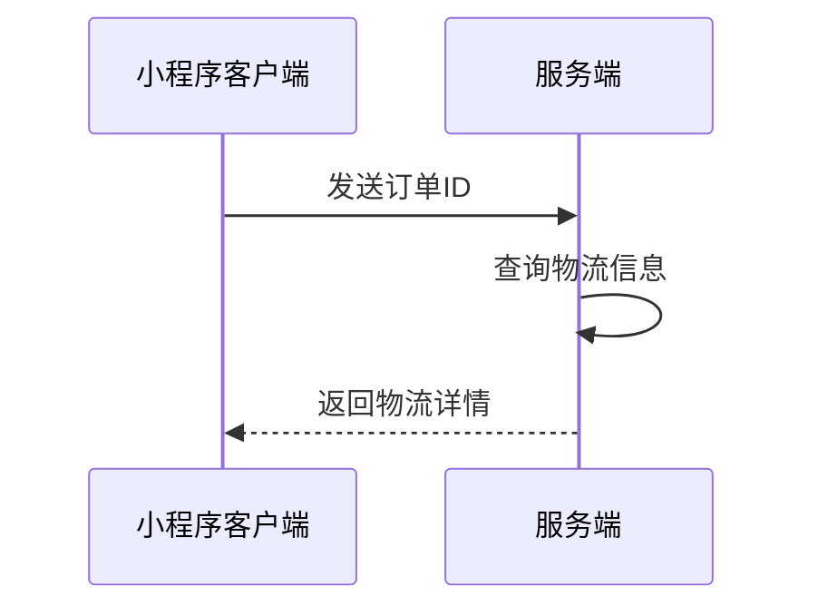

## 物流查询接口

**接口名称：** 物流信息查询
**功能描述：** 根据订单ID查询物流配送信息，包括物流状态、物流公司、物流单号和物流轨迹
**接口地址：** /api/logistics/query
**请求方式：** POST

### 功能说明
该接口用于查询订单的物流配送信息，返回包括物流状态、物流公司信息、物流单号以及详细的物流轨迹。



### 请求参数
```json
{
  "orderId": "123456789"
}
```

| 参数名 | 类型 | 必填 | 说明 | 示例值 |
|----|---|-----|---|-----|
| orderId | string | 是 | 订单ID | 123456789 |

### 响应参数
```json
{
  "error": 0,
  "body": {
    "status": "shipping",
    "statusText": "运输中",
    "companyName": "顺丰速运",
    "trackingNo": "SF1234567890123",
    "tracks": [
      {
        "time": "2024-01-16 14:30:25",
        "status": "快件已到达 【北京朝阳分拣中心】",
        "location": "北京朝阳分拣中心"
      },
      {
        "time": "2024-01-16 10:15:30",
        "status": "快件已从 【北京天通苑营业点】 发出，下一站 【北京朝阳分拣中心】",
        "location": "北京天通苑营业点"
      },
      {
        "time": "2024-01-16 08:20:15",
        "status": "快件已在 【北京天通苑营业点】 装车，准备发往下一站",
        "location": "北京天通苑营业点"
      },
      {
        "time": "2024-01-15 18:45:00",
        "status": "已收件",
        "location": "北京天通苑营业点"
      }
    ],
    "companyInfo": {
      "name": "顺丰速运",
      "phone": "95338",
      "logo": "https://img.alicdn.com/tfs/TB1V4g3d.H1gK0jSZSyXXXtlpXa-200-200.png"
    }
  },
  "message": "获取物流信息成功",
  "success": true
}
```

| 参数名 | 类型 | 必填 | 说明 | 示例值 |
|----|---|-----|---|-----|
| error | int | 是 | 错误码，0表示成功 | 0 |
| body | object | 是 | 响应数据 | |
| body.status | string | 是 | 物流状态：pending-待发货，shipping-运输中，delivered-已签收，exception-异常 | shipping |
| body.statusText | string | 是 | 物流状态文本描述 | 运输中 |
| body.companyName | string | 是 | 物流公司名称 | 顺丰速运 |
| body.trackingNo | string | 是 | 物流单号 | SF1234567890123 |
| body.tracks | array | 是 | 物流轨迹数组 | |
| body.tracks[].time | string | 是 | 物流节点时间 | 2024-01-16 14:30:25 |
| body.tracks[].status | string | 是 | 物流节点状态描述 | 快件已到达 【北京朝阳分拣中心】 |
| body.tracks[].location | string | 是 | 物流节点位置 | 北京朝阳分拣中心 |
| body.companyInfo | object | 否 | 物流公司详细信息 | |
| body.companyInfo.name | string | 否 | 物流公司名称 | 顺丰速运 |
| body.companyInfo.phone | string | 否 | 物流公司客服电话 | 95338 |
| body.companyInfo.logo | string | 否 | 物流公司logo图片URL | https://img.alicdn.com/tfs/TB1V4g3d.H1gK0jSZSyXXXtlpXa-200-200.png |
| message | string | 是 | 响应消息 | 获取物流信息成功 |
| success | bool | 是 | 是否成功 | true |

### 错误码说明

| 错误码 | 说明 |
|----|-----|
| 0 | 成功 |
| 401 | 未登录，需要重新登录 |
| 500 | 系统异常，请稍后重试 |
| 1001 | 参数错误，订单ID不能为空 |
| 1002 | 订单不存在 |
| 1003 | 该订单暂无物流信息 |

### 状态码枚举说明

根据index.js中的实现，物流状态包括以下几种：

| 状态码 | 状态文本 | 说明 |
|----|-----|-----|
| pending | 待发货 | 订单已创建，等待商家发货 |
| shipping | 运输中 | 商品已发货，正在运输途中 |
| delivered | 已签收 | 商品已送达并完成签收 |
| exception | 异常 | 物流过程中出现异常情况 |

### 接口调用说明

1. **请求Header要求**：
   - 必须在header中设置`auth`字段，值为当前登录用户的token
   - Content-Type: application/json

2. **请求参数格式**：
   - 使用JSON格式传参
   - 即使参数为空，也需要传递空对象 `{}`

3. **错误处理**：
   - 当error=401时，会自动跳转到登录页面
   - 当error=500时，显示"系统异常"提示
   - 其他错误码会显示具体的错误信息

4. **Mock数据支持**：
   - 当API调用失败时，会自动降级使用Mock数据
   - Mock数据根据订单ID的最后一位数字选择不同的数据集 