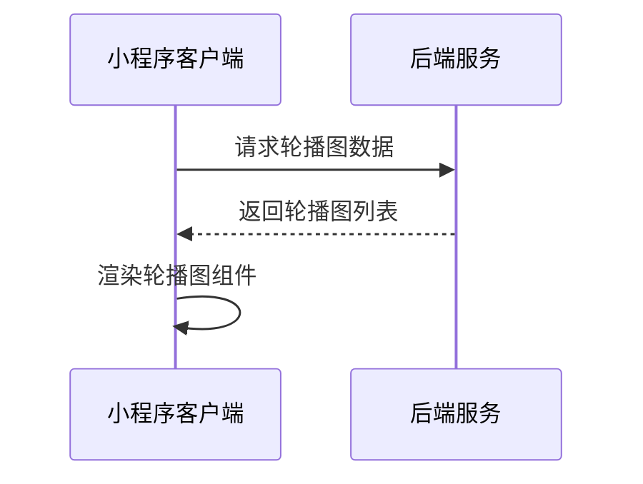
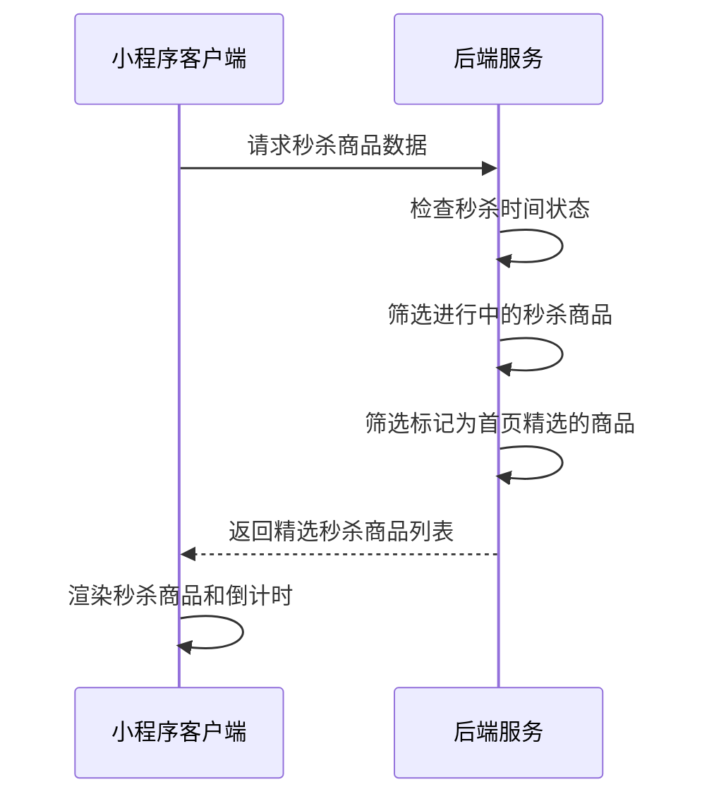
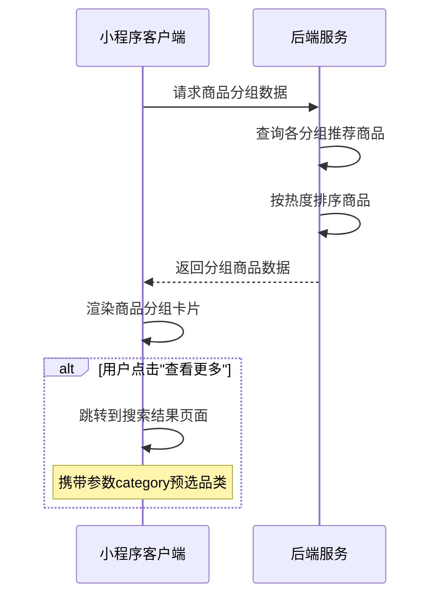
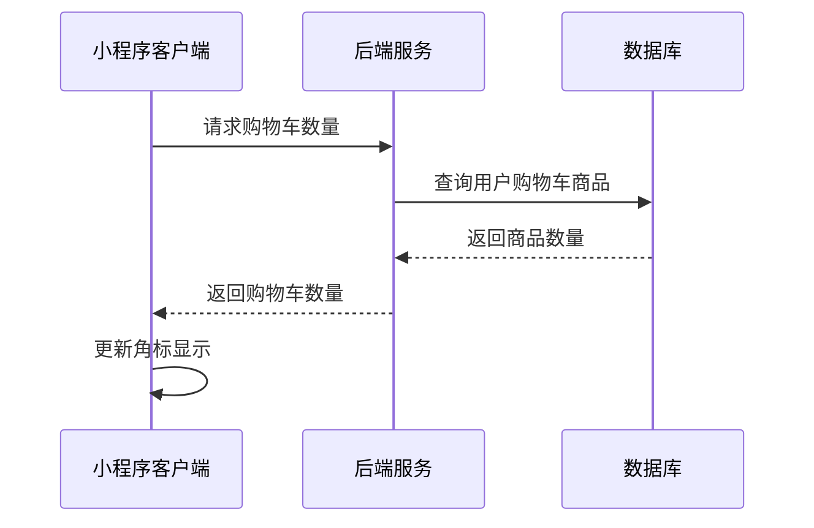
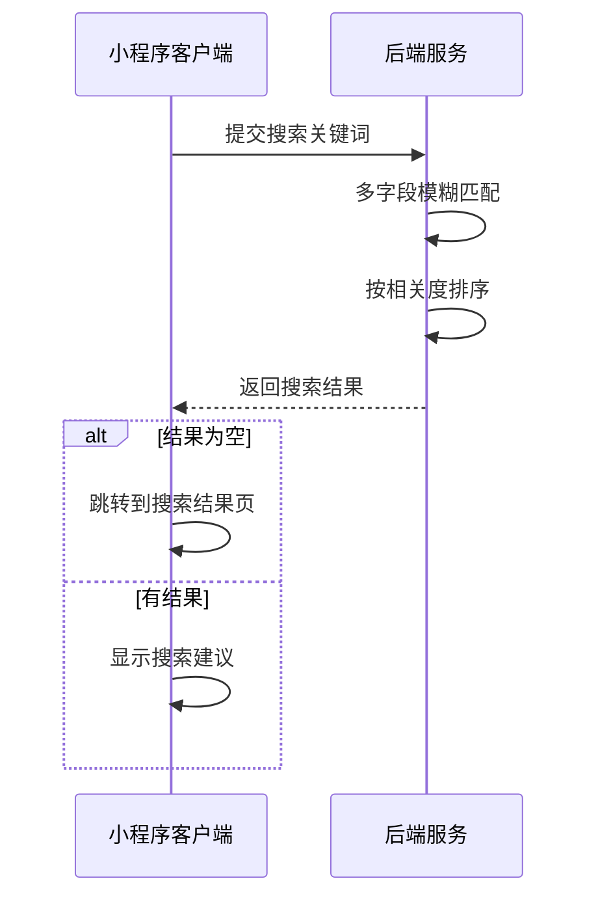
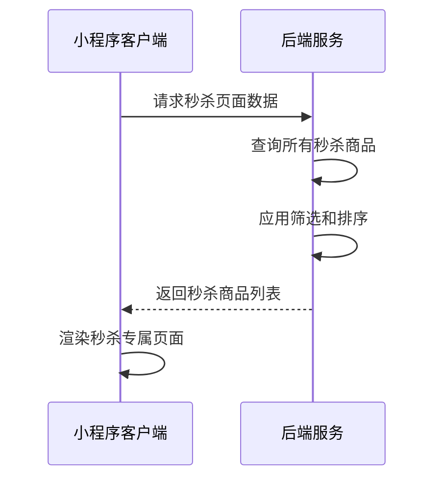

# 商城页面接口文档

## 获取轮播图数据

**接口名称：** 获取商城首页轮播图数据
**功能描述：** 获取商城首页轮播图的图片、标题、跳转链接等信息，用于首页banner展示
**接口地址：** /api/mall/banners
**请求方式：** GET

### 功能说明
获取商城首页轮播图数据，支持不同类型的跳转目标（活动详情页、商品详情页等），用于首页顶部轮播展示。每个banner包含图片、跳转链接、排序权重等信息。



### 请求参数
无需传入参数

### 响应参数
```json
{
  "error": 0,
  "body": {
    "banners": [
      {
        "id": "banner_1",
        "imageUrl": "https://images.unsplash.com/photo-1551698618-1dfe5d97d256?w=800",
        "title": "夏季羽毛球装备特惠",
        "subtitle": "专业装备，助力你的运动表现",
        "targetType": "product",
        "targetId": "product_1",
        "link": "/pages/productDetail/index?id=1",
        "sortOrder": 1,
        "isActive": true
      }
    ]
  },
  "message": "获取轮播图数据成功",
  "success": true
}
```

| 参数名 | 类型 | 必填 | 说明 | 示例值 |
|----|---|-----|---|-----|
| error | int | 是 | 错误码，0表示成功 | 0 |
| body | object | 是 | 响应数据 | |
| body.banners | array | 是 | 轮播图列表 | |
| body.banners[].id | string | 是 | 轮播图唯一ID | banner_1 |
| body.banners[].imageUrl | string | 是 | 轮播图图片URL | https://example.com/banner.jpg |
| body.banners[].title | string | 是 | 轮播图主标题 | 夏季羽毛球装备特惠 |
| body.banners[].subtitle | string | 否 | 轮播图副标题 | 专业装备，助力你的运动表现 |
| body.banners[].targetType | string | 是 | 跳转类型（product商品/activity活动） | product |
| body.banners[].targetId | string | 是 | 跳转目标ID | product_1 |
| body.banners[].link | string | 是 | 跳转链接 | /pages/productDetail/index?id=1 |
| body.banners[].sortOrder | int | 是 | 排序权重（数字越小越靠前） | 1 |
| body.banners[].isActive | bool | 是 | 是否启用 | true |
| message | string | 是 | 响应消息 | 获取轮播图数据成功 |
| success | bool | 是 | 是否成功 | true |

---

## 获取限时秒杀商品

**接口名称：** 获取限时秒杀商品列表
**功能描述：** 获取当前正在进行的限时秒杀商品，包含秒杀价格、倒计时等信息
**接口地址：** /api/mall/seckill
**请求方式：** GET

### 功能说明
获取当前时间段正在进行秒杀的商品列表，包含原价、秒杀价、结束时间等信息。系统会自动判断秒杀状态，只返回正在进行中的秒杀商品。**特别注意：商城首页展示的秒杀商品都是由后台运营人员在秒杀管理页面中手动精选的商品，并非所有秒杀商品都会在首页展示。**



### 请求参数
```json
{
  "limit": 10,
  "featured": true
}
```

| 参数名 | 类型 | 必填 | 说明 | 示例值 |
|----|---|-----|---|-----|
| limit | int | 否 | 返回商品数量限制（默认10） | 10 |
| featured | bool | 否 | 是否只返回精选商品（默认true，首页调用） | true |

### 响应参数
```json
{
  "error": 0,
  "body": {
    "seckillInfo": {
      "currentSessionName": "12点档",
      "endTime": "2024-12-18T16:00:00Z",
      "remainingSeconds": 14196
    },
    "products": [
      {
        "productId": "product_101",
        "title": "YONEX尤尼克斯羽毛球拍",
        "imageUrl": "https://images.unsplash.com/photo-1551698618-1dfe5d97d256?w=400",
        "originalPrice": 899,
        "seckillPrice": 599,
        "brand": "YONEX",
        "salesCount": 268,
        "stock": 50,
        "maxBuyCount": 2,
        "isFeatured": true,
        "featuredOrder": 1
      }
    ],
    "totalSeckillCount": 45,
    "featuredCount": 8
  },
  "message": "获取秒杀商品成功",
  "success": true
}
```

| 参数名 | 类型 | 必填 | 说明 | 示例值 |
|----|---|-----|---|-----|
| error | int | 是 | 错误码，0表示成功 | 0 |
| body | object | 是 | 响应数据 | |
| body.seckillInfo | object | 是 | 秒杀场次信息 | |
| body.seckillInfo.currentSessionName | string | 是 | 当前场次名称 | 12点档 |
| body.seckillInfo.endTime | string | 是 | 秒杀结束时间 | 2024-12-18T16:00:00Z |
| body.seckillInfo.remainingSeconds | int | 是 | 剩余秒数 | 14196 |
| body.products | array | 是 | 秒杀商品列表 | |
| body.products[].productId | string | 是 | 商品唯一ID | product_101 |
| body.products[].title | string | 是 | 商品标题 | YONEX尤尼克斯羽毛球拍 |
| body.products[].imageUrl | string | 是 | 商品主图URL | https://example.com/product.jpg |
| body.products[].originalPrice | number | 是 | 商品原价 | 899 |
| body.products[].seckillPrice | number | 是 | 秒杀价格 | 599 |
| body.products[].brand | string | 是 | 商品品牌 | YONEX |
| body.products[].salesCount | int | 是 | 已售数量 | 268 |
| body.products[].stock | int | 是 | 剩余库存 | 50 |
| body.products[].maxBuyCount | int | 是 | 单次最大购买数量 | 2 |
| body.products[].isFeatured | bool | 是 | 是否为首页精选商品 | true |
| body.products[].featuredOrder | int | 否 | 首页精选排序（数字越小越靠前） | 1 |
| body.totalSeckillCount | int | 是 | 当前总秒杀商品数量 | 45 |
| body.featuredCount | int | 是 | 当前精选秒杀商品数量 | 8 |
| message | string | 是 | 响应消息 | 获取秒杀商品成功 |
| success | bool | 是 | 是否成功 | true |

---

## 获取商品分组数据

**接口名称：** 获取商城首页商品分组数据
**功能描述：** 获取商城首页的商品分组，包含羽毛球拍、羽毛球鞋、运动必备等分类商品
**接口地址：** /api/mall/product-groups
**请求方式：** GET

### 功能说明
获取商城首页展示的商品分组数据，每个分组包含分组名称、描述和该分组下的推荐商品列表。商品按热度和推荐度排序，每个分组最多展示4个商品。**用户点击"查看更多"时，会跳转到搜索结果页面并自动勾选对应的品类筛选条件。**



### 请求参数
```json
{
  "limit": 4
}
```

| 参数名 | 类型 | 必填 | 说明 | 示例值 |
|----|---|-----|---|-----|
| limit | int | 否 | 每个分组返回商品数量（默认4） | 4 |

### 响应参数
```json
{
  "error": 0,
  "body": {
    "productGroups": [
      {
        "groupId": "racket",
        "groupName": "羽毛球拍",
        "groupDesc": "专业球拍，助你提升球技",
        "iconUrl": "https://example.com/icon-racket.png",
        "sortOrder": 1,
        "categoryCode": "racket",
        "moreLink": "/pages/search-result/index?category=racket",
        "products": [
          {
            "productId": "product_101",
            "name": "YONEX尤尼克斯ARC-11羽毛球拍",
            "imageUrl": "https://images.unsplash.com/photo-1551698618-1dfe5d97d256?w=300",
            "price": 899,
            "originalPrice": 1099,
            "salesCount": 268,
            "tag": "热销",
            "brand": "YONEX",
            "category": "羽毛球拍"
          }
        ]
      }
    ]
  },
  "message": "获取商品分组成功",
  "success": true
}
```

| 参数名 | 类型 | 必填 | 说明 | 示例值 |
|----|---|-----|---|-----|
| error | int | 是 | 错误码，0表示成功 | 0 |
| body | object | 是 | 响应数据 | |
| body.productGroups | array | 是 | 商品分组列表 | |
| body.productGroups[].groupId | string | 是 | 分组唯一ID | racket |
| body.productGroups[].groupName | string | 是 | 分组名称 | 羽毛球拍 |
| body.productGroups[].groupDesc | string | 是 | 分组描述 | 专业球拍，助你提升球技 |
| body.productGroups[].iconUrl | string | 否 | 分组图标URL | https://example.com/icon.png |
| body.productGroups[].sortOrder | int | 是 | 分组排序权重 | 1 |
| body.productGroups[].categoryCode | string | 是 | 品类代码（用于搜索页筛选） | racket |
| body.productGroups[].moreLink | string | 是 | "查看更多"跳转链接 | /pages/search-result/index?category=racket |
| body.productGroups[].products | array | 是 | 分组商品列表 | |
| body.productGroups[].products[].productId | string | 是 | 商品唯一ID | product_101 |
| body.productGroups[].products[].name | string | 是 | 商品名称 | YONEX尤尼克斯ARC-11羽毛球拍 |
| body.productGroups[].products[].imageUrl | string | 是 | 商品主图URL | https://example.com/product.jpg |
| body.productGroups[].products[].price | number | 是 | 当前价格 | 899 |
| body.productGroups[].products[].originalPrice | number | 否 | 原价（用于显示划线价） | 1099 |
| body.productGroups[].products[].salesCount | int | 是 | 销量 | 268 |
| body.productGroups[].products[].tag | string | 否 | 商品标签（热销/新品/专业等） | 热销 |
| body.productGroups[].products[].brand | string | 是 | 商品品牌 | YONEX |
| body.productGroups[].products[].category | string | 是 | 商品分类 | 羽毛球拍 |
| message | string | 是 | 响应消息 | 获取商品分组成功 |
| success | bool | 是 | 是否成功 | true |

**业务逻辑说明：**
- `categoryCode`: 与搜索结果页的category参数对应，确保筛选逻辑一致
- `moreLink`: 包含完整的跳转路径和参数，前端直接使用wx.navigateTo跳转
- 跳转到搜索结果页后，会自动在类目导航中勾选对应的品类，并显示该品类下的商品列表

---

## 获取购物车数量

**接口名称：** 获取用户购物车商品数量
**功能描述：** 获取当前用户购物车中的商品数量，用于购物车角标显示
**接口地址：** /api/mall/cart/count
**请求方式：** GET

### 功能说明
获取当前登录用户购物车中的商品总数量，用于在商城页面右下角的悬浮购物车按钮上显示数量角标。



### 请求参数
无需传入参数（需要用户登录态）

### 响应参数
```json
{
  "error": 0,
  "body": {
    "cartCount": 3,
    "totalAmount": 1797,
    "lastUpdated": "2024-12-18T15:30:00Z"
  },
  "message": "获取购物车数量成功",
  "success": true
}
```

| 参数名 | 类型 | 必填 | 说明 | 示例值 |
|----|---|-----|---|-----|
| error | int | 是 | 错误码，0表示成功 | 0 |
| body | object | 是 | 响应数据 | |
| body.cartCount | int | 是 | 购物车商品数量 | 3 |
| body.totalAmount | number | 是 | 购物车商品总金额 | 1797 |
| body.lastUpdated | string | 是 | 最后更新时间 | 2024-12-18T15:30:00Z |
| message | string | 是 | 响应消息 | 获取购物车数量成功 |
| success | bool | 是 | 是否成功 | true |

---

## 商品快速搜索

**接口名称：** 商城页面快速搜索商品
**功能描述：** 在商城页面进行商品搜索，返回匹配的商品列表
**接口地址：** /api/mall/search
**请求方式：** GET

### 功能说明
在商城页面顶部搜索栏进行商品搜索，支持商品名称、品牌、分类等多字段模糊匹配。搜索结果按相关度排序，支持分页加载。



### 请求参数
```json
{
  "keyword": "羽毛球拍",
  "page": 1,
  "pageSize": 10
}
```

| 参数名 | 类型 | 必填 | 说明 | 示例值 |
|----|---|-----|---|-----|
| keyword | string | 是 | 搜索关键词 | 羽毛球拍 |
| page | int | 否 | 页码（默认1） | 1 |
| pageSize | int | 否 | 每页数量（默认10） | 10 |

### 响应参数
```json
{
  "error": 0,
  "body": {
    "products": [
      {
        "productId": "product_101",
        "name": "YONEX尤尼克斯ARC-11羽毛球拍",
        "imageUrl": "https://images.unsplash.com/photo-1551698618-1dfe5d97d256?w=300",
        "price": 899,
        "originalPrice": 1099,
        "salesCount": 268,
        "brand": "YONEX",
        "category": "羽毛球拍",
        "relevanceScore": 95
      }
    ],
    "pagination": {
      "page": 1,
      "pageSize": 10,
      "total": 15,
      "totalPages": 2,
      "hasMore": true
    },
    "searchSummary": {
      "keyword": "羽毛球拍",
      "totalMatched": 15,
      "searchTime": 89
    }
  },
  "message": "搜索商品成功",
  "success": true
}
```

| 参数名 | 类型 | 必填 | 说明 | 示例值 |
|----|---|-----|---|-----|
| error | int | 是 | 错误码，0表示成功 | 0 |
| body | object | 是 | 响应数据 | |
| body.products | array | 是 | 搜索结果商品列表 | |
| body.products[].productId | string | 是 | 商品唯一ID | product_101 |
| body.products[].name | string | 是 | 商品名称 | YONEX尤尼克斯ARC-11羽毛球拍 |
| body.products[].imageUrl | string | 是 | 商品主图URL | https://example.com/product.jpg |
| body.products[].price | number | 是 | 当前价格 | 899 |
| body.products[].originalPrice | number | 否 | 原价 | 1099 |
| body.products[].salesCount | int | 是 | 销量 | 268 |
| body.products[].brand | string | 是 | 商品品牌 | YONEX |
| body.products[].category | string | 是 | 商品分类 | 羽毛球拍 |
| body.products[].relevanceScore | int | 否 | 相关度分数 | 95 |
| body.pagination | object | 是 | 分页信息 | |
| body.pagination.page | int | 是 | 当前页码 | 1 |
| body.pagination.pageSize | int | 是 | 每页数量 | 10 |
| body.pagination.total | int | 是 | 总记录数 | 15 |
| body.pagination.totalPages | int | 是 | 总页数 | 2 |
| body.pagination.hasMore | bool | 是 | 是否有更多数据 | true |
| body.searchSummary | object | 是 | 搜索汇总信息 | |
| body.searchSummary.keyword | string | 是 | 搜索关键词 | 羽毛球拍 |
| body.searchSummary.totalMatched | int | 是 | 匹配商品总数 | 15 |
| body.searchSummary.searchTime | int | 是 | 搜索耗时（毫秒） | 89 |
| message | string | 是 | 响应消息 | 搜索商品成功 |
| success | bool | 是 | 是否成功 | true |

---

## 获取秒杀页面数据

**接口名称：** 获取秒杀专属页面数据
**功能描述：** 获取秒杀专属页面的完整商品列表，支持品牌筛选和排序
**接口地址：** /api/mall/seckill/page
**请求方式：** GET

### 功能说明
获取秒杀专属页面的数据，包含所有秒杀商品（不仅限于首页展示的几个），支持品牌筛选、价格排序等功能。用户点击商城首页"更多"按钮时跳转到此页面。



### 请求参数
```json
{
  "page": 1,
  "pageSize": 20,
  "brand": "",
  "sortBy": "price_asc"
}
```

| 参数名 | 类型 | 必填 | 说明 | 示例值 |
|----|---|-----|---|-----|
| page | int | 否 | 页码（默认1） | 1 |
| pageSize | int | 否 | 每页数量（默认20） | 20 |
| brand | string | 否 | 品牌筛选 | YONEX |
| sortBy | string | 否 | 排序方式 | price_asc |

**sortBy参数说明：**
- `price_asc`：价格从低到高
- `price_desc`：价格从高到低
- `sales_desc`：销量从高到低
- `discount_desc`：折扣从大到小

### 响应参数
```json
{
  "error": 0,
  "body": {
    "seckillInfo": {
      "currentSessionName": "12点档",
      "endTime": "2024-12-18T16:00:00Z",
      "remainingSeconds": 14196
    },
    "products": [
      {
        "productId": "product_101",
        "title": "YONEX尤尼克斯羽毛球拍",
        "imageUrl": "https://images.unsplash.com/photo-1551698618-1dfe5d97d256?w=400",
        "originalPrice": 899,
        "seckillPrice": 599,
        "discountPercent": 33,
        "brand": "YONEX",
        "salesCount": 268,
        "stock": 50,
        "maxBuyCount": 2
      }
    ],
    "brands": [
      {
        "brandName": "YONEX",
        "productCount": 12
      }
    ],
    "pagination": {
      "page": 1,
      "pageSize": 20,
      "total": 45,
      "totalPages": 3,
      "hasMore": true
    }
  },
  "message": "获取秒杀页面数据成功",
  "success": true
}
```

| 参数名 | 类型 | 必填 | 说明 | 示例值 |
|----|---|-----|---|-----|
| error | int | 是 | 错误码，0表示成功 | 0 |
| body | object | 是 | 响应数据 | |
| body.seckillInfo | object | 是 | 秒杀场次信息 | |
| body.seckillInfo.currentSessionName | string | 是 | 当前场次名称 | 12点档 |
| body.seckillInfo.endTime | string | 是 | 秒杀结束时间 | 2024-12-18T16:00:00Z |
| body.seckillInfo.remainingSeconds | int | 是 | 剩余秒数 | 14196 |
| body.products | array | 是 | 秒杀商品列表 | |
| body.products[].productId | string | 是 | 商品唯一ID | product_101 |
| body.products[].title | string | 是 | 商品标题 | YONEX尤尼克斯羽毛球拍 |
| body.products[].imageUrl | string | 是 | 商品主图URL | https://example.com/product.jpg |
| body.products[].originalPrice | number | 是 | 商品原价 | 899 |
| body.products[].seckillPrice | number | 是 | 秒杀价格 | 599 |
| body.products[].discountPercent | int | 是 | 折扣百分比 | 33 |
| body.products[].brand | string | 是 | 商品品牌 | YONEX |
| body.products[].salesCount | int | 是 | 已售数量 | 268 |
| body.products[].stock | int | 是 | 剩余库存 | 50 |
| body.products[].maxBuyCount | int | 是 | 单次最大购买数量 | 2 |
| body.brands | array | 是 | 可筛选品牌列表 | |
| body.brands[].brandName | string | 是 | 品牌名称 | YONEX |
| body.brands[].productCount | int | 是 | 该品牌商品数量 | 12 |
| body.pagination | object | 是 | 分页信息 | |
| body.pagination.page | int | 是 | 当前页码 | 1 |
| body.pagination.pageSize | int | 是 | 每页数量 | 20 |
| body.pagination.total | int | 是 | 总记录数 | 45 |
| body.pagination.totalPages | int | 是 | 总页数 | 3 |
| body.pagination.hasMore | bool | 是 | 是否有更多数据 | true |
| message | string | 是 | 响应消息 | 获取秒杀页面数据成功 |
| success | bool | 是 | 是否成功 | true |
``` 