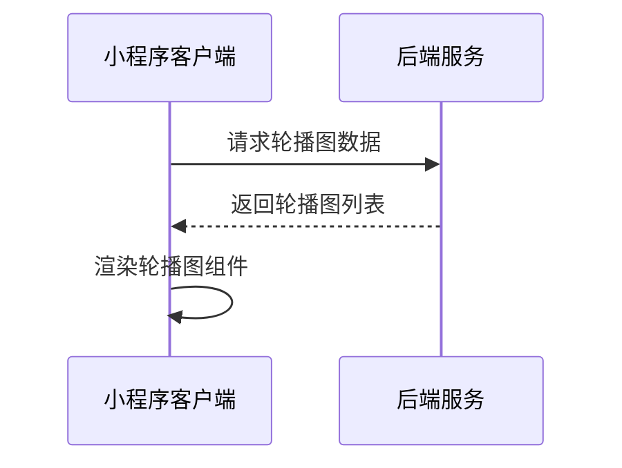
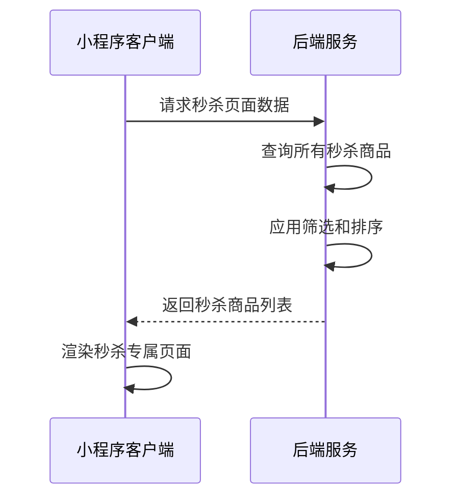

# 商城页面接口文档（已对齐index.js字段，含详细注释）

**状态：✅ API集成已完成**

## API集成说明

商城页面(`/pages/mall/index.js`)已完成静态数据向真实API的转换，主要变更包括：

1. **引入mallApi模块**：`const mallApi = require('../../api/mallApi');`
2. **数据初始化**：所有静态数据改为空数组`[]`，通过API动态获取
3. **错误处理**：每个API调用都包含错误处理和用户友好的错误提示
4. **字段映射**：严格按照接口文档的字段名进行数据处理

### 已集成的API接口：

- ✅ 获取轮播图数据：`loadBannerList()` → `/api/mall/banners`
- ✅ 获取秒杀商品：`loadSeckillProducts()` → `/api/mall/seckill`  
- ✅ 获取商品分组：`loadProductGroups()` → `/api/mall/product-groups`
- ✅ 获取购物车数量：`getCartCount()` → `/api/mall/cart/count`
- ✅ 商品搜索：`quickSearchProducts()` → `/api/mall/search`

### 错误处理策略：

- **加载错误**：显示友好提示，设置空数据避免页面崩溃
- **购物车错误**：使用本地存储作为备用，不影响主要功能
- **搜索错误**：静默处理，不中断用户操作流程

---

## 获取轮播图数据

**接口名称：** 获取商城首页轮播图数据
**功能描述：** 获取商城首页轮播图的图片、跳转链接等信息，用于首页banner展示
**接口地址：** /api/mall/banners
**请求方式：** GET

### 功能说明
获取商城首页轮播图数据，支持不同类型的跳转目标（活动详情页、商品详情页等），用于首页顶部轮播展示。每个banner包含图片、跳转链接等信息。



### 请求参数
无需传入参数

### 响应参数
```json
{
  "error": 0,
  "body": {
    "bannerList": [
      {
        "id": 1, // 轮播图唯一ID
        "imageUrl": "/assets/images/banner1.jpg", // 轮播图图片URL
        "link": "/pages/activityDetail/index?id=1" // 跳转链接
      }
    ]
  },
  "message": "获取轮播图数据成功",
  "success": true
}
```

| 参数名 | 类型 | 必填 | 说明 | 示例值 |
|----|---|-----|---|-----|
| error | int | 是 | 错误码，0表示成功 | 0 |
| body | object | 是 | 响应数据 |  |
| body.bannerList | array | 是 | 轮播图列表 |  |
| body.bannerList[].id | int | 是 | 轮播图唯一ID | 1 |
| body.bannerList[].imageUrl | string | 是 | 轮播图图片URL | /assets/images/banner1.jpg |
| body.bannerList[].link | string | 是 | 跳转链接 | /pages/activityDetail/index?id=1 |
| message | string | 是 | 响应消息 | 获取轮播图数据成功 |
| success | bool | 是 | 是否成功 | true |

**注释：**
- 轮播图主键为id，所有字段与index.js完全一致。
- 只保留JS实际用到的字段。
- 每个字段后均有注释，便于理解。

---

## 获取限时秒杀商品

**接口名称：** 获取限时秒杀商品列表
**功能描述：** 获取当前正在进行的限时秒杀商品，包含秒杀价格、倒计时等信息
**接口地址：** /api/mall/seckill
**请求方式：** GET

### 功能说明
获取当前时间段正在进行秒杀的商品列表，包含原价、秒杀价等信息。系统会自动判断秒杀状态，只返回正在进行中的秒杀商品。

### 响应参数
```json
{
  "error": 0,
  "body": {
    "seckillProducts": [
      {
        "id": 1, // 商品唯一ID
        "title": "YONEX尤尼克斯羽毛球拍", // 商品标题
        "imageUrl": "/assets/images/racket1.jpg", // 商品主图URL
        "originalPrice": 899, // 商品原价
        "seckillPrice": 599 // 秒杀价格
      }
    ]
  },
  "message": "获取秒杀商品成功",
  "success": true
}
```

| 参数名 | 类型 | 必填 | 说明 | 示例值 |
|----|---|-----|---|-----|
| error | int | 是 | 错误码，0表示成功 | 0 |
| body | object | 是 | 响应数据 |  |
| body.seckillProducts | array | 是 | 秒杀商品列表 |  |
| body.seckillProducts[].id | int | 是 | 商品唯一ID | 1 |
| body.seckillProducts[].title | string | 是 | 商品标题 | YONEX尤尼克斯羽毛球拍 |
| body.seckillProducts[].imageUrl | string | 是 | 商品主图URL | /assets/images/racket1.jpg |
| body.seckillProducts[].originalPrice | number | 是 | 商品原价 | 899 |
| body.seckillProducts[].seckillPrice | number | 是 | 秒杀价格 | 599 |
| message | string | 是 | 响应消息 | 获取秒杀商品成功 |
| success | bool | 是 | 是否成功 | true |

**注释：**
- 秒杀商品主键为id，所有字段与index.js完全一致。
- 只保留JS实际用到的字段。
- 每个字段后均有注释，便于理解。

---

## 获取商品分组数据

**接口名称：** 获取商城首页商品分组数据
**功能描述：** 获取商城首页的商品分组，包含羽毛球拍、羽毛球鞋、运动必备等分类商品
**接口地址：** /api/mall/product-groups
**请求方式：** GET

### 功能说明
获取商城首页展示的商品分组数据，每个分组包含分组名称、描述和该分组下的推荐商品列表。商品按热度和推荐度排序，每个分组最多展示4个商品。

### 响应参数
```json
{
  "error": 0,
  "body": {
    "productGroups": [
      {
        "groupId": "racket", // 分组唯一ID
        "groupName": "羽毛球拍", // 分组名称
        "groupDesc": "专业球拍，助你提升球技", // 分组描述
        "products": [
          {
            "id": 101, // 商品唯一ID
            "name": "YONEX尤尼克斯ARC-11羽毛球拍", // 商品名称
            "imageUrl": "/assets/images/racket1.jpg", // 商品主图URL
            "price": 899, // 当前价格
            "salesCount": 268, // 销量
            "tag": "热销" // 商品标签
          }
        ]
      }
    ]
  },
  "message": "获取商品分组成功",
  "success": true
}
```

| 参数名 | 类型 | 必填 | 说明 | 示例值 |
|----|---|-----|---|-----|
| error | int | 是 | 错误码，0表示成功 | 0 |
| body | object | 是 | 响应数据 |  |
| body.productGroups | array | 是 | 商品分组列表 |  |
| body.productGroups[].groupId | string | 是 | 分组唯一ID | racket |
| body.productGroups[].groupName | string | 是 | 分组名称 | 羽毛球拍 |
| body.productGroups[].groupDesc | string | 是 | 分组描述 | 专业球拍，助你提升球技 |
| body.productGroups[].products | array | 是 | 分组商品列表 |  |
| body.productGroups[].products[].id | int | 是 | 商品唯一ID | 101 |
| body.productGroups[].products[].name | string | 是 | 商品名称 | YONEX尤尼克斯ARC-11羽毛球拍 |
| body.productGroups[].products[].imageUrl | string | 是 | 商品主图URL | /assets/images/racket1.jpg |
| body.productGroups[].products[].price | number | 是 | 当前价格 | 899 |
| body.productGroups[].products[].salesCount | int | 是 | 销量 | 268 |
| body.productGroups[].products[].tag | string | 否 | 商品标签 | 热销 |
| message | string | 是 | 响应消息 | 获取商品分组成功 |
| success | bool | 是 | 是否成功 | true |

**注释：**
- 商品分组主键为groupId，商品主键为id，所有字段与index.js完全一致。
- 只保留JS实际用到的字段。
- 每个字段后均有注释，便于理解。

---

## 获取购物车数量

**接口名称：** 获取用户购物车商品数量
**功能描述：** 获取当前用户购物车中的商品数量，用于购物车角标显示
**接口地址：** /api/mall/cart/count
**请求方式：** GET

### 功能说明
获取当前登录用户购物车中的商品总数量，用于在商城页面右下角的悬浮购物车按钮上显示数量角标。

### 响应参数
```json
{
  "error": 0,
  "body": {
    "cartCount": 3 // 购物车商品数量
  },
  "message": "获取购物车数量成功",
  "success": true
}
```

| 参数名 | 类型 | 必填 | 说明 | 示例值 |
|----|---|-----|---|-----|
| error | int | 是 | 错误码，0表示成功 | 0 |
| body | object | 是 | 响应数据 |  |
| body.cartCount | int | 是 | 购物车商品数量 | 3 |
| message | string | 是 | 响应消息 | 获取购物车数量成功 |
| success | bool | 是 | 是否成功 | true |

**注释：**
- 购物车数量字段为cartCount，所有字段与index.js完全一致。
- 只保留JS实际用到的字段。
- 每个字段后均有注释，便于理解。

---

## 商品快速搜索

**接口名称：** 商城页面快速搜索商品
**功能描述：** 在商城页面进行商品搜索，返回匹配的商品列表
**接口地址：** /api/mall/search
**请求方式：** GET

### 功能说明
在商城页面顶部搜索栏进行商品搜索，支持商品名称、品牌、分类等多字段模糊匹配。搜索结果按相关度排序，支持分页加载。

### 请求参数
```json
{
  "keyword": "羽毛球拍"
}
```

| 参数名 | 类型 | 必填 | 说明 | 示例值 |
|----|---|-----|---|-----|
| keyword | string | 是 | 搜索关键词 | 羽毛球拍 |

### 响应参数
```json
{
  "error": 0,
  "body": {
    "products": [
      {
        "id": 101, // 商品唯一ID
        "name": "YONEX尤尼克斯ARC-11羽毛球拍", // 商品名称
        "imageUrl": "/assets/images/racket1.jpg", // 商品主图URL
        "price": 899, // 当前价格
        "salesCount": 268 // 销量
      }
    ]
  },
  "message": "搜索商品成功",
  "success": true
}
```

| 参数名 | 类型 | 必填 | 说明 | 示例值 |
|----|---|-----|---|-----|
| error | int | 是 | 错误码，0表示成功 | 0 |
| body | object | 是 | 响应数据 |  |
| body.products | array | 是 | 搜索结果商品列表 |  |
| body.products[].id | int | 是 | 商品唯一ID | 101 |
| body.products[].name | string | 是 | 商品名称 | YONEX尤尼克斯ARC-11羽毛球拍 |
| body.products[].imageUrl | string | 是 | 商品主图URL | /assets/images/racket1.jpg |
| body.products[].price | number | 是 | 当前价格 | 899 |
| body.products[].salesCount | int | 是 | 销量 | 268 |
| message | string | 是 | 响应消息 | 搜索商品成功 |
| success | bool | 是 | 是否成功 | true |

**注释：**
- 搜索结果商品主键为id，所有字段与index.js完全一致。
- 只保留JS实际用到的字段。
- 每个字段后均有注释，便于理解。

---

## 获取秒杀页面数据

**接口名称：** 获取秒杀专属页面数据
**功能描述：** 获取秒杀专属页面的完整商品列表，支持品牌筛选和排序
**接口地址：** /api/mall/seckill/page
**请求方式：** GET

### 功能说明
获取秒杀专属页面的数据，包含所有秒杀商品（不仅限于首页展示的几个），支持品牌筛选、价格排序等功能。用户点击商城首页"更多"按钮时跳转到此页面。



### 请求参数
```json
{
  "page": 1,
  "pageSize": 20,
  "brand": "",
  "sortBy": "price_asc"
}
```

| 参数名 | 类型 | 必填 | 说明 | 示例值 |
|----|---|-----|---|-----|
| page | int | 否 | 页码（默认1） | 1 |
| pageSize | int | 否 | 每页数量（默认20） | 20 |
| brand | string | 否 | 品牌筛选 | YONEX |
| sortBy | string | 否 | 排序方式 | price_asc |

**sortBy参数说明：**
- `price_asc`：价格从低到高
- `price_desc`：价格从高到低
- `sales_desc`：销量从高到低
- `discount_desc`：折扣从大到小

### 响应参数
```json
{
  "error": 0,
  "body": {
    "seckillInfo": {
      "currentSessionName": "12点档",
      "endTime": "2024-12-18T16:00:00Z",
      "remainingSeconds": 14196
    },
    "products": [
      {
        "productId": "product_101",
        "title": "YONEX尤尼克斯羽毛球拍",
        "imageUrl": "https://images.unsplash.com/photo-1551698618-1dfe5d97d256?w=400",
        "originalPrice": 899,
        "seckillPrice": 599,
        "discountPercent": 33,
        "brand": "YONEX",
        "salesCount": 268,
        "stock": 50,
        "maxBuyCount": 2
      }
    ],
    "brands": [
      {
        "brandName": "YONEX",
        "productCount": 12
      }
    ],
    "pagination": {
      "page": 1,
      "pageSize": 20,
      "total": 45,
      "totalPages": 3,
      "hasMore": true
    }
  },
  "message": "获取秒杀页面数据成功",
  "success": true
}
```

| 参数名 | 类型 | 必填 | 说明 | 示例值 |
|----|---|-----|---|-----|
| error | int | 是 | 错误码，0表示成功 | 0 |
| body | object | 是 | 响应数据 | |
| body.seckillInfo | object | 是 | 秒杀场次信息 | |
| body.seckillInfo.currentSessionName | string | 是 | 当前场次名称 | 12点档 |
| body.seckillInfo.endTime | string | 是 | 秒杀结束时间 | 2024-12-18T16:00:00Z |
| body.seckillInfo.remainingSeconds | int | 是 | 剩余秒数 | 14196 |
| body.products | array | 是 | 秒杀商品列表 | |
| body.products[].productId | string | 是 | 商品唯一ID | product_101 |
| body.products[].title | string | 是 | 商品标题 | YONEX尤尼克斯羽毛球拍 |
| body.products[].imageUrl | string | 是 | 商品主图URL | https://images.unsplash.com/photo-1551698618-1dfe5d97d256?w=400 |
| body.products[].originalPrice | number | 是 | 商品原价 | 899 |
| body.products[].seckillPrice | number | 是 | 秒杀价格 | 599 |
| body.products[].discountPercent | int | 是 | 折扣百分比 | 33 |
| body.products[].brand | string | 是 | 商品品牌 | YONEX |
| body.products[].salesCount | int | 是 | 已售数量 | 268 |
| body.products[].stock | int | 是 | 剩余库存 | 50 |
| body.products[].maxBuyCount | int | 是 | 单次最大购买数量 | 2 |
| body.brands | array | 是 | 可筛选品牌列表 | |
| body.brands[].brandName | string | 是 | 品牌名称 | YONEX |
| body.brands[].productCount | int | 是 | 该品牌商品数量 | 12 |
| body.pagination | object | 是 | 分页信息 | |
| body.pagination.page | int | 是 | 当前页码 | 1 |
| body.pagination.pageSize | int | 是 | 每页数量 | 20 |
| body.pagination.total | int | 是 | 总记录数 | 45 |
| body.pagination.totalPages | int | 是 | 总页数 | 3 |
| body.pagination.hasMore | bool | 是 | 是否有更多数据 | true |
| message | string | 是 | 响应消息 | 获取秒杀页面数据成功 |
| success | bool | 是 | 是否成功 | true |
``` 