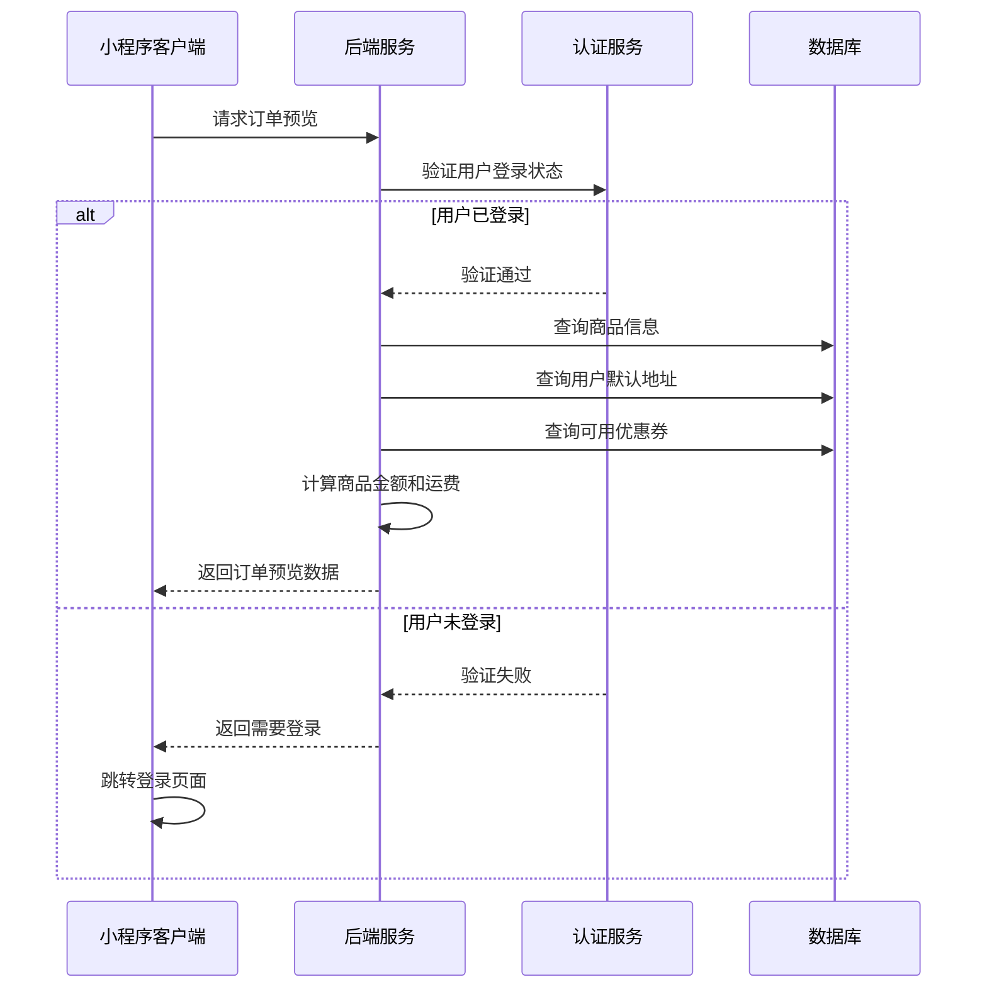
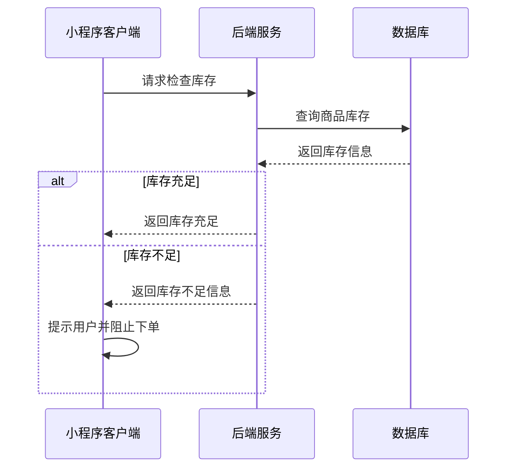
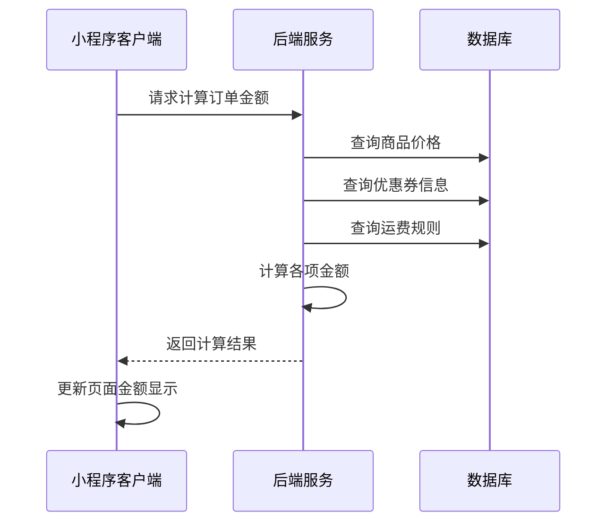
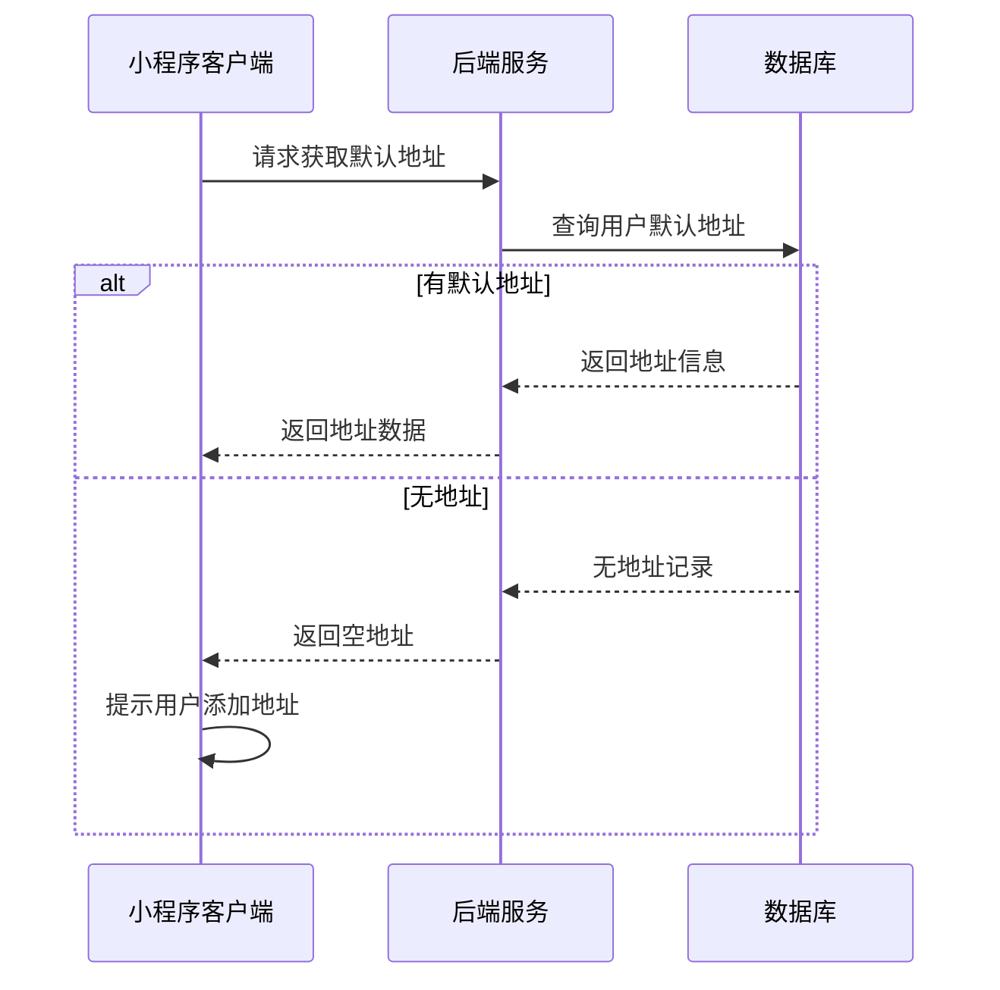
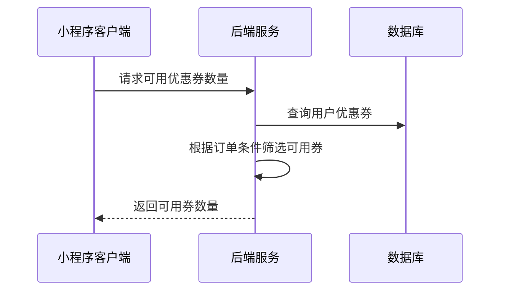
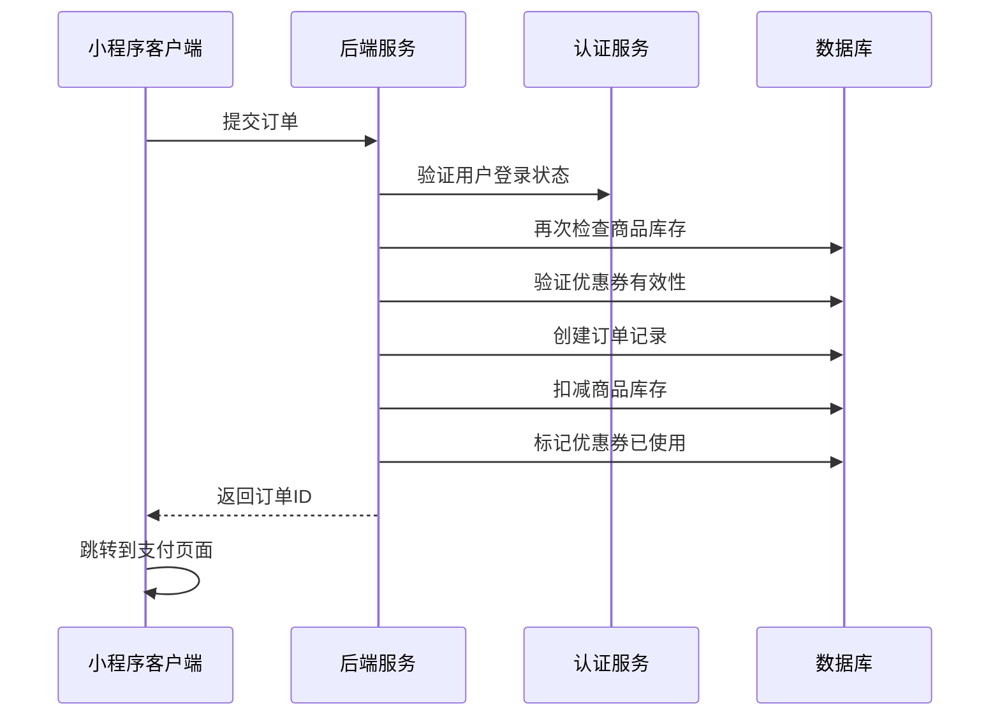

# 订单确认页面接口文档

## 获取订单预览信息

**接口名称：** 获取订单预览信息
**功能描述：** 获取订单确认页面所需的商品信息、地址信息、优惠券等数据
**接口地址：** /api/orders/preview
**请求方式：** POST

### 功能说明
用户从购物车结算或商品详情页"立即购买"进入订单确认页时，获取订单预览信息。包含商品详情、默认收货地址、可用优惠券数量、运费计算等。**此接口需要用户登录状态。**



### 请求参数
```json
{
  "goods": [
    {
      "goodsId": "goods_001",
      "quantity": 1,
      "specInfo": {
        "颜色": "蓝色",
        "尺码": "L"
      }
    }
  ],
  "source": "cart"
}
```

| 参数名 | 类型 | 必填 | 说明 | 示例值 |
|----|---|-----|---|-----|
| goods | array | 是 | 商品列表 | |
| goods[].goodsId | string | 是 | 商品ID | goods_001 |
| goods[].quantity | int | 是 | 购买数量 | 1 |
| goods[].specInfo | object | 否 | 规格信息 | {"颜色": "蓝色"} |
| source | string | 是 | 来源（cart购物车/detail商品详情） | cart |

### 响应参数
```json
{
  "error": 0,
  "body": {
    "orderPreview": {
      "goods": [
        {
          "goodsId": "goods_001",
          "name": "NCS#75速【多啦A梦黄】【3只装】",
          "image": "https://example.com/goods.jpg",
          "spec": "黄色 3只装",
          "price": 15.00,
          "quantity": 1,
          "subtotal": 15.00
        }
      ],
      "address": {
        "addressId": "addr_001",
        "name": "张三",
        "phone": "138****5678",
        "address": "广东省深圳市南山区科技园南区"
      },
      "availableCoupons": 3,
      "amounts": {
        "goodsAmount": 15.00,
        "shippingFee": 0.00,
        "discountAmount": 0.00,
        "finalAmount": 15.00
      }
    }
  },
  "message": "获取订单预览成功",
  "success": true
}
```

| 参数名 | 类型 | 必填 | 说明 | 示例值 |
|----|---|-----|---|-----|
| error | int | 是 | 错误码，0成功/401未登录 | 0 |
| body | object | 是 | 响应数据 | |
| body.orderPreview | object | 是 | 订单预览信息 | |
| body.orderPreview.goods | array | 是 | 商品列表 | |
| body.orderPreview.goods[].goodsId | string | 是 | 商品ID | goods_001 |
| body.orderPreview.goods[].name | string | 是 | 商品名称 | NCS#75速【多啦A梦黄】 |
| body.orderPreview.goods[].image | string | 是 | 商品图片 | https://example.com/goods.jpg |
| body.orderPreview.goods[].spec | string | 否 | 规格描述 | 黄色 3只装 |
| body.orderPreview.goods[].price | number | 是 | 单价 | 15.00 |
| body.orderPreview.goods[].quantity | int | 是 | 数量 | 1 |
| body.orderPreview.goods[].subtotal | number | 是 | 小计 | 15.00 |
| body.orderPreview.address | object | 否 | 默认收货地址 | |
| body.orderPreview.address.addressId | string | 是 | 地址ID | addr_001 |
| body.orderPreview.address.name | string | 是 | 收件人姓名 | 张三 |
| body.orderPreview.address.phone | string | 是 | 联系电话 | 138****5678 |
| body.orderPreview.address.address | string | 是 | 完整地址 | 广东省深圳市南山区科技园南区 |
| body.orderPreview.availableCoupons | int | 是 | 可用优惠券数量 | 3 |
| body.orderPreview.amounts | object | 是 | 金额信息 | |
| body.orderPreview.amounts.goodsAmount | number | 是 | 商品总金额 | 15.00 |
| body.orderPreview.amounts.shippingFee | number | 是 | 运费 | 0.00 |
| body.orderPreview.amounts.discountAmount | number | 是 | 优惠金额 | 0.00 |
| body.orderPreview.amounts.finalAmount | number | 是 | 最终应付金额 | 15.00 |
| message | string | 是 | 响应消息 | 获取订单预览成功 |
| success | bool | 是 | 是否成功 | true |

---

## 检查商品库存

**接口名称：** 检查商品库存
**功能描述：** 验证所选商品的库存是否充足，确保可以正常下单
**接口地址：** /api/goods/check-stock
**请求方式：** POST

### 功能说明
在订单确认页面加载时检查所有商品的库存状态，防止下单时出现库存不足的情况。如果库存不足，需要提示用户并阻止下单。



### 请求参数
```json
{
  "goods": [
    {
      "goodsId": "goods_001",
      "quantity": 1,
      "specInfo": {
        "颜色": "蓝色"
      }
    }
  ]
}
```

| 参数名 | 类型 | 必填 | 说明 | 示例值 |
|----|---|-----|---|-----|
| goods | array | 是 | 需要检查的商品列表 | |
| goods[].goodsId | string | 是 | 商品ID | goods_001 |
| goods[].quantity | int | 是 | 购买数量 | 1 |
| goods[].specInfo | object | 否 | 规格信息 | {"颜色": "蓝色"} |

### 响应参数
```json
{
  "error": 0,
  "body": {
    "stockCheck": {
      "allInStock": true,
      "details": [
        {
          "goodsId": "goods_001",
          "inStock": true,
          "availableStock": 50,
          "requestedQuantity": 1
        }
      ]
    }
  },
  "message": "库存检查完成",
  "success": true
}
```

| 参数名 | 类型 | 必填 | 说明 | 示例值 |
|----|---|-----|---|-----|
| error | int | 是 | 错误码，0表示成功 | 0 |
| body | object | 是 | 响应数据 | |
| body.stockCheck | object | 是 | 库存检查结果 | |
| body.stockCheck.allInStock | bool | 是 | 是否全部有库存 | true |
| body.stockCheck.details | array | 是 | 各商品库存详情 | |
| body.stockCheck.details[].goodsId | string | 是 | 商品ID | goods_001 |
| body.stockCheck.details[].inStock | bool | 是 | 是否有库存 | true |
| body.stockCheck.details[].availableStock | int | 是 | 可用库存数量 | 50 |
| body.stockCheck.details[].requestedQuantity | int | 是 | 请求数量 | 1 |
| message | string | 是 | 响应消息 | 库存检查完成 |
| success | bool | 是 | 是否成功 | true |

---

## 计算订单金额

**接口名称：** 计算订单金额
**功能描述：** 根据商品、地址、优惠券等信息重新计算订单总金额
**接口地址：** /api/orders/calculate-amount
**请求方式：** POST

### 功能说明
用户在订单确认页面选择优惠券或修改商品数量后，重新计算订单的各项金额，包括商品金额、运费、优惠金额和最终应付金额。



### 请求参数
```json
{
  "goods": [
    {
      "goodsId": "goods_001",
      "quantity": 1,
      "price": 15.00
    }
  ],
  "addressId": "addr_001",
  "couponId": "coupon_001"
}
```

| 参数名 | 类型 | 必填 | 说明 | 示例值 |
|----|---|-----|---|-----|
| goods | array | 是 | 商品列表 | |
| goods[].goodsId | string | 是 | 商品ID | goods_001 |
| goods[].quantity | int | 是 | 数量 | 1 |
| goods[].price | number | 是 | 单价 | 15.00 |
| addressId | string | 否 | 收货地址ID（用于计算运费） | addr_001 |
| couponId | string | 否 | 优惠券ID | coupon_001 |

### 响应参数
```json
{
  "error": 0,
  "body": {
    "amounts": {
      "goodsAmount": 15.00,
      "shippingFee": 0.00,
      "discountAmount": 5.00,
      "finalAmount": 10.00
    },
    "couponInfo": {
      "couponId": "coupon_001",
      "name": "满10元减5元",
      "discount": 5.00
    }
  },
  "message": "金额计算成功",
  "success": true
}
```

| 参数名 | 类型 | 必填 | 说明 | 示例值 |
|----|---|-----|---|-----|
| error | int | 是 | 错误码，0表示成功 | 0 |
| body | object | 是 | 响应数据 | |
| body.amounts | object | 是 | 金额信息 | |
| body.amounts.goodsAmount | number | 是 | 商品总金额 | 15.00 |
| body.amounts.shippingFee | number | 是 | 运费 | 0.00 |
| body.amounts.discountAmount | number | 是 | 优惠金额 | 5.00 |
| body.amounts.finalAmount | number | 是 | 最终应付金额 | 10.00 |
| body.couponInfo | object | 否 | 优惠券信息（使用优惠券时返回） | |
| body.couponInfo.couponId | string | 是 | 优惠券ID | coupon_001 |
| body.couponInfo.name | string | 是 | 优惠券名称 | 满10元减5元 |
| body.couponInfo.discount | number | 是 | 优惠金额 | 5.00 |
| message | string | 是 | 响应消息 | 金额计算成功 |
| success | bool | 是 | 是否成功 | true |

---

## 获取用户收货地址

**接口名称：** 获取用户收货地址
**功能描述：** 获取用户的默认收货地址信息
**接口地址：** /api/user/address/default
**请求方式：** GET

### 功能说明
在订单确认页面显示用户的默认收货地址。如果用户还没有设置地址，返回空数据，前端提示用户添加地址。**此接口需要用户登录状态。**



### 请求参数
无需传入参数（需要用户登录态）

### 响应参数
```json
{
  "error": 0,
  "body": {
    "address": {
      "addressId": "addr_001",
      "name": "张三",
      "phone": "13800138000",
      "region": "广东省 深圳市 南山区",
      "detailAddress": "科技园南区深圳软件园",
      "address": "广东省深圳市南山区科技园南区深圳软件园",
      "isDefault": true
    }
  },
  "message": "获取地址成功",
  "success": true
}
```

| 参数名 | 类型 | 必填 | 说明 | 示例值 |
|----|---|-----|---|-----|
| error | int | 是 | 错误码，0成功/401未登录 | 0 |
| body | object | 是 | 响应数据 | |
| body.address | object | 否 | 默认地址信息（无地址时为null） | |
| body.address.addressId | string | 是 | 地址ID | addr_001 |
| body.address.name | string | 是 | 收件人姓名 | 张三 |
| body.address.phone | string | 是 | 联系电话 | 13800138000 |
| body.address.region | string | 是 | 省市区 | 广东省 深圳市 南山区 |
| body.address.detailAddress | string | 是 | 详细地址 | 科技园南区深圳软件园 |
| body.address.address | string | 是 | 完整地址 | 广东省深圳市南山区科技园南区深圳软件园 |
| body.address.isDefault | bool | 是 | 是否默认地址 | true |
| message | string | 是 | 响应消息 | 获取地址成功 |
| success | bool | 是 | 是否成功 | true |

---

## 获取可用优惠券数量

**接口名称：** 获取可用优惠券数量
**功能描述：** 获取当前订单可使用的优惠券数量
**接口地址：** /api/user/coupons/available
**请求方式：** GET

### 功能说明
根据当前订单的商品和金额，查询用户可以使用的优惠券数量，用于在订单确认页面显示可用优惠券数量。**此接口需要用户登录状态。**



### 请求参数
```json
{
  "orderAmount": 15.00,
  "goodsIds": ["goods_001"]
}
```

| 参数名 | 类型 | 必填 | 说明 | 示例值 |
|----|---|-----|---|-----|
| orderAmount | number | 是 | 订单商品总金额 | 15.00 |
| goodsIds | array | 是 | 商品ID列表 | ["goods_001"] |

### 响应参数
```json
{
  "error": 0,
  "body": {
    "availableCount": 3,
    "totalSavings": 25.00
  },
  "message": "获取优惠券数量成功",
  "success": true
}
```

| 参数名 | 类型 | 必填 | 说明 | 示例值 |
|----|---|-----|---|-----|
| error | int | 是 | 错误码，0成功/401未登录 | 0 |
| body | object | 是 | 响应数据 | |
| body.availableCount | int | 是 | 可用优惠券数量 | 3 |
| body.totalSavings | number | 是 | 最大可节省金额 | 25.00 |
| message | string | 是 | 响应消息 | 获取优惠券数量成功 |
| success | bool | 是 | 是否成功 | true |

---

## 提交订单

**接口名称：** 提交订单
**功能描述：** 提交订单信息，创建新订单并返回订单ID用于支付
**接口地址：** /api/orders/create
**请求方式：** POST

### 功能说明
用户在订单确认页面填写完所有信息后，提交订单创建新的订单记录。需要验证库存、优惠券有效性等，成功后返回订单ID供支付使用。**此接口需要用户登录状态。**



### 请求参数
```json
{
  "goods": [
    {
      "goodsId": "goods_001",
      "quantity": 1,
      "price": 15.00,
      "specInfo": {
        "颜色": "黄色",
        "规格": "3只装"
      }
    }
  ],
  "address": {
    "addressId": "addr_001",
    "name": "张三",
    "phone": "13800138000",
    "address": "广东省深圳市南山区科技园南区深圳软件园"
  },
  "couponId": "coupon_001",
  "remark": "请小心包装",
  "amounts": {
    "goodsAmount": 15.00,
    "shippingFee": 0.00,
    "discountAmount": 5.00,
    "finalAmount": 10.00
  }
}
```

| 参数名 | 类型 | 必填 | 说明 | 示例值 |
|----|---|-----|---|-----|
| goods | array | 是 | 订单商品列表 | |
| goods[].goodsId | string | 是 | 商品ID | goods_001 |
| goods[].quantity | int | 是 | 购买数量 | 1 |
| goods[].price | number | 是 | 单价 | 15.00 |
| goods[].specInfo | object | 否 | 规格信息 | {"颜色": "黄色"} |
| address | object | 是 | 收货地址信息 | |
| address.addressId | string | 是 | 地址ID | addr_001 |
| address.name | string | 是 | 收件人姓名 | 张三 |
| address.phone | string | 是 | 联系电话 | 13800138000 |
| address.address | string | 是 | 完整地址 | 广东省深圳市南山区科技园南区深圳软件园 |
| couponId | string | 否 | 使用的优惠券ID | coupon_001 |
| remark | string | 否 | 订单备注 | 请小心包装 |
| amounts | object | 是 | 金额信息 | |
| amounts.goodsAmount | number | 是 | 商品总金额 | 15.00 |
| amounts.shippingFee | number | 是 | 运费 | 0.00 |
| amounts.discountAmount | number | 是 | 优惠金额 | 5.00 |
| amounts.finalAmount | number | 是 | 最终应付金额 | 10.00 |

### 响应参数
```json
{
  "error": 0,
  "body": {
    "order": {
      "orderId": "order_20241215001",
      "orderNo": "ORD202412150001",
      "status": "pending_payment",
      "totalAmount": 10.00,
      "createTime": "2024-12-15 14:30:00",
      "payDeadline": "2024-12-15 16:30:00"
    }
  },
  "message": "订单创建成功",
  "success": true
}
```

| 参数名 | 类型 | 必填 | 说明 | 示例值 |
|----|---|-----|---|-----|
| error | int | 是 | 错误码，0成功/401未登录/400参数错误 | 0 |
| body | object | 是 | 响应数据 | |
| body.order | object | 是 | 订单信息 | |
| body.order.orderId | string | 是 | 订单ID | order_20241215001 |
| body.order.orderNo | string | 是 | 订单号 | ORD202412150001 |
| body.order.status | string | 是 | 订单状态 | pending_payment |
| body.order.totalAmount | number | 是 | 订单总金额 | 10.00 |
| body.order.createTime | string | 是 | 创建时间 | 2024-12-15 14:30:00 |
| body.order.payDeadline | string | 是 | 支付截止时间 | 2024-12-15 16:30:00 |
| message | string | 是 | 响应消息 | 订单创建成功 |
| success | bool | 是 | 是否成功 | true |
</rewritten_file> 