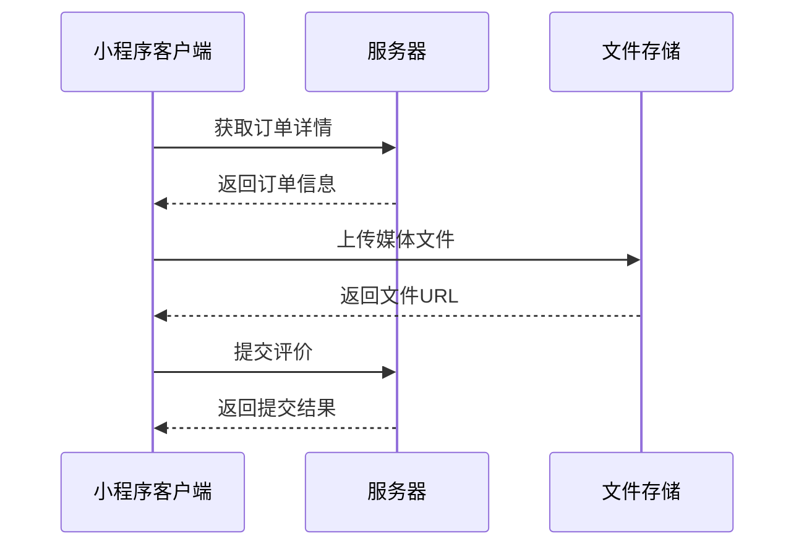

# 订单评价页面API接口文档

## 接口名称

**接口名称：** 订单评价相关接口
**功能描述：** 提供订单评价功能相关的API接口，包括获取订单详情、上传媒体文件、提交评价等
**接口地址：** /api/evaluation/*
**请求方式：** GET/POST

## 功能说明

订单评价页面主要功能包括：
1. 获取待评价订单的详细信息
2. 上传评价相关的图片和视频文件
3. 提交商品评价（包含星级、文字内容、标签、媒体文件等）



## 1. 获取订单详情

### 功能说明
获取待评价订单的详细信息，包括订单商品信息、规格、价格等

### 请求参数
```json
{
  "orderId": "123456789"
}
```

| 参数名 | 类型 | 必填 | 说明 | 示例值 |
|----|---|-----|---|-----|
| orderId | string | 是 | 订单ID | 123456789 |

### 响应参数
```json
{
  "error": 0,
  "body": {
    "id": "123456789",
    "orderNo": "ORD20231201001",
    "status": "completed",
    "createTime": "2023-12-01T10:00:00Z",
    "goods": [
      {
        "id": 1,
        "title": "李宁N72三代羽毛球拍全碳素超轻进攻型单拍",
        "image": "https://img.alicdn.com/imgextra/i1/2200756107659/O1CN01YXz5Tl1H8QBqKJPYu_!!2200756107659.jpg",
        "spec": "颜色:炫酷黑 重量:4U",
        "price": 299.00,
        "quantity": 1,
        "category": "sports"
      }
    ],
    "totalAmount": 299.00,
    "canEvaluate": true,
    "evaluateDeadline": "2023-12-31T23:59:59Z"
  },
  "message": "获取订单详情成功",
  "success": true
}
```

| 参数名 | 类型 | 必填 | 说明 | 示例值 |
|----|---|-----|---|-----|
| error | int | 是 | 错误码 | 0 |
| body | object | 是 | 响应数据 | |
| body.id | string | 是 | 订单ID | 123456789 |
| body.orderNo | string | 是 | 订单编号 | ORD20231201001 |
| body.status | string | 是 | 订单状态 | completed |
| body.createTime | string | 是 | 订单创建时间 | 2023-12-01T10:00:00Z |
| body.goods | array | 是 | 商品列表 | |
| body.goods[0].id | int | 是 | 商品ID | 1 |
| body.goods[0].title | string | 是 | 商品标题 | 李宁N72三代羽毛球拍全碳素超轻进攻型单拍 |
| body.goods[0].image | string | 是 | 商品图片URL | https://img.alicdn.com/... |
| body.goods[0].spec | string | 是 | 商品规格 | 颜色:炫酷黑 重量:4U |
| body.goods[0].price | float | 是 | 商品价格 | 299.00 |
| body.goods[0].quantity | int | 是 | 购买数量 | 1 |
| body.goods[0].category | string | 是 | 商品分类 | sports |
| body.totalAmount | float | 是 | 订单总金额 | 299.00 |
| body.canEvaluate | bool | 是 | 是否可以评价 | true |
| body.evaluateDeadline | string | 是 | 评价截止时间 | 2023-12-31T23:59:59Z |
| message | string | 是 | 响应消息 | 获取订单详情成功 |
| success | bool | 是 | 是否成功 | true |

## 2. 上传媒体文件

### 功能说明
上传评价相关的图片或视频文件，支持多文件同时上传

### 请求参数
```json
{
  "type": "image",
  "files": [
    {
      "filePath": "temp_file_path_1",
      "fileName": "image1.jpg",
      "fileSize": 1024000
    }
  ]
}
```

| 参数名 | 类型 | 必填 | 说明 | 示例值 |
|----|---|-----|---|-----|
| type | string | 是 | 文件类型（image/video） | image |
| files | array | 是 | 文件列表 | |
| files[0].filePath | string | 是 | 临时文件路径 | temp_file_path_1 |
| files[0].fileName | string | 是 | 文件名 | image1.jpg |
| files[0].fileSize | int | 是 | 文件大小（字节） | 1024000 |

### 响应参数
```json
{
  "error": 0,
  "body": [
    {
      "type": "image",
      "url": "https://cdn.example.com/uploads/image1.jpg",
      "thumb": "https://cdn.example.com/uploads/thumb_image1.jpg",
      "size": "1.2MB",
      "fileName": "image1.jpg",
      "uploadTime": "2023-12-01T10:30:00Z"
    }
  ],
  "message": "文件上传成功",
  "success": true
}
```

| 参数名 | 类型 | 必填 | 说明 | 示例值 |
|----|---|-----|---|-----|
| error | int | 是 | 错误码 | 0 |
| body | array | 是 | 上传结果列表 | |
| body[0].type | string | 是 | 文件类型 | image |
| body[0].url | string | 是 | 文件访问URL | https://cdn.example.com/uploads/image1.jpg |
| body[0].thumb | string | 是 | 缩略图URL | https://cdn.example.com/uploads/thumb_image1.jpg |
| body[0].size | string | 是 | 文件大小 | 1.2MB |
| body[0].fileName | string | 是 | 文件名 | image1.jpg |
| body[0].uploadTime | string | 是 | 上传时间 | 2023-12-01T10:30:00Z |
| message | string | 是 | 响应消息 | 文件上传成功 |
| success | bool | 是 | 是否成功 | true |

## 3. 获取评价标签

### 功能说明
根据商品类型获取可选的评价标签列表

### 请求参数
```json
{
  "category": "sports",
  "productType": "badminton"
}
```

| 参数名 | 类型 | 必填 | 说明 | 示例值 |
|----|---|-----|---|-----|
| category | string | 否 | 商品分类 | sports |
| productType | string | 否 | 商品类型 | badminton |

### 响应参数
```json
{
  "error": 0,
  "body": {
    "tags": [
      "质量很好",
      "做工精细", 
      "包装完整",
      "发货迅速",
      "手感很好",
      "重量合适",
      "弹性不错",
      "外观漂亮"
    ],
    "maxSelectCount": 5
  },
  "message": "获取评价标签成功",
  "success": true
}
```

| 参数名 | 类型 | 必填 | 说明 | 示例值 |
|----|---|-----|---|-----|
| error | int | 是 | 错误码 | 0 |
| body | object | 是 | 响应数据 | |
| body.tags | array | 是 | 标签列表 | ["质量很好", "做工精细"] |
| body.maxSelectCount | int | 是 | 最大选择数量 | 5 |
| message | string | 是 | 响应消息 | 获取评价标签成功 |
| success | bool | 是 | 是否成功 | true |

## 4. 提交评价

### 功能说明
提交商品评价，包含星级评分、文字内容、标签、媒体文件等信息

### 请求参数
```json
{
  "orderId": "123456789",
  "goodsId": 1,
  "rating": 5,
  "content": "商品质量很好，手感不错，值得推荐！",
  "tags": ["质量很好", "手感很好", "外观漂亮"],
  "mediaUrls": [
    "https://cdn.example.com/uploads/image1.jpg",
    "https://cdn.example.com/uploads/video1.mp4"
  ],
  "isAnonymous": false,
  "isPublic": true
}
```

| 参数名 | 类型 | 必填 | 说明 | 示例值 |
|----|---|-----|---|-----|
| orderId | string | 是 | 订单ID | 123456789 |
| goodsId | int | 是 | 商品ID | 1 |
| rating | int | 是 | 星级评分（1-5） | 5 |
| content | string | 否 | 文字评价内容 | 商品质量很好，手感不错，值得推荐！ |
| tags | array | 否 | 选中的标签列表 | ["质量很好", "手感很好"] |
| mediaUrls | array | 否 | 媒体文件URL列表 | ["https://cdn.example.com/uploads/image1.jpg"] |
| isAnonymous | bool | 否 | 是否匿名评价 | false |
| isPublic | bool | 否 | 是否公开评价 | true |

### 响应参数
```json
{
  "error": 0,
  "body": {
    "evaluationId": "eval_123456789",
    "orderId": "123456789",
    "goodsId": 1,
    "rating": 5,
    "content": "商品质量很好，手感不错，值得推荐！",
    "tags": ["质量很好", "手感很好", "外观漂亮"],
    "mediaUrls": [
      "https://cdn.example.com/uploads/image1.jpg",
      "https://cdn.example.com/uploads/video1.mp4"
    ],
    "isAnonymous": false,
    "isPublic": true,
    "createTime": "2023-12-01T11:00:00Z",
    "rewardPoints": 10
  },
  "message": "评价提交成功",
  "success": true
}
```

| 参数名 | 类型 | 必填 | 说明 | 示例值 |
|----|---|-----|---|-----|
| error | int | 是 | 错误码 | 0 |
| body | object | 是 | 响应数据 | |
| body.evaluationId | string | 是 | 评价ID | eval_123456789 |
| body.orderId | string | 是 | 订单ID | 123456789 |
| body.goodsId | int | 是 | 商品ID | 1 |
| body.rating | int | 是 | 星级评分 | 5 |
| body.content | string | 是 | 文字评价内容 | 商品质量很好，手感不错，值得推荐！ |
| body.tags | array | 是 | 标签列表 | ["质量很好", "手感很好"] |
| body.mediaUrls | array | 是 | 媒体文件URL列表 | ["https://cdn.example.com/uploads/image1.jpg"] |
| body.isAnonymous | bool | 是 | 是否匿名评价 | false |
| body.isPublic | bool | 是 | 是否公开评价 | true |
| body.createTime | string | 是 | 评价创建时间 | 2023-12-01T11:00:00Z |
| body.rewardPoints | int | 是 | 评价奖励积分 | 10 |
| message | string | 是 | 响应消息 | 评价提交成功 |
| success | bool | 是 | 是否成功 | true |

## 5. 删除媒体文件

### 功能说明
删除已上传的媒体文件

### 请求参数
```json
{
  "fileUrl": "https://cdn.example.com/uploads/image1.jpg"
}
```

| 参数名 | 类型 | 必填 | 说明 | 示例值 |
|----|---|-----|---|-----|
| fileUrl | string | 是 | 文件URL | https://cdn.example.com/uploads/image1.jpg |

### 响应参数
```json
{
  "error": 0,
  "body": {
    "deletedUrl": "https://cdn.example.com/uploads/image1.jpg",
    "deleteTime": "2023-12-01T11:30:00Z"
  },
  "message": "文件删除成功",
  "success": true
}
```

| 参数名 | 类型 | 必填 | 说明 | 示例值 |
|----|---|-----|---|-----|
| error | int | 是 | 错误码 | 0 |
| body | object | 是 | 响应数据 | |
| body.deletedUrl | string | 是 | 已删除的文件URL | https://cdn.example.com/uploads/image1.jpg |
| body.deleteTime | string | 是 | 删除时间 | 2023-12-01T11:30:00Z |
| message | string | 是 | 响应消息 | 文件删除成功 |
| success | bool | 是 | 是否成功 | true |

## 错误码说明

| 错误码 | 说明 | 处理建议 |
|----|---|-----|
| 0 | 成功 | 正常处理 |
| 1001 | 参数错误 | 检查请求参数是否完整 |
| 1002 | 订单不存在 | 确认订单ID是否正确 |
| 1003 | 订单状态不允许评价 | 确认订单是否已完成 |
| 1004 | 评价已提交 | 该订单已评价，不能重复提交 |
| 1005 | 文件上传失败 | 检查文件格式和大小 |
| 1006 | 文件格式不支持 | 仅支持jpg、png、mp4格式 |
| 1007 | 文件大小超限 | 图片不超过5MB，视频不超过50MB |
| 1008 | 评价内容违规 | 检查评价内容是否包含敏感词 |
| 1009 | 用户未登录 | 请先登录后再操作 |
| 1010 | 权限不足 | 确认是否有评价权限 |

## 注意事项

1. **文件上传限制**：
   - 图片格式：jpg、png、gif
   - 视频格式：mp4、mov
   - 图片大小：单张不超过5MB
   - 视频大小：单个不超过50MB
   - 视频时长：不超过60秒
   - 总文件数：最多9个文件

2. **评价内容限制**：
   - 文字内容：最多500字符
   - 标签选择：最多5个标签
   - 星级评分：必填，1-5星
   - 评价时间：订单完成后30天内

3. **安全要求**：
   - 所有接口需要用户登录态
   - 文件上传需要验证文件类型和大小
   - 评价内容需要进行敏感词过滤
   - 防止重复提交评价

4. **性能优化**：
   - 图片自动压缩处理
   - 视频自动生成缩略图
   - 支持断点续传
   - 文件上传进度回调 