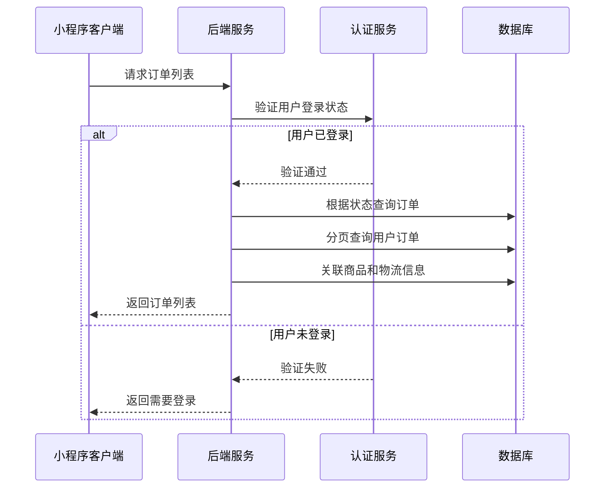
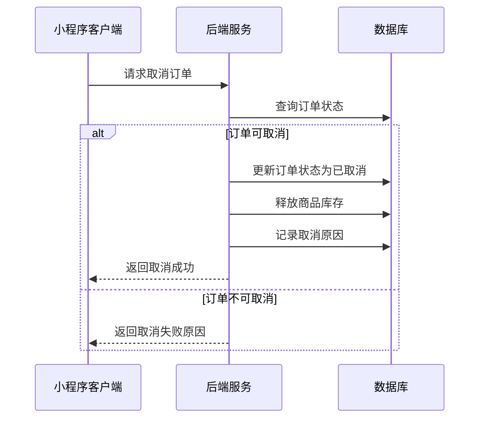
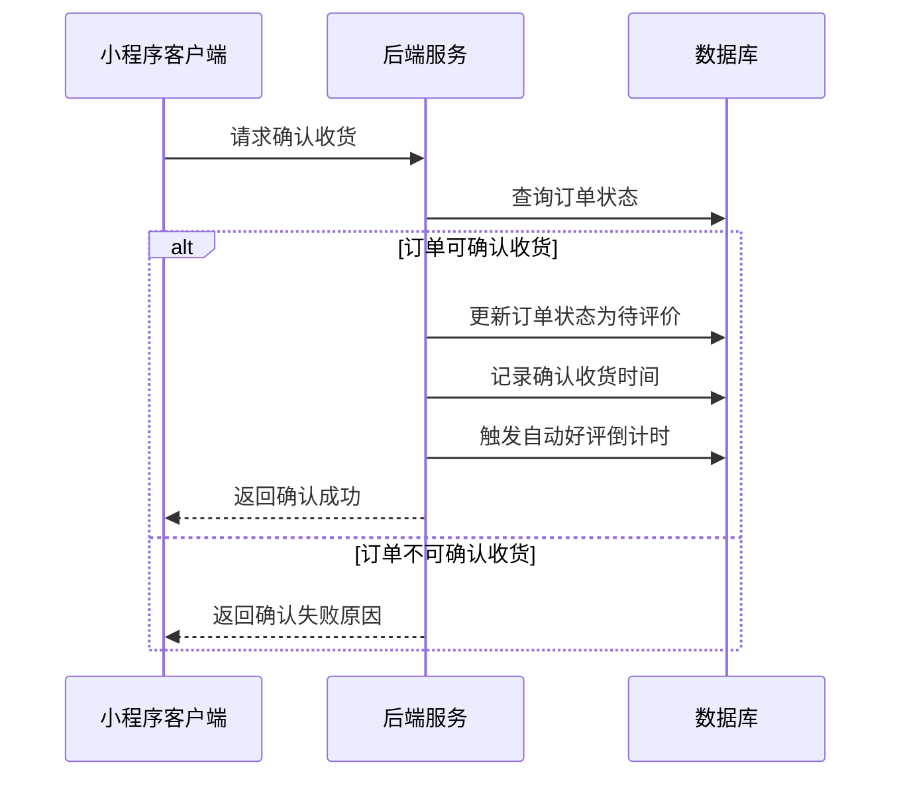
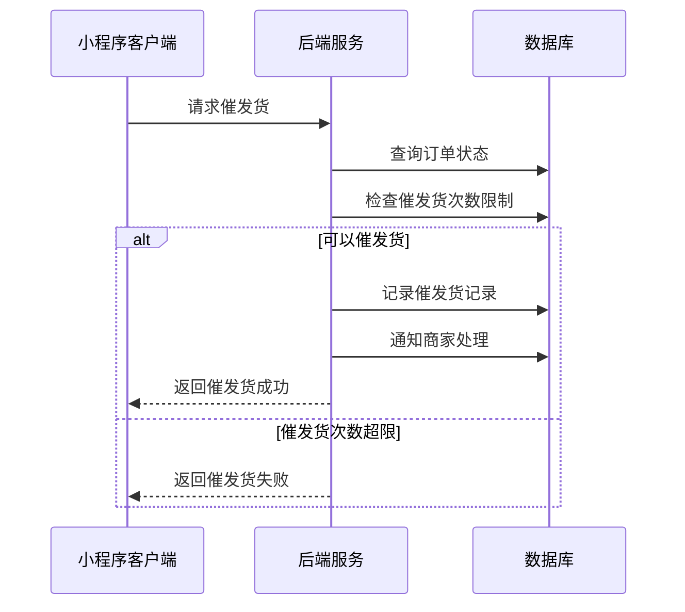
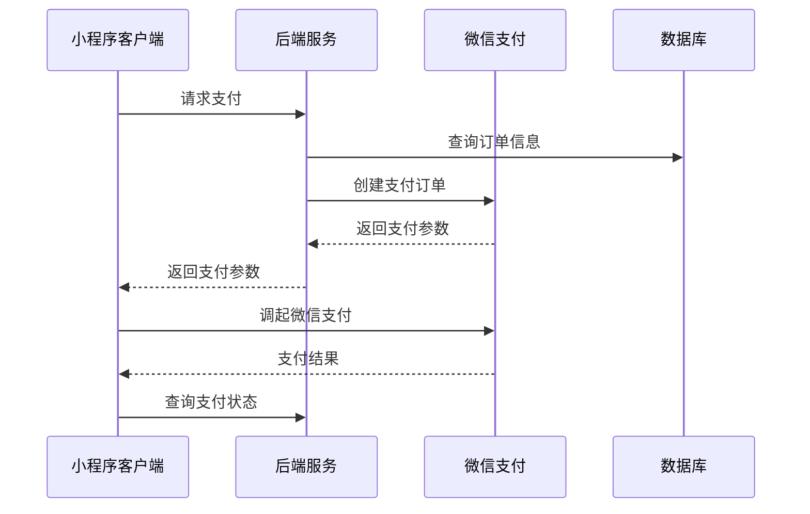
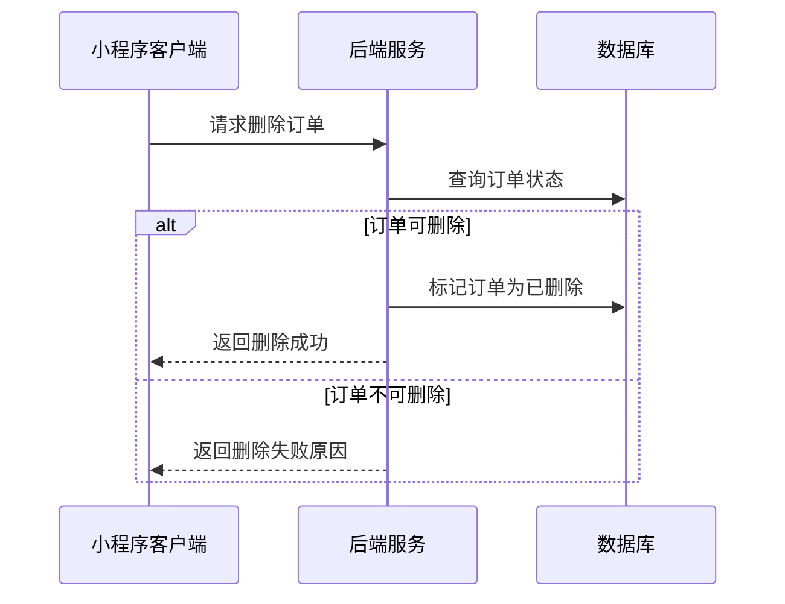
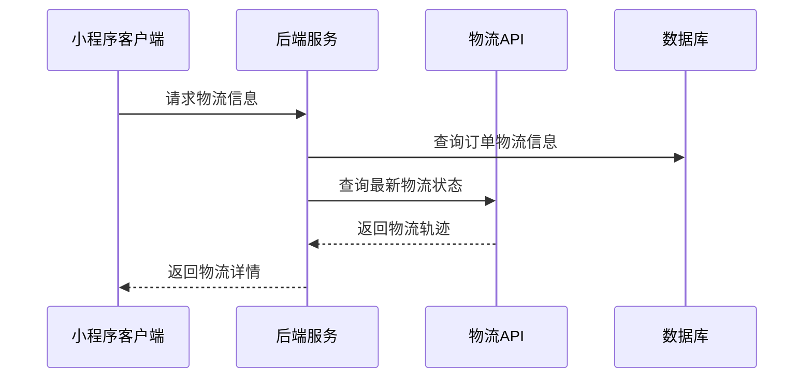

# 订单列表页面接口文档

## 获取订单列表

**接口名称：** 获取订单列表
**功能描述：** 获取用户的订单列表，支持按状态筛选和分页加载
**接口地址：** /api/order/list
**请求方式：** GET

### 功能说明
在订单列表页面显示用户的所有订单，支持按状态筛选（全部、待付款、待发货、待收货、待评价、退款/售后），支持分页加载。**此接口需要用户登录状态。**



### 请求参数
```json
{
  "page": 1,
  "pageSize": 10,
  "status": "unpaid"
}
```

| 参数名 | 类型 | 必填 | 说明 | 示例值 |
|----|---|-----|---|-----|
| page | int | 否 | 页码（默认1） | 1 |
| pageSize | int | 否 | 每页数量（默认10） | 10 |
| status | string | 否 | 订单状态筛选（空为全部/unpaid待付款/shipped待发货/shipping待收货/completed待评价/refunding退款售后） | unpaid |

### 响应参数
```json
{
  "error": 0,
  "body": {
    "orders": {
      "total": 156,
      "list": [
        {
          "id": "ORDER001",
          "createTime": "2024-01-15 14:30:00",
          "status": "unpaid",
          "statusText": "待付款",
          "totalAmount": 486.00,
          "goods": [
            {
              "id": 1,
              "title": "李宁N72三代羽毛球拍全碳素超轻进攻型单拍",
              "image": "https://img.alicdn.com/imgextra/i1/2200756107659/O1CN01YXz5Tl1H8QBqKJPYu_!!2200756107659.jpg",
              "spec": "颜色:炫酷黑 重量:4U",
              "price": 299.00,
              "quantity": 1
            }
          ],
          "logistics": {
            "company": "圆通快递",
            "trackingNo": "YT9876543210",
            "status": "运输中"
          },
          "paymentExpireTime": "2024-01-15 16:30:00",
          "canCancel": true,
          "canConfirmReceive": false,
          "canEvaluate": false,
          "canDelete": false
        }
      ]
    },
    "pagination": {
      "page": 1,
      "pageSize": 10,
      "total": 156,
      "totalPages": 16,
      "hasMore": true
    }
  },
  "message": "获取订单列表成功",
  "success": true
}
```

| 参数名 | 类型 | 必填 | 说明 | 示例值 |
|----|---|-----|---|-----|
| error | int | 是 | 错误码，0成功/401未登录 | 0 |
| body | object | 是 | 响应数据 | |
| body.orders | object | 是 | 订单数据 | |
| body.orders.total | int | 是 | 订单总数 | 156 |
| body.orders.list | array | 是 | 订单列表 | |
| body.orders.list[].id | string | 是 | 订单ID | ORDER001 |
| body.orders.list[].createTime | string | 是 | 创建时间 | 2024-01-15 14:30:00 |
| body.orders.list[].status | string | 是 | 订单状态 | unpaid |
| body.orders.list[].statusText | string | 是 | 状态文字 | 待付款 |
| body.orders.list[].totalAmount | number | 是 | 订单总金额 | 486.00 |
| body.orders.list[].goods | array | 是 | 商品列表 | |
| body.orders.list[].goods[].id | int | 是 | 商品ID | 1 |
| body.orders.list[].goods[].title | string | 是 | 商品标题 | 李宁N72三代羽毛球拍全碳素超轻进攻型单拍 |
| body.orders.list[].goods[].image | string | 是 | 商品图片 | https://example.com/image.jpg |
| body.orders.list[].goods[].spec | string | 是 | 商品规格 | 颜色:炫酷黑 重量:4U |
| body.orders.list[].goods[].price | number | 是 | 商品单价 | 299.00 |
| body.orders.list[].goods[].quantity | int | 是 | 商品数量 | 1 |
| body.orders.list[].logistics | object | 否 | 物流信息（有物流时返回） | |
| body.orders.list[].logistics.company | string | 是 | 快递公司 | 圆通快递 |
| body.orders.list[].logistics.trackingNo | string | 是 | 运单号 | YT9876543210 |
| body.orders.list[].logistics.status | string | 是 | 物流状态 | 运输中 |
| body.orders.list[].paymentExpireTime | string | 否 | 支付超时时间（待付款订单） | 2024-01-15 16:30:00 |
| body.orders.list[].canCancel | bool | 是 | 是否可取消 | true |
| body.orders.list[].canConfirmReceive | bool | 是 | 是否可确认收货 | false |
| body.orders.list[].canEvaluate | bool | 是 | 是否可评价 | false |
| body.orders.list[].canDelete | bool | 是 | 是否可删除 | false |
| body.pagination | object | 是 | 分页信息 | |
| body.pagination.page | int | 是 | 当前页码 | 1 |
| body.pagination.pageSize | int | 是 | 每页数量 | 10 |
| body.pagination.total | int | 是 | 总记录数 | 156 |
| body.pagination.totalPages | int | 是 | 总页数 | 16 |
| body.pagination.hasMore | bool | 是 | 是否有更多数据 | true |
| message | string | 是 | 响应消息 | 获取订单列表成功 |
| success | bool | 是 | 是否成功 | true |

---

## 取消订单

**接口名称：** 取消订单
**功能描述：** 取消待付款状态的订单
**接口地址：** /api/order/cancel
**请求方式：** POST

### 功能说明
用户在待付款状态下取消订单，释放商品库存并更新订单状态。**此接口需要用户登录状态。**



### 请求参数
```json
{
  "orderId": "ORDER001",
  "reason": "不想要了"
}
```

| 参数名 | 类型 | 必填 | 说明 | 示例值 |
|----|---|-----|---|-----|
| orderId | string | 是 | 订单ID | ORDER001 |
| reason | string | 否 | 取消原因 | 不想要了 |

### 响应参数
```json
{
  "error": 0,
  "body": {
    "cancelResult": {
      "orderId": "ORDER001",
      "cancelled": true,
      "refundAmount": 486.00,
      "refundMethod": "原路退回",
      "refundTime": "3-5个工作日",
      "message": "订单已取消，金额将在3-5个工作日内原路退回"
    }
  },
  "message": "订单取消成功",
  "success": true
}
```

| 参数名 | 类型 | 必填 | 说明 | 示例值 |
|----|---|-----|---|-----|
| error | int | 是 | 错误码，0成功/401未登录/400订单不可取消 | 0 |
| body | object | 是 | 响应数据 | |
| body.cancelResult | object | 是 | 取消结果 | |
| body.cancelResult.orderId | string | 是 | 订单ID | ORDER001 |
| body.cancelResult.cancelled | bool | 是 | 是否取消成功 | true |
| body.cancelResult.refundAmount | number | 是 | 退款金额 | 486.00 |
| body.cancelResult.refundMethod | string | 是 | 退款方式 | 原路退回 |
| body.cancelResult.refundTime | string | 是 | 退款时间说明 | 3-5个工作日 |
| body.cancelResult.message | string | 是 | 取消结果消息 | 订单已取消，金额将在3-5个工作日内原路退回 |
| message | string | 是 | 响应消息 | 订单取消成功 |
| success | bool | 是 | 是否成功 | true |

---

## 确认收货

**接口名称：** 确认收货
**功能描述：** 确认收到商品，完成订单交易
**接口地址：** /api/order/confirm-receive
**请求方式：** POST

### 功能说明
用户在待收货状态下确认收到商品，订单状态变为待评价。**此接口需要用户登录状态。**



### 请求参数
```json
{
  "orderId": "ORDER003"
}
```

| 参数名 | 类型 | 必填 | 说明 | 示例值 |
|----|---|-----|---|-----|
| orderId | string | 是 | 订单ID | ORDER003 |

### 响应参数
```json
{
  "error": 0,
  "body": {
    "confirmResult": {
      "orderId": "ORDER003",
      "confirmed": true,
      "newStatus": "completed",
      "newStatusText": "待评价",
      "confirmTime": "2024-01-16 10:30:00",
      "autoEvaluateTime": "2024-01-23 10:30:00",
      "message": "确认收货成功，如7天内未评价将自动好评"
    }
  },
  "message": "确认收货成功",
  "success": true
}
```

| 参数名 | 类型 | 必填 | 说明 | 示例值 |
|----|---|-----|---|-----|
| error | int | 是 | 错误码，0成功/401未登录/400订单不可确认 | 0 |
| body | object | 是 | 响应数据 | |
| body.confirmResult | object | 是 | 确认结果 | |
| body.confirmResult.orderId | string | 是 | 订单ID | ORDER003 |
| body.confirmResult.confirmed | bool | 是 | 是否确认成功 | true |
| body.confirmResult.newStatus | string | 是 | 新的订单状态 | completed |
| body.confirmResult.newStatusText | string | 是 | 新状态文字 | 待评价 |
| body.confirmResult.confirmTime | string | 是 | 确认收货时间 | 2024-01-16 10:30:00 |
| body.confirmResult.autoEvaluateTime | string | 是 | 自动好评时间 | 2024-01-23 10:30:00 |
| body.confirmResult.message | string | 是 | 确认结果消息 | 确认收货成功，如7天内未评价将自动好评 |
| message | string | 是 | 响应消息 | 确认收货成功 |
| success | bool | 是 | 是否成功 | true |

---

## 催发货

**接口名称：** 催发货
**功能描述：** 催促商家尽快发货
**接口地址：** /api/order/urge-shipping
**请求方式：** POST

### 功能说明
用户在待发货状态下催促商家发货，记录催发货次数和时间。**此接口需要用户登录状态。**



### 请求参数
```json
{
  "orderId": "ORDER002"
}
```

| 参数名 | 类型 | 必填 | 说明 | 示例值 |
|----|---|-----|---|-----|
| orderId | string | 是 | 订单ID | ORDER002 |

### 响应参数
```json
{
  "error": 0,
  "body": {
    "urgeResult": {
      "orderId": "ORDER002",
      "urged": true,
      "urgeCount": 1,
      "maxUrgeCount": 3,
      "nextUrgeTime": "2024-01-17 10:00:00",
      "message": "催发货成功，我们已通知商家尽快发货"
    }
  },
  "message": "催发货成功",
  "success": true
}
```

| 参数名 | 类型 | 必填 | 说明 | 示例值 |
|----|---|-----|---|-----|
| error | int | 是 | 错误码，0成功/401未登录/400订单状态错误/429催发货过频繁 | 0 |
| body | object | 是 | 响应数据 | |
| body.urgeResult | object | 是 | 催发货结果 | |
| body.urgeResult.orderId | string | 是 | 订单ID | ORDER002 |
| body.urgeResult.urged | bool | 是 | 是否催发货成功 | true |
| body.urgeResult.urgeCount | int | 是 | 已催发货次数 | 1 |
| body.urgeResult.maxUrgeCount | int | 是 | 最大催发货次数 | 3 |
| body.urgeResult.nextUrgeTime | string | 否 | 下次可催发货时间 | 2024-01-17 10:00:00 |
| body.urgeResult.message | string | 是 | 催发货结果消息 | 催发货成功，我们已通知商家尽快发货 |
| message | string | 是 | 响应消息 | 催发货成功 |
| success | bool | 是 | 是否成功 | true |

---

## 订单支付

**接口名称：** 订单支付
**功能描述：** 发起订单支付流程
**接口地址：** /api/order/pay
**请求方式：** POST

### 功能说明
用户点击立即付款按钮，发起微信支付流程。**此接口需要用户登录状态。**



### 请求参数
```json
{
  "orderId": "ORDER001",
  "paymentMethod": "wechat"
}
```

| 参数名 | 类型 | 必填 | 说明 | 示例值 |
|----|---|-----|---|-----|
| orderId | string | 是 | 订单ID | ORDER001 |
| paymentMethod | string | 是 | 支付方式（wechat微信支付） | wechat |

### 响应参数
```json
{
  "error": 0,
  "body": {
    "paymentParams": {
      "appId": "wx1234567890abcdef",
      "timeStamp": "1642248600",
      "nonceStr": "randomstring",
      "package": "prepay_id=wx123456789",
      "signType": "RSA",
      "paySign": "signature",
      "orderId": "ORDER001",
      "totalAmount": 486.00
    }
  },
  "message": "支付参数获取成功",
  "success": true
}
```

| 参数名 | 类型 | 必填 | 说明 | 示例值 |
|----|---|-----|---|-----|
| error | int | 是 | 错误码，0成功/401未登录/400订单不可支付 | 0 |
| body | object | 是 | 响应数据 | |
| body.paymentParams | object | 是 | 微信支付参数 | |
| body.paymentParams.appId | string | 是 | 小程序AppId | wx1234567890abcdef |
| body.paymentParams.timeStamp | string | 是 | 时间戳 | 1642248600 |
| body.paymentParams.nonceStr | string | 是 | 随机字符串 | randomstring |
| body.paymentParams.package | string | 是 | 统一下单接口返回的prepay_id | prepay_id=wx123456789 |
| body.paymentParams.signType | string | 是 | 签名算法 | RSA |
| body.paymentParams.paySign | string | 是 | 签名 | signature |
| body.paymentParams.orderId | string | 是 | 订单ID | ORDER001 |
| body.paymentParams.totalAmount | number | 是 | 支付金额 | 486.00 |
| message | string | 是 | 响应消息 | 支付参数获取成功 |
| success | bool | 是 | 是否成功 | true |

---

## 删除订单

**接口名称：** 删除订单
**功能描述：** 删除已完成或已取消的订单
**接口地址：** /api/order/delete
**请求方式：** DELETE

### 功能说明
用户删除已完成或已取消状态的订单记录。**此接口需要用户登录状态。**



### 请求参数
```json
{
  "orderId": "ORDER004"
}
```

| 参数名 | 类型 | 必填 | 说明 | 示例值 |
|----|---|-----|---|-----|
| orderId | string | 是 | 订单ID | ORDER004 |

### 响应参数
```json
{
  "error": 0,
  "body": {
    "deleteResult": {
      "orderId": "ORDER004",
      "deleted": true,
      "message": "订单删除成功"
    }
  },
  "message": "订单删除成功",
  "success": true
}
```

| 参数名 | 类型 | 必填 | 说明 | 示例值 |
|----|---|-----|---|-----|
| error | int | 是 | 错误码，0成功/401未登录/400订单不可删除 | 0 |
| body | object | 是 | 响应数据 | |
| body.deleteResult | object | 是 | 删除结果 | |
| body.deleteResult.orderId | string | 是 | 订单ID | ORDER004 |
| body.deleteResult.deleted | bool | 是 | 是否删除成功 | true |
| body.deleteResult.message | string | 是 | 删除结果消息 | 订单删除成功 |
| message | string | 是 | 响应消息 | 订单删除成功 |
| success | bool | 是 | 是否成功 | true |

---

## 查看物流信息

**接口名称：** 查看物流信息
**功能描述：** 获取订单的详细物流跟踪信息
**接口地址：** /api/order/logistics
**请求方式：** GET

### 功能说明
获取订单的物流详细信息，包括物流轨迹、当前状态等。**此接口需要用户登录状态。**



### 请求参数
```json
{
  "orderId": "ORDER003"
}
```

| 参数名 | 类型 | 必填 | 说明 | 示例值 |
|----|---|-----|---|-----|
| orderId | string | 是 | 订单ID | ORDER003 |

### 响应参数
```json
{
  "error": 0,
  "body": {
    "logistics": {
      "orderId": "ORDER003",
      "company": "圆通快递",
      "companyCode": "YTO",
      "trackingNo": "YT9876543210",
      "status": "运输中",
      "senderInfo": {
        "name": "倍特爱羽毛球专营店",
        "address": "广东省深圳市南山区科技园",
        "phone": "0755-12345678"
      },
      "receiverInfo": {
        "name": "张三",
        "address": "广东省深圳市福田区中心城",
        "phone": "138****5678"
      },
      "timeline": [
        {
          "time": "2024-01-15 18:30:00",
          "status": "已发货",
          "description": "快件已从深圳分拨中心发出，正在派送中",
          "location": "深圳分拨中心"
        },
        {
          "time": "2024-01-15 14:20:00",
          "status": "已收件",
          "description": "快件已由深圳南山区收件员收件",
          "location": "深圳南山区"
        }
      ],
      "estimatedDeliveryTime": "2024-01-17 18:00:00"
    }
  },
  "message": "获取物流信息成功",
  "success": true
}
```

| 参数名 | 类型 | 必填 | 说明 | 示例值 |
|----|---|-----|---|-----|
| error | int | 是 | 错误码，0成功/401未登录/404订单不存在 | 0 |
| body | object | 是 | 响应数据 | |
| body.logistics | object | 是 | 物流信息 | |
| body.logistics.orderId | string | 是 | 订单ID | ORDER003 |
| body.logistics.company | string | 是 | 快递公司名称 | 圆通快递 |
| body.logistics.companyCode | string | 是 | 快递公司代码 | YTO |
| body.logistics.trackingNo | string | 是 | 运单号 | YT9876543210 |
| body.logistics.status | string | 是 | 当前物流状态 | 运输中 |
| body.logistics.senderInfo | object | 是 | 发件人信息 | |
| body.logistics.senderInfo.name | string | 是 | 发件人姓名 | 倍特爱羽毛球专营店 |
| body.logistics.senderInfo.address | string | 是 | 发件地址 | 广东省深圳市南山区科技园 |
| body.logistics.senderInfo.phone | string | 是 | 发件人电话 | 0755-12345678 |
| body.logistics.receiverInfo | object | 是 | 收件人信息 | |
| body.logistics.receiverInfo.name | string | 是 | 收件人姓名 | 张三 |
| body.logistics.receiverInfo.address | string | 是 | 收件地址 | 广东省深圳市福田区中心城 |
| body.logistics.receiverInfo.phone | string | 是 | 收件人电话 | 138****5678 |
| body.logistics.timeline | array | 是 | 物流轨迹 | |
| body.logistics.timeline[].time | string | 是 | 时间 | 2024-01-15 18:30:00 |
| body.logistics.timeline[].status | string | 是 | 状态 | 已发货 |
| body.logistics.timeline[].description | string | 是 | 描述 | 快件已从深圳分拨中心发出，正在派送中 |
| body.logistics.timeline[].location | string | 是 | 位置 | 深圳分拨中心 |
| body.logistics.estimatedDeliveryTime | string | 否 | 预计送达时间 | 2024-01-17 18:00:00 |
| message | string | 是 | 响应消息 | 获取物流信息成功 |
| success | bool | 是 | 是否成功 | true | 