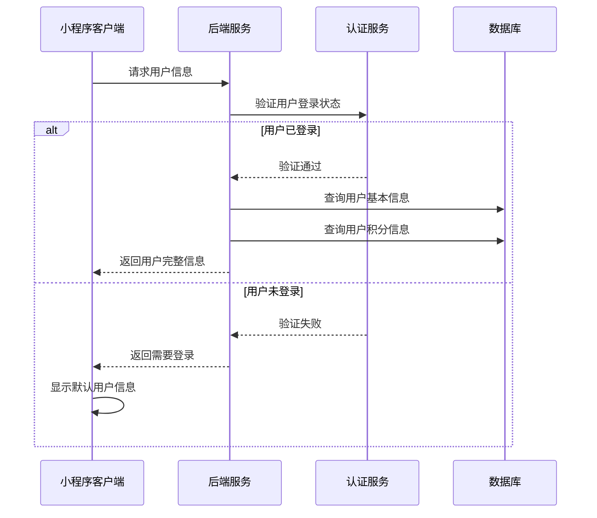
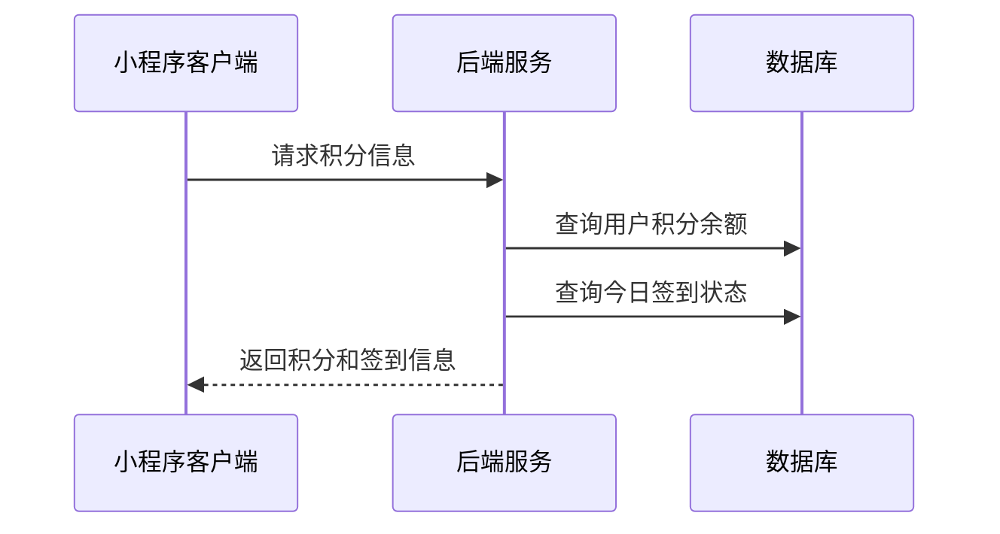
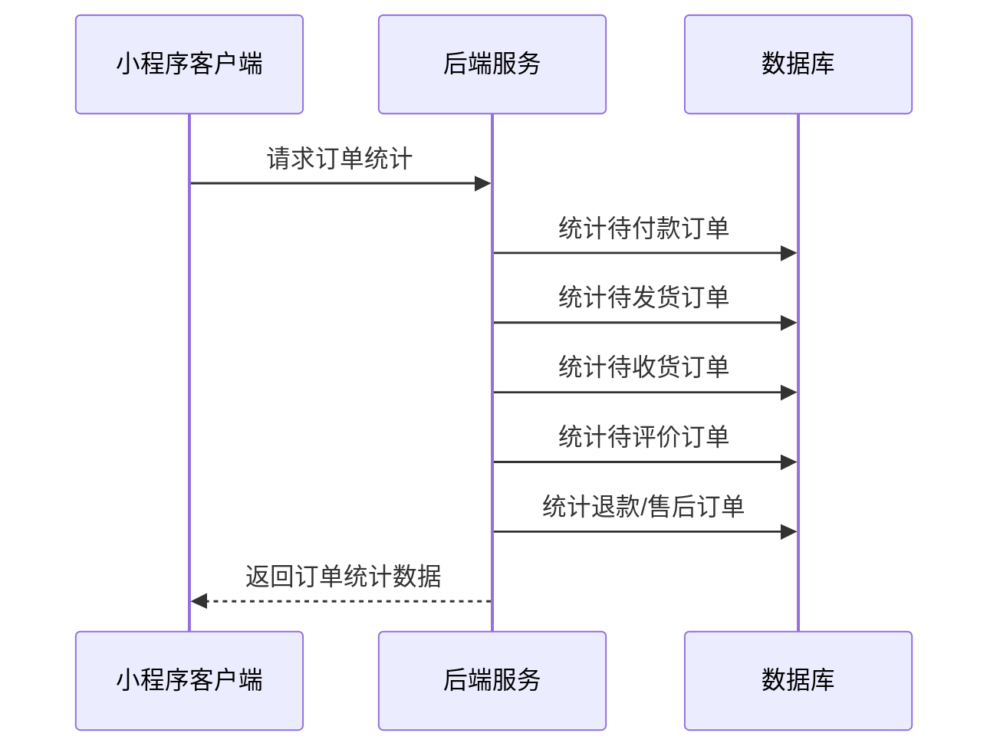
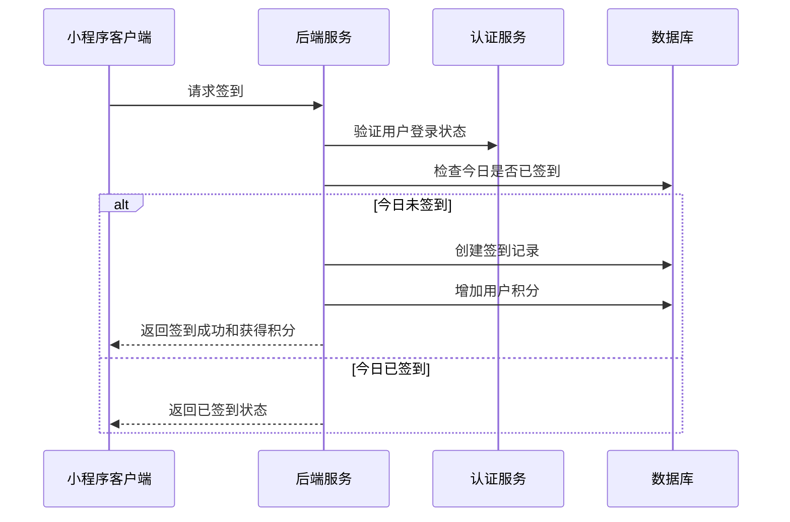
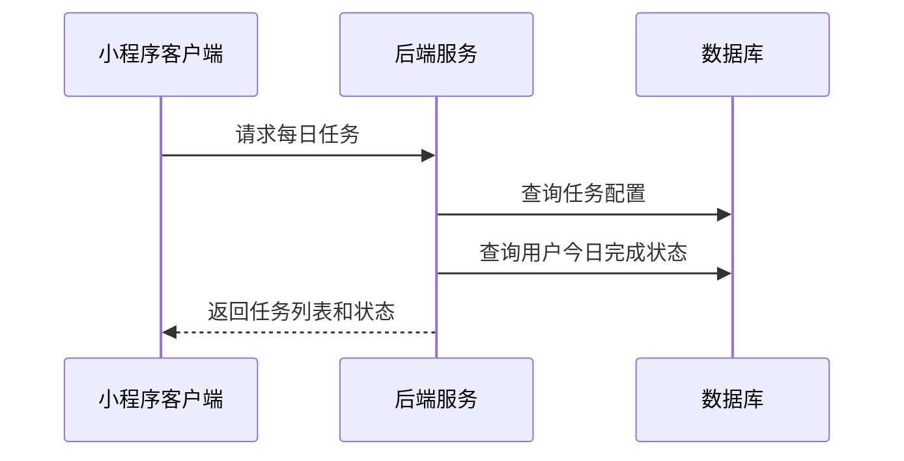
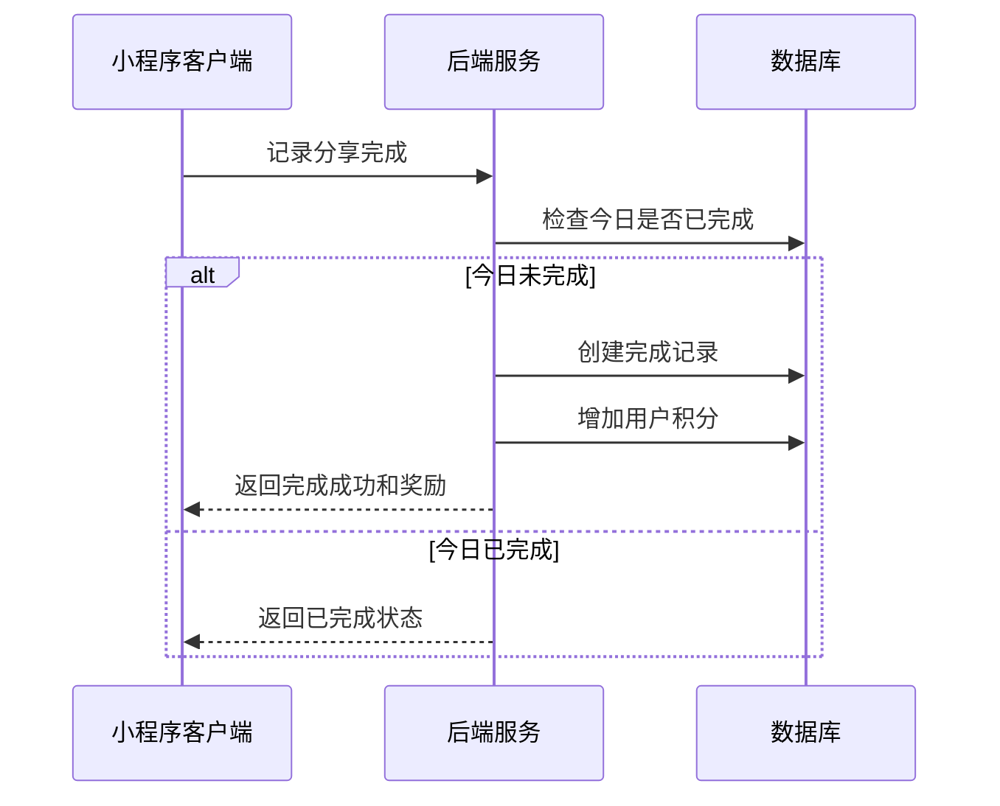
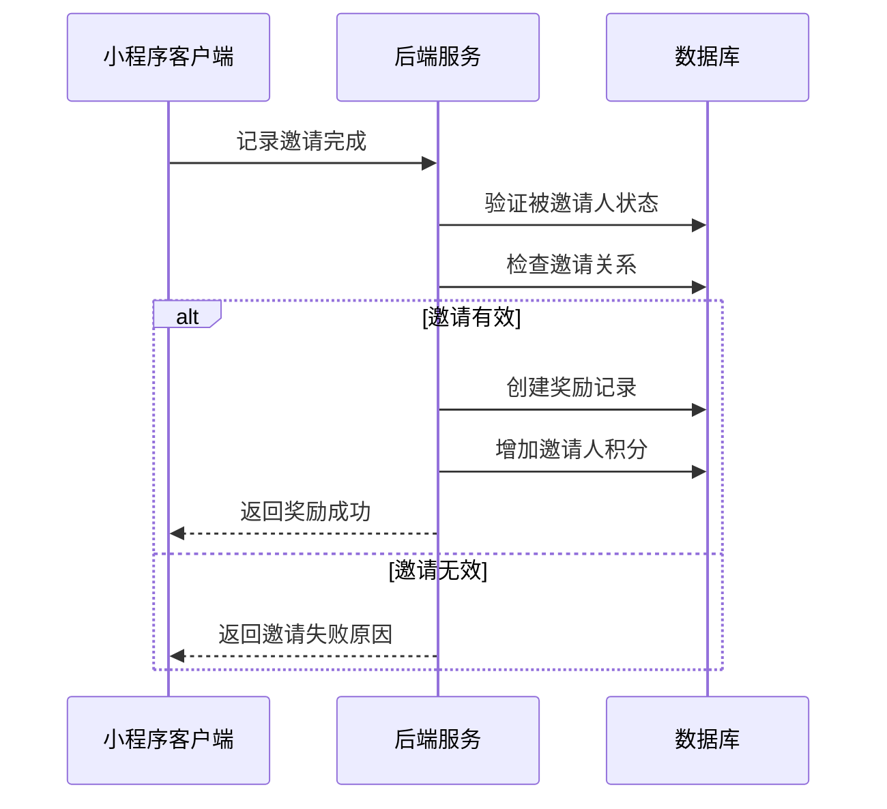

# 个人页面接口文档（已对齐index.ts字段，含详细注释）

## 获取用户基本信息

**接口名称：** 获取用户基本信息
**功能描述：** 获取用户头像、昵称、积分、会员等级等基本信息
**接口地址：** /api/user/info
**请求方式：** GET

### 功能说明
在个人页面显示用户的基本信息，包括头像、昵称、积分余额、会员等级等。**此接口需要用户登录状态。**



### 请求参数
无需传入参数（需要用户登录态）

### 响应参数
```json
{
  "error": 0,
  "body": {
    "userInfo": {
      "avatarUrl": "https://wx.qlogo.cn/mmopen/vi_32/xxx.jpg", // 用户头像URL
      "nickName": "张三", // 用户昵称
      "level": "中级会员", // 会员等级
      "id": "10086", // 用户编号
      "pointsBalance": 850 // 当前积分余额
    },
    "coupons": 5, // 优惠券数量
    "services": 3 // 服务数量
  },
  "message": "获取用户基本信息成功",
  "success": true
}
```

| 参数名 | 类型 | 必填 | 说明 | 示例值 |
|----|---|-----|---|-----|
| error | int | 是 | 错误码，0成功/401未登录 | 0 |
| body | object | 是 | 响应数据 | |
| body.userInfo | object | 是 | 用户信息 | |
| body.userInfo.avatarUrl | string | 是 | 用户头像URL | https://wx.qlogo.cn/mmopen/vi_32/xxx.jpg |
| body.userInfo.nickName | string | 是 | 用户昵称 | 张三 |
| body.userInfo.level | string | 是 | 会员等级 | 中级会员 |
| body.userInfo.id | string | 是 | 用户编号 | 10086 |
| body.userInfo.pointsBalance | int | 是 | 当前积分余额 | 850 |
| body.coupons | int | 是 | 优惠券数量 | 5 |
| body.services | int | 是 | 服务数量 | 3 |
| message | string | 是 | 响应消息 | 获取用户基本信息成功 |
| success | bool | 是 | 是否成功 | true |

---

## 获取积分信息

**接口名称：** 获取积分信息
**功能描述：** 获取用户积分余额和签到状态信息
**接口地址：** /api/points/info
**请求方式：** POST

### 功能说明
获取用户当前积分余额和今日签到状态，用于个人页面积分展示和签到功能控制。**此接口需要用户登录状态。**



### 请求参数
```json
{}
```

| 参数名 | 类型 | 必填 | 说明 | 示例值 |
|----|---|-----|---|-----|
| 无需参数 | - | - | 从token中获取用户信息 | - |

### 响应参数
```json
{
  "error": 0,
  "body": {
    "balance": 850, // 积分余额
    "isSigned": false // 今日是否已签到
  },
  "message": "获取积分信息成功",
  "success": true
}
```

| 参数名 | 类型 | 必填 | 说明 | 示例值 |
|----|---|-----|---|-----|
| error | int | 是 | 错误码，0成功/401未登录 | 0 |
| body | object | 是 | 响应数据 | |
| body.balance | int | 是 | 积分余额 | 850 |
| body.isSigned | bool | 是 | 今日是否已签到 | false |
| message | string | 是 | 响应消息 | 获取积分信息成功 |
| success | bool | 是 | 是否成功 | true |

---

## 获取订单统计数据

**接口名称：** 获取订单统计数据
**功能描述：** 获取用户各状态订单的数量统计
**接口地址：** /api/order/counts
**请求方式：** POST

### 功能说明
统计用户各种状态的订单数量，包括待付款、待发货、待收货、待评价、退款/售后等，用于个人页面订单状态显示。**此接口需要用户登录状态。**



### 请求参数
```json
{}
```

| 参数名 | 类型 | 必填 | 说明 | 示例值 |
|----|---|-----|---|-----|
| 无需参数 | - | - | 从token中获取用户信息 | - |

### 响应参数
```json
{
  "error": 0,
  "body": {
    "unpaid": 2, // 待付款订单数
    "unshipped": 1, // 待发货订单数
    "shipped": 3, // 待收货订单数
    "uncommented": 1, // 待评价订单数
    "refunding": 0 // 退款/售后订单数
  },
  "message": "获取订单统计成功",
  "success": true
}
```

| 参数名 | 类型 | 必填 | 说明 | 示例值 |
|----|---|-----|---|-----|
| error | int | 是 | 错误码，0成功/401未登录 | 0 |
| body | object | 是 | 响应数据 | |
| body.unpaid | int | 是 | 待付款订单数 | 2 |
| body.unshipped | int | 是 | 待发货订单数 | 1 |
| body.shipped | int | 是 | 待收货订单数 | 3 |
| body.uncommented | int | 是 | 待评价订单数 | 1 |
| body.refunding | int | 是 | 退款/售后订单数 | 0 |
| message | string | 是 | 响应消息 | 获取订单统计成功 |
| success | bool | 是 | 是否成功 | true |

---

## 用户签到

**接口名称：** 用户签到
**功能描述：** 处理用户每日签到，获得积分奖励
**接口地址：** /api/points/signIn
**请求方式：** POST

### 功能说明
用户点击签到按钮进行每日签到，签到成功后获得积分奖励。每天只能签到一次，重复签到会返回已签到状态。**此接口需要用户登录状态。**



### 请求参数
```json
{}
```

| 参数名 | 类型 | 必填 | 说明 | 示例值 |
|----|---|-----|---|-----|
| 无需参数 | - | - | 从token中获取用户信息 | - |

### 响应参数
```json
{
  "error": 0,
  "body": {
    "success": true, // 签到是否成功
    "points": 5 // 本次获得积分
  },
  "message": "签到成功",
  "success": true
}
```

| 参数名 | 类型 | 必填 | 说明 | 示例值 |
|----|---|-----|---|-----|
| error | int | 是 | 错误码，0成功/401未登录/402已签到 | 0 |
| body | object | 是 | 响应数据 | |
| body.success | bool | 是 | 签到是否成功 | true |
| body.points | int | 是 | 本次获得积分 | 5 |
| message | string | 是 | 响应消息 | 签到成功 |
| success | bool | 是 | 是否成功 | true |

---

## 获取每日任务列表

**接口名称：** 获取每日任务列表
**功能描述：** 获取用户每日任务列表和完成状态
**接口地址：** /api/tasks/daily
**请求方式：** GET

### 功能说明
获取每日任务列表，包括签到、分享、邀请等任务的完成状态和奖励积分。用于个人页面每日任务区域展示。**此接口需要用户登录状态。**



### 请求参数
无需传入参数（需要用户登录态）

### 响应参数
```json
{
  "error": 0,
  "body": {
    "dailyTasks": [
      {
        "id": 1,
        "name": "每日签到",
        "description": "连续签到7天额外奖励30积分",
        "icon": "check-in",
        "pointsReward": 5,
        "status": 0,
        "buttonText": "去签到",
        "completed": false
      },
      {
        "id": 2,
        "name": "分享小程序",
        "description": "分享给好友获得5积分",
        "icon": "share",
        "pointsReward": 5,
        "status": 0,
        "buttonText": "去分享",
        "completed": false
      },
      {
        "id": 3,
        "name": "邀请好友",
        "description": "成功邀请1位好友获得30积分",
        "icon": "invite",
        "pointsReward": 30,
        "status": 0,
        "buttonText": "去邀请",
        "completed": false
      }
    ]
  },
  "message": "获取每日任务成功",
  "success": true
}
```

| 参数名 | 类型 | 必填 | 说明 | 示例值 |
|----|---|-----|---|-----|
| error | int | 是 | 错误码，0成功/401未登录 | 0 |
| body | object | 是 | 响应数据 | |
| body.dailyTasks | array | 是 | 每日任务列表 | |
| body.dailyTasks[].id | int | 是 | 任务ID | 1 |
| body.dailyTasks[].name | string | 是 | 任务名称 | 每日签到 |
| body.dailyTasks[].description | string | 是 | 任务描述 | 连续签到7天额外奖励30积分 |
| body.dailyTasks[].icon | string | 是 | 任务图标标识 | check-in |
| body.dailyTasks[].pointsReward | int | 是 | 奖励积分 | 5 |
| body.dailyTasks[].status | int | 是 | 完成状态（0未完成/1已完成） | 0 |
| body.dailyTasks[].buttonText | string | 是 | 按钮文字 | 去签到 |
| body.dailyTasks[].completed | bool | 是 | 是否已完成 | false |
| message | string | 是 | 响应消息 | 获取每日任务成功 |
| success | bool | 是 | 是否成功 | true |

---

## 完成分享任务

**接口名称：** 完成分享任务
**功能描述：** 记录用户分享小程序行为，发放奖励积分
**接口地址：** /api/tasks/share/complete
**请求方式：** POST

### 功能说明
用户分享小程序后调用此接口记录完成状态并发放奖励积分。每天限制完成一次。**此接口需要用户登录状态。**



### 请求参数
```json
{
  "shareType": "friend"
}
```

| 参数名 | 类型 | 必填 | 说明 | 示例值 |
|----|---|-----|---|-----|
| shareType | string | 是 | 分享类型（friend好友/timeline朋友圈） | friend |

### 响应参数
```json
{
  "error": 0,
  "body": {
    "taskResult": {
      "completed": true,
      "points": 5,
      "totalPoints": 860,
      "message": "分享任务完成！获得5积分"
    }
  },
  "message": "分享任务完成",
  "success": true
}
```

| 参数名 | 类型 | 必填 | 说明 | 示例值 |
|----|---|-----|---|-----|
| error | int | 是 | 错误码，0成功/401未登录/402已完成 | 0 |
| body | object | 是 | 响应数据 | |
| body.taskResult | object | 是 | 任务完成结果 | |
| body.taskResult.completed | bool | 是 | 是否完成 | true |
| body.taskResult.points | int | 是 | 获得积分 | 5 |
| body.taskResult.totalPoints | int | 是 | 完成后总积分 | 860 |
| body.taskResult.message | string | 是 | 完成消息 | 分享任务完成！获得5积分 |
| message | string | 是 | 响应消息 | 分享任务完成 |
| success | bool | 是 | 是否成功 | true |

---

## 完成邀请任务

**接口名称：** 完成邀请任务
**功能描述：** 记录用户邀请好友行为，发放奖励积分
**接口地址：** /api/tasks/invite/complete
**请求方式：** POST

### 功能说明
当被邀请的好友完成注册或首次购买后，调用此接口为邀请人发放奖励积分。**此接口需要用户登录状态。**



### 请求参数
```json
{
  "invitedUserId": 789012,
  "inviteType": "register"
}
```

| 参数名 | 类型 | 必填 | 说明 | 示例值 |
|----|---|-----|---|-----|
| invitedUserId | int | 是 | 被邀请用户ID | 789012 |
| inviteType | string | 是 | 邀请类型（register注册/order首单） | register |

### 响应参数
```json
{
  "error": 0,
  "body": {
    "inviteResult": {
      "success": true,
      "points": 30,
      "totalPoints": 890,
      "invitedUserName": "李四",
      "message": "成功邀请好友李四，获得30积分奖励"
    }
  },
  "message": "邀请任务完成",
  "success": true
}
```

| 参数名 | 类型 | 必填 | 说明 | 示例值 |
|----|---|-----|---|-----|
| error | int | 是 | 错误码，0成功/401未登录/403邀请无效 | 0 |
| body | object | 是 | 响应数据 | |
| body.inviteResult | object | 是 | 邀请结果 | |
| body.inviteResult.success | bool | 是 | 邀请是否成功 | true |
| body.inviteResult.points | int | 是 | 获得积分 | 30 |
| body.inviteResult.totalPoints | int | 是 | 完成后总积分 | 890 |
| body.inviteResult.invitedUserName | string | 是 | 被邀请用户昵称 | 李四 |
| body.inviteResult.message | string | 是 | 邀请结果消息 | 成功邀请好友李四，获得30积分奖励 |
| message | string | 是 | 响应消息 | 邀请任务完成 |
| success | bool | 是 | 是否成功 | true | 