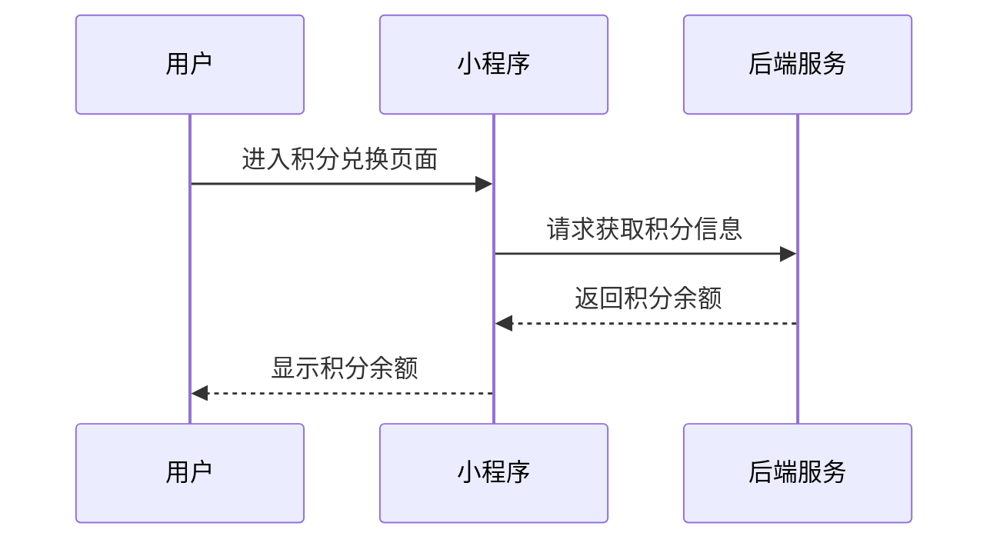
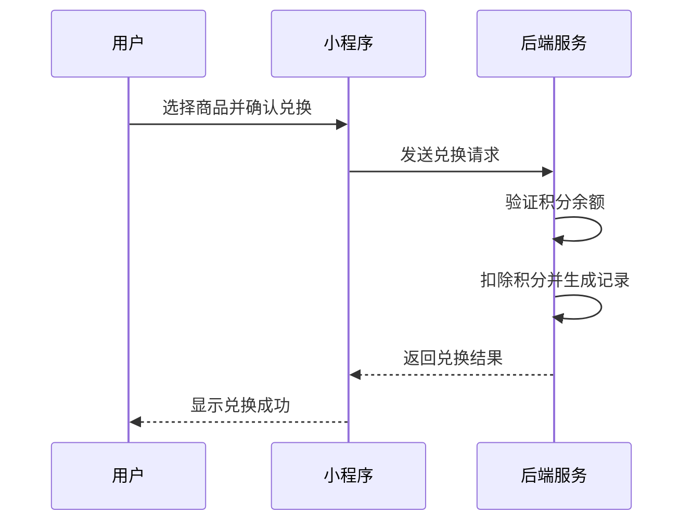

# 积分兑换页面接口文档

## 1. 获取积分信息

**接口名称：** 获取用户积分信息
**功能描述：** 获取当前用户的积分余额信息，用于展示在积分兑换页面
**接口地址：** /points/info
**请求方式：** POST

### 功能说明
用户进入积分兑换页面时，系统会自动调用此接口获取用户当前的积分余额，以便用户了解自己可用的积分数量。



### 请求参数
```json
{}
```

| 参数名 | 类型 | 必填 | 说明 | 示例值 |
|----|---|-----|---|-----|
| 无 | - | - | 该接口无需传递参数 | - |

### 请求头
| 参数名 | 类型 | 必填 | 说明 | 示例值 |
|----|---|-----|---|-----|
| Authorization | string | 是 | 用户登录凭证 | Bearer token_value |

### 响应参数
```json
{
  "error": 0,
  "body": {
    "balance": 280
  },
  "message": "获取积分信息成功",
  "success": true
}
```

| 参数名 | 类型 | 必填 | 说明 | 示例值 |
|----|---|-----|---|-----|
| error | int | 是 | 错误码，0表示成功 | 0 |
| body | object | 是 | 响应数据 | |
| body.balance | int | 是 | 用户积分余额 | 280 |
| message | string | 是 | 响应消息 | 获取积分信息成功 |
| success | bool | 是 | 是否成功 | true |

### 错误码说明
| 错误码 | 说明 |
|-------|------|
| 0 | 成功 |
| 401 | 用户未登录或token无效 |
| 500 | 服务器内部错误 |

---

## 2. 兑换商品

**接口名称：** 积分兑换商品
**功能描述：** 用户使用积分兑换指定商品，扣除相应积分并生成兑换记录
**接口地址：** /points/exchange
**请求方式：** POST

### 功能说明
用户选择要兑换的商品后，系统会验证用户积分是否足够，如果足够则扣除相应积分并生成兑换记录。



### 请求参数
```json
{
  "productId": 1,
  "count": 1
}
```

| 参数名 | 类型 | 必填 | 说明 | 示例值 |
|----|---|-----|---|-----|
| productId | int | 是 | 要兑换的商品ID | 1 |
| count | int | 否 | 兑换数量，默认为1 | 1 |

### 请求头
| 参数名 | 类型 | 必填 | 说明 | 示例值 |
|----|---|-----|---|-----|
| Authorization | string | 是 | 用户登录凭证 | Bearer token_value |

### 响应参数
```json
{
  "error": 0,
  "body": {
    "exchangeId": "EX202312010001",
    "productId": 1,
    "productName": "优惠券50元",
    "pointsUsed": 500,
    "remainingPoints": 280,
    "exchangeTime": "2023-12-01 10:30:00",
    "status": "success"
  },
  "message": "兑换成功",
  "success": true
}
```

| 参数名 | 类型 | 必填 | 说明 | 示例值 |
|----|---|-----|---|-----|
| error | int | 是 | 错误码，0表示成功 | 0 |
| body | object | 是 | 响应数据 | |
| body.exchangeId | string | 是 | 兑换记录ID | EX202312010001 |
| body.productId | int | 是 | 兑换的商品ID | 1 |
| body.productName | string | 是 | 兑换的商品名称 | 优惠券50元 |
| body.pointsUsed | int | 是 | 消耗的积分数量 | 500 |
| body.remainingPoints | int | 是 | 兑换后剩余积分 | 280 |
| body.exchangeTime | string | 是 | 兑换时间 | 2023-12-01 10:30:00 |
| body.status | string | 是 | 兑换状态 | success |
| message | string | 是 | 响应消息 | 兑换成功 |
| success | bool | 是 | 是否成功 | true |

### 错误码说明
| 错误码 | 说明 |
|-------|------|
| 0 | 成功 |
| 400 | 参数错误 |
| 401 | 用户未登录或token无效 |
| 403 | 积分不足 |
| 404 | 商品不存在 |
| 409 | 商品库存不足 |
| 500 | 服务器内部错误 |

### 业务规则
1. 用户必须登录才能进行兑换
2. 用户积分余额必须大于等于商品所需积分
3. 商品必须有库存才能兑换
4. 兑换成功后会立即扣除相应积分
5. 每次兑换都会生成唯一的兑换记录ID

### 商品信息参考
根据前端页面数据，当前支持兑换的商品包括：

| 商品ID | 商品名称 | 所需积分 | 库存 | 描述 |
|-------|---------|---------|------|------|
| 1 | 优惠券50元 | 500 | 999 | 可用于商城消费抵扣现金 |
| 2 | 羽毛球场地30分钟 | 800 | 10 | 可预约任意时段羽毛球场地30分钟 |
| 3 | 网球场地60分钟 | 1200 | 5 | 可预约任意时段网球场地60分钟 | 