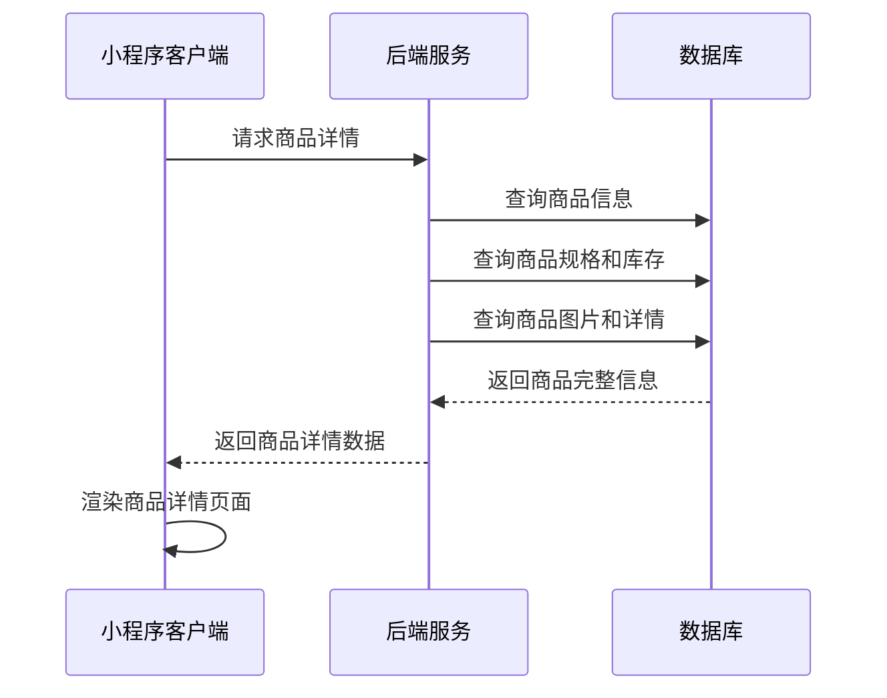
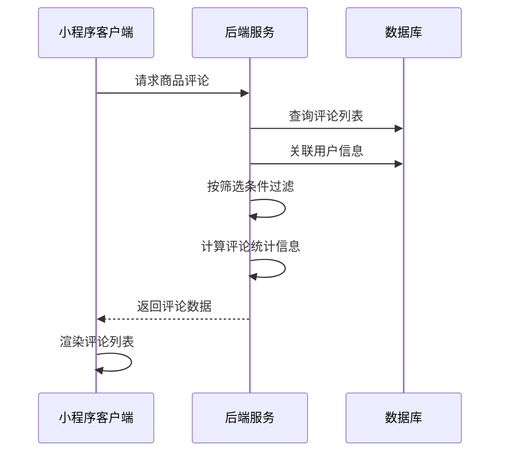
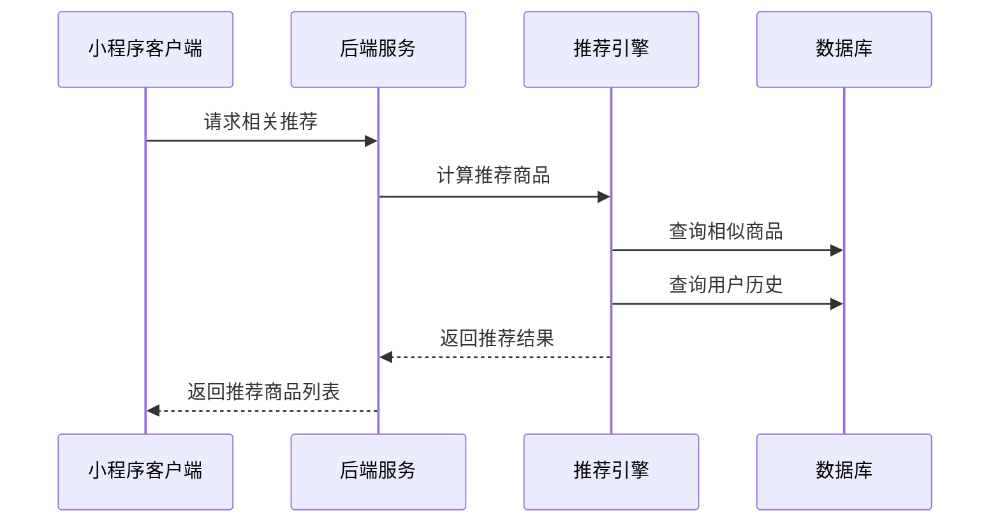
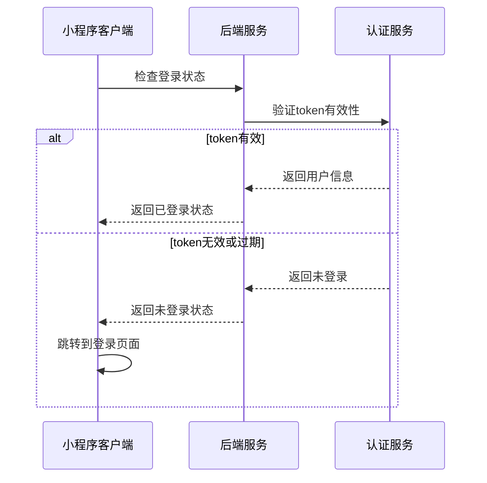
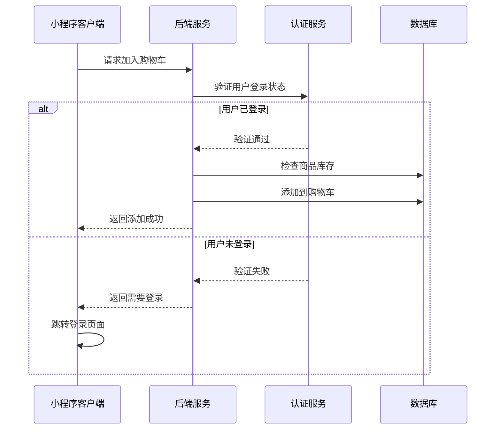
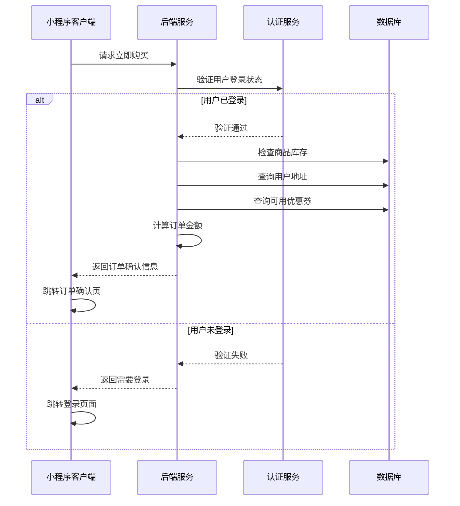
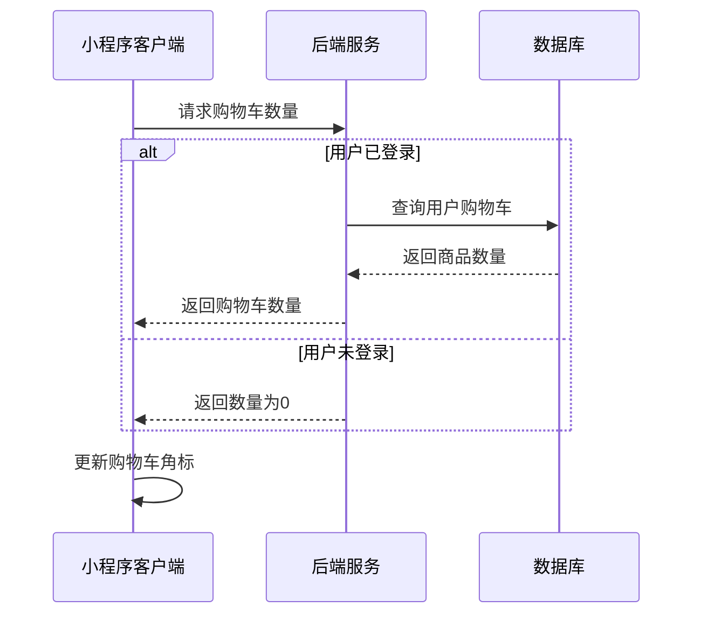

# 商品详情页面接口文档

## 获取商品详情信息

**接口名称：** 获取商品详情信息
**功能描述：** 获取商品的完整详情信息，包括基本信息、规格、图片、参数等
**接口地址：** /api/products/detail
**请求方式：** GET

### 功能说明
获取商品详情页面需要的完整信息，包括商品基本信息、价格、库存、规格选项、服务保障、图文详情等。支持不同规格商品的价格和库存展示。



### 请求参数
```json
{
  "productId": "product_101"
}
```

| 参数名 | 类型 | 必填 | 说明 | 示例值 |
|----|---|-----|---|-----|
| productId | string | 是 | 商品唯一ID | product_101 |

### 响应参数
```json
{
  "error": 0,
  "body": {
    "product": {
      "id": "product_101",
      "name": "YONEX尤尼克斯ARC-11羽毛球拍",
      "description": "专业羽毛球拍，适合进阶选手",
      "brand": "YONEX",
      "price": 899.00,
      "originalPrice": 1099.00,
      "salesCount": 268,
      "stock": 50,
      "shippingInfo": "24小时发货",
      "images": [
        "https://images.unsplash.com/photo-1551698618-1dfe5d97d256?w=800",
        "https://images.unsplash.com/photo-1551698618-1dfe5d97d256?w=800"
      ],
      "serviceGuarantees": [
        {
          "name": "发货保障",
          "description": "24小时发货",
          "icon": "/assets/icons/shipping.png"
        },
        {
          "name": "退换保障", 
          "description": "7天无理由退换",
          "icon": "/assets/icons/return.png"
        },
        {
          "name": "正品保障",
          "description": "正品保障",
          "icon": "/assets/icons/authentic.png"
        }
      ],
      "specGroups": [
        {
          "name": "颜色",
          "options": [
            {
              "value": "蓝色",
              "priceAdjustment": 0,
              "stock": 30,
              "disabled": false
            },
            {
              "value": "红色", 
              "priceAdjustment": 0,
              "stock": 20,
              "disabled": false
            }
          ]
        },
        {
          "name": "重量",
          "options": [
            {
              "value": "3U",
              "priceAdjustment": 0,
              "stock": 25,
              "disabled": false
            },
            {
              "value": "4U",
              "priceAdjustment": 0,
              "stock": 25,
              "disabled": false
            }
          ]
        }
      ],
      "specs": [
        {
          "name": "品牌",
          "value": "YONEX"
        },
        {
          "name": "材质",
          "value": "碳纤维"
        },
        {
          "name": "平衡点",
          "value": "290mm"
        }
      ],
      "detailContent": "<p>商品详情HTML内容</p>",
      "isActive": true,
      "categories": ["羽毛球拍", "YONEX"]
    }
  },
  "message": "获取商品详情成功",
  "success": true
}
```

| 参数名 | 类型 | 必填 | 说明 | 示例值 |
|----|---|-----|---|-----|
| error | int | 是 | 错误码，0表示成功 | 0 |
| body | object | 是 | 响应数据 | |
| body.product | object | 是 | 商品详情信息 | |
| body.product.id | string | 是 | 商品唯一ID | product_101 |
| body.product.name | string | 是 | 商品名称 | YONEX尤尼克斯ARC-11羽毛球拍 |
| body.product.description | string | 是 | 商品描述 | 专业羽毛球拍，适合进阶选手 |
| body.product.brand | string | 是 | 商品品牌 | YONEX |
| body.product.price | number | 是 | 当前价格 | 899.00 |
| body.product.originalPrice | number | 否 | 原价 | 1099.00 |
| body.product.salesCount | int | 是 | 销量 | 268 |
| body.product.stock | int | 是 | 总库存 | 50 |
| body.product.shippingInfo | string | 是 | 发货信息 | 24小时发货 |
| body.product.images | array | 是 | 商品图片列表 | |
| body.product.serviceGuarantees | array | 是 | 服务保障列表 | |
| body.product.serviceGuarantees[].name | string | 是 | 保障名称 | 发货保障 |
| body.product.serviceGuarantees[].description | string | 是 | 保障描述 | 24小时发货 |
| body.product.serviceGuarantees[].icon | string | 是 | 保障图标 | /assets/icons/shipping.png |
| body.product.specGroups | array | 是 | 规格组列表 | |
| body.product.specGroups[].name | string | 是 | 规格组名称 | 颜色 |
| body.product.specGroups[].options | array | 是 | 规格选项列表 | |
| body.product.specGroups[].options[].value | string | 是 | 规格值 | 蓝色 |
| body.product.specGroups[].options[].priceAdjustment | number | 是 | 价格调整（相对基础价格） | 0 |
| body.product.specGroups[].options[].stock | int | 是 | 该规格库存 | 30 |
| body.product.specGroups[].options[].disabled | bool | 是 | 是否禁用 | false |
| body.product.specs | array | 是 | 商品参数列表 | |
| body.product.specs[].name | string | 是 | 参数名称 | 品牌 |
| body.product.specs[].value | string | 是 | 参数值 | YONEX |
| body.product.detailContent | string | 是 | 图文详情HTML | <p>商品详情HTML内容</p> |
| body.product.isActive | bool | 是 | 商品是否有效 | true |
| body.product.categories | array | 是 | 商品分类标签 | ["羽毛球拍", "YONEX"] |
| message | string | 是 | 响应消息 | 获取商品详情成功 |
| success | bool | 是 | 是否成功 | true |

---

## 获取商品评论列表

**接口名称：** 获取商品评论列表
**功能描述：** 获取指定商品的用户评论列表，支持分页和筛选
**接口地址：** /api/products/comments
**请求方式：** GET

### 功能说明
获取商品的用户评论信息，包括评论内容、评分、用户信息、评论图片等。支持按评分筛选、有图筛选等功能，用于商品详情页评论预览和评论详情页。



### 请求参数
```json
{
  "productId": "product_101",
  "page": 1,
  "pageSize": 10,
  "filter": "all"
}
```

| 参数名 | 类型 | 必填 | 说明 | 示例值 |
|----|---|-----|---|-----|
| productId | string | 是 | 商品ID | product_101 |
| page | int | 否 | 页码（默认1） | 1 |
| pageSize | int | 否 | 每页数量（默认10） | 10 |
| filter | string | 否 | 筛选类型（all全部/withImage有图/positive好评/negative差评） | all |

### 响应参数
```json
{
  "error": 0,
  "body": {
    "comments": {
      "total": 156,
      "withImageCount": 89,
      "positiveCount": 142,
      "negativeCount": 8,
      "averageRating": 4.6,
      "ratingDistribution": {
        "5": 98,
        "4": 44,
        "3": 6,
        "2": 4,
        "1": 4
      },
      "tags": ["质量很好", "发货快", "包装精美", "性价比高"],
      "list": [
        {
          "id": "comment_001",
          "userId": "user_123",
          "username": "张***",
          "userAvatar": "https://example.com/avatar.jpg",
          "rating": 5,
          "content": "非常满意的一次购物体验，羽毛球拍质量很好，手感不错！",
          "images": [
            "https://example.com/comment1.jpg",
            "https://example.com/comment2.jpg"
          ],
          "createTime": "2024-12-15 14:30:00",
          "isLiked": false,
          "likeCount": 12,
          "spec": "颜色：蓝色 重量：4U",
          "isAnonymous": false
        }
      ]
    },
    "pagination": {
      "page": 1,
      "pageSize": 10,
      "total": 156,
      "totalPages": 16,
      "hasMore": true
    }
  },
  "message": "获取评论成功",
  "success": true
}
```

| 参数名 | 类型 | 必填 | 说明 | 示例值 |
|----|---|-----|---|-----|
| error | int | 是 | 错误码，0表示成功 | 0 |
| body | object | 是 | 响应数据 | |
| body.comments | object | 是 | 评论数据 | |
| body.comments.total | int | 是 | 评论总数 | 156 |
| body.comments.withImageCount | int | 是 | 有图评论数量 | 89 |
| body.comments.positiveCount | int | 是 | 好评数量（4-5星） | 142 |
| body.comments.negativeCount | int | 是 | 差评数量（1-2星） | 8 |
| body.comments.averageRating | number | 是 | 平均评分 | 4.6 |
| body.comments.ratingDistribution | object | 是 | 评分分布 | |
| body.comments.ratingDistribution.5 | int | 是 | 5星评论数 | 98 |
| body.comments.ratingDistribution.4 | int | 是 | 4星评论数 | 44 |
| body.comments.ratingDistribution.3 | int | 是 | 3星评论数 | 6 |
| body.comments.ratingDistribution.2 | int | 是 | 2星评论数 | 4 |
| body.comments.ratingDistribution.1 | int | 是 | 1星评论数 | 4 |
| body.comments.tags | array | 是 | 评论标签 | ["质量很好", "发货快"] |
| body.comments.list | array | 是 | 评论列表 | |
| body.comments.list[].id | string | 是 | 评论ID | comment_001 |
| body.comments.list[].userId | string | 是 | 用户ID | user_123 |
| body.comments.list[].username | string | 是 | 用户名（脱敏） | 张*** |
| body.comments.list[].userAvatar | string | 否 | 用户头像 | https://example.com/avatar.jpg |
| body.comments.list[].rating | int | 是 | 评分（1-5） | 5 |
| body.comments.list[].content | string | 是 | 评论内容 | 非常满意的一次购物体验 |
| body.comments.list[].images | array | 否 | 评论图片 | |
| body.comments.list[].createTime | string | 是 | 评论时间 | 2024-12-15 14:30:00 |
| body.comments.list[].isLiked | bool | 是 | 当前用户是否点赞 | false |
| body.comments.list[].likeCount | int | 是 | 点赞数 | 12 |
| body.comments.list[].spec | string | 否 | 购买时的规格 | 颜色：蓝色 重量：4U |
| body.comments.list[].isAnonymous | bool | 是 | 是否匿名评论 | false |
| body.pagination | object | 是 | 分页信息 | |
| body.pagination.page | int | 是 | 当前页码 | 1 |
| body.pagination.pageSize | int | 是 | 每页数量 | 10 |
| body.pagination.total | int | 是 | 总记录数 | 156 |
| body.pagination.totalPages | int | 是 | 总页数 | 16 |
| body.pagination.hasMore | bool | 是 | 是否有更多数据 | true |
| message | string | 是 | 响应消息 | 获取评论成功 |
| success | bool | 是 | 是否成功 | true |

---

## 获取相关推荐商品

**接口名称：** 获取相关推荐商品
**功能描述：** 根据当前商品推荐相关商品，用于商品详情页推荐区域
**接口地址：** /api/products/related
**请求方式：** GET

### 功能说明
基于当前商品的分类、品牌、价格等特征，推荐相关的商品。推荐算法考虑用户浏览历史、商品相似度、销量等因素。



### 请求参数
```json
{
  "productId": "product_101",
  "limit": 10
}
```

| 参数名 | 类型 | 必填 | 说明 | 示例值 |
|----|---|-----|---|-----|
| productId | string | 是 | 当前商品ID | product_101 |
| limit | int | 否 | 推荐数量限制（默认10） | 10 |

### 响应参数
```json
{
  "error": 0,
  "body": {
    "relatedProducts": [
      {
        "id": "product_102",
        "name": "威克多胜利TK-F隼羽毛球拍",
        "imageUrl": "https://images.unsplash.com/photo-1551698618-1dfe5d97d256?w=300",
        "price": 758.00,
        "originalPrice": 890.00,
        "salesCount": 189,
        "brand": "威克多",
        "category": "羽毛球拍",
        "recommendReason": "同类型热销商品",
        "similarityScore": 0.85
      }
    ]
  },
  "message": "获取推荐商品成功",
  "success": true
}
```

| 参数名 | 类型 | 必填 | 说明 | 示例值 |
|----|---|-----|---|-----|
| error | int | 是 | 错误码，0表示成功 | 0 |
| body | object | 是 | 响应数据 | |
| body.relatedProducts | array | 是 | 推荐商品列表 | |
| body.relatedProducts[].id | string | 是 | 商品ID | product_102 |
| body.relatedProducts[].name | string | 是 | 商品名称 | 威克多胜利TK-F隼羽毛球拍 |
| body.relatedProducts[].imageUrl | string | 是 | 商品主图 | https://example.com/product.jpg |
| body.relatedProducts[].price | number | 是 | 当前价格 | 758.00 |
| body.relatedProducts[].originalPrice | number | 否 | 原价 | 890.00 |
| body.relatedProducts[].salesCount | int | 是 | 销量 | 189 |
| body.relatedProducts[].brand | string | 是 | 品牌 | 威克多 |
| body.relatedProducts[].category | string | 是 | 分类 | 羽毛球拍 |
| body.relatedProducts[].recommendReason | string | 否 | 推荐理由 | 同类型热销商品 |
| body.relatedProducts[].similarityScore | number | 否 | 相似度分数 | 0.85 |
| message | string | 是 | 响应消息 | 获取推荐商品成功 |
| success | bool | 是 | 是否成功 | true |

---

## 检查用户登录状态

**接口名称：** 检查用户登录状态
**功能描述：** 验证用户当前登录状态，用于购物车、客服等需要登录的功能
**接口地址：** /api/auth/check-login
**请求方式：** GET

### 功能说明
在用户进行加入购物车、立即购买、联系客服等操作前，检查用户是否已登录。如果未登录，前端需要引导用户进行登录操作。



### 请求参数
**请求头：**
```json
{
  "Authorization": "Bearer {token}"
}
```

| 参数名 | 类型 | 必填 | 说明 | 示例值 |
|----|---|-----|---|-----|
| Authorization | string | 否 | 用户token（如果有） | Bearer abc123... |

### 响应参数
```json
{
  "error": 0,
  "body": {
    "isLoggedIn": true,
    "user": {
      "userId": "user_123",
      "nickname": "张三",
      "avatarUrl": "https://example.com/avatar.jpg",
      "memberLevel": "初级会员"
    },
    "tokenValid": true,
    "expiresIn": 86400
  },
  "message": "登录状态检查成功",
  "success": true
}
```

| 参数名 | 类型 | 必填 | 说明 | 示例值 |
|----|---|-----|---|-----|
| error | int | 是 | 错误码，0表示成功 | 0 |
| body | object | 是 | 响应数据 | |
| body.isLoggedIn | bool | 是 | 是否已登录 | true |
| body.user | object | 否 | 用户信息（已登录时返回） | |
| body.user.userId | string | 是 | 用户ID | user_123 |
| body.user.nickname | string | 是 | 用户昵称 | 张三 |
| body.user.avatarUrl | string | 否 | 用户头像 | https://example.com/avatar.jpg |
| body.user.memberLevel | string | 是 | 会员等级 | 初级会员 |
| body.tokenValid | bool | 是 | token是否有效 | true |
| body.expiresIn | int | 否 | token剩余有效时间（秒） | 86400 |
| message | string | 是 | 响应消息 | 登录状态检查成功 |
| success | bool | 是 | 是否成功 | true |

---

## 加入购物车

**接口名称：** 加入购物车
**功能描述：** 将选择的商品和规格添加到用户购物车
**接口地址：** /api/cart/add
**请求方式：** POST

### 功能说明
用户在商品详情页选择规格后，将商品添加到购物车。**此接口需要用户登录状态，未登录用户需要先引导登录。** 如果购物车中已存在相同商品和规格，则增加数量。



### 请求参数
```json
{
  "productId": "product_101",
  "quantity": 1,
  "selectedSpecs": {
    "颜色": "蓝色",
    "重量": "4U"
  }
}
```

| 参数名 | 类型 | 必填 | 说明 | 示例值 |
|----|---|-----|---|-----|
| productId | string | 是 | 商品ID | product_101 |
| quantity | int | 是 | 添加数量 | 1 |
| selectedSpecs | object | 是 | 选择的规格 | {"颜色": "蓝色", "重量": "4U"} |

### 响应参数
```json
{
  "error": 0,
  "body": {
    "cartId": "cart_001",
    "action": "added",
    "newQuantity": 2,
    "cartCount": 5
  },
  "message": "添加到购物车成功",
  "success": true
}
```

| 参数名 | 类型 | 必填 | 说明 | 示例值 |
|----|---|-----|---|-----|
| error | int | 是 | 错误码，0成功/401未登录/400参数错误 | 0 |
| body | object | 是 | 响应数据 | |
| body.cartId | string | 是 | 购物车条目ID | cart_001 |
| body.action | string | 是 | 操作类型（added新增/updated更新） | added |
| body.newQuantity | int | 是 | 该条目最新数量 | 2 |
| body.cartCount | int | 是 | 购物车总商品数 | 5 |
| message | string | 是 | 响应消息 | 添加到购物车成功 |
| success | bool | 是 | 是否成功 | true |

---

## 立即购买

**接口名称：** 立即购买商品
**功能描述：** 直接购买商品，跳转到订单确认页面
**接口地址：** /api/orders/buy-now
**请求方式：** POST

### 功能说明
用户选择商品规格后直接购买，生成临时订单信息并返回订单确认页面所需数据。**此接口需要用户登录状态。** 包含商品信息、收货地址、可用优惠券等。



### 请求参数
```json
{
  "productId": "product_101",
  "quantity": 1,
  "selectedSpecs": {
    "颜色": "蓝色",
    "重量": "4U"
  },
  "addressId": "addr_001",
  "remark": "请小心包装"
}
```

| 参数名 | 类型 | 必填 | 说明 | 示例值 |
|----|---|-----|---|-----|
| productId | string | 是 | 商品ID | product_101 |
| quantity | int | 是 | 购买数量 | 1 |
| selectedSpecs | object | 是 | 选择的规格 | {"颜色": "蓝色", "重量": "4U"} |
| addressId | string | 否 | 收货地址ID | addr_001 |
| remark | string | 否 | 订单备注 | 请小心包装 |

### 响应参数
```json
{
  "error": 0,
  "body": {
    "orderPreview": {
      "tempOrderId": "temp_order_001",
      "product": {
        "productId": "product_101",
        "name": "YONEX尤尼克斯ARC-11羽毛球拍",
        "image": "https://example.com/product.jpg",
        "spec": "颜色：蓝色 重量：4U",
        "price": 899.00,
        "quantity": 1,
        "subtotal": 899.00
      },
      "address": {
        "addressId": "addr_001",
        "recipientName": "张三",
        "phone": "138****5678",
        "region": "广东省 深圳市 南山区",
        "detailAddress": "科技园南区深圳软件园"
      },
      "availableCoupons": [
        {
          "couponId": "coupon_001",
          "name": "满200减30优惠券",
          "discountValue": 30.00,
          "minAmount": 200.00
        }
      ],
      "priceDetail": {
        "productAmount": 899.00,
        "shippingFee": 0.00,
        "discountAmount": 0.00,
        "totalAmount": 899.00
      },
      "remark": "请小心包装"
    }
  },
  "message": "获取订单预览成功",
  "success": true
}
```

| 参数名 | 类型 | 必填 | 说明 | 示例值 |
|----|---|-----|---|-----|
| error | int | 是 | 错误码，0成功/401未登录 | 0 |
| body | object | 是 | 响应数据 | |
| body.orderPreview | object | 是 | 订单预览信息 | |
| body.orderPreview.tempOrderId | string | 是 | 临时订单ID | temp_order_001 |
| body.orderPreview.product | object | 是 | 商品信息 | |
| body.orderPreview.product.productId | string | 是 | 商品ID | product_101 |
| body.orderPreview.product.name | string | 是 | 商品名称 | YONEX尤尼克斯ARC-11羽毛球拍 |
| body.orderPreview.product.image | string | 是 | 商品图片 | https://example.com/product.jpg |
| body.orderPreview.product.spec | string | 是 | 选择的规格 | 颜色：蓝色 重量：4U |
| body.orderPreview.product.price | number | 是 | 商品单价 | 899.00 |
| body.orderPreview.product.quantity | int | 是 | 购买数量 | 1 |
| body.orderPreview.product.subtotal | number | 是 | 商品小计 | 899.00 |
| body.orderPreview.address | object | 否 | 收货地址信息 | |
| body.orderPreview.address.addressId | string | 是 | 地址ID | addr_001 |
| body.orderPreview.address.recipientName | string | 是 | 收件人 | 张三 |
| body.orderPreview.address.phone | string | 是 | 联系电话 | 138****5678 |
| body.orderPreview.address.region | string | 是 | 地区 | 广东省 深圳市 南山区 |
| body.orderPreview.address.detailAddress | string | 是 | 详细地址 | 科技园南区深圳软件园 |
| body.orderPreview.availableCoupons | array | 是 | 可用优惠券 | |
| body.orderPreview.availableCoupons[].couponId | string | 是 | 优惠券ID | coupon_001 |
| body.orderPreview.availableCoupons[].name | string | 是 | 优惠券名称 | 满200减30优惠券 |
| body.orderPreview.availableCoupons[].discountValue | number | 是 | 优惠金额 | 30.00 |
| body.orderPreview.availableCoupons[].minAmount | number | 是 | 最低使用金额 | 200.00 |
| body.orderPreview.priceDetail | object | 是 | 价格明细 | |
| body.orderPreview.priceDetail.productAmount | number | 是 | 商品金额 | 899.00 |
| body.orderPreview.priceDetail.shippingFee | number | 是 | 运费 | 0.00 |
| body.orderPreview.priceDetail.discountAmount | number | 是 | 优惠金额 | 0.00 |
| body.orderPreview.priceDetail.totalAmount | number | 是 | 总金额 | 899.00 |
| body.orderPreview.remark | string | 否 | 订单备注 | 请小心包装 |
| message | string | 是 | 响应消息 | 获取订单预览成功 |
| success | bool | 是 | 是否成功 | true |

---

## 获取购物车商品数量

**接口名称：** 获取购物车商品数量
**功能描述：** 获取当前用户购物车中商品的总数量，用于显示购物车角标
**接口地址：** /api/cart/count
**请求方式：** GET

### 功能说明
获取用户购物车中商品的总数量，用于在商品详情页底部购物车按钮上显示角标。未登录用户返回0。



### 请求参数
无需传入参数（需要用户登录态，未登录返回0）

### 响应参数
```json
{
  "error": 0,
  "body": {
    "cartCount": 5,
    "totalAmount": 2697.00
  },
  "message": "获取购物车数量成功",
  "success": true
}
```

| 参数名 | 类型 | 必填 | 说明 | 示例值 |
|----|---|-----|---|-----|
| error | int | 是 | 错误码，0表示成功 | 0 |
| body | object | 是 | 响应数据 | |
| body.cartCount | int | 是 | 购物车商品总数量 | 5 |
| body.totalAmount | number | 是 | 购物车商品总金额 | 2697.00 |
| message | string | 是 | 响应消息 | 获取购物车数量成功 |
| success | bool | 是 | 是否成功 | true |