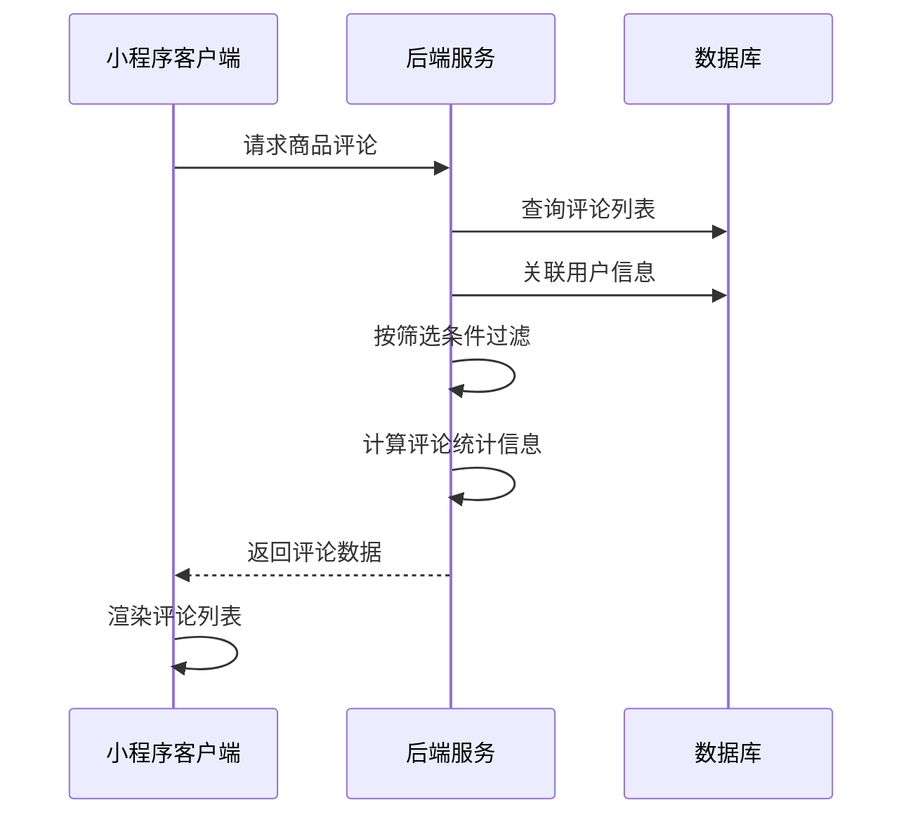
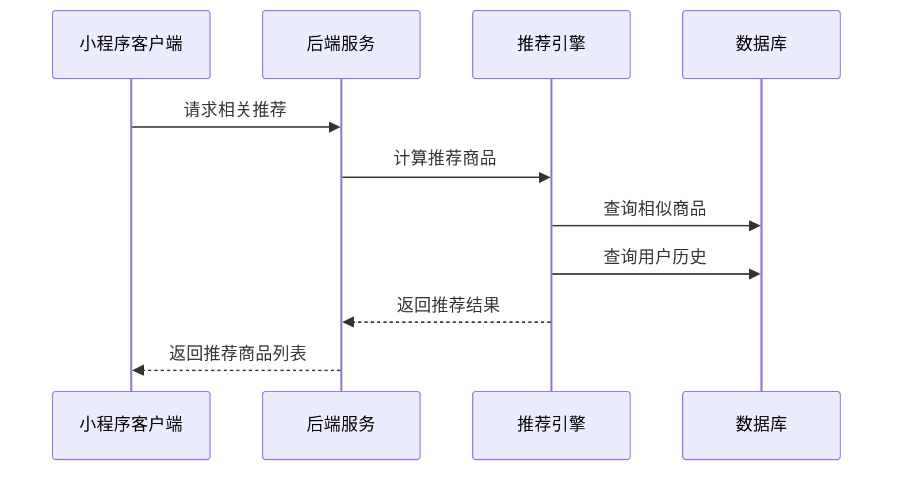
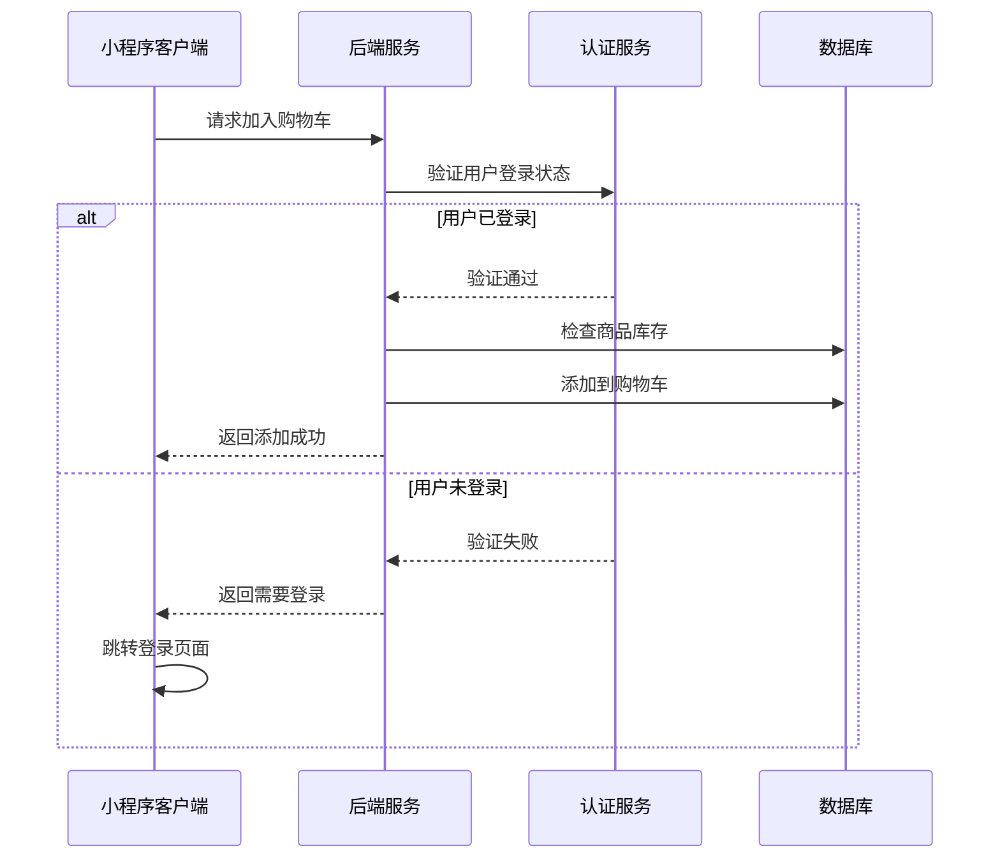
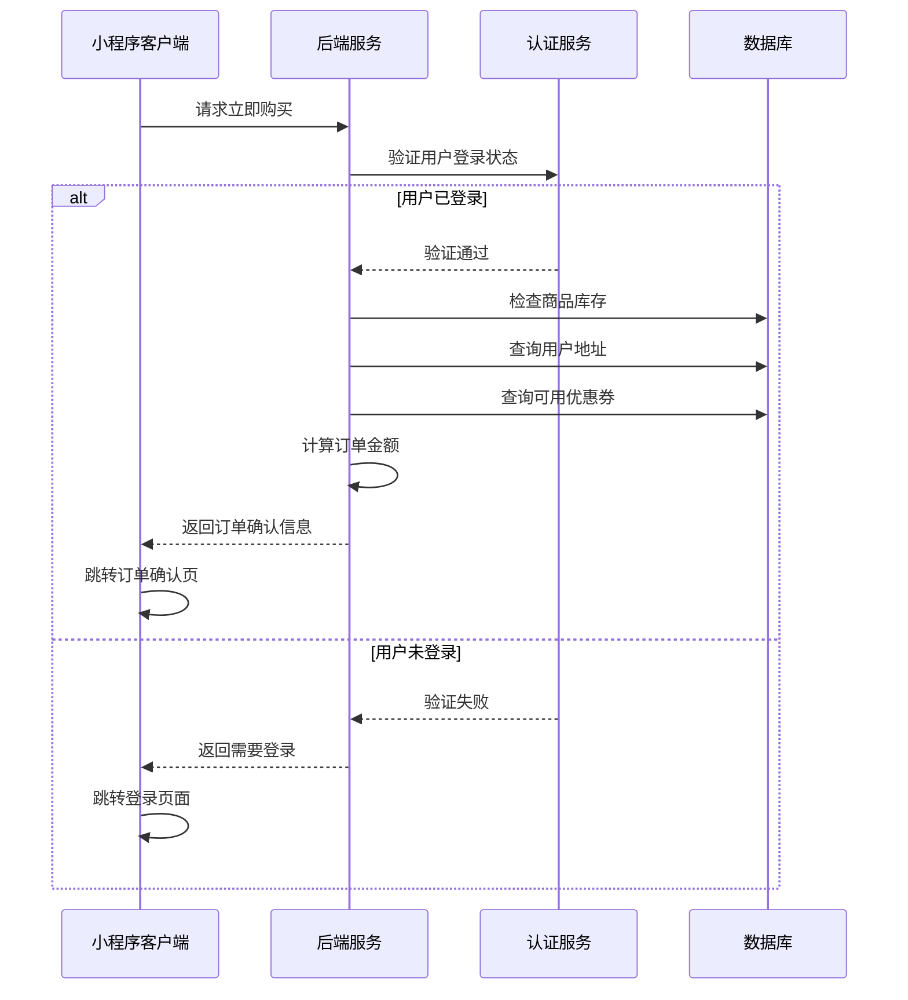
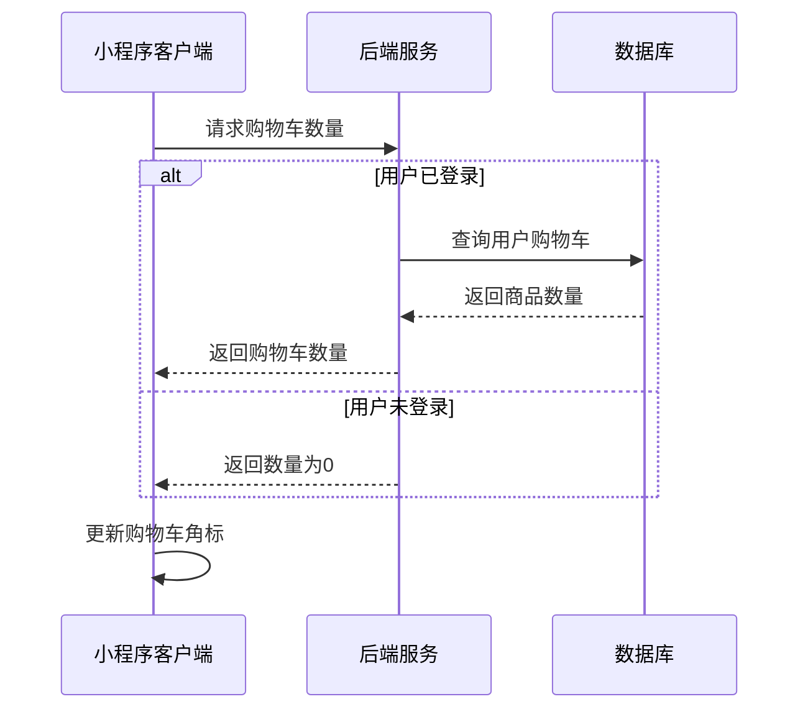
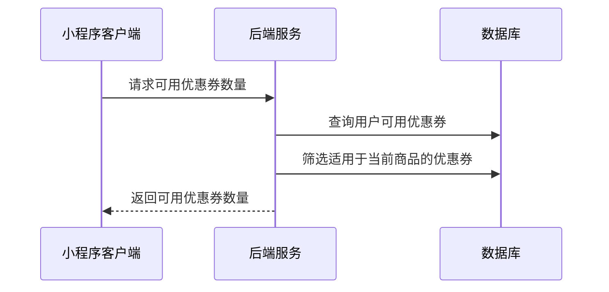

# 商品详情页面接口文档（已对齐index.js字段，含详细注释）

## 获取商品详情信息

**接口名称：** 获取商品详情信息
**功能描述：** 获取商品的完整详情信息，包括基本信息、规格、图片、参数等
**接口地址：** /api/products/detail
**请求方式：** GET

### 功能说明
获取商品详情页面需要的完整信息，包括商品基本信息、价格、规格选项、图文详情等。支持不同规格商品的价格展示。


### 请求参数
```json
{
  "productId": "product_101"
}
```

| 参数名 | 类型 | 必填 | 说明 | 示例值 |
|----|---|-----|---|-----|
| productId | string | 是 | 商品唯一ID | product_101 |

### 响应参数
```json
{
  "error": 0,
  "body": {
    "product": {
      "id": "product_101", // 商品唯一ID
      "name": "YONEX尤尼克斯ARC-11羽毛球拍", // 商品名称
      "description": "专业羽毛球拍，适合进阶选手", // 商品描述
      "brand": "YONEX", // 商品品牌
      "price": "899.00", // 当前价格
      "originalPrice": "1099.00", // 原价
      "salesCount": 268, // 销量
      "shippingInfo": "24小时发货", // 发货信息
      "images": [
        "https://images.unsplash.com/photo-1551698618-1dfe5d97d256?w=800", // 商品图片列表
        "https://images.unsplash.com/photo-1551698618-1dfe5d97d256?w=800"
      ],
      "specs": [
        {
          "name": "品牌", // 参数名称
          "value": "YONEX" // 参数值
        },
        {
          "name": "材质",
          "value": "碳纤维"
        },
        {
          "name": "平衡点",
          "value": "290mm"
        }
      ],
      "detailContent": "<p>商品详情HTML内容</p>", // 图文详情HTML
      "optionGroups": [
        {
          "name": "颜色", // 规格组名称
          "options": [
            {
              "value": "蓝色", // 规格值
              "selected": false, // 是否选中
              "disabled": false // 是否禁用
            },
            {
              "value": "红色",
              "selected": false,
              "disabled": false
            }
          ]
        },
        {
          "name": "重量",
          "options": [
            {
              "value": "3U",
              "selected": false,
              "disabled": false
            },
            {
              "value": "4U",
              "selected": false,
              "disabled": false
            }
          ]
        }
      ]
    }
  },
  "message": "获取商品详情成功",
  "success": true
}
```

| 参数名 | 类型 | 必填 | 说明 | 示例值 |
|----|---|-----|---|-----|
| error | int | 是 | 错误码，0表示成功 | 0 |
| body | object | 是 | 响应数据 | |
| body.product | object | 是 | 商品详情信息 | |
| body.product.id | string | 是 | 商品唯一ID | product_101 |
| body.product.name | string | 是 | 商品名称 | YONEX尤尼克斯ARC-11羽毛球拍 |
| body.product.description | string | 是 | 商品描述 | 专业羽毛球拍，适合进阶选手 |
| body.product.brand | string | 是 | 商品品牌 | YONEX |
| body.product.price | string | 是 | 当前价格 | 899.00 |
| body.product.originalPrice | string | 否 | 原价 | 1099.00 |
| body.product.salesCount | int | 是 | 销量 | 268 |
| body.product.shippingInfo | string | 是 | 发货信息 | 24小时发货 |
| body.product.images | array | 是 | 商品图片列表 | |
| body.product.specs | array | 是 | 商品参数列表 | |
| body.product.specs[].name | string | 是 | 参数名称 | 品牌 |
| body.product.specs[].value | string | 是 | 参数值 | YONEX |
| body.product.detailContent | string | 是 | 图文详情HTML | <p>商品详情HTML内容</p> |
| body.product.optionGroups | array | 是 | 规格组列表 | |
| body.product.optionGroups[].name | string | 是 | 规格组名称 | 颜色 |
| body.product.optionGroups[].options | array | 是 | 规格选项列表 | |
| body.product.optionGroups[].options[].value | string | 是 | 规格值 | 蓝色 |
| body.product.optionGroups[].options[].selected | bool | 是 | 是否选中 | false |
| body.product.optionGroups[].options[].disabled | bool | 是 | 是否禁用 | false |
| message | string | 是 | 响应消息 | 获取商品详情成功 |
| success | bool | 是 | 是否成功 | true |

---

## 获取商品评论列表

**接口名称：** 获取商品评论列表
**功能描述：** 获取指定商品的用户评论列表，支持分页和筛选
**接口地址：** /api/products/comments
**请求方式：** GET

### 功能说明
获取商品的用户评论信息，包括评论内容、评分、用户信息、评论图片等。支持按评分筛选、有图筛选等功能，用于商品详情页评论预览和评论详情页。



### 请求参数
```json
{
  "productId": "product_101",
  "page": 1,
  "pageSize": 10,
  "filter": "all"
}
```

| 参数名 | 类型 | 必填 | 说明 | 示例值 |
|----|---|-----|---|-----|
| productId | string | 是 | 商品ID | product_101 |
| page | int | 否 | 页码（默认1） | 1 |
| pageSize | int | 否 | 每页数量（默认10） | 10 |
| filter | string | 否 | 筛选类型（all全部/withImage有图/positive好评/negative差评） | all |

### 响应参数
```json
{
  "error": 0,
  "body": {
    "comments": {
      "total": 156, // 评论总数
      "averageRating": 4.6, // 平均评分
      "tags": ["质量很好", "发货快", "包装精美", "性价比高"], // 评论标签
      "list": [
        {
          "id": "comment_001", // 评论ID
          "username": "张***", // 用户名（脱敏）
          "userAvatar": "https://example.com/avatar.jpg", // 用户头像
          "rating": 5, // 评分（1-5）
          "content": "非常满意的一次购物体验，羽毛球拍质量很好，手感不错！", // 评论内容
          "images": [
            "https://example.com/comment1.jpg", // 评论图片
            "https://example.com/comment2.jpg"
          ],
          "createTime": "2024-12-15 14:30:00" // 评论时间
        }
      ]
    }
  },
  "message": "获取评论成功",
  "success": true
}
```

| 参数名 | 类型 | 必填 | 说明 | 示例值 |
|----|---|-----|---|-----|
| error | int | 是 | 错误码，0表示成功 | 0 |
| body | object | 是 | 响应数据 | |
| body.comments | object | 是 | 评论数据 | |
| body.comments.total | int | 是 | 评论总数 | 156 |
| body.comments.averageRating | number | 是 | 平均评分 | 4.6 |
| body.comments.tags | array | 是 | 评论标签 | ["质量很好", "发货快"] |
| body.comments.list | array | 是 | 评论列表 | |
| body.comments.list[].id | string | 是 | 评论ID | comment_001 |
| body.comments.list[].username | string | 是 | 用户名（脱敏） | 张*** |
| body.comments.list[].userAvatar | string | 否 | 用户头像 | https://example.com/avatar.jpg |
| body.comments.list[].rating | int | 是 | 评分（1-5） | 5 |
| body.comments.list[].content | string | 是 | 评论内容 | 非常满意的一次购物体验 |
| body.comments.list[].images | array | 否 | 评论图片 | |
| body.comments.list[].createTime | string | 是 | 评论时间 | 2024-12-15 14:30:00 |
| message | string | 是 | 响应消息 | 获取评论成功 |
| success | bool | 是 | 是否成功 | true |

---

## 获取相关推荐商品

**接口名称：** 获取相关推荐商品
**功能描述：** 根据当前商品推荐相关商品，用于商品详情页推荐区域
**接口地址：** /api/products/related
**请求方式：** GET

### 功能说明
基于当前商品的分类、品牌、价格等特征，推荐相关的商品。推荐算法考虑用户浏览历史、商品相似度、销量等因素。



### 请求参数
```json
{
  "productId": "product_101",
  "limit": 10
}
```

| 参数名 | 类型 | 必填 | 说明 | 示例值 |
|----|---|-----|---|-----|
| productId | string | 是 | 当前商品ID | product_101 |
| limit | int | 否 | 推荐数量限制（默认10） | 10 |

### 响应参数
```json
{
  "error": 0,
  "body": {
    "relatedProducts": [
      {
        "id": "product_102", // 商品ID
        "name": "威克多胜利TK-F隼羽毛球拍", // 商品名称
        "imageUrl": "https://images.unsplash.com/photo-1551698618-1dfe5d97d256?w=300", // 商品主图
        "price": "758.00" // 当前价格
      }
    ]
  },
  "message": "获取推荐商品成功",
  "success": true
}
```

| 参数名 | 类型 | 必填 | 说明 | 示例值 |
|----|---|-----|---|-----|
| error | int | 是 | 错误码，0表示成功 | 0 |
| body | object | 是 | 响应数据 | |
| body.relatedProducts | array | 是 | 推荐商品列表 | |
| body.relatedProducts[].id | string | 是 | 商品ID | product_102 |
| body.relatedProducts[].name | string | 是 | 商品名称 | 威克多胜利TK-F隼羽毛球拍 |
| body.relatedProducts[].imageUrl | string | 是 | 商品主图 | https://example.com/product.jpg |
| body.relatedProducts[].price | string | 是 | 当前价格 | 758.00 |
| message | string | 是 | 响应消息 | 获取推荐商品成功 |
| success | bool | 是 | 是否成功 | true |

---

## 加入购物车

**接口名称：** 加入购物车
**功能描述：** 将选择的商品和规格添加到用户购物车
**接口地址：** /api/cart/add
**请求方式：** POST

### 功能说明
用户在商品详情页选择规格后，将商品添加到购物车。**此接口需要用户登录状态，未登录用户需要先引导登录。** 如果购物车中已存在相同商品和规格，则增加数量。



### 请求参数
```json
{
  "productId": "product_101",
  "quantity": 1,
  "specs": {
    "颜色": "蓝色",
    "重量": "4U"
  },
  "remark": "请小心包装"
}
```

| 参数名 | 类型 | 必填 | 说明 | 示例值 |
|----|---|-----|---|-----|
| productId | string | 是 | 商品ID | product_101 |
| quantity | int | 是 | 添加数量 | 1 |
| specs | object | 是 | 选择的规格 | {"颜色": "蓝色", "重量": "4U"} |
| remark | string | 否 | 备注信息 | 请小心包装 |

### 响应参数
```json
{
  "error": 0,
  "body": {
    "success": true, // 是否添加成功
    "message": "添加到购物车成功" // 结果消息
  },
  "message": "添加到购物车成功",
  "success": true
}
```

| 参数名 | 类型 | 必填 | 说明 | 示例值 |
|----|---|-----|---|-----|
| error | int | 是 | 错误码，0成功/401未登录/400参数错误 | 0 |
| body | object | 是 | 响应数据 | |
| body.success | bool | 是 | 是否添加成功 | true |
| body.message | string | 是 | 结果消息 | 添加到购物车成功 |
| message | string | 是 | 响应消息 | 添加到购物车成功 |
| success | bool | 是 | 是否成功 | true |

---

## 立即购买

**接口名称：** 立即购买商品
**功能描述：** 直接购买商品，跳转到订单确认页面
**接口地址：** /api/orders/buy-now
**请求方式：** POST

### 功能说明
用户选择商品规格后直接购买，生成临时订单信息并返回订单确认页面所需数据。**此接口需要用户登录状态。** 包含商品信息、收货地址、可用优惠券等。



### 请求参数
```json
{
  "productId": "product_101",
  "quantity": 1,
  "specs": {
    "颜色": "蓝色",
    "重量": "4U"
  },
  "remark": "请小心包装"
}
```

| 参数名 | 类型 | 必填 | 说明 | 示例值 |
|----|---|-----|---|-----|
| productId | string | 是 | 商品ID | product_101 |
| quantity | int | 是 | 购买数量 | 1 |
| specs | object | 是 | 选择的规格 | {"颜色": "蓝色", "重量": "4U"} |
| remark | string | 否 | 订单备注 | 请小心包装 |

### 响应参数
```json
{
  "error": 0,
  "body": {
    "orderData": {
      "product": {
        "productId": "product_101", // 商品ID
        "name": "YONEX尤尼克斯ARC-11羽毛球拍", // 商品名称
        "image": "https://example.com/product.jpg", // 商品图片
        "spec": "颜色：蓝色 重量：4U", // 选择的规格
        "price": 899.00, // 商品单价
        "quantity": 1, // 购买数量
        "subtotal": 899.00 // 商品小计
      },
      "address": {
        "addressId": "addr_001", // 地址ID
        "recipientName": "张三", // 收件人
        "phone": "138****5678", // 联系电话
        "region": "广东省 深圳市 南山区", // 地区
        "detailAddress": "科技园南区深圳软件园" // 详细地址
      },
      "priceDetail": {
        "productAmount": 899.00, // 商品金额
        "shippingFee": 0.00, // 运费
        "discountAmount": 0.00, // 优惠金额
        "totalAmount": 899.00 // 总金额
      },
      "remark": "请小心包装" // 订单备注
    }
  },
  "message": "获取订单预览成功",
  "success": true
}
```

| 参数名 | 类型 | 必填 | 说明 | 示例值 |
|----|---|-----|---|-----|
| error | int | 是 | 错误码，0成功/401未登录 | 0 |
| body | object | 是 | 响应数据 | |
| body.orderData | object | 是 | 订单数据 | |
| body.orderData.product | object | 是 | 商品信息 | |
| body.orderData.product.productId | string | 是 | 商品ID | product_101 |
| body.orderData.product.name | string | 是 | 商品名称 | YONEX尤尼克斯ARC-11羽毛球拍 |
| body.orderData.product.image | string | 是 | 商品图片 | https://example.com/product.jpg |
| body.orderData.product.spec | string | 是 | 选择的规格 | 颜色：蓝色 重量：4U |
| body.orderData.product.price | number | 是 | 商品单价 | 899.00 |
| body.orderData.product.quantity | int | 是 | 购买数量 | 1 |
| body.orderData.product.subtotal | number | 是 | 商品小计 | 899.00 |
| body.orderData.address | object | 否 | 收货地址信息 | |
| body.orderData.address.addressId | string | 是 | 地址ID | addr_001 |
| body.orderData.address.recipientName | string | 是 | 收件人 | 张三 |
| body.orderData.address.phone | string | 是 | 联系电话 | 138****5678 |
| body.orderData.address.region | string | 是 | 地区 | 广东省 深圳市 南山区 |
| body.orderData.address.detailAddress | string | 是 | 详细地址 | 科技园南区深圳软件园 |
| body.orderData.priceDetail | object | 是 | 价格明细 | |
| body.orderData.priceDetail.productAmount | number | 是 | 商品金额 | 899.00 |
| body.orderData.priceDetail.shippingFee | number | 是 | 运费 | 0.00 |
| body.orderData.priceDetail.discountAmount | number | 是 | 优惠金额 | 0.00 |
| body.orderData.priceDetail.totalAmount | number | 是 | 总金额 | 899.00 |
| body.orderData.remark | string | 否 | 订单备注 | 请小心包装 |
| message | string | 是 | 响应消息 | 获取订单预览成功 |
| success | bool | 是 | 是否成功 | true |

---

## 获取购物车商品数量

**接口名称：** 获取购物车商品数量
**功能描述：** 获取当前用户购物车中商品的总数量，用于显示购物车角标
**接口地址：** /api/cart/count
**请求方式：** GET

### 功能说明
获取用户购物车中商品的总数量，用于在商品详情页底部购物车按钮上显示角标。未登录用户返回0。



### 请求参数
无需传入参数（需要用户登录态，未登录返回0）

### 响应参数
```json
{
  "error": 0,
  "body": {
    "cartCount": 5 // 购物车商品总数量
  },
  "message": "获取购物车数量成功",
  "success": true
}
```

| 参数名 | 类型 | 必填 | 说明 | 示例值 |
|----|---|-----|---|-----|
| error | int | 是 | 错误码，0表示成功 | 0 |
| body | object | 是 | 响应数据 | |
| body.cartCount | int | 是 | 购物车商品总数量 | 5 |
| message | string | 是 | 响应消息 | 获取购物车数量成功 |
| success | bool | 是 | 是否成功 | true |

---

## 获取可用优惠券数量

**接口名称：** 获取可用优惠券数量
**功能描述：** 获取当前商品可用的优惠券数量
**接口地址：** /api/coupons/available-count
**请求方式：** GET

### 功能说明
获取当前商品可用的优惠券数量，用于商品详情页优惠券按钮显示。



### 请求参数
无需传入参数（需要用户登录态）

### 响应参数
```json
{
  "error": 0,
  "body": {
    "availableCount": 3 // 可用优惠券数量
  },
  "message": "获取可用优惠券数量成功",
  "success": true
}
```

| 参数名 | 类型 | 必填 | 说明 | 示例值 |
|----|---|-----|---|-----|
| error | int | 是 | 错误码，0表示成功 | 0 |
| body | object | 是 | 响应数据 | |
| body.availableCount | int | 是 | 可用优惠券数量 | 3 |
| message | string | 是 | 响应消息 | 获取可用优惠券数量成功 |
| success | bool | 是 | 是否成功 | true |