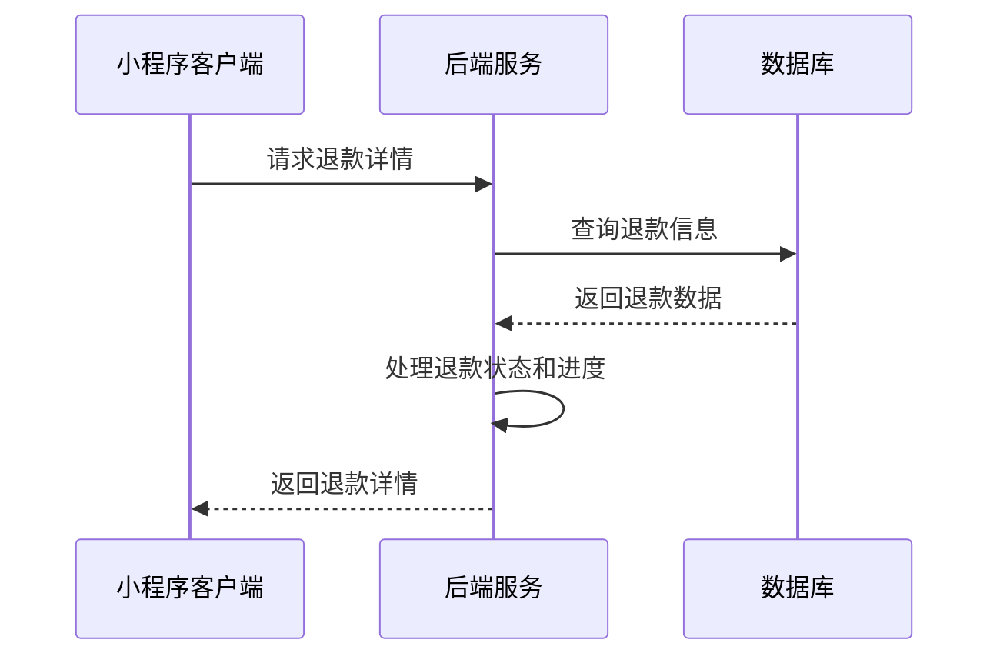

# 退款详情页面 API 接口文档

## 获取退款详情

**接口名称：** 获取退款详情信息
**功能描述：** 根据订单号和退款编号获取退款的详细信息，包括商品信息、退款状态、退款进度等
**接口地址：** /api/refund/detail
**请求方式：** POST

### 功能说明
该接口用于获取用户的退款详情信息，包括：
- 商品基本信息（图片、标题、规格、数量、价格）
- 退款状态信息（金额、状态、退款方式、申请原因、时间节点）
- 退款进度时间线（申请提交、商家处理、退款完成等步骤）

业务流程：


### 请求参数
```json
{
  "orderNo": "202401160001",
  "refundNo": "RF202401160001"
}
```

| 参数名 | 类型 | 必填 | 说明 | 示例值 |
|----|---|-----|---|-----|
| orderNo | string | 是 | 订单编号 | 202401160001 |
| refundNo | string | 是 | 退款编号 | RF202401160001 |

### 响应参数
```json
{
  "error": 0,
  "body": {
    "productInfo": {
      "image": "https://img.alicdn.com/tfs/TB1V4g3d.H1gK0jSZSyXXXtlpXa-400-400.png",
      "title": "苹果iPhone 15 Pro Max 1TB 天然钛金色",
      "spec": "天然钛金色 1TB",
      "quantity": 1,
      "price": 9999.00
    },
    "refundInfo": {
      "amount": 9999.00,
      "status": "refunding",
      "statusText": "退款中",
      "refundMethod": "original",
      "refundMethodText": "原路退回",
      "reason": "不想要了",
      "applyTime": "2024-01-16 10:30:25",
      "processTime": "2024-01-16 14:20:30",
      "completeTime": ""
    },
    "progressList": [
      {
        "step": 1,
        "title": "申请提交",
        "desc": "您已提交退款申请",
        "time": "2024-01-16 10:30:25",
        "status": "completed"
      },
      {
        "step": 2,
        "title": "商家处理",
        "desc": "商家正在审核您的退款申请",
        "time": "2024-01-16 14:20:30",
        "status": "current"
      },
      {
        "step": 3,
        "title": "退款完成",
        "desc": "退款将原路返回您的支付账户",
        "time": "",
        "status": "pending"
      }
    ]
  },
  "message": "获取退款详情成功",
  "success": true
}
```

| 参数名 | 类型 | 必填 | 说明 | 示例值 |
|----|---|-----|---|-----|
| error | int | 是 | 错误码，0表示成功 | 0 |
| body | object | 是 | 响应数据 | |
| body.productInfo | object | 是 | 商品信息 | |
| body.productInfo.image | string | 是 | 商品主图URL | https://img.alicdn.com/tfs/TB1V4g3d.H1gK0jSZSyXXXtlpXa-400-400.png |
| body.productInfo.title | string | 是 | 商品标题 | 苹果iPhone 15 Pro Max 1TB 天然钛金色 |
| body.productInfo.spec | string | 是 | 商品规格 | 天然钛金色 1TB |
| body.productInfo.quantity | int | 是 | 商品数量 | 1 |
| body.productInfo.price | float | 是 | 商品单价 | 9999.00 |
| body.refundInfo | object | 是 | 退款信息 | |
| body.refundInfo.amount | float | 是 | 退款金额 | 9999.00 |
| body.refundInfo.status | string | 是 | 退款状态：refunding-退款中，completed-已完成，rejected-已驳回 | refunding |
| body.refundInfo.statusText | string | 是 | 退款状态文字描述 | 退款中 |
| body.refundInfo.refundMethod | string | 是 | 退款方式：original-原路退回，wechat-微信零钱 | original |
| body.refundInfo.refundMethodText | string | 是 | 退款方式文字描述 | 原路退回 |
| body.refundInfo.reason | string | 是 | 退款原因 | 不想要了 |
| body.refundInfo.applyTime | string | 是 | 申请时间 | 2024-01-16 10:30:25 |
| body.refundInfo.processTime | string | 否 | 处理时间，未处理时为空 | 2024-01-16 14:20:30 |
| body.refundInfo.completeTime | string | 否 | 完成时间，未完成时为空 | |
| body.progressList | array | 是 | 退款进度时间线 | |
| body.progressList[].step | int | 是 | 步骤序号 | 1 |
| body.progressList[].title | string | 是 | 步骤标题 | 申请提交 |
| body.progressList[].desc | string | 是 | 步骤描述 | 您已提交退款申请 |
| body.progressList[].time | string | 否 | 步骤时间，未到达时为空 | 2024-01-16 10:30:25 |
| body.progressList[].status | string | 是 | 步骤状态：completed-已完成，current-当前步骤，pending-待处理，rejected-已驳回 | completed |
| message | string | 是 | 响应消息 | 获取退款详情成功 |
| success | bool | 是 | 是否成功 | true |

### 错误响应
```json
{
  "error": 1001,
  "body": null,
  "message": "退款记录不存在",
  "success": false
}
```

### 错误码说明
| 错误码 | 说明 |
|-------|------|
| 0 | 成功 |
| 1001 | 退款记录不存在 |
| 1002 | 订单号格式错误 |
| 1003 | 退款编号格式错误 |
| 1004 | 无权限查看该退款记录 |
| 5000 | 服务器内部错误 |

### 接口调用示例
```javascript
// 微信小程序中的调用示例
const refundData = await wx.request({
  url: '/api/refund/detail',
  method: 'POST',
  header: {
    'Content-Type': 'application/json',
    'Authorization': 'Bearer ' + wx.getStorageSync('token') // 需要用户登录token
  },
  data: {
    orderNo: '202401160001',
    refundNo: 'RF202401160001'
  }
});
```

### 注意事项
1. 该接口需要用户登录，请求头中需要携带有效的Authorization token
2. 用户只能查看自己的退款记录，不能查看他人的退款信息
3. 退款状态和进度信息会实时更新，建议在页面显示时刷新数据
4. 图片URL建议使用CDN加速，提高加载速度
5. 时间格式统一使用 "YYYY-MM-DD HH:mm:ss" 格式
6. 退款金额保留两位小数，单位为元 