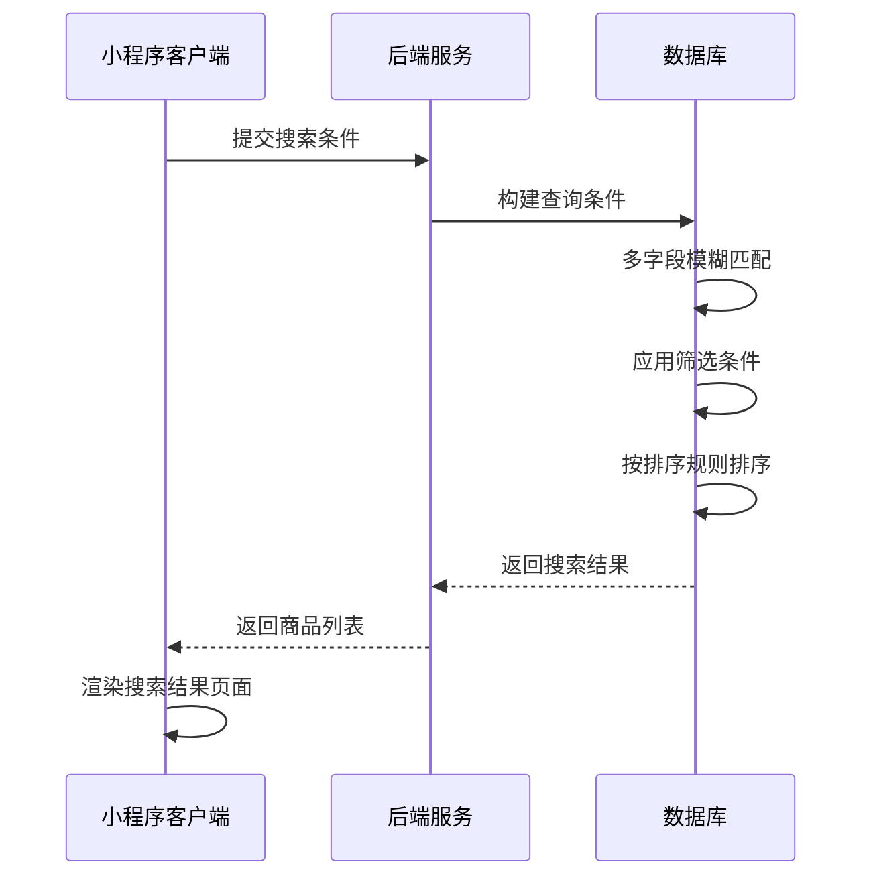
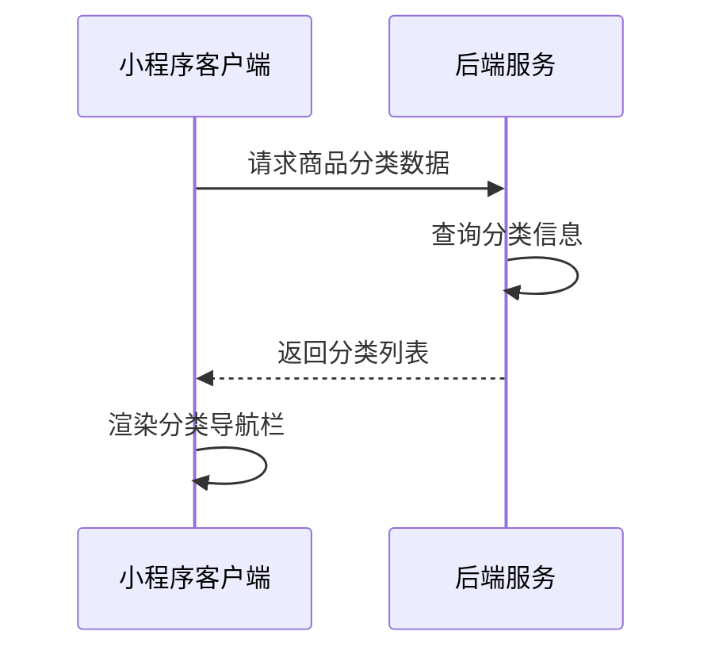
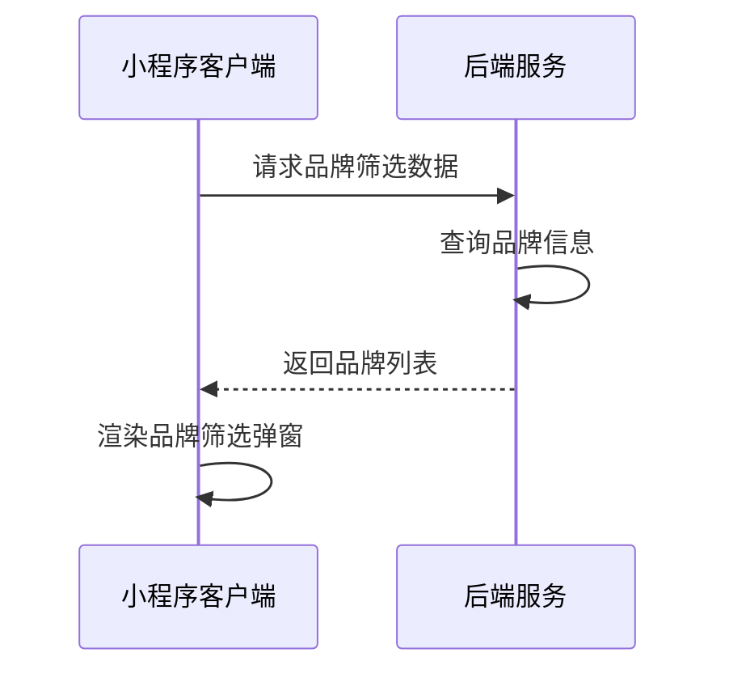
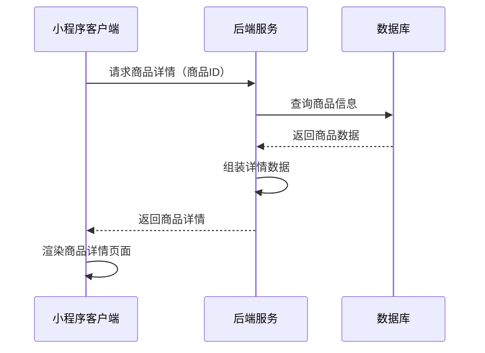

# 搜索结果页面接口文档

## 商品综合搜索

**接口名称：** 商品综合搜索
**功能描述：** 根据关键词、分类、品牌等条件搜索商品，支持多重筛选和排序
**接口地址：** /api/products/search
**请求方式：** GET

### 功能说明
提供商品的综合搜索功能，支持关键词搜索、分类筛选、品牌筛选、价格排序、销量排序等多种条件组合。搜索结果按相关度和排序规则进行排序，支持分页加载。



### 请求参数
```json
{
  "keyword": "羽毛球拍",
  "categoryId": 1,
  "brandIds": [1, 2, 3],
  "sortType": "sales",
  "sortDirection": "desc",
  "page": 1,
  "pageSize": 10
}
```

| 参数名 | 类型 | 必填 | 说明 | 示例值 |
|----|---|-----|---|-----|
| keyword | string | 否 | 搜索关键词 | 羽毛球拍 |
| categoryId | int | 否 | 分类ID（0表示全部） | 1 |
| brandIds | array | 否 | 品牌ID数组 | [1, 2, 3] |
| sortType | string | 否 | 排序类型（sales销量/price价格） | sales |
| sortDirection | string | 否 | 排序方向（desc降序/asc升序） | desc |
| page | int | 否 | 页码（默认1） | 1 |
| pageSize | int | 否 | 每页数量（默认10） | 10 |

**sortType参数说明：**
- `sales`：销量排序
- `price`：价格排序

**sortDirection参数说明：**
- `desc`：降序（从大到小）
- `asc`：升序（从小到大）

### 响应参数
```json
{
  "error": 0,
  "body": {
    "products": [
      {
        "id": 1,
        "title": "YONEX尤尼克斯羽毛球拍单拍超轻碳纤维进攻型球拍ARC11",
        "image": "https://via.placeholder.com/300x300/4a90e2/ffffff?text=羽毛球拍",
        "price": 299,
        "originalPrice": 399,
        "sales": 1200,
        "rating": 4.9,
        "brand": "尤尼克斯",
        "category": "羽毛球拍",
        "tags": ["专业", "进攻型"]
      }
    ],
    "pagination": {
      "page": 1,
      "pageSize": 10,
      "total": 156,
      "hasMore": true
    }
  },
  "message": "搜索商品成功",
  "success": true
}
```

| 参数名 | 类型 | 必填 | 说明 | 示例值 |
|----|---|-----|---|-----|
| error | int | 是 | 错误码，0表示成功 | 0 |
| body | object | 是 | 响应数据 | |
| body.products | array | 是 | 搜索结果商品列表 | |
| body.products[].id | int | 是 | 商品ID | 1 |
| body.products[].title | string | 是 | 商品标题 | YONEX尤尼克斯羽毛球拍单拍超轻碳纤维进攻型球拍ARC11 |
| body.products[].image | string | 是 | 商品主图URL | https://via.placeholder.com/300x300/4a90e2/ffffff?text=羽毛球拍 |
| body.products[].price | number | 是 | 当前价格 | 299 |
| body.products[].originalPrice | number | 否 | 原价（用于显示划线价） | 399 |
| body.products[].sales | int | 是 | 月销量 | 1200 |
| body.products[].rating | number | 否 | 商品评分（1-5分） | 4.9 |
| body.products[].brand | string | 是 | 品牌名称 | 尤尼克斯 |
| body.products[].category | string | 是 | 分类名称 | 羽毛球拍 |
| body.products[].tags | array | 否 | 商品标签 | ["专业", "进攻型"] |
| body.pagination | object | 是 | 分页信息 | |
| body.pagination.page | int | 是 | 当前页码 | 1 |
| body.pagination.pageSize | int | 是 | 每页数量 | 10 |
| body.pagination.total | int | 是 | 总记录数 | 156 |
| body.pagination.hasMore | bool | 是 | 是否有更多数据 | true |
| message | string | 是 | 响应消息 | 搜索商品成功 |
| success | bool | 是 | 是否成功 | true |

---

## 获取商品分类列表

**接口名称：** 获取商品分类列表
**功能描述：** 获取搜索页面顶部分类导航所需的分类数据
**接口地址：** /api/products/categories
**请求方式：** GET

### 功能说明
获取搜索结果页面顶部分类导航栏需要的分类数据，包含分类名称、图标等信息。用于用户快速切换商品分类进行筛选。



### 请求参数
无需传入参数

### 响应参数
```json
{
  "error": 0,
  "body": {
    "categories": [
      {
        "id": 1,
        "name": "羽毛球拍",
        "icon": "🏸"
      },
      {
        "id": 2,
        "name": "羽毛球鞋",
        "icon": "👟"
      },
      {
        "id": 3,
        "name": "球服",
        "icon": "👕"
      },
      {
        "id": 4,
        "name": "球包",
        "icon": "🎒"
      },
      {
        "id": 5,
        "name": "羽毛球",
        "icon": "🏸"
      },
      {
        "id": 6,
        "name": "运动配件",
        "icon": "⚡"
      }
    ]
  },
  "message": "获取分类列表成功",
  "success": true
}
```

| 参数名 | 类型 | 必填 | 说明 | 示例值 |
|----|---|-----|---|-----|
| error | int | 是 | 错误码，0表示成功 | 0 |
| body | object | 是 | 响应数据 | |
| body.categories | array | 是 | 分类列表 | |
| body.categories[].id | int | 是 | 分类唯一ID | 1 |
| body.categories[].name | string | 是 | 分类名称 | 羽毛球拍 |
| body.categories[].icon | string | 是 | 分类图标（emoji） | 🏸 |
| message | string | 是 | 响应消息 | 获取分类列表成功 |
| success | bool | 是 | 是否成功 | true |

---

## 获取品牌筛选数据

**接口名称：** 获取品牌筛选数据
**功能描述：** 获取品牌筛选弹窗所需的品牌列表数据
**接口地址：** /api/products/brands
**请求方式：** GET

### 功能说明
获取搜索结果页面品牌筛选弹窗需要的品牌数据，包含品牌名称、选中状态等信息。



### 请求参数
无需传入参数

### 响应参数
```json
{
  "error": 0,
  "body": {
    "brands": [
      {
        "id": 1,
        "name": "李宁",
        "selected": false
      },
      {
        "id": 2,
        "name": "威克多",
        "selected": false
      },
      {
        "id": 3,
        "name": "倍特爱",
        "selected": false
      },
      {
        "id": 4,
        "name": "威肯",
        "selected": false
      },
      {
        "id": 5,
        "name": "超牌",
        "selected": false
      },
      {
        "id": 6,
        "name": "泰昂",
        "selected": false
      },
      {
        "id": 7,
        "name": "翎美",
        "selected": false
      },
      {
        "id": 8,
        "name": "尤尼克斯",
        "selected": false
      },
      {
        "id": 9,
        "name": "亚狮龙",
        "selected": false
      },
      {
        "id": 10,
        "name": "GOSEN",
        "selected": false
      }
    ]
  },
  "message": "获取品牌列表成功",
  "success": true
}
```

| 参数名 | 类型 | 必填 | 说明 | 示例值 |
|----|---|-----|---|-----|
| error | int | 是 | 错误码，0表示成功 | 0 |
| body | object | 是 | 响应数据 | |
| body.brands | array | 是 | 品牌列表 | |
| body.brands[].id | int | 是 | 品牌唯一ID | 1 |
| body.brands[].name | string | 是 | 品牌名称 | 李宁 |
| body.brands[].selected | bool | 是 | 是否选中 | false |
| message | string | 是 | 响应消息 | 获取品牌列表成功 |
| success | bool | 是 | 是否成功 | true |

---

## 获取商品详情

**接口名称：** 获取商品详情信息
**功能描述：** 根据商品ID获取商品的详细信息，用于商品详情页面展示
**接口地址：** /api/products/detail
**请求方式：** GET

### 功能说明
获取指定商品的详细信息，包含商品基本信息、价格、库存、规格、评价等完整数据。用户点击商品卡片时跳转到商品详情页。



### 请求参数
```json
{
  "id": 1
}
```

| 参数名 | 类型 | 必填 | 说明 | 示例值 |
|----|---|-----|---|-----|
| id | int | 是 | 商品ID | 1 |

### 响应参数
```json
{
  "error": 0,
  "body": {
    "id": 1,
    "title": "YONEX尤尼克斯羽毛球拍单拍超轻碳纤维进攻型球拍ARC11",
    "image": "https://via.placeholder.com/300x300/4a90e2/ffffff?text=羽毛球拍",
    "price": 299,
    "originalPrice": 399,
    "sales": 1200,
    "rating": 4.9,
    "brand": "尤尼克斯",
    "category": "羽毛球拍",
    "tags": ["专业", "进攻型"]
  },
  "message": "获取商品详情成功",
  "success": true
}
```

| 参数名 | 类型 | 必填 | 说明 | 示例值 |
|----|---|-----|---|-----|
| error | int | 是 | 错误码，0表示成功 | 0 |
| body | object | 是 | 响应数据 | |
| body.id | int | 是 | 商品ID | 1 |
| body.title | string | 是 | 商品标题 | YONEX尤尼克斯羽毛球拍单拍超轻碳纤维进攻型球拍ARC11 |
| body.image | string | 是 | 商品主图URL | https://via.placeholder.com/300x300/4a90e2/ffffff?text=羽毛球拍 |
| body.price | number | 是 | 当前价格 | 299 |
| body.originalPrice | number | 否 | 原价 | 399 |
| body.sales | int | 是 | 月销量 | 1200 |
| body.rating | number | 否 | 商品评分 | 4.9 |
| body.brand | string | 是 | 品牌名称 | 尤尼克斯 |
| body.category | string | 是 | 分类名称 | 羽毛球拍 |
| body.tags | array | 否 | 商品标签 | ["专业", "进攻型"] |
| message | string | 是 | 响应消息 | 获取商品详情成功 |
| success | bool | 是 | 是否成功 | true | 