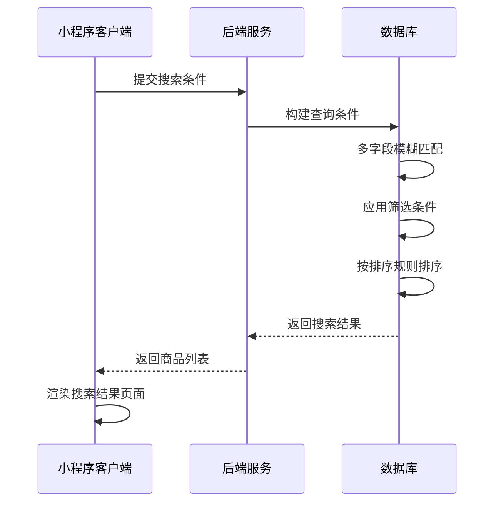
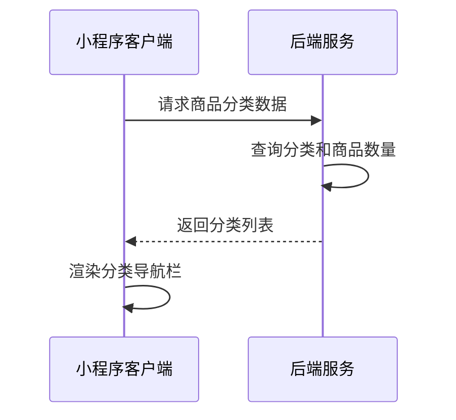
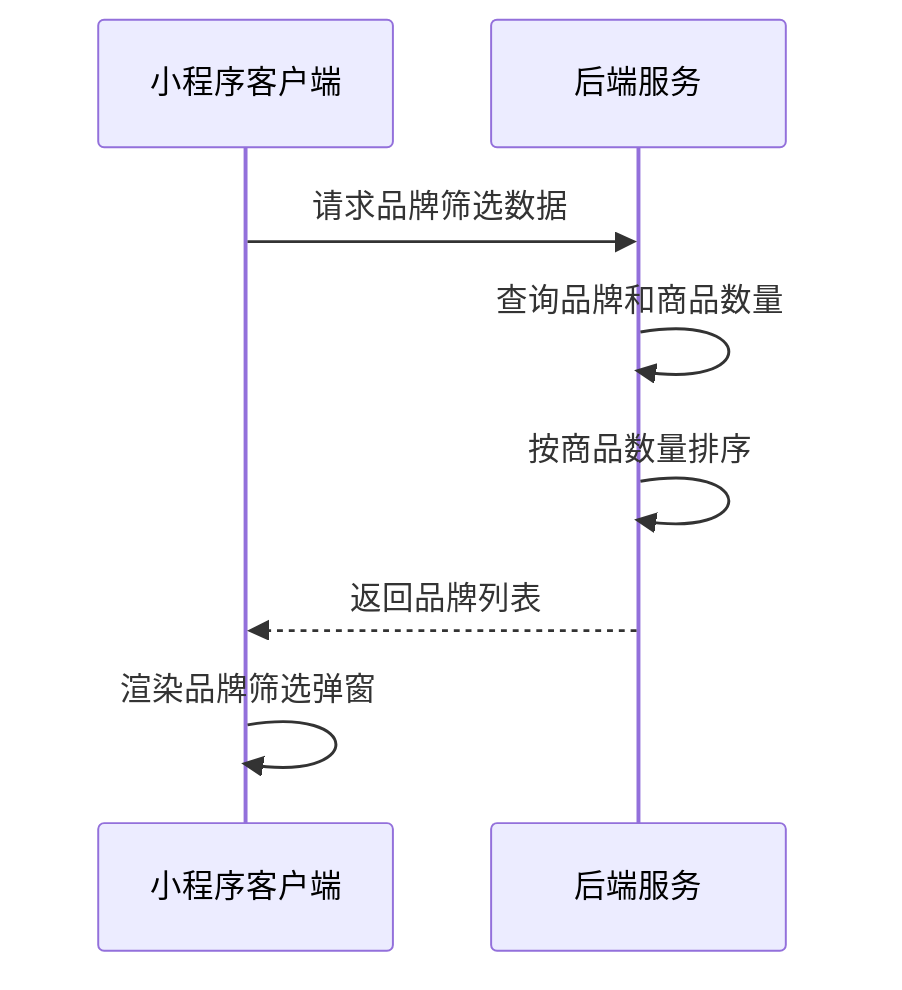
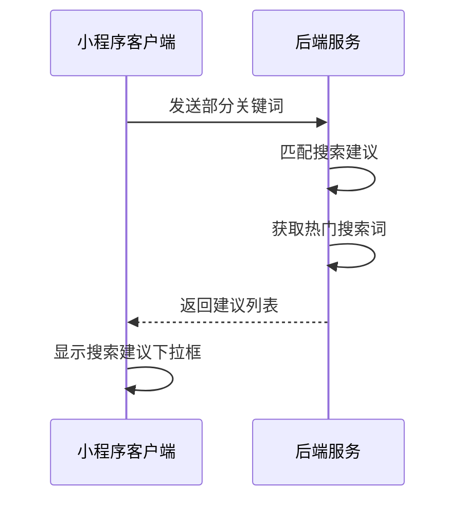
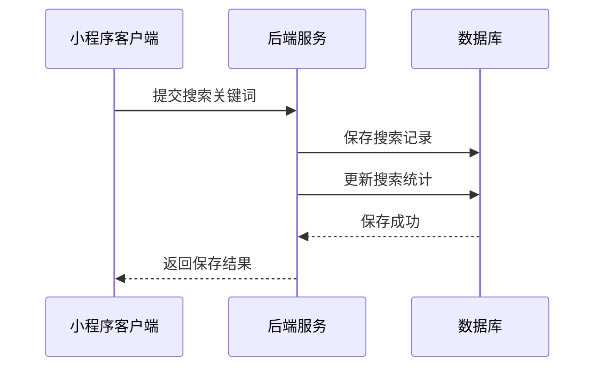
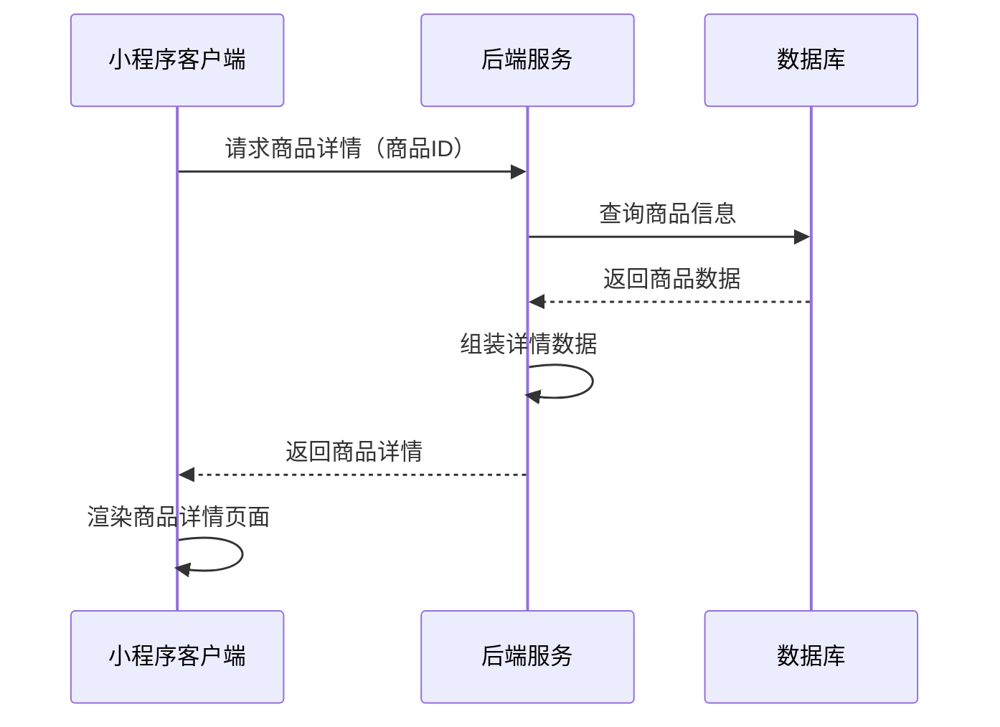

# 搜索结果页面接口文档

## 商品综合搜索

**接口名称：** 商品综合搜索
**功能描述：** 根据关键词、分类、品牌等条件搜索商品，支持多重筛选和排序
**接口地址：** /api/products/search
**请求方式：** GET

### 功能说明
提供商品的综合搜索功能，支持关键词搜索、分类筛选、品牌筛选、价格排序、销量排序等多种条件组合。搜索结果按相关度和排序规则进行排序，支持分页加载。



### 请求参数
```json
{
  "keyword": "羽毛球拍",
  "categoryId": 1,
  "brandIds": [1, 2, 3],
  "sortBy": "sales_desc",
  "sortDirection": "desc",
  "page": 1,
  "pageSize": 20,
  "priceMin": 0,
  "priceMax": 2000
}
```

| 参数名 | 类型 | 必填 | 说明 | 示例值 |
|----|---|-----|---|-----|
| keyword | string | 否 | 搜索关键词 | 羽毛球拍 |
| categoryId | int | 否 | 分类ID（0表示全部） | 1 |
| brandIds | array | 否 | 品牌ID数组 | [1, 2, 3] |
| sortBy | string | 否 | 排序字段 | sales_desc |
| sortDirection | string | 否 | 排序方向 | desc |
| page | int | 否 | 页码（默认1） | 1 |
| pageSize | int | 否 | 每页数量（默认20） | 20 |
| priceMin | number | 否 | 最低价格 | 0 |
| priceMax | number | 否 | 最高价格 | 2000 |

**sortBy参数说明：**
- `relevance`：相关度（默认）
- `sales`：销量
- `price`：价格
- `createTime`：上架时间

**sortDirection参数说明：**
- `asc`：升序（从小到大）
- `desc`：降序（从大到小）

### 响应参数
```json
{
  "error": 0,
  "body": {
    "products": [
      {
        "productId": "product_101",
        "title": "YONEX尤尼克斯ARC-11羽毛球拍",
        "image": "https://images.unsplash.com/photo-1551698618-1dfe5d97d256?w=400",
        "price": 899,
        "originalPrice": 1099,
        "sales": 268,
        "rating": 4.8,
        "brand": "YONEX",
        "brandId": 8,
        "category": "羽毛球拍",
        "categoryId": 1,
        "tags": ["热销", "专业"],
        "relevanceScore": 95,
        "isNew": false,
        "isSeckill": false
      }
    ],
    "pagination": {
      "page": 1,
      "pageSize": 20,
      "total": 156,
      "totalPages": 8,
      "hasMore": true
    },
    "searchSummary": {
      "keyword": "羽毛球拍",
      "totalMatched": 156,
      "searchTime": 145,
      "appliedFilters": {
        "categoryName": "羽毛球拍",
        "brandNames": ["YONEX", "威克多"],
        "priceRange": "0-2000"
      }
    }
  },
  "message": "搜索商品成功",
  "success": true
}
```

| 参数名 | 类型 | 必填 | 说明 | 示例值 |
|----|---|-----|---|-----|
| error | int | 是 | 错误码，0表示成功 | 0 |
| body | object | 是 | 响应数据 | |
| body.products | array | 是 | 搜索结果商品列表 | |
| body.products[].productId | string | 是 | 商品唯一ID | product_101 |
| body.products[].title | string | 是 | 商品标题 | YONEX尤尼克斯ARC-11羽毛球拍 |
| body.products[].image | string | 是 | 商品主图URL | https://example.com/product.jpg |
| body.products[].price | number | 是 | 当前价格 | 899 |
| body.products[].originalPrice | number | 否 | 原价（用于显示划线价） | 1099 |
| body.products[].sales | int | 是 | 月销量 | 268 |
| body.products[].rating | number | 否 | 商品评分（1-5分） | 4.8 |
| body.products[].brand | string | 是 | 品牌名称 | YONEX |
| body.products[].brandId | int | 是 | 品牌ID | 8 |
| body.products[].category | string | 是 | 分类名称 | 羽毛球拍 |
| body.products[].categoryId | int | 是 | 分类ID | 1 |
| body.products[].tags | array | 否 | 商品标签 | ["热销", "专业"] |
| body.products[].relevanceScore | int | 否 | 相关度分数 | 95 |
| body.products[].isNew | bool | 是 | 是否新品 | false |
| body.products[].isSeckill | bool | 是 | 是否秒杀商品 | false |
| body.pagination | object | 是 | 分页信息 | |
| body.pagination.page | int | 是 | 当前页码 | 1 |
| body.pagination.pageSize | int | 是 | 每页数量 | 20 |
| body.pagination.total | int | 是 | 总记录数 | 156 |
| body.pagination.totalPages | int | 是 | 总页数 | 8 |
| body.pagination.hasMore | bool | 是 | 是否有更多数据 | true |
| body.searchSummary | object | 是 | 搜索汇总信息 | |
| body.searchSummary.keyword | string | 否 | 搜索关键词 | 羽毛球拍 |
| body.searchSummary.totalMatched | int | 是 | 匹配商品总数 | 156 |
| body.searchSummary.searchTime | int | 是 | 搜索耗时（毫秒） | 145 |
| body.searchSummary.appliedFilters | object | 是 | 已应用的筛选条件 | |
| body.searchSummary.appliedFilters.categoryName | string | 否 | 分类名称 | 羽毛球拍 |
| body.searchSummary.appliedFilters.brandNames | array | 否 | 品牌名称列表 | ["YONEX", "威克多"] |
| body.searchSummary.appliedFilters.priceRange | string | 否 | 价格范围 | 0-2000 |
| message | string | 是 | 响应消息 | 搜索商品成功 |
| success | bool | 是 | 是否成功 | true |

---

## 获取商品分类列表

**接口名称：** 获取商品分类列表
**功能描述：** 获取搜索页面顶部分类导航所需的分类数据
**接口地址：** /api/products/categories
**请求方式：** GET

### 功能说明
获取搜索结果页面顶部分类导航栏需要的分类数据，包含分类名称、图标、商品数量等信息。用于用户快速切换商品分类进行筛选。



### 请求参数
无需传入参数

### 响应参数
```json
{
  "error": 0,
  "body": {
    "categories": [
      {
        "categoryId": 1,
        "categoryName": "羽毛球拍",
        "icon": "🏸",
        "productCount": 156,
        "isHot": true,
        "sortOrder": 1
      },
      {
        "categoryId": 2,
        "categoryName": "羽毛球鞋",
        "icon": "👟",
        "productCount": 89,
        "isHot": true,
        "sortOrder": 2
      },
      {
        "categoryId": 3,
        "categoryName": "球服",
        "icon": "👕",
        "productCount": 67,
        "isHot": false,
        "sortOrder": 3
      },
      {
        "categoryId": 4,
        "categoryName": "球包",
        "icon": "🎒",
        "productCount": 45,
        "isHot": false,
        "sortOrder": 4
      },
      {
        "categoryId": 5,
        "categoryName": "羽毛球",
        "icon": "🏸",
        "productCount": 34,
        "isHot": false,
        "sortOrder": 5
      },
      {
        "categoryId": 6,
        "categoryName": "运动配件",
        "icon": "⚡",
        "productCount": 78,
        "isHot": false,
        "sortOrder": 6
      }
    ]
  },
  "message": "获取分类列表成功",
  "success": true
}
```

| 参数名 | 类型 | 必填 | 说明 | 示例值 |
|----|---|-----|---|-----|
| error | int | 是 | 错误码，0表示成功 | 0 |
| body | object | 是 | 响应数据 | |
| body.categories | array | 是 | 分类列表 | |
| body.categories[].categoryId | int | 是 | 分类唯一ID | 1 |
| body.categories[].categoryName | string | 是 | 分类名称 | 羽毛球拍 |
| body.categories[].icon | string | 是 | 分类图标（emoji） | 🏸 |
| body.categories[].productCount | int | 是 | 该分类下商品数量 | 156 |
| body.categories[].isHot | bool | 是 | 是否热门分类 | true |
| body.categories[].sortOrder | int | 是 | 排序权重 | 1 |
| message | string | 是 | 响应消息 | 获取分类列表成功 |
| success | bool | 是 | 是否成功 | true |

---

## 获取品牌筛选数据

**接口名称：** 获取品牌筛选数据
**功能描述：** 获取品牌筛选弹窗所需的品牌列表数据
**接口地址：** /api/products/brands
**请求方式：** GET

### 功能说明
获取搜索结果页面品牌筛选弹窗需要的品牌数据，包含品牌名称、logo、商品数量等信息。支持按商品数量排序显示。



### 请求参数
```json
{
  "categoryId": 1,
  "showCount": true
}
```

| 参数名 | 类型 | 必填 | 说明 | 示例值 |
|----|---|-----|---|-----|
| categoryId | int | 否 | 分类ID（可过滤特定分类的品牌） | 1 |
| showCount | bool | 否 | 是否显示商品数量（默认true） | true |

### 响应参数
```json
{
  "error": 0,
  "body": {
    "brands": [
      {
        "brandId": 1,
        "brandName": "李宁",
        "brandLogo": "https://example.com/logo-lining.png",
        "productCount": 78,
        "isPopular": true,
        "firstLetter": "L",
        "sortOrder": 1
      },
      {
        "brandId": 2,
        "brandName": "威克多",
        "brandLogo": "https://example.com/logo-victor.png",
        "productCount": 65,
        "isPopular": true,
        "firstLetter": "W",
        "sortOrder": 2
      },
      {
        "brandId": 3,
        "brandName": "倍特爱",
        "brandLogo": "https://example.com/logo-betai.png",
        "productCount": 45,
        "isPopular": false,
        "firstLetter": "B",
        "sortOrder": 3
      },
      {
        "brandId": 8,
        "brandName": "尤尼克斯",
        "brandLogo": "https://example.com/logo-yonex.png",
        "productCount": 123,
        "isPopular": true,
        "firstLetter": "Y",
        "sortOrder": 4
      }
    ],
    "popularBrands": [1, 2, 8],
    "letterGroups": [
      {
        "letter": "B",
        "brands": [3]
      },
      {
        "letter": "L",
        "brands": [1]
      }
    ]
  },
  "message": "获取品牌列表成功",
  "success": true
}
```

| 参数名 | 类型 | 必填 | 说明 | 示例值 |
|----|---|-----|---|-----|
| error | int | 是 | 错误码，0表示成功 | 0 |
| body | object | 是 | 响应数据 | |
| body.brands | array | 是 | 品牌列表 | |
| body.brands[].brandId | int | 是 | 品牌唯一ID | 1 |
| body.brands[].brandName | string | 是 | 品牌名称 | 李宁 |
| body.brands[].brandLogo | string | 否 | 品牌logo图片URL | https://example.com/logo.png |
| body.brands[].productCount | int | 是 | 该品牌商品数量 | 78 |
| body.brands[].isPopular | bool | 是 | 是否热门品牌 | true |
| body.brands[].firstLetter | string | 是 | 品牌名首字母 | L |
| body.brands[].sortOrder | int | 是 | 排序权重 | 1 |
| body.popularBrands | array | 是 | 热门品牌ID列表 | [1, 2, 8] |
| body.letterGroups | array | 是 | 按字母分组的品牌 | |
| body.letterGroups[].letter | string | 是 | 字母 | B |
| body.letterGroups[].brands | array | 是 | 该字母下的品牌ID | [3] |
| message | string | 是 | 响应消息 | 获取品牌列表成功 |
| success | bool | 是 | 是否成功 | true |

---

## 获取搜索建议

**接口名称：** 获取搜索关键词建议
**功能描述：** 根据用户输入提供搜索关键词建议和热门搜索
**接口地址：** /api/products/search-suggestions
**请求方式：** GET

### 功能说明
在用户输入搜索关键词时，提供实时的搜索建议和热门搜索词，帮助用户快速找到想要的商品。支持模糊匹配和历史搜索记录。



### 请求参数
```json
{
  "keyword": "羽毛",
  "limit": 10
}
```

| 参数名 | 类型 | 必填 | 说明 | 示例值 |
|----|---|-----|---|-----|
| keyword | string | 否 | 部分关键词（为空时返回热门搜索） | 羽毛 |
| limit | int | 否 | 返回建议数量（默认10） | 10 |

### 响应参数
```json
{
  "error": 0,
  "body": {
    "suggestions": [
      {
        "text": "羽毛球拍",
        "type": "keyword",
        "searchCount": 1256,
        "isHot": true
      },
      {
        "text": "羽毛球鞋",
        "type": "keyword",
        "searchCount": 845,
        "isHot": true
      },
      {
        "text": "羽毛球",
        "type": "keyword",
        "searchCount": 623,
        "isHot": false
      }
    ],
    "hotSearches": [
      {
        "text": "YONEX羽毛球拍",
        "searchCount": 2341,
        "trend": "up"
      },
      {
        "text": "威克多球鞋",
        "searchCount": 1876,
        "trend": "stable"
      },
      {
        "text": "羽毛球包",
        "searchCount": 1234,
        "trend": "down"
      }
    ],
    "categories": [
      {
        "categoryId": 1,
        "categoryName": "羽毛球拍",
        "matchReason": "包含关键词"
      }
    ]
  },
  "message": "获取搜索建议成功",
  "success": true
}
```

| 参数名 | 类型 | 必填 | 说明 | 示例值 |
|----|---|-----|---|-----|
| error | int | 是 | 错误码，0表示成功 | 0 |
| body | object | 是 | 响应数据 | |
| body.suggestions | array | 是 | 搜索建议列表 | |
| body.suggestions[].text | string | 是 | 建议关键词 | 羽毛球拍 |
| body.suggestions[].type | string | 是 | 建议类型 | keyword |
| body.suggestions[].searchCount | int | 是 | 搜索次数 | 1256 |
| body.suggestions[].isHot | bool | 是 | 是否热门 | true |
| body.hotSearches | array | 是 | 热门搜索列表 | |
| body.hotSearches[].text | string | 是 | 热门搜索词 | YONEX羽毛球拍 |
| body.hotSearches[].searchCount | int | 是 | 搜索次数 | 2341 |
| body.hotSearches[].trend | string | 是 | 趋势（up上升/stable稳定/down下降） | up |
| body.categories | array | 是 | 匹配的分类 | |
| body.categories[].categoryId | int | 是 | 分类ID | 1 |
| body.categories[].categoryName | string | 是 | 分类名称 | 羽毛球拍 |
| body.categories[].matchReason | string | 是 | 匹配原因 | 包含关键词 |
| message | string | 是 | 响应消息 | 获取搜索建议成功 |
| success | bool | 是 | 是否成功 | true |

---

## 保存搜索记录

**接口名称：** 保存用户搜索记录
**功能描述：** 保存用户的搜索关键词，用于个性化推荐和搜索建议
**接口地址：** /api/products/search-history
**请求方式：** POST

### 功能说明
保存用户的搜索历史记录，用于后续提供个性化的搜索建议和商品推荐。系统会自动去重和限制历史记录数量。



### 请求参数
```json
{
  "keyword": "羽毛球拍",
  "resultCount": 156,
  "searchSource": "search_page"
}
```

| 参数名 | 类型 | 必填 | 说明 | 示例值 |
|----|---|-----|---|-----|
| keyword | string | 是 | 搜索关键词 | 羽毛球拍 |
| resultCount | int | 否 | 搜索结果数量 | 156 |
| searchSource | string | 否 | 搜索来源页面 | search_page |

**searchSource参数说明：**
- `search_page`：搜索结果页面
- `mall_page`：商城首页
- `index_page`：首页搜索

### 响应参数
```json
{
  "error": 0,
  "body": {
    "saved": true,
    "historyCount": 15,
    "searchId": "search_123456"
  },
  "message": "保存搜索记录成功",
  "success": true
}
```

| 参数名 | 类型 | 必填 | 说明 | 示例值 |
|----|---|-----|---|-----|
| error | int | 是 | 错误码，0表示成功 | 0 |
| body | object | 是 | 响应数据 | |
| body.saved | bool | 是 | 是否保存成功 | true |
| body.historyCount | int | 是 | 当前历史记录总数 | 15 |
| body.searchId | string | 是 | 搜索记录唯一ID | search_123456 |
| message | string | 是 | 响应消息 | 保存搜索记录成功 |
| success | bool | 是 | 是否成功 | true |

---

## 获取商品详情

**接口名称：** 获取商品详情信息
**功能描述：** 根据商品ID获取商品的详细信息，用于商品详情页面展示
**接口地址：** /api/products/detail
**请求方式：** GET

### 功能说明
获取指定商品的详细信息，包含商品基本信息、价格、库存、规格、评价等完整数据。用户点击商品卡片时跳转到商品详情页。



### 请求参数
```json
{
  "productId": "product_101"
}
```

| 参数名 | 类型 | 必填 | 说明 | 示例值 |
|----|---|-----|---|-----|
| productId | string | 是 | 商品唯一ID | product_101 |

### 响应参数
```json
{
  "error": 0,
  "body": {
    "productId": "product_101",
    "title": "YONEX尤尼克斯ARC-11羽毛球拍",
    "images": [
      "https://images.unsplash.com/photo-1551698618-1dfe5d97d256?w=800",
      "https://images.unsplash.com/photo-1551698618-1dfe5d97d257?w=800"
    ],
    "price": 899,
    "originalPrice": 1099,
    "discountPercent": 18,
    "sales": 268,
    "stock": 45,
    "rating": 4.8,
    "reviewCount": 156,
    "brand": "YONEX",
    "brandId": 8,
    "category": "羽毛球拍",
    "categoryId": 1,
    "tags": ["热销", "专业"],
    "specifications": [
      {
        "name": "重量",
        "value": "85g±2g"
      },
      {
        "name": "材质",
        "value": "高刚性碳纤维"
      }
    ],
    "variants": [
      {
        "name": "颜色",
        "options": [
          {
            "value": "蓝色",
            "price": 899,
            "stock": 20
          },
          {
            "value": "红色",
            "price": 899,
            "stock": 25
          }
        ]
      }
    ],
    "description": "专业级羽毛球拍，采用高刚性碳纤维材质...",
    "deliveryInfo": {
      "freeShipping": true,
      "estimatedDays": "1-3天",
      "supportCOD": true
    }
  },
  "message": "获取商品详情成功",
  "success": true
}
```

| 参数名 | 类型 | 必填 | 说明 | 示例值 |
|----|---|-----|---|-----|
| error | int | 是 | 错误码，0表示成功 | 0 |
| body | object | 是 | 响应数据 | |
| body.productId | string | 是 | 商品唯一ID | product_101 |
| body.title | string | 是 | 商品标题 | YONEX尤尼克斯ARC-11羽毛球拍 |
| body.images | array | 是 | 商品图片URL列表 | ["https://example.com/1.jpg"] |
| body.price | number | 是 | 当前价格 | 899 |
| body.originalPrice | number | 否 | 原价 | 1099 |
| body.discountPercent | int | 否 | 折扣百分比 | 18 |
| body.sales | int | 是 | 月销量 | 268 |
| body.stock | int | 是 | 库存数量 | 45 |
| body.rating | number | 否 | 商品评分 | 4.8 |
| body.reviewCount | int | 是 | 评价数量 | 156 |
| body.brand | string | 是 | 品牌名称 | YONEX |
| body.brandId | int | 是 | 品牌ID | 8 |
| body.category | string | 是 | 分类名称 | 羽毛球拍 |
| body.categoryId | int | 是 | 分类ID | 1 |
| body.tags | array | 否 | 商品标签 | ["热销", "专业"] |
| body.specifications | array | 是 | 商品规格参数 | |
| body.specifications[].name | string | 是 | 规格名称 | 重量 |
| body.specifications[].value | string | 是 | 规格值 | 85g±2g |
| body.variants | array | 否 | 商品变体（颜色、尺寸等） | |
| body.variants[].name | string | 是 | 变体名称 | 颜色 |
| body.variants[].options | array | 是 | 变体选项 | |
| body.variants[].options[].value | string | 是 | 选项值 | 蓝色 |
| body.variants[].options[].price | number | 是 | 该选项价格 | 899 |
| body.variants[].options[].stock | int | 是 | 该选项库存 | 20 |
| body.description | string | 是 | 商品详细描述 | 专业级羽毛球拍... |
| body.deliveryInfo | object | 是 | 配送信息 | |
| body.deliveryInfo.freeShipping | bool | 是 | 是否免运费 | true |
| body.deliveryInfo.estimatedDays | string | 是 | 预计配送时间 | 1-3天 |
| body.deliveryInfo.supportCOD | bool | 是 | 是否支持货到付款 | true |
| message | string | 是 | 响应消息 | 获取商品详情成功 |
| success | bool | 是 | 是否成功 | true | 