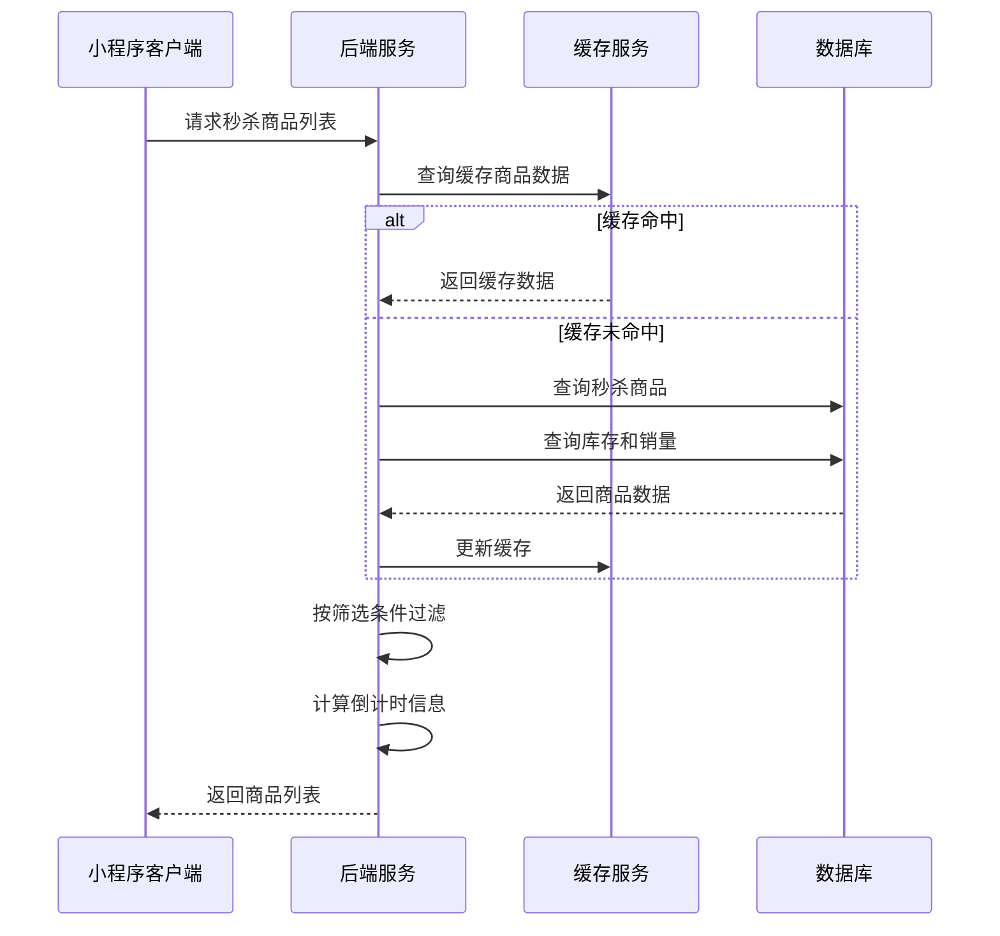
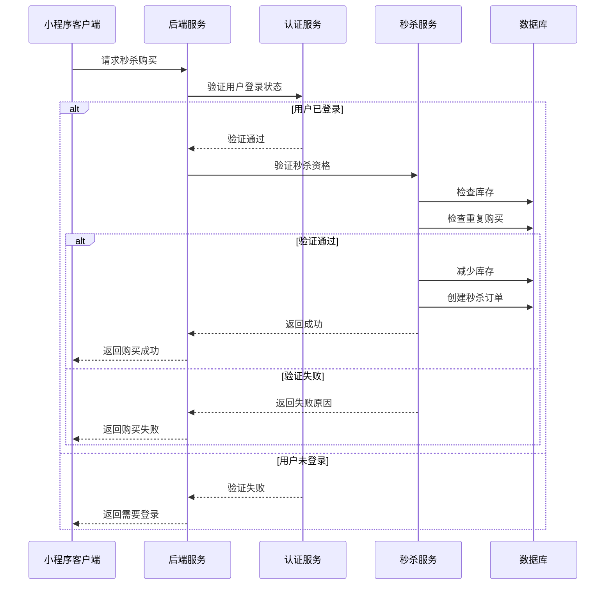
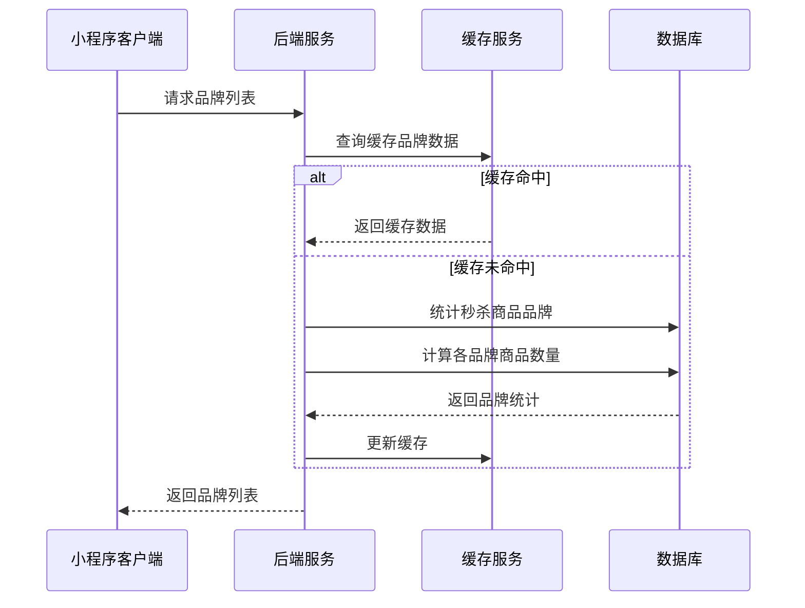
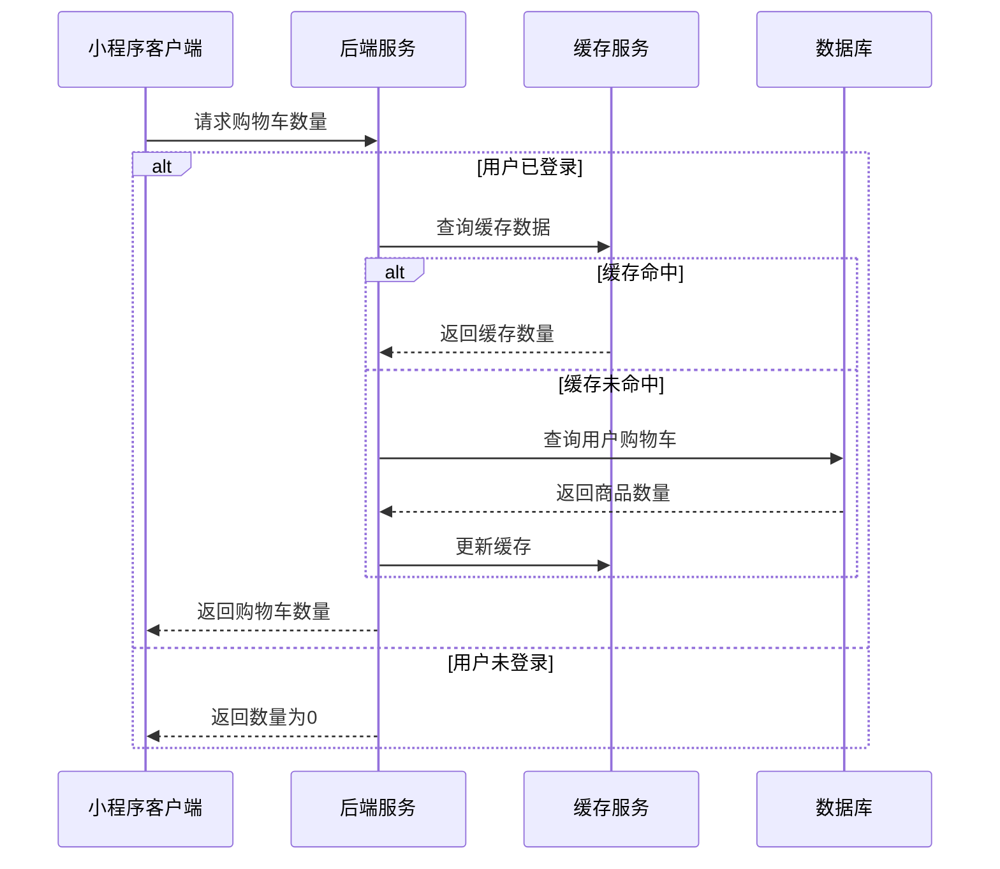
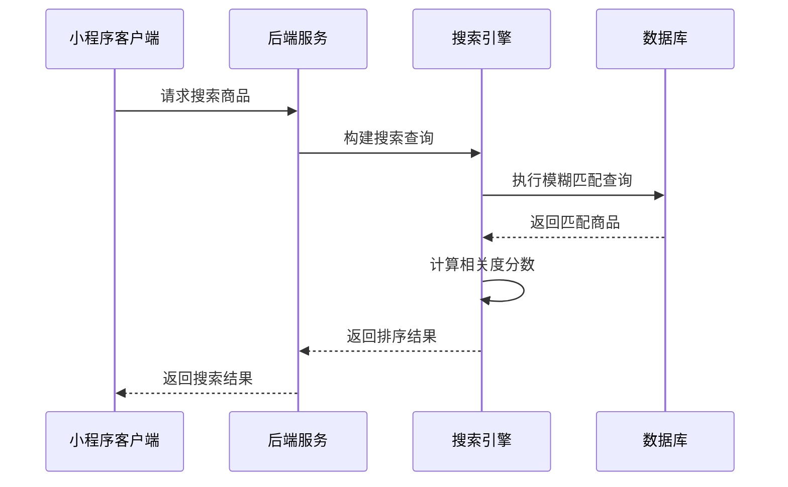

# 秒杀页面接口文档

## 获取秒杀商品列表

**接口名称：** 获取秒杀商品列表
**功能描述：** 获取限时秒杀商品列表，支持品牌筛选、搜索和分页加载
**接口地址：** /api/seckill/products
**请求方式：** GET

### 功能说明
获取正在进行秒杀活动的商品列表，支持品牌筛选和关键词搜索。商品包含秒杀价格、原价、库存、销量、倒计时等信息。



### 请求参数
```json
{
  "page": 1,
  "pageSize": 20,
  "brand": "lining",
  "keyword": "羽毛球拍",
  "sortBy": "sales_desc"
}
```

| 参数名 | 类型 | 必填 | 说明 | 示例值 |
|----|---|-----|---|-----|
| page | int | 否 | 页码（默认1） | 1 |
| pageSize | int | 否 | 每页数量（默认20） | 20 |
| brand | string | 否 | 品牌筛选（all全部/lining李宁/victor威克多等） | lining |
| keyword | string | 否 | 搜索关键词 | 羽毛球拍 |
| sortBy | string | 否 | 排序方式（sales_desc销量降序/price_asc价格升序/time_asc时间升序） | sales_desc |

### 响应参数
```json
{
  "error": 0,
  "body": {
    "products": {
      "total": 45,
      "list": [
        {
          "id": "product_101",
          "title": "李宁羽毛球拍碳纤维单拍超轻进攻型专业比赛拍子",
          "brand": "李宁",
          "brandKey": "lining",
          "imageUrl": "https://example.com/product.jpg",
          "seckillPrice": 199.00,
          "originalPrice": 299.00,
          "discountRate": 33,
          "stock": 150,
          "soldCount": 268,
          "startTime": "2024-01-15 10:00:00",
          "endTime": "2024-01-15 23:59:59",
          "remainingTime": 28800000,
          "countdownText": "08:00:00",
          "status": "ongoing",
          "tags": ["包邮", "正品", "现货"],
          "category": "羽毛球拍"
        }
      ]
    },
    "brands": [
      {
        "key": "all",
        "name": "全部",
        "count": 45
      },
      {
        "key": "lining",
        "name": "李宁",
        "count": 12
      },
      {
        "key": "victor",
        "name": "威克多", 
        "count": 8
      }
    ],
    "pagination": {
      "page": 1,
      "pageSize": 20,
      "total": 45,
      "totalPages": 3,
      "hasMore": true
    }
  },
  "message": "获取秒杀商品列表成功",
  "success": true
}
```

| 参数名 | 类型 | 必填 | 说明 | 示例值 |
|----|---|-----|---|-----|
| error | int | 是 | 错误码，0表示成功 | 0 |
| body | object | 是 | 响应数据 | |
| body.products | object | 是 | 商品数据 | |
| body.products.total | int | 是 | 商品总数 | 45 |
| body.products.list | array | 是 | 商品列表 | |
| body.products.list[].id | string | 是 | 商品ID | product_101 |
| body.products.list[].title | string | 是 | 商品标题 | 李宁羽毛球拍碳纤维单拍超轻进攻型专业比赛拍子 |
| body.products.list[].brand | string | 是 | 品牌名称 | 李宁 |
| body.products.list[].brandKey | string | 是 | 品牌标识 | lining |
| body.products.list[].imageUrl | string | 是 | 商品主图 | https://example.com/product.jpg |
| body.products.list[].seckillPrice | number | 是 | 秒杀价格 | 199.00 |
| body.products.list[].originalPrice | number | 是 | 原价 | 299.00 |
| body.products.list[].discountRate | int | 是 | 折扣率（百分比） | 33 |
| body.products.list[].stock | int | 是 | 剩余库存 | 150 |
| body.products.list[].soldCount | int | 是 | 已售数量 | 268 |
| body.products.list[].startTime | string | 是 | 秒杀开始时间 | 2024-01-15 10:00:00 |
| body.products.list[].endTime | string | 是 | 秒杀结束时间 | 2024-01-15 23:59:59 |
| body.products.list[].remainingTime | int | 是 | 剩余时间（毫秒） | 28800000 |
| body.products.list[].countdownText | string | 是 | 倒计时文字 | 08:00:00 |
| body.products.list[].status | string | 是 | 状态（ongoing进行中/ended已结束/upcoming即将开始） | ongoing |
| body.products.list[].tags | array | 是 | 商品标签 | ["包邮", "正品", "现货"] |
| body.products.list[].category | string | 是 | 商品分类 | 羽毛球拍 |
| body.brands | array | 是 | 品牌筛选列表 | |
| body.brands[].key | string | 是 | 品牌标识 | lining |
| body.brands[].name | string | 是 | 品牌名称 | 李宁 |
| body.brands[].count | int | 是 | 该品牌商品数量 | 12 |
| body.pagination | object | 是 | 分页信息 | |
| body.pagination.page | int | 是 | 当前页码 | 1 |
| body.pagination.pageSize | int | 是 | 每页数量 | 20 |
| body.pagination.total | int | 是 | 总记录数 | 45 |
| body.pagination.totalPages | int | 是 | 总页数 | 3 |
| body.pagination.hasMore | bool | 是 | 是否有更多数据 | true |
| message | string | 是 | 响应消息 | 获取秒杀商品列表成功 |
| success | bool | 是 | 是否成功 | true |

---

## 秒杀商品立即购买

**接口名称：** 秒杀商品立即购买
**功能描述：** 对秒杀商品进行立即购买下单操作
**接口地址：** /api/seckill/buy-now
**请求方式：** POST

### 功能说明
用户点击秒杀商品的"抢"按钮后，进行立即购买操作。系统会检查库存、验证秒杀时间、防止重复下单等。**此接口需要用户登录状态。**



### 请求参数
```json
{
  "productId": "product_101",
  "quantity": 1,
  "seckillPrice": 199.00
}
```

| 参数名 | 类型 | 必填 | 说明 | 示例值 |
|----|---|-----|---|-----|
| productId | string | 是 | 商品ID | product_101 |
| quantity | int | 是 | 购买数量（秒杀商品通常限购1件） | 1 |
| seckillPrice | number | 是 | 秒杀价格（用于验证） | 199.00 |

### 响应参数
```json
{
  "error": 0,
  "body": {
    "seckillResult": {
      "success": true,
      "orderId": "ORDER_SK_001",
      "productInfo": {
        "productId": "product_101",
        "title": "李宁羽毛球拍碳纤维单拍超轻进攻型专业比赛拍子",
        "image": "https://example.com/product.jpg",
        "quantity": 1,
        "seckillPrice": 199.00,
        "originalPrice": 299.00,
        "savedAmount": 100.00
      },
      "orderInfo": {
        "orderId": "ORDER_SK_001",
        "totalAmount": 199.00,
        "createTime": "2024-01-15 14:30:00",
        "paymentExpireTime": "2024-01-15 14:45:00",
        "status": "unpaid"
      },
      "remainingStock": 149,
      "message": "恭喜您！秒杀成功，请尽快完成支付"
    }
  },
  "message": "秒杀购买成功",
  "success": true
}
```

| 参数名 | 类型 | 必填 | 说明 | 示例值 |
|----|---|-----|---|-----|
| error | int | 是 | 错误码，0成功/401未登录/400参数错误/409库存不足/410秒杀结束/429操作频繁 | 0 |
| body | object | 是 | 响应数据 | |
| body.seckillResult | object | 是 | 秒杀结果 | |
| body.seckillResult.success | bool | 是 | 是否秒杀成功 | true |
| body.seckillResult.orderId | string | 是 | 订单ID | ORDER_SK_001 |
| body.seckillResult.productInfo | object | 是 | 商品信息 | |
| body.seckillResult.productInfo.productId | string | 是 | 商品ID | product_101 |
| body.seckillResult.productInfo.title | string | 是 | 商品标题 | 李宁羽毛球拍碳纤维单拍超轻进攻型专业比赛拍子 |
| body.seckillResult.productInfo.image | string | 是 | 商品图片 | https://example.com/product.jpg |
| body.seckillResult.productInfo.quantity | int | 是 | 购买数量 | 1 |
| body.seckillResult.productInfo.seckillPrice | number | 是 | 秒杀价格 | 199.00 |
| body.seckillResult.productInfo.originalPrice | number | 是 | 原价 | 299.00 |
| body.seckillResult.productInfo.savedAmount | number | 是 | 节省金额 | 100.00 |
| body.seckillResult.orderInfo | object | 是 | 订单信息 | |
| body.seckillResult.orderInfo.orderId | string | 是 | 订单ID | ORDER_SK_001 |
| body.seckillResult.orderInfo.totalAmount | number | 是 | 订单总金额 | 199.00 |
| body.seckillResult.orderInfo.createTime | string | 是 | 创建时间 | 2024-01-15 14:30:00 |
| body.seckillResult.orderInfo.paymentExpireTime | string | 是 | 支付超时时间 | 2024-01-15 14:45:00 |
| body.seckillResult.orderInfo.status | string | 是 | 订单状态 | unpaid |
| body.seckillResult.remainingStock | int | 是 | 剩余库存 | 149 |
| body.seckillResult.message | string | 是 | 结果消息 | 恭喜您！秒杀成功，请尽快完成支付 |
| message | string | 是 | 响应消息 | 秒杀购买成功 |
| success | bool | 是 | 是否成功 | true |

---

## 获取品牌筛选列表

**接口名称：** 获取品牌筛选列表
**功能描述：** 获取秒杀页面的品牌筛选选项和商品数量统计
**接口地址：** /api/seckill/brands
**请求方式：** GET

### 功能说明
获取参与秒杀活动的所有品牌列表，用于页面品牌筛选功能。返回品牌名称、标识和对应的商品数量。



### 请求参数
无需传入参数

### 响应参数
```json
{
  "error": 0,
  "body": {
    "brands": {
      "defaultBrands": [
        {
          "key": "all",
          "name": "全部",
          "count": 45,
          "isDefault": true
        },
        {
          "key": "beta",
          "name": "倍特爱",
          "count": 8,
          "isDefault": true
        },
        {
          "key": "lining",
          "name": "李宁",
          "count": 12,
          "isDefault": true
        },
        {
          "key": "victor",
          "name": "威克多",
          "count": 8,
          "isDefault": true
        }
      ],
      "extraBrands": [
        {
          "key": "lingmei",
          "name": "翎美",
          "count": 5,
          "isDefault": false
        },
        {
          "key": "yashilong",
          "name": "亚狮龙",
          "count": 4,
          "isDefault": false
        },
        {
          "key": "weiken",
          "name": "威肯",
          "count": 3,
          "isDefault": false
        },
        {
          "key": "taiang",
          "name": "泰昂",
          "count": 5,
          "isDefault": false
        }
      ],
      "totalBrands": 8,
      "totalProducts": 45
    }
  },
  "message": "获取品牌列表成功",
  "success": true
}
```

| 参数名 | 类型 | 必填 | 说明 | 示例值 |
|----|---|-----|---|-----|
| error | int | 是 | 错误码，0表示成功 | 0 |
| body | object | 是 | 响应数据 | |
| body.brands | object | 是 | 品牌数据 | |
| body.brands.defaultBrands | array | 是 | 默认显示的品牌 | |
| body.brands.defaultBrands[].key | string | 是 | 品牌标识 | beta |
| body.brands.defaultBrands[].name | string | 是 | 品牌名称 | 倍特爱 |
| body.brands.defaultBrands[].count | int | 是 | 商品数量 | 8 |
| body.brands.defaultBrands[].isDefault | bool | 是 | 是否默认显示 | true |
| body.brands.extraBrands | array | 是 | 展开显示的额外品牌 | |
| body.brands.extraBrands[].key | string | 是 | 品牌标识 | lingmei |
| body.brands.extraBrands[].name | string | 是 | 品牌名称 | 翎美 |
| body.brands.extraBrands[].count | int | 是 | 商品数量 | 5 |
| body.brands.extraBrands[].isDefault | bool | 是 | 是否默认显示 | false |
| body.brands.totalBrands | int | 是 | 品牌总数 | 8 |
| body.brands.totalProducts | int | 是 | 商品总数 | 45 |
| message | string | 是 | 响应消息 | 获取品牌列表成功 |
| success | bool | 是 | 是否成功 | true |

---

## 获取购物车商品数量

**接口名称：** 获取购物车商品数量
**功能描述：** 获取当前用户购物车中的商品总数量，用于显示悬浮购物车角标
**接口地址：** /api/cart/count
**请求方式：** GET

### 功能说明
获取用户购物车中商品的总数量，用于在秒杀页面右下角的悬浮购物车按钮上显示角标数量。未登录用户返回0。



### 请求参数
无需传入参数（需要用户登录态，未登录返回0）

### 响应参数
```json
{
  "error": 0,
  "body": {
    "cartCount": 5,
    "totalAmount": 1297.00,
    "lastUpdateTime": "2024-01-15 14:30:00"
  },
  "message": "获取购物车数量成功",
  "success": true
}
```

| 参数名 | 类型 | 必填 | 说明 | 示例值 |
|----|---|-----|---|-----|
| error | int | 是 | 错误码，0表示成功 | 0 |
| body | object | 是 | 响应数据 | |
| body.cartCount | int | 是 | 购物车商品总数量 | 5 |
| body.totalAmount | number | 是 | 购物车商品总金额 | 1297.00 |
| body.lastUpdateTime | string | 是 | 最后更新时间 | 2024-01-15 14:30:00 |
| message | string | 是 | 响应消息 | 获取购物车数量成功 |
| success | bool | 是 | 是否成功 | true |

---

## 商品搜索

**接口名称：** 秒杀商品搜索
**功能描述：** 在秒杀商品中进行关键词搜索
**接口地址：** /api/seckill/search
**请求方式：** GET

### 功能说明
在秒杀商品范围内根据关键词搜索商品，支持商品标题、品牌名称的模糊匹配。搜索结果按相关度排序。



### 请求参数
```json
{
  "keyword": "羽毛球拍",
  "page": 1,
  "pageSize": 20,
  "brand": "all"
}
```

| 参数名 | 类型 | 必填 | 说明 | 示例值 |
|----|---|-----|---|-----|
| keyword | string | 是 | 搜索关键词 | 羽毛球拍 |
| page | int | 否 | 页码（默认1） | 1 |
| pageSize | int | 否 | 每页数量（默认20） | 20 |
| brand | string | 否 | 品牌筛选（all全部） | all |

### 响应参数
```json
{
  "error": 0,
  "body": {
    "searchResult": {
      "keyword": "羽毛球拍",
      "total": 28,
      "searchTime": 0.125,
      "products": [
        {
          "id": "product_101",
          "title": "李宁羽毛球拍碳纤维单拍超轻进攻型专业比赛拍子",
          "brand": "李宁",
          "brandKey": "lining",
          "imageUrl": "https://example.com/product.jpg",
          "seckillPrice": 199.00,
          "originalPrice": 299.00,
          "stock": 150,
          "soldCount": 268,
          "endTime": "2024-01-15 23:59:59",
          "countdownText": "08:00:00",
          "tags": ["包邮", "正品", "现货"],
          "relevanceScore": 0.95,
          "highlightTitle": "李宁<em>羽毛球拍</em>碳纤维单拍超轻进攻型专业比赛拍子"
        }
      ]
    },
    "pagination": {
      "page": 1,
      "pageSize": 20,
      "total": 28,
      "totalPages": 2,
      "hasMore": true
    },
    "suggestions": [
      "羽毛球拍碳纤维",
      "羽毛球拍进攻型",
      "羽毛球拍李宁"
    ]
  },
  "message": "搜索完成",
  "success": true
}
```

| 参数名 | 类型 | 必填 | 说明 | 示例值 |
|----|---|-----|---|-----|
| error | int | 是 | 错误码，0表示成功 | 0 |
| body | object | 是 | 响应数据 | |
| body.searchResult | object | 是 | 搜索结果 | |
| body.searchResult.keyword | string | 是 | 搜索关键词 | 羽毛球拍 |
| body.searchResult.total | int | 是 | 搜索结果总数 | 28 |
| body.searchResult.searchTime | number | 是 | 搜索耗时（秒） | 0.125 |
| body.searchResult.products | array | 是 | 商品列表（与商品列表接口字段相同） | |
| body.searchResult.products[].relevanceScore | number | 是 | 相关度分数 | 0.95 |
| body.searchResult.products[].highlightTitle | string | 是 | 高亮标题（关键词用em标签包围） | 李宁<em>羽毛球拍</em>碳纤维单拍超轻进攻型专业比赛拍子 |
| body.pagination | object | 是 | 分页信息 | |
| body.pagination.page | int | 是 | 当前页码 | 1 |
| body.pagination.pageSize | int | 是 | 每页数量 | 20 |
| body.pagination.total | int | 是 | 总记录数 | 28 |
| body.pagination.totalPages | int | 是 | 总页数 | 2 |
| body.pagination.hasMore | bool | 是 | 是否有更多数据 | true |
| body.suggestions | array | 是 | 搜索建议 | ["羽毛球拍碳纤维", "羽毛球拍进攻型", "羽毛球拍李宁"] |
| message | string | 是 | 响应消息 | 搜索完成 |
| success | bool | 是 | 是否成功 | true |

---

## 秒杀活动配置

### 业务规则说明

#### 秒杀时间规则
- **活动时长**：每场秒杀活动持续时间为1-24小时
- **倒计时精度**：精确到秒，格式为"HH:mm:ss"
- **状态判断**：
  - `upcoming`：当前时间 < 开始时间
  - `ongoing`：开始时间 ≤ 当前时间 < 结束时间
  - `ended`：当前时间 ≥ 结束时间

#### 库存管理规则
- **库存扣减**：用户成功秒杀后立即扣减库存
- **库存释放**：超时未支付订单释放库存（15分钟超时）
- **超卖防护**：使用分布式锁防止超卖

#### 用户限购规则
- **限购数量**：每个用户每个商品限购1件
- **重复验证**：下单前检查用户是否已购买过该商品
- **防刷保护**：同一用户1秒内只能提交1次购买请求

#### 支付时效规则
- **支付超时**：秒杀订单需在15分钟内完成支付
- **超时处理**：超时未支付自动取消订单并释放库存
- **支付提醒**：倒计时提醒用户尽快支付 