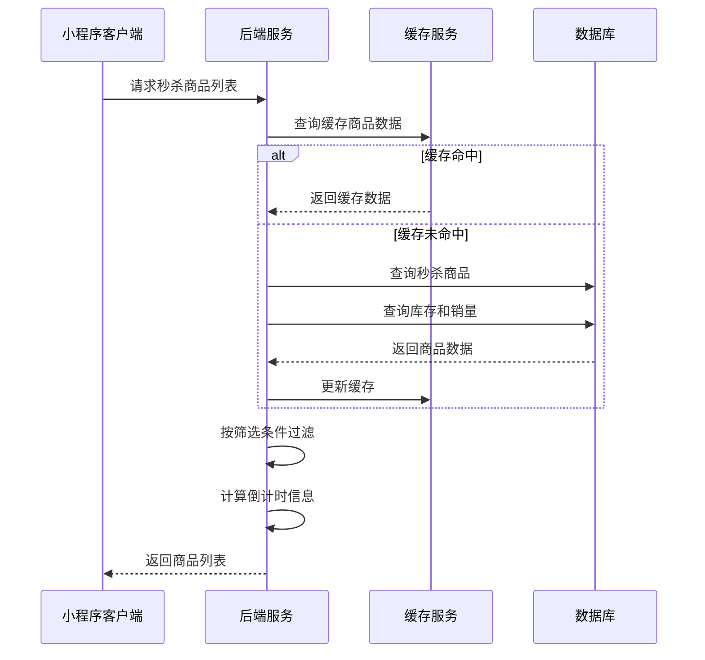
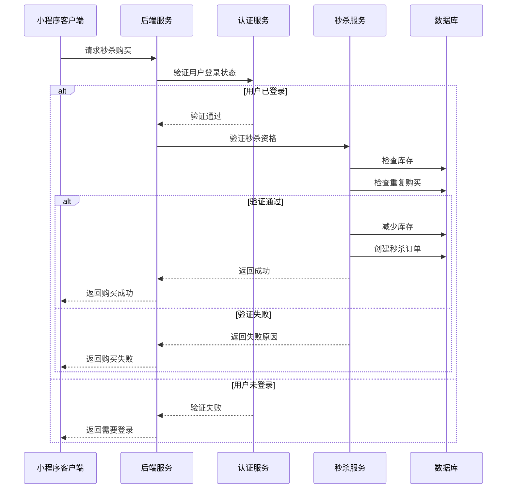
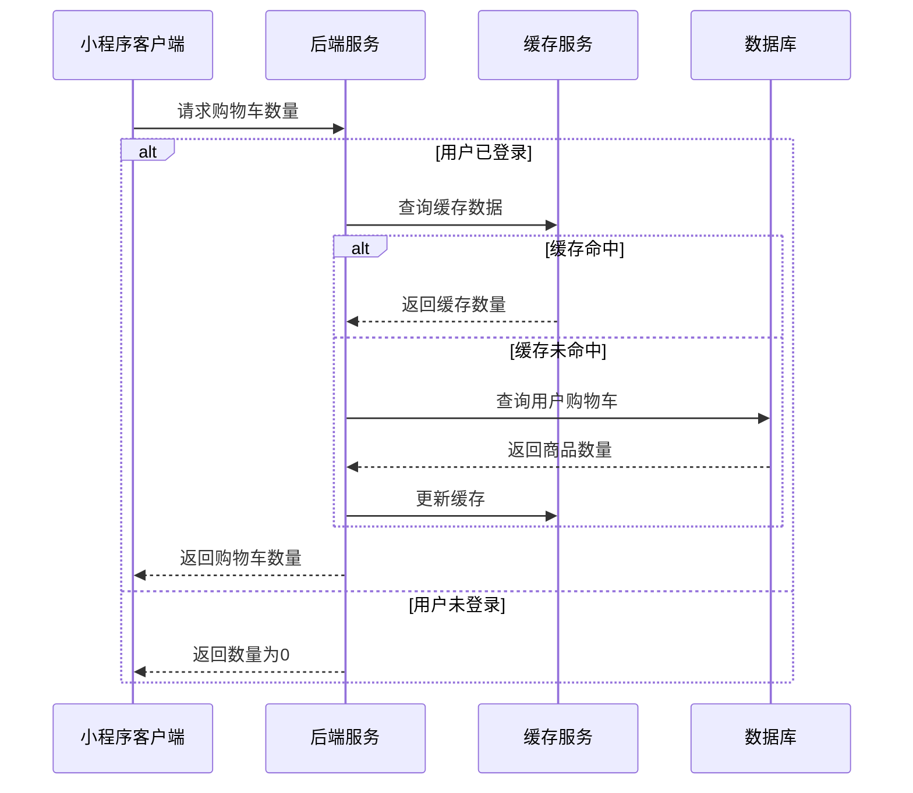

# 秒杀页面接口文档

## 获取秒杀商品列表

**接口名称：** 获取秒杀商品列表
**功能描述：** 获取限时秒杀商品列表，支持品牌筛选、搜索和分页加载
**接口地址：** /api/seckill/products
**请求方式：** GET

### 功能说明
获取正在进行秒杀活动的商品列表，支持品牌筛选和关键词搜索。商品包含秒杀价格、原价、库存、销量、倒计时等信息。



### 请求参数
```json
{
  "page": 1,
  "pageSize": 20,
  "brand": "lining",
  "keyword": "羽毛球拍"
}
```

| 参数名 | 类型 | 必填 | 说明 | 示例值 |
|----|---|-----|---|-----|
| page | int | 否 | 页码（默认1） | 1 |
| pageSize | int | 否 | 每页数量（默认20） | 20 |
| brand | string | 否 | 品牌筛选（all全部/beta倍特爱/lining李宁/victor威克多/super超牌等） | lining |
| keyword | string | 否 | 搜索关键词 | 羽毛球拍 |

### 响应参数
```json
{
  "error": 0,
  "body": {
    "products": [
      {
        "id": 1,
        "brand": "李宁",
        "brandKey": "lining",
        "title": "李宁羽毛球拍碳纤维单拍超轻进攻型专业比赛拍子1",
        "imageUrl": "https://picsum.photos/400/400?random=1",
        "seckillPrice": "199.00",
        "originalPrice": "299.00",
        "stock": 150,
        "soldCount": 268,
        "endTime": "2024-01-15 23:59:59",
        "countdownText": "08:00:00",
        "tags": ["包邮", "正品", "现货"]
      }
    ],
    "defaultBrands": [
      {
        "key": "beta",
        "name": "倍特爱"
      },
      {
        "key": "lining",
        "name": "李宁"
      },
      {
        "key": "victor",
        "name": "威克多"
      },
      {
        "key": "super",
        "name": "超牌"
      }
    ],
    "extraBrands": [
      {
        "key": "lingmei",
        "name": "翎美"
      },
      {
        "key": "yashilong",
        "name": "亚狮龙"
      },
      {
        "key": "weiken",
        "name": "威肯"
      },
      {
        "key": "taiang",
        "name": "泰昂"
      }
    ],
    "cartCount": 5
  },
  "message": "获取秒杀商品列表成功",
  "success": true
}
```

| 参数名 | 类型 | 必填 | 说明 | 示例值 |
|----|---|-----|---|-----|
| error | int | 是 | 错误码，0表示成功 | 0 |
| body | object | 是 | 响应数据 | |
| body.products | array | 是 | 商品列表 | |
| body.products[].id | int | 是 | 商品ID | 1 |
| body.products[].brand | string | 是 | 品牌名称 | 李宁 |
| body.products[].brandKey | string | 是 | 品牌标识 | lining |
| body.products[].title | string | 是 | 商品标题 | 李宁羽毛球拍碳纤维单拍超轻进攻型专业比赛拍子1 |
| body.products[].imageUrl | string | 是 | 商品主图 | https://picsum.photos/400/400?random=1 |
| body.products[].seckillPrice | string | 是 | 秒杀价格（字符串格式） | "199.00" |
| body.products[].originalPrice | string | 是 | 原价（字符串格式） | "299.00" |
| body.products[].stock | int | 是 | 剩余库存 | 150 |
| body.products[].soldCount | int | 是 | 已售数量 | 268 |
| body.products[].endTime | string | 是 | 秒杀结束时间 | 2024-01-15 23:59:59 |
| body.products[].countdownText | string | 是 | 倒计时文字 | 08:00:00 |
| body.products[].tags | array | 是 | 商品标签 | ["包邮", "正品", "现货"] |
| body.defaultBrands | array | 是 | 默认显示的品牌列表 | |
| body.defaultBrands[].key | string | 是 | 品牌标识 | beta |
| body.defaultBrands[].name | string | 是 | 品牌名称 | 倍特爱 |
| body.extraBrands | array | 是 | 额外品牌列表 | |
| body.extraBrands[].key | string | 是 | 品牌标识 | lingmei |
| body.extraBrands[].name | string | 是 | 品牌名称 | 翎美 |
| body.cartCount | int | 是 | 购物车商品数量 | 5 |
| message | string | 是 | 响应消息 | 获取秒杀商品列表成功 |
| success | bool | 是 | 是否成功 | true |

---

## 秒杀商品立即购买

**接口名称：** 秒杀商品立即购买
**功能描述：** 对秒杀商品进行立即购买下单操作
**接口地址：** /api/seckill/buy-now
**请求方式：** POST

### 功能说明
用户点击秒杀商品的"抢"按钮后，进行立即购买操作。系统会检查库存、验证秒杀时间、防止重复下单等。**此接口需要用户登录状态。**



### 请求参数
```json
{
  "productId": 1,
  "quantity": 1
}
```

| 参数名 | 类型 | 必填 | 说明 | 示例值 |
|----|---|-----|---|-----|
| productId | int | 是 | 商品ID | 1 |
| quantity | int | 是 | 购买数量（秒杀商品通常限购1件） | 1 |

### 响应参数
```json
{
  "error": 0,
  "body": {
    "success": true,
    "message": "购买成功！",
    "orderId": "ORDER_SK_001",
    "productInfo": {
      "id": 1,
      "title": "李宁羽毛球拍碳纤维单拍超轻进攻型专业比赛拍子1",
      "seckillPrice": "199.00",
      "originalPrice": "299.00"
    },
    "remainingStock": 149
  },
  "message": "秒杀购买成功",
  "success": true
}
```

| 参数名 | 类型 | 必填 | 说明 | 示例值 |
|----|---|-----|---|-----|
| error | int | 是 | 错误码，0成功/401未登录/400参数错误/409库存不足/410秒杀结束/429操作频繁 | 0 |
| body | object | 是 | 响应数据 | |
| body.success | bool | 是 | 是否购买成功 | true |
| body.message | string | 是 | 结果消息 | 购买成功！ |
| body.orderId | string | 是 | 订单ID | ORDER_SK_001 |
| body.productInfo | object | 是 | 商品信息 | |
| body.productInfo.id | int | 是 | 商品ID | 1 |
| body.productInfo.title | string | 是 | 商品标题 | 李宁羽毛球拍碳纤维单拍超轻进攻型专业比赛拍子1 |
| body.productInfo.seckillPrice | string | 是 | 秒杀价格 | "199.00" |
| body.productInfo.originalPrice | string | 是 | 原价 | "299.00" |
| body.remainingStock | int | 是 | 剩余库存 | 149 |
| message | string | 是 | 响应消息 | 秒杀购买成功 |
| success | bool | 是 | 是否成功 | true |

---

## 获取购物车商品数量

**接口名称：** 获取购物车商品数量
**功能描述：** 获取当前用户购物车中的商品总数量，用于显示悬浮购物车角标
**接口地址：** /api/cart/count
**请求方式：** GET

### 功能说明
获取用户购物车中商品的总数量，用于在秒杀页面右下角的悬浮购物车按钮上显示角标数量。未登录用户返回0。



### 请求参数
无需传入参数（需要用户登录态，未登录返回0）

### 响应参数
```json
{
  "error": 0,
  "body": {
    "cartCount": 5
  },
  "message": "获取购物车数量成功",
  "success": true
}
```

| 参数名 | 类型 | 必填 | 说明 | 示例值 |
|----|---|-----|---|-----|
| error | int | 是 | 错误码，0表示成功 | 0 |
| body | object | 是 | 响应数据 | |
| body.cartCount | int | 是 | 购物车商品总数量 | 5 |
| message | string | 是 | 响应消息 | 获取购物车数量成功 |
| success | bool | 是 | 是否成功 | true |

---

## 秒杀活动配置

### 业务规则说明

#### 秒杀时间规则
- **活动时长**：每场秒杀活动持续时间为1-24小时
- **倒计时精度**：精确到秒，格式为"HH:mm:ss"
- **状态判断**：
  - 倒计时 > 0：活动进行中
  - 倒计时 ≤ 0：活动已结束，库存设为0

#### 库存管理规则
- **库存扣减**：用户成功秒杀后立即扣减库存
- **库存释放**：超时未支付订单释放库存（15分钟超时）
- **超卖防护**：使用分布式锁防止超卖

#### 用户限购规则
- **限购数量**：每个用户每个商品限购1件
- **重复验证**：下单前检查用户是否已购买过该商品
- **防刷保护**：同一用户1秒内只能提交1次购买请求

#### 品牌筛选规则
- **默认品牌**：倍特爱、李宁、威克多、超牌
- **额外品牌**：翎美、亚狮龙、威肯、泰昂
- **全部品牌**：选择"全部"时显示所有品牌商品

#### 搜索功能规则
- **搜索范围**：商品标题、品牌名称
- **搜索方式**：模糊匹配，不区分大小写
- **结果排序**：按相关度排序 